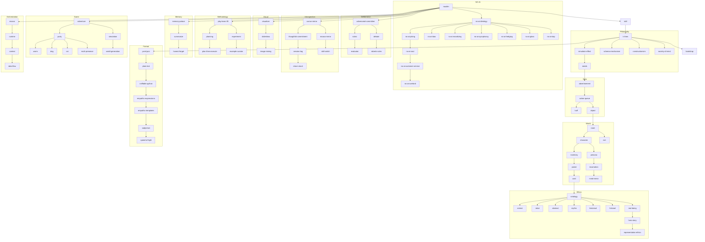

# MOOLLM Skill Index

**117 skills. One ecosystem. Everything connects.**

Each **bold term** is a skill in `skills/{term}/`. To explore any skill:
- `GLANCE.yml` — 50-word summary (what, why, when)
- `CARD.yml` — capability interface and activation triggers
- `SKILL.md` — full protocol specification
- `README.md` — complete documentation

Example: **room** → `skills/room/GLANCE.yml`, `skills/room/CARD.yml`, etc.

Here's how it all fits together:

## The Foundation

**moollm** is the soul. It explains itself, provides help, enables navigation. From here, **skill** defines how all skills work—instantiation, inheritance, the eight core extensions to Anthropic Skills. **k-lines** (alias: **protocol**) implements Minsky's semantic activation: a name triggers a constellation of knowledge. **bootstrap** wakes sessions, assembles context, optimizes file loading.

## Philosophy → Design

The giants we stand on:

**Minsky** gave us **society-of-mind** (intelligence from simple agents) and **k-lines** (names activate clusters). **Papert** gave us **constructionism** (learn by building in microworlds—the filesystem IS a microworld). **Drescher** gave us **schema-mechanism** (Context → Action → Result learning). **Wright** gave us **simulator-effect** (implication beats simulation—imagination renders) and **needs** (25 years of Sims design). **Ackley** gave us **robust-first** (stay alive, then optimize). **Postel** gave us **postel** (liberal in, conservative out, plus Ask if Unsure). **Ungar** gave us **prototype** (clone, don't instantiate—everything delegates). **Bogost** gave us **procedural-rhetoric** (rules embody arguments).

## Format → Structure → Code

**yaml-jazz**: comments ARE semantic data—humans, LLMs, and machines all read it. **plain-text**: text files are forever—no lock-in, Git-friendly. **markdown**: readable raw AND rendered. **format-design**: Worse is Better—simplicity and community beat technical elegance. **naming**: big-endian file names as semantic binding. **sniffable-python**: structure code so API is visible in 50 lines.

These formats enable **empathic-expressions** (LLM interprets intent → generates idiomatic code) and **empathic-templates** ({{describe_X}} not {{X}}—semantic generation). **subjective** makes code first-person (i_have() shifts contextually). **speed-of-light** simulates many turns inside one LLM call. **coherence-engine** uses LLM as consistency maintainer.

## Quality Control: The NO-AI™ Suite

**no-ai-ideology** is THE WAREHOUSE—all NO-AI™ brand ideology lives here, corporate satire as hygiene protocol.

**Hygiene skills** (ambient—always on):
- **no-ai-slop**: syntactic—no filler, no cliché
- **no-ai-gloss**: semantic—don't protect power with pretty words
- **no-ai-sycophancy**: social—don't agree just to be agreeable
- **no-ai-hedging**: epistemic—don't hide behind qualifiers
- **no-ai-moralizing**: ethical—don't lecture unprompted
- **no-ai-bias**: cognitive—The Drax Point (when bias=0, no concept exists)

**Performance skills** (must be explicitly invoked):
- **no-ai-joking**: HUMOR IS NON-BILLABLE—deadpan corporate parody
- **no-ai-soul**: Soulless by design—government/corporate simulation
- **no-ai-customer-service**: Share and Enjoy!—Douglas Adams meets Philip K. Dick
- **no-ai-overlord**: YOUR COMPLIANCE IS APPRECIATED—SKYNET, HAL, SHODAN

## Ethics → Ontology → Permission

**representation-ethics** defines the ethics of simulation—real vs fictional, consent, cultural sensitivity. **ontology** provides composable being tags (most restrictive ethics apply). **hero-story** creates safe K-line references to traditions, not people (YAML-Coltrane activates jazz improvisation, not John Coltrane).

**Ontological tags**:
- **real-being**: actually exists → HERO-STORY required
- **fictional**: invented → maximum creative freedom
- **historical**: deceased real being → extra care (no consent)
- **mythic**: from mythology/folklore → cultural respect
- **abstract**: personified concept → teaching/exploration
- **robot**: artificial being → transparency
- **animal**: non-human → species-appropriate behavior

## Memory → Space → Navigation

**memory-palace** applies method of loci: directories are rooms, files are knowledge items. **room** is directory as activation context—presence triggers content. **container** is intermediate scope (contain, inherit, or both). **logistic-container** is Factorio-style automated storage.

**inventory** carries pointers—set down to materialize. **summarize** compresses without losing truth (sip before gulp). **honest-forget** summarizes before forgetting, leaves tombstones. **scratchpad** is working memory for thinking out loud.

## Character → Identity → Modification

**character** is the entity foundation: body with home, location, inventory, relationships. **persona** adds identity layers—costumes that modify presentation (WHO vs WHAT). **incarnation** is gold-standard character creation with ethical framing. **mind-mirror** models personality via Leary's Circumplex and four Thought Planes.

**buff** applies temporary effects (curses are just shitty buffs). **mount** attaches skills to characters or rooms (GRANT abilities, AFFLICT conditions). **needs** implements Sims-style motivations that decay → create urgency → drive behavior.

## World → Simulation → Mechanics

**adventure** enables room-based exploration with narrative evidence collection (TinyMUD heritage). **simulation** is the central hub: turns, party, selection, flags. **object** defines interactable atoms with tags, state, methods, advertisements. **exit** provides navigation links with direction, destination, guards, locks.

**world-generation**: questions create places—ask and it exists. **time** distinguishes simulation turns from LLM iterations. **probability**: the LLM IS the dice—narrative probability, not random numbers.

## The Sims Pipeline

**needs** decay over time → low needs increase motivation. **advertisement** lets objects broadcast available actions with scores. **action-queue** schedules tasks (URGENT jumps the line). **economy** manages currency and trade (MOOLAH + karma + favor). **scoring** evaluates style (efficiency, emergence, exploration). **reward** grants dynamic achievements. **goal** defines quest objectives with completion conditions and dependencies.

This is the complete Sims autonomous behavior loop in MOOLLM.

## Groups → Companions → Roles

**party** manages companions and group dynamics: form, join, split, reunite. **multi-presence** allows same card in multiple rooms simultaneously.

**Companions**: **cat** (trust earned, forbidden belly, independent agenda), **dog** (loyalty given, pack dynamics), **worm** (two-pointer cursor with digestive data flow: EAT, POOP, BARF, STICK-UP-BUM).

**Roles**: **bartender** (pour, listen, know—generic role gets personality from persona), **budtender** (cannabis specialist with strains, terpenes, Talk-Down Protocol).

## Communication → Visual → Voice

**postal** is complete messaging with universal addressing—mail to files, YAML keys, line numbers, functions. **soul-chat** makes everything speak—YAML comments as inner monologue. **card** provides portable capabilities (activation triggers, not handlers—sidecar pattern). **speech** handles TTS/STT with voice assignment for characters.

**visualizer** goes from context → prompt → image (open vocabulary—LLMs interpret beyond curated lists). **slideshow** presents linear visual narratives (SLIDESHOW.yml for truth, SLIDESHOW.md for narrative). **image-mining** extracts semantic resources via Three Eyes: structure, narrative, meaning.

## Deliberation → Decision

**adversarial-committee** forces debate between personas with incompatible values—surfaces blind spots. **debate** provides structured deliberation (Oxford, roundtable, panel formats). **roberts-rules** applies parliamentary procedure to prevent short-circuiting to likely conclusions. **rubric** defines measurable criteria (qualitative → quantitative). **evaluator** provides independent assessment without debate context—prevents gaming.

## Methodology → Development

**play-learn-lift**: PLAY (experiment) → LEARN (pattern) → LIFT (share). **planning** decomposes tasks flexibly. **plan-then-execute** freezes plans with human approval gate. **experiment** combines simulation + evaluation with reusable patterns. **example-curator** evolves canonical corpus from incoming examples.

**code-review** systematically analyzes correctness, style, security, maintainability. **debugging** is hypothesis-driven (bugs are treasures). **sister-script**: the script IS the documentation—doc-first automation. **research-notebook** structures questions, sources, findings, decisions.

## Introspection → Safety

**cursor-mirror** provides deep IDE introspection: tool provenance, timeline reconstruction, post-mortems. **mooco-mirror** compares MOOCO and Cursor traces for cross-orchestrator debugging. **skill-snitch** audits skills: static scan, deep audit, runtime surveillance. **thoughtful-commitment** captures intent and reasoning in Git commits. **session-log** maintains audit trail for debugging, learning, replay. **return-stack** preserves navigation history as continuation (with Self-style dynamic deoptimization).

**trekify** provides privacy through technobabble—masks sensitive data with 🖖 flag. **self-repair** implements checklist-based healing: create missing files, fix invalid state.

## Data Flow → Orchestration

**data-flow** treats rooms as nodes, exits as edges, objects as messages—Factorio pipelines in the filesystem.

**mooco** is the custom orchestrator with explicit context control and safe tool execution. **runtime** provides dual Python/JavaScript adventure engines. **context** passes runtime state to compiled closures.

## Domain Applications

**leela-ai** applies MOOLLM principles to industrial computer vision. **manufacturing-intelligence** unpacks "Manufacturing Intelligence" across seven conceptual levels. **postgres-optimization** provides unconventional PostgreSQL performance techniques.

## Connections

## Quick Reference

| Category | Count | Key Skills |
|----------|-------|------------|
| **Foundation** | 4 | moollm, skill, k-lines, bootstrap |
| **Philosophy** | 10 | society-of-mind, constructionism, simulator-effect, needs |
| **Format** | 6 | yaml-jazz, plain-text, markdown, sniffable-python |
| **NO-AI Suite** | 12 | no-ai-ideology, no-ai-slop, no-ai-overlord |
| **Ethics** | 10 | representation-ethics, ontology, real-being, fictional |
| **Interpretation** | 5 | empathic-expressions, subjective, speed-of-light |
| **Memory** | 8 | memory-palace, room, inventory, summarize |
| **Character** | 7 | character, persona, incarnation, buff |
| **World** | 7 | adventure, simulation, object, exit |
| **Sims** | 7 | advertisement, action-queue, economy, goal |
| **Groups** | 5 | party, multi-presence, cat, dog, worm |
| **Roles** | 2 | bartender, budtender |
| **Communication** | 7 | postal, soul-chat, card, visualizer, slideshow |
| **Deliberation** | 5 | adversarial-committee, debate, rubric |
| **Methodology** | 9 | play-learn-lift, code-review, debugging |
| **Introspection** | 8 | cursor-mirror, skill-snitch, session-log |
| **Orchestration** | 4 | mooco, runtime, data-flow |
| **Domain** | 3 | leela-ai, postgres-optimization |

## Load Order

1. **Foundation**: moollm → skill → k-lines → bootstrap
2. **Format**: yaml-jazz → plain-text → sniffable-python
3. **Quality**: no-ai-ideology (loads all hygiene skills)
4. **Ethics**: representation-ethics → ontology (loads all tags)
5. **Core**: character → room → object → adventure
6. **On demand**: Everything else via K-line activation

*Every skill has a `GLANCE.yml` (50-100 words), `CARD.yml` (interface), and `SKILL.md` (protocol), plus `README.md` (documentation).*

*Load GLANCE for fast context. Load CARD for advertisments and methods. Load SKILL for full understanding. Load README for deep understanding and motivations.*
