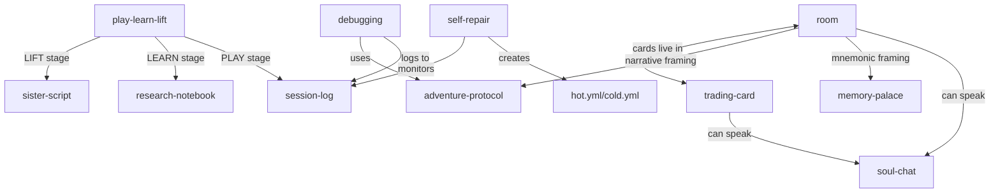

# MOOLLM Skills

> *"Skills are conventions the model follows, not code the orchestrator runs."*

Userland protocols over files.

> [!TIP]
> **New here?** Start with [play-learn-lift/](./play-learn-lift/) to learn the methodology, then explore [room/](./room/) and [trading-card/](./trading-card/).

---

## What is a Skill?

A skill is a **userland protocol** that defines:

- [x] **Directory layouts** and naming conventions
- [x] **File formats** and schemas
- [x] **Behavioral rules** and checklists
- [x] **Interaction patterns** the model follows

Skills are implemented purely through:

- [x] File tools (`ls`, `read`, `write`, `patch`)
- [x] Search tools (lexical, vector)
- [x] The model reading and following documented rules

> [!IMPORTANT]
> **Skills do NOT require orchestrator changes.** They're pure documentation.

---

## Key Principles

### 1. Skills are Documents
A skill is defined by its documentation, not its code.
The model reads the docs and follows them.

### 2. Skills are Instantiated
Running a skill = copying its template into a session workspace.
The instance is the activation record.

### 3. Skills can Compose
Skills can delegate to other skills via prototype chains.
Self-like inheritance through file lookup.

### 4. Skills are Debuggable
Every skill action is visible in files.
No hidden state, no magic.

---

## Skill Index

### Methodology (How to Work)

| Skill | Purpose | Tier |
|-------|---------|------|
| [play-learn-lift/](./play-learn-lift/) | Explore → Learn → Share wisdom | 1 |
| [sister-script/](./sister-script/) | Document-first automation | 2 |
| [plan-then-execute/](./plan-then-execute/) | Frozen plans with approval gates | 2 |
| [planning/](./planning/) | Flexible task decomposition | 1 |

### Memory & Context

| Skill | Purpose | Tier |
|-------|---------|------|
| [summarize/](./summarize/) | Compress without losing truth | 1 |
| [honest-forget/](./honest-forget/) | Graceful memory decay | 1 |
| [session-log/](./session-log/) | Human-readable audit trail | 1 |
| [memory-palace/](./memory-palace/) | Spatial knowledge organization | 1 |

### Spatial (The Room/Card System)

| Skill | Purpose | Tier |
|-------|---------|------|
| [room/](./room/) | Directories as activation contexts | 1 |
| [trading-card/](./trading-card/) | Capabilities as instantiable cards | 1 |
| [adventure-protocol/](./adventure-protocol/) | Narrative room exploration | 1 |

### Entity & Dialogue

| Skill | Purpose | Tier |
|-------|---------|------|
| [soul-chat/](./soul-chat/) | Everything speaks — multi-voice dialogues | 1 |

### Development

| Skill | Purpose | Tier |
|-------|---------|------|
| [research-notebook/](./research-notebook/) | Structured investigation | 1 |
| [debugging/](./debugging/) | Hypothesis-driven bug hunting | 2 |
| [code-review/](./code-review/) | Systematic code analysis | 2 |

### System

| Skill | Purpose | Tier |
|-------|---------|------|
| [self-repair/](./self-repair/) | Checklist-based healing | 1 |
| [scratchpad/](./scratchpad/) | Working memory | 1 |

---

## Skill Tiers

| Tier | Tools Required | Examples |
|------|----------------|----------|
| 0 | None (pure prompt) | Writing styles, reasoning patterns |
| 1 | File only | Scratchpad, planning, memory palace |
| 2 | File + execution | Code review, debugging |
| 3 | Full access | Git workflow, deployment |

**Principle:** Use the lowest tier possible.

---

## Skill Anatomy

```
skills/
  my-skill/
    README.md         # Human entry point (GitHub renders this)
    SKILL.md          # Full protocol documentation
    PROTOTYPE.yml     # Machine-readable definition
    template/         # Files to copy on instantiation
      *.tmpl          # Templates with placeholders
```

Every skill directory has a `README.md` — the intertwingled index.

---

## Integration with MOOLLM

| Skill Concept | MOOLLM Equivalent |
|---------------|-------------------|
| Skill prototype | Trading card template |
| Skill instance | Room activation (card in play) |
| Template files | Character soul structure |
| Checklist | Protocol steps |
| Delegation | Prototype inheritance |

---

## Quick Start

### Use a Skill

1. Read the skill's `README.md` to understand it
2. Copy the `template/` files to your working directory
3. Fill in the templates with your specifics
4. Follow the documented protocol in `SKILL.md`

### Create a New Skill

1. Create `skills/my-skill/`
2. Write `README.md` (human entry point)
3. Write `SKILL.md` (full protocol)
4. Write `PROTOTYPE.yml` (machine definition)
5. Create `template/` with starter files
6. Register in `INDEX.yml`

See [templates/basic-skill/](./templates/basic-skill/) for a minimal example.

---

## Meta Files

| File | Purpose |
|------|---------|
| [INDEX.yml](./INDEX.yml) | Machine-readable skill registry |
| [skill-instantiation-protocol.md](./skill-instantiation-protocol.md) | SIP: How skills are invoked |
| [delegation-object-protocol.md](./delegation-object-protocol.md) | DOP: Self-like inheritance |
| [templates/](./templates/) | Skill templates for bootstrapping |

---

## Navigation

| Direction | Destination |
|-----------|-------------|
| ⬆️ Up | [Project Root](../) |
| ➡️ Sibling | [kernel/](../kernel/) — Low-level protocols |
| ➡️ Sibling | [schemas/](../schemas/) — Data formats |
| ➡️ Sibling | [designs/](../designs/) — Historical archives |

---

## The Intertwingularity

> *"Everything is deeply intertwingled."* — Ted Nelson

Skills don't stand alone. They form a web:



Every skill connects to others. Navigate freely.

---

<details>
<summary><strong>📚 See Also (click to expand)</strong></summary>

### Protocols & Symbols
- [PROTOCOLS.yml](../PROTOCOLS.yml) — Full symbol index (K-lines)
- [QUICKSTART.md](../QUICKSTART.md) — 3-minute overview

### Kernel (Infrastructure)
- [kernel/](../kernel/) — The basement
- [kernel/NAMING.yml](../kernel/NAMING.yml) — File naming conventions
- [kernel/tool-calling-protocol.md](../kernel/tool-calling-protocol.md) — WHY-REQUIRED

### Schemas (Shapes)
- [schemas/](../schemas/) — Data format definitions
- [schemas/agent-directory-schema.yml](../schemas/agent-directory-schema.yml) — `.agent/` structure

### Meta
- [skill-instantiation-protocol.md](./skill-instantiation-protocol.md) — How skills are born
- [delegation-object-protocol.md](./delegation-object-protocol.md) — How skills inherit

</details>