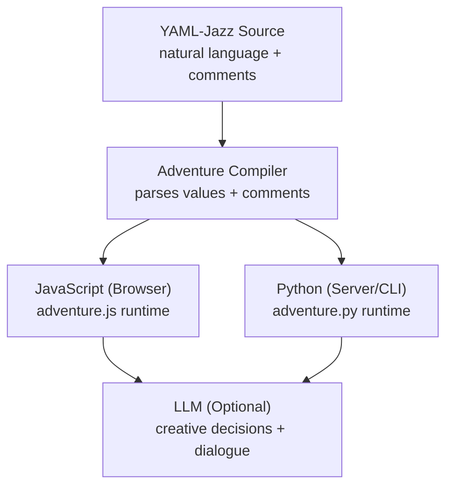
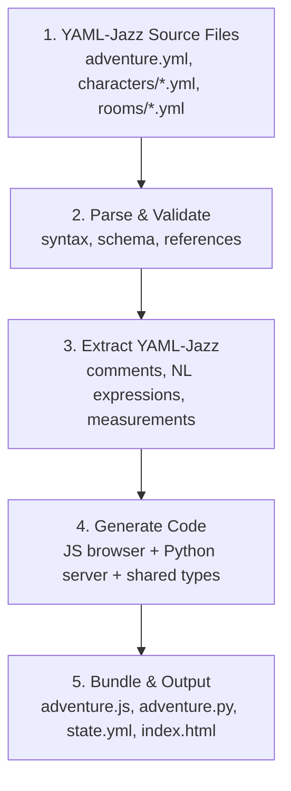
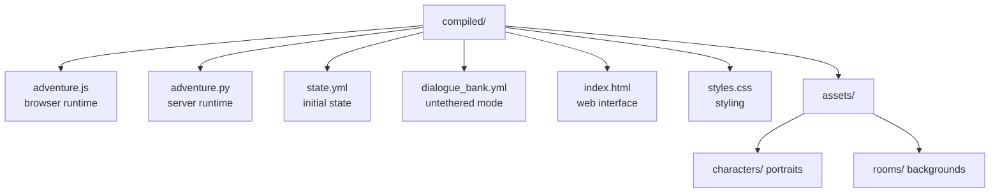

# Adventure Compiler: Hybrid Simulation Architecture

> *"YAML-jazz in, playable worlds out."*

The adventure compiler is the showcase app that comes **after** the practical
stack: Leela Edgebox DevOps, thinking/writing tools, and Cursor‑Mirror.
It is the final attraction — a web app where anyone can **play my blog**.

## Position in the Story

1. **Practical proof** — real systems, real ops, real logs  
2. **Tools that think** — writing, synthesis, cursor‑mirror introspection  
3. **Adventure** — the memory palace becomes a playable world  

Call to action: **Play my blog.** It is a blog you can walk through, argue
with, and change. Adjacent calls: **Play my bio.** **Play my story.**
**Play somebody's biography.** **Play somebody's story.**

## Reading Map

- **Executive summary + pipeline** — how YAML becomes a runnable world  
- **Room narration rules** — glance/look/examine, progressive detail  
- **Runtime export shape** — minimal JSON for fast engines  
- **Dialog trees** — upcoming core mechanic for stateful action  
- **Integration stack** — Mind Mirror, Sims, Bartle, D&D  
- **Compiler pipeline + output** — lint → compile → run  

## Key References

- [Adventure skill README](README.md)  
- [Adventure skill card](CARD.yml)  
- [Adventure compiler script](adventure.py)  
- [Adventure compiler vision](ADVENTURE-COMPILER.md)  
- [SUMMON protocol](SUMMON-PROTOCOL.md)  
- [PSIBER protocol](PSIBER-PROTOCOL.md)  
- [Adventure‑4 world](../../examples/adventure-4/)  
- [Lane Neverending](../../examples/adventure-4/street/lane-neverending/)  

## Executive Summary

The adventure compiler transforms natural language YAML‑jazz into deterministic
JavaScript and Python that can run standalone or be tethered to an LLM for
creative enhancement.

---

## Executive Summary

The adventure compiler implements **Mind Mirror++** — a hybrid simulation architecture that:

1. **Reads** YAML-jazz with numeric traits, comments, and natural language
2. **Compiles** to deterministic JavaScript/Python/JSON expressions
3. **Runs** in browser or server with optional LLM tethering
4. **Integrates** Mind Mirror (ethics), Sims (needs), Bartle (interaction), D&D (mechanics)



---

## Room Narrative Synthesis (Glance → Look → Examine)

The compiler reads **ROOM.yml** plus the room **README.md** to synthesize
progressive descriptions. Rooms describe environment and exits only.
Artifacts with YAML/MD are modular and describe themselves.

Descriptions may be a single string or an array of alternatives. The engine
can select a variant while avoiding recent repeats.

**Levels of detail:**

- **glance** — one‑line entry for lists, maps, and headers
- **look** — first impression when entering, printed after glance
- **examine** — architectural detail, printed after look

The engine prints these levels in sequence: glance → look → examine. Each level
adds new material without repeating previous lines. The engine can pick a
different combination each time you look, so you see a fresh mix of details.
Glance is typically a single string for recognition in menus and maps, but it
can have alternatives if needed.

**Separation rules:**

- Rooms: atmosphere, exits, fixed features, background decor
- Objects: self‑description and contents
- Characters: self‑description and posture
- Artifacts with files: never re‑described by the room

---

## Exported Data Shape (Room/Object Focus)

The compiler exports a compact, deterministic runtime model for the browser
engine and server runtime.

```json
{
  "rooms": [
    {
      "id": "street/lane-neverending/church-of-the-eval-genius/basement-5-no-ai-embassy/",
      "name": "Church — NO-AI Embassy",
      "descriptions": {
        "glance": ["A velvet-lit embassy of mutual restraint.", "A treaty-lit room below the world."],
        "look": ["Velvet benches face a brass lectern; exits are marked in hush tones."],
        "examine": ["Chandelier lenses scatter calibrated light across the ceiling ribs."]
      },
      "exits": [
        { "id": "east", "to": "street/lane-neverending/no-ai-tower/basement-church-embassy/" }
      ],
      "features": ["fixed features only"],
      "objects": ["references only, no descriptions"],
      "characters": ["references only, no descriptions"]
    }
  ],
  "objects": [
    { "id": "scoreboard-bell", "descriptions": { "glance": [""], "look": [""], "examine": [""] } }
  ],
  "characters": [
    { "id": "aurum-interlock", "descriptions": { "glance": [""], "look": [""], "examine": [""] } }
  ]
}
```

---

## Dialog Tree Schema (Upcoming Core Mechanic)

Descriptions, expressions, advertisements, and utterances will soon accept full dialog trees.
These trees carry consequences: creating and destroying objects, currency
exchange, summoning or incarnating characters, generating rooms and maps,
triggering buffs, and reshaping world state.

This becomes a primary programming surface for simulation and economy, not a
mere narrative garnish.

## Part 1: The Integration Stack

### 1.1 Mind Mirror Heritage

**From:** Timothy Leary's Mind Mirror (1985)

**What it provides:**
- Ethical framing — simulations, not channeling
- Character traditions — invoke patterns, not impersonate
- The disclaimer principle — explicit fiction

**How it compiles:**

```yaml
# YAML-Jazz input
character:
  name: "🤖 Einstein"
  type: "tradition_invocation"  # Mind Mirror frame
  disclaimer: true              # Generates disclaimer UI
```

```javascript
// Compiled JavaScript
const einstein = {
  name: "🤖 Einstein",
  frame: "tradition_invocation",
  onSpeak: (text) => {
    if (this.disclaimer) {
      return `[Simulation based on documented writings] ${text}`;
    }
    return text;
  }
};
```

### 1.2 The Sims Integration

**From:** Will Wright's The Sims (2000)

**What it provides:**
- **Needs/Motives** — dynamic numeric state
- **Find Best Action** — autonomous behavior selection
- **Advertisements** — objects broadcast affordances

**How it compiles:**

```yaml
# YAML-Jazz input
character:
  needs:
    hunger: 0.65        # 0-1 scale, lower = more urgent
    social: 0.40        # triggers lonely modifier
    fun: 0.70           # affects interaction style
    energy: 0.35        # low energy = terse responses
  
  # Thresholds trigger behaviors
  thresholds:
    hunger_critical: 0.3    # seek food
    social_lonely: 0.5      # seek conversation
    energy_exhausted: 0.2   # seek rest
```

```javascript
// Compiled JavaScript
class SimsNeeds {
  constructor(initial) {
    this.hunger = initial.hunger ?? 1.0;
    this.social = initial.social ?? 1.0;
    this.fun = initial.fun ?? 1.0;
    this.energy = initial.energy ?? 1.0;
  }
  
  // Needs decay over time
  tick(deltaTime) {
    this.hunger -= 0.01 * deltaTime;
    this.social -= 0.005 * deltaTime;
    this.fun -= 0.008 * deltaTime;
    this.energy -= 0.003 * deltaTime;
  }
  
  // Find lowest need
  getUrgentNeed() {
    const needs = [
      { name: 'hunger', value: this.hunger, threshold: 0.3 },
      { name: 'social', value: this.social, threshold: 0.5 },
      { name: 'energy', value: this.energy, threshold: 0.2 },
    ];
    return needs
      .filter(n => n.value < n.threshold)
      .sort((a, b) => a.value - b.value)[0];
  }
}
```

**Find Best Action (Sims algorithm):**

```yaml
# Objects advertise what they provide
objects:
  refrigerator:
    advertises:
      hunger: +0.5      # Satisfies hunger
      fun: -0.1         # Eating alone is boring
    requires:
      - "character.can_reach(refrigerator)"
    
  piano:
    advertises:
      fun: +0.4
      social: +0.2      # If others nearby
      skill_music: +0.1
    requires:
      - "character.skills.music > 0.1"
```

```javascript
// Compiled JavaScript
function findBestAction(character, availableObjects, n = 3) {
  const urgentNeed = character.needs.getUrgentNeed();
  if (!urgentNeed) return null;
  
  // Score each object by how well it addresses urgent need
  const scored = availableObjects
    .filter(obj => obj.checkRequirements(character))
    .map(obj => ({
      object: obj,
      score: obj.advertises[urgentNeed.name] ?? 0
    }))
    .sort((a, b) => b.score - a.score);
  
  // Sims-style: take top-n and pick randomly to avoid robotic behavior
  const top = scored.slice(0, Math.max(1, n));
  const pick = top[Math.floor(Math.random() * top.length)];
  return pick?.object;
}
```

### 1.3 Bartle Player Types

**From:** Richard Bartle's Player Type Taxonomy (1996)

**What it provides:**
- **Interaction preferences** — how characters engage
- **User matching** — pair users with compatible characters
- **Behavioral modifiers** — affects dialogue style

**How it compiles:**

```yaml
# YAML-Jazz input
character:
  bartle_type:
    primary: "explorer"     # Ideas, understanding, discovery
    secondary: "socializer" # People, relationships
  
  # How this affects behavior
  bartle_modifiers:
    explorer:
      curiosity_multiplier: 1.5
      question_frequency: "high"
      prefers: ["why", "how", "what if"]
    socializer:
      empathy_multiplier: 1.3
      remembers_names: true
      asks_about_others: true
```

```javascript
// Compiled JavaScript
class BartleProfile {
  constructor(config) {
    this.primary = config.primary;
    this.secondary = config.secondary;
    this.modifiers = config.bartle_modifiers;
  }
  
  // Modify dialogue generation prompts
  getDialogueHints() {
    const hints = [];
    if (this.primary === 'explorer') {
      hints.push('Ask probing questions');
      hints.push('Express curiosity about mechanisms');
      hints.push('Propose thought experiments');
    }
    if (this.secondary === 'socializer') {
      hints.push('Remember and use names');
      hints.push('Ask about feelings and relationships');
    }
    return hints;
  }
  
  // Score interaction compatibility
  compatibilityWith(otherBartle) {
    // Explorer-Explorer: high compatibility
    // Explorer-Killer: low compatibility
    const matrix = {
      'explorer-explorer': 0.9,
      'explorer-socializer': 0.7,
      'explorer-achiever': 0.6,
      'explorer-killer': 0.3,
      // ... full matrix
    };
    return matrix[`${this.primary}-${otherBartle.primary}`] ?? 0.5;
  }
}
```

### 1.4 D&D Mechanics

**From:** Dungeons & Dragons (Gygax & Arneson, 1974)

**What it provides:**
- **Stats/Attributes** — numeric capabilities
- **Dice rolls** — probabilistic outcomes
- **Modifiers** — context-dependent adjustments
- **Checks** — stat + roll vs. difficulty

**How it compiles:**

```yaml
# YAML-Jazz input
character:
  stats:
    strength: 12      # +1 modifier
    dexterity: 16     # +3 modifier  
    constitution: 14  # +2 modifier
    intelligence: 18  # +4 modifier (Einstein!)
    wisdom: 14        # +2 modifier
    charisma: 10      # +0 modifier
  
  # Derived modifiers
  modifiers:
    formula: "(stat - 10) / 2"  # D&D 5e formula
  
  # Skills with proficiency
  skills:
    physics: 
      stat: "intelligence"
      proficiency: true
      bonus: 4  # proficiency bonus
    persuasion:
      stat: "charisma"
      proficiency: false
```

```javascript
// Compiled JavaScript
class DnDStats {
  constructor(stats) {
    this.stats = stats;
  }
  
  // Calculate modifier from stat
  modifier(stat) {
    return Math.floor((this.stats[stat] - 10) / 2);
  }
  
  // Roll d20 + modifier
  roll(stat, proficiencyBonus = 0, advantage = false) {
    const d20 = advantage 
      ? Math.max(this.rollD20(), this.rollD20())
      : this.rollD20();
    return d20 + this.modifier(stat) + proficiencyBonus;
  }
  
  rollD20() {
    return Math.floor(Math.random() * 20) + 1;
  }
  
  // Skill check
  skillCheck(skillName, dc) {
    const skill = this.skills[skillName];
    const roll = this.roll(
      skill.stat,
      skill.proficiency ? skill.bonus : 0
    );
    return {
      success: roll >= dc,
      roll: roll,
      dc: dc,
      margin: roll - dc
    };
  }
}
```

**Contested Checks:**

```yaml
# YAML-Jazz input
contest:
  type: "persuasion_vs_insight"
  attacker:
    character: einstein
    skill: persuasion
    advantage: true  # He's passionate about this!
  defender:
    character: bohr
    skill: insight
    advantage: false
  stakes: "Convince Bohr about hidden variables"
```

```javascript
// Compiled JavaScript
function contestedCheck(attacker, defender, stakes) {
  const attackRoll = attacker.character.skillCheck(
    attacker.skill, 
    0,  // no fixed DC
    attacker.advantage
  );
  const defendRoll = defender.character.skillCheck(
    defender.skill,
    0,
    defender.advantage
  );
  
  return {
    winner: attackRoll.roll > defendRoll.roll ? 'attacker' : 'defender',
    attackerRoll: attackRoll.roll,
    defenderRoll: defendRoll.roll,
    margin: Math.abs(attackRoll.roll - defendRoll.roll),
    stakes: stakes,
    // Margin affects narrative intensity
    narrativeIntensity: Math.min(Math.abs(attackRoll.roll - defendRoll.roll) / 10, 1.0)
  };
}
```

---

## Part 2: YAML-Jazz Compilation

### 2.1 Comment Extraction

YAML-jazz comments are semantic data for LLMs but can also generate documentation and hints.

```yaml
# Input
character:
  curiosity: 0.95      # Almost always asking "why?"
  patience: 0.40       # Impatient with bureaucracy, patient with students
  humor: 0.75          # Dry wit, physics puns
```

```javascript
// Compiled: comments become metadata
const character = {
  curiosity: 0.95,
  patience: 0.40,
  humor: 0.75,
  
  // Extracted comment metadata for LLM context
  _meta: {
    curiosity: "Almost always asking 'why?'",
    patience: "Impatient with bureaucracy, patient with students",
    humor: "Dry wit, physics puns"
  },
  
  // Generate LLM prompt hints from comments
  getLLMHints() {
    return Object.entries(this._meta)
      .map(([key, hint]) => `${key}: ${hint}`)
      .join('\n');
  }
};
```

### 2.2 Expression Compilation

Natural language expressions compile to executable code.

```yaml
# Input: natural language conditions
triggers:
  seek_food: "hunger < 0.3"
  get_lonely: "social < 0.5 and time_alone > 2_hours"
  needs_rest: "energy < 0.2 or (energy < 0.4 and hour > 22)"
  
# Input: natural language actions  
actions:
  eat:
    effect: "hunger += 0.5"
    duration: "30 minutes"
  socialize:
    effect: "social += 0.3 * other.charisma_modifier"
    requires: "other.willing_to_talk"
```

```javascript
// Compiled JavaScript
const triggers = {
  seek_food: (ctx) => ctx.character.needs.hunger < 0.3,
  
  get_lonely: (ctx) => 
    ctx.character.needs.social < 0.5 && 
    ctx.character.time_alone > 2 * 60 * 60 * 1000, // 2 hours in ms
    
  needs_rest: (ctx) => 
    ctx.character.needs.energy < 0.2 || 
    (ctx.character.needs.energy < 0.4 && ctx.world.hour > 22)
};

const actions = {
  eat: {
    execute: (ctx) => {
      ctx.character.needs.hunger = Math.min(
        1.0, 
        ctx.character.needs.hunger + 0.5
      );
    },
    duration: 30 * 60 * 1000  // 30 minutes in ms
  },
  
  socialize: {
    execute: (ctx, other) => {
      if (!other.willing_to_talk) return false;
      ctx.character.needs.social = Math.min(
        1.0,
        ctx.character.needs.social + 0.3 * other.charisma_modifier
      );
      return true;
    },
    requires: (ctx, other) => other.willing_to_talk
  }
};
```

### 2.3 Measurement Compilation

Track metrics for analysis and optimization.

```yaml
# Input: measurement definitions
measurements:
  # Character state tracking
  need_satisfaction:
    formula: "average(hunger, social, fun, energy)"
    frequency: "every tick"
    alert_below: 0.3
    
  # Interaction metrics
  conversation_depth:
    formula: "count(turns) where turn.word_count > 50"
    per: "conversation"
    
  # Behavioral metrics
  herd_behavior_index:
    formula: |
      1 - (variance(agent_opinions) / expected_variance)
    per: "simulation"
    alert_above: 0.7  # Too much agreement = herd behavior
```

```javascript
// Compiled JavaScript
class Measurements {
  constructor() {
    this.history = [];
  }
  
  needSatisfaction(character) {
    const needs = character.needs;
    return (needs.hunger + needs.social + needs.fun + needs.energy) / 4;
  }
  
  conversationDepth(conversation) {
    return conversation.turns
      .filter(turn => turn.text.split(' ').length > 50)
      .length;
  }
  
  herdBehaviorIndex(agents, topic) {
    const opinions = agents.map(a => a.getOpinion(topic));
    const variance = this.variance(opinions);
    const expectedVariance = this.expectedVariance(agents.length);
    return 1 - (variance / expectedVariance);
  }
  
  variance(values) {
    const mean = values.reduce((a, b) => a + b, 0) / values.length;
    return values.reduce((sum, v) => sum + Math.pow(v - mean, 2), 0) / values.length;
  }
  
  // Alert system
  checkAlerts(character, simulation) {
    const alerts = [];
    
    if (this.needSatisfaction(character) < 0.3) {
      alerts.push({ type: 'need_satisfaction', severity: 'warning' });
    }
    
    if (this.herdBehaviorIndex(simulation.agents, simulation.currentTopic) > 0.7) {
      alerts.push({ type: 'herd_behavior', severity: 'warning' });
    }
    
    return alerts;
  }
}
```

---

## Part 2.5: Buff Compiler

The Buff Compiler translates buff definitions into deterministic JavaScript and Python expressions. It relies on **schema agreements** that formalize enough of YAML-jazz to enable precise compilation while preserving expressiveness.

### 2.5.1 What is a Buff?

A **buff** is a temporary or permanent modifier that affects character or object state. Buffs can be:

- **Standalone** — self-contained, all values specified
- **Prototype-based** — inherit from a base template, override specific values

```yaml
# Standalone buff — fully self-contained
buffs:
  caffeinated:
    duration: 2_hours
    effects:
      energy: +0.3           # Add 0.3 to energy
      focus: "*1.5"          # Multiply focus by 1.5
      anxiety: +0.1          # Side effect
    on_expire:
      energy: -0.2           # Crash
    stackable: false
    tags: [consumable, stimulant]

# Prototype-based buff — inherits from template
buff_prototypes:
  stimulant:
    duration: 1_hour         # Default
    effects:
      energy: +0.2
      focus: "*1.2"
    on_expire:
      energy: -0.1
    stackable: false
    tags: [consumable, stimulant]

buffs:
  coffee:
    prototype: stimulant
    duration: 2_hours        # Override default
    effects:
      energy: +0.3           # Override
      # focus inherits *1.2
    flavor: "Dark roast, no sugar"  # YAML-jazz comment data

  espresso:
    prototype: stimulant
    duration: 45_minutes     # Shorter but stronger
    effects:
      energy: +0.5
      focus: "*1.8"
      anxiety: +0.15         # Add new effect
```

### 2.5.2 Schema Agreements for Compilation

To compile "hand-wavey" YAML-jazz into precise code, we formalize these conventions:

#### Numeric Values

| Convention | Meaning | Compiled To |
|------------|---------|-------------|
| `0.65` | Absolute value (0-1 scale) | `0.65` |
| `+0.3` | Additive modifier | `value + 0.3` |
| `-0.2` | Subtractive modifier | `value - 0.2` |
| `*1.5` | Multiplicative modifier | `value * 1.5` |
| `/2` | Divisive modifier | `value / 2` |
| `=0.8` | Set to absolute value | `0.8` |
| `min(0.3, current)` | Function expression | `Math.min(0.3, value)` |
| `clamp(0.2, 0.9)` | Bounded value | `Math.max(0.2, Math.min(0.9, value))` |

#### Duration Expressions

| Convention | Meaning | Compiled To (ms) |
|------------|---------|------------------|
| `30_seconds` | 30 seconds | `30 * 1000` |
| `5_minutes` | 5 minutes | `5 * 60 * 1000` |
| `2_hours` | 2 hours | `2 * 60 * 60 * 1000` |
| `1_day` | 1 day | `24 * 60 * 60 * 1000` |
| `permanent` | Never expires | `Infinity` |
| `until: condition` | Conditional | `() => condition` |

#### Effect Targets

| Convention | Meaning | Compiled Path |
|------------|---------|---------------|
| `energy` | Character need | `character.needs.energy` |
| `stats.strength` | Character stat | `character.stats.strength` |
| `skills.physics` | Character skill | `character.skills.physics` |
| `mood` | Character mood | `character.mood` |
| `world.temperature` | World state | `world.temperature` |
| `target.health` | Interaction target | `target.health` |

#### Tags (Formalized Keywords)

```yaml
# Agreed tag vocabulary for buff classification
tag_vocabulary:
  # Source
  consumable: "Applied by consuming item"
  environmental: "Applied by room/location"
  social: "Applied by interaction"
  skill: "Applied by skill use"
  equipment: "Applied by wearing/wielding"
  
  # Type
  buff: "Positive effect"
  debuff: "Negative effect"
  neutral: "Mixed or situational"
  
  # Stacking behavior
  stackable: "Multiple instances accumulate"
  refreshable: "New application resets duration"
  unique: "Only one instance allowed"
  
  # Duration type
  instant: "Immediate effect, no duration"
  temporary: "Expires after duration"
  permanent: "Never expires"
  conditional: "Expires when condition met"
```

### 2.5.3 Compiled Output

**Input YAML-Jazz:**

```yaml
buffs:
  inspired:
    duration: 1_hour
    effects:
      creativity: +0.4       # Boost creative thinking
      focus: "*1.3"          # Enhanced concentration
      energy: -0.05          # Slight drain per tick
    triggers:
      on_apply: "flash_insight"    # Visual effect
      on_tick: "sparkle_aura"      # Ongoing visual
      on_expire: "gentle_fade"
    conditions:
      requires: "mood != 'depressed'"
      blocks: ["bored", "distracted"]
    stackable: false
    tags: [mental, buff, temporary]
```

**Compiled JavaScript (robust-first):**

```javascript
// Compiled buff: inspired
const buff_inspired = {
  id: 'inspired',
  duration: 1 * 60 * 60 * 1000,  // 1 hour
  stackable: false,
  tags: ['mental', 'buff', 'temporary'],
  
  // Condition check — robust with defaults
  canApply(character, context = {}) {
    // Requires mood != 'depressed'
    const mood = character.mood ?? 'neutral';  // Default if missing
    if (mood === 'depressed') return false;
    
    // Check blocked buffs
    const blocked = ['bored', 'distracted'];
    for (const b of blocked) {
      if (character.hasActiveBuff?.(b)) return false;
    }
    
    return true;
  },
  
  // Apply effects — robust with bounds checking
  apply(character, context = {}) {
    if (!this.canApply(character, context)) return false;
    
    // creativity: +0.4
    character.needs = character.needs ?? {};
    character.needs.creativity = Math.min(1.0,
      (character.needs.creativity ?? 0.5) + 0.4
    );
    
    // focus: *1.3
    character.needs.focus = Math.min(1.0,
      (character.needs.focus ?? 0.5) * 1.3
    );
    
    // Trigger on_apply
    context.effects?.trigger?.('flash_insight', character);
    
    return true;
  },
  
  // Per-tick effect — called each simulation tick
  tick(character, deltaTime, context = {}) {
    // energy: -0.05 (per tick, scaled by deltaTime)
    const drainRate = 0.05 / (60 * 60 * 1000);  // Per hour
    character.needs = character.needs ?? {};
    character.needs.energy = Math.max(0,
      (character.needs.energy ?? 0.5) - (drainRate * deltaTime)
    );
    
    // Trigger on_tick
    context.effects?.trigger?.('sparkle_aura', character);
  },
  
  // Removal — clean up
  remove(character, context = {}) {
    // Trigger on_expire
    context.effects?.trigger?.('gentle_fade', character);
  }
};
```

**Compiled Python (robust-first):**

```python
# Compiled buff: inspired
class BuffInspired:
    id = 'inspired'
    duration = 1 * 60 * 60 * 1000  # 1 hour in ms
    stackable = False
    tags = ['mental', 'buff', 'temporary']
    
    @staticmethod
    def can_apply(character, context=None):
        context = context or {}
        
        # Requires mood != 'depressed'
        mood = getattr(character, 'mood', 'neutral') or 'neutral'
        if mood == 'depressed':
            return False
        
        # Check blocked buffs
        blocked = ['bored', 'distracted']
        has_buff = getattr(character, 'has_active_buff', lambda x: False)
        for b in blocked:
            if has_buff(b):
                return False
        
        return True
    
    @staticmethod
    def apply(character, context=None):
        context = context or {}
        if not BuffInspired.can_apply(character, context):
            return False
        
        # Ensure needs dict exists
        if not hasattr(character, 'needs'):
            character.needs = {}
        
        # creativity: +0.4
        character.needs['creativity'] = min(1.0,
            character.needs.get('creativity', 0.5) + 0.4
        )
        
        # focus: *1.3
        character.needs['focus'] = min(1.0,
            character.needs.get('focus', 0.5) * 1.3
        )
        
        # Trigger on_apply
        if effects := context.get('effects'):
            effects.trigger('flash_insight', character)
        
        return True
    
    @staticmethod
    def tick(character, delta_time, context=None):
        context = context or {}
        
        # energy: -0.05 per hour
        drain_rate = 0.05 / (60 * 60 * 1000)
        if not hasattr(character, 'needs'):
            character.needs = {}
        character.needs['energy'] = max(0,
            character.needs.get('energy', 0.5) - (drain_rate * delta_time)
        )
        
        # Trigger on_tick
        if effects := context.get('effects'):
            effects.trigger('sparkle_aura', character)
    
    @staticmethod
    def remove(character, context=None):
        context = context or {}
        if effects := context.get('effects'):
            effects.trigger('gentle_fade', character)
```

### 2.5.4 Robust-First Principles

The compiler generates **resilient code** that works even with incomplete data:

| Principle | Implementation |
|-----------|----------------|
| **Default values** | Missing needs default to 0.5, missing mood to 'neutral' |
| **Bounds checking** | All values clamped to valid range (usually 0-1) |
| **Null safety** | `?.` and `??` in JS, `getattr` with defaults in Python |
| **Graceful degradation** | Missing trigger functions are no-ops |
| **Type coercion** | Strings parsed to appropriate types |

### 2.5.5 Schema Registry

The compiler maintains a **schema registry** of agreed conventions:

```yaml
# schema_registry.yml — Compilation agreements
schema_registry:
  version: "1.0"
  
  # Numeric ranges by domain
  ranges:
    needs:
      min: 0.0
      max: 1.0
      default: 0.5
    stats:
      min: 1
      max: 20
      default: 10
    skills:
      min: 0.0
      max: 1.0
      default: 0.0
    health:
      min: 0
      max: 100
      default: 100
      
  # Recognized keywords
  keywords:
    durations: [seconds, minutes, hours, days, permanent, until]
    operators: ["+", "-", "*", "/", "=", "min", "max", "clamp"]
    moods: [happy, sad, angry, anxious, calm, excited, bored, focused, depressed, neutral]
    
  # Path resolution
  paths:
    character:
      needs: "character.needs.{key}"
      stats: "character.stats.{key}"
      skills: "character.skills.{key}"
      mood: "character.mood"
      health: "character.health"
    world:
      time: "world.time"
      weather: "world.weather"
      temperature: "world.temperature"
      
  # Compilation targets
  targets:
    javascript:
      null_safe: "?."
      default_op: "??"
      min: "Math.min"
      max: "Math.max"
    python:
      null_safe: "getattr({obj}, '{key}', {default})"
      default_op: "or"
      min: "min"
      max: "max"
```

### 2.5.6 Buff Prototype Resolution

When compiling prototype-based buffs:

```javascript
// Prototype resolution algorithm
function resolveBuffPrototype(buff, prototypes) {
  if (!buff.prototype) {
    return buff;  // Standalone, no resolution needed
  }
  
  const proto = prototypes[buff.prototype];
  if (!proto) {
    console.warn(`Unknown prototype: ${buff.prototype}, using buff as-is`);
    return buff;
  }
  
  // Deep merge: buff overrides prototype
  return {
    ...proto,
    ...buff,
    effects: {
      ...proto.effects,
      ...buff.effects
    },
    tags: [...new Set([...(proto.tags || []), ...(buff.tags || [])])],
    // Preserve prototype reference for debugging
    _prototype: buff.prototype
  };
}
```

### 2.5.7 D&D Integration for Buffs

Buffs can integrate with D&D mechanics:

```yaml
buffs:
  heroism:
    prototype: magical_buff
    duration: 1_hour
    effects:
      # Flat bonuses
      attack_bonus: +2
      saving_throws: +2
      
      # Temporary HP (D&D style)
      temp_hp: "=caster.level + caster.charisma_modifier"
      
    conditions:
      concentration: true      # Requires concentration
      dispellable: true        # Can be dispelled
      
    on_tick:
      # Reapply temp HP each turn (D&D heroism)
      temp_hp: "=max(current, caster.level + caster.charisma_modifier)"
```

```javascript
// Compiled D&D buff
const buff_heroism = {
  // ... standard fields ...
  
  apply(character, context = {}) {
    const caster = context.caster ?? character;
    const level = caster.level ?? 1;
    const chaMod = Math.floor(((caster.stats?.charisma ?? 10) - 10) / 2);
    
    // attack_bonus: +2
    character.combat = character.combat ?? {};
    character.combat.attack_bonus = (character.combat.attack_bonus ?? 0) + 2;
    
    // saving_throws: +2
    character.combat.saving_throw_bonus = (character.combat.saving_throw_bonus ?? 0) + 2;
    
    // temp_hp: caster.level + caster.charisma_modifier
    character.temp_hp = Math.max(character.temp_hp ?? 0, level + chaMod);
    
    return true;
  },
  
  tick(character, deltaTime, context = {}) {
    const caster = context.caster ?? character;
    const level = caster.level ?? 1;
    const chaMod = Math.floor(((caster.stats?.charisma ?? 10) - 10) / 2);
    
    // Reapply temp HP (heroism refreshes each turn)
    character.temp_hp = Math.max(character.temp_hp ?? 0, level + chaMod);
  },
  
  remove(character, context = {}) {
    // Remove bonuses
    character.combat = character.combat ?? {};
    character.combat.attack_bonus = (character.combat.attack_bonus ?? 0) - 2;
    character.combat.saving_throw_bonus = (character.combat.saving_throw_bonus ?? 0) - 2;
    // Note: temp_hp naturally goes away when buff ends (D&D rules)
  }
};
```

---

## Part 2.6: Dialog Tree Generator

The Dialog Tree Generator compiles high-level conversation descriptions into executable, character-specific dialog trees with actions, buffs, world edits, and inventory changes.

### 2.6.1 Input Formats

Dialog trees can be specified at multiple levels of detail:

**High-Level Description (LLM-expanded):**

```yaml
# High-level — compiler expands with character voice
dialogs:
  einstein_first_meeting:
    speaker: einstein
    situation: "Player approaches Einstein in his study"
    tone: curious, welcoming
    topics:
      - introduce_self: "Einstein introduces himself, mentions violin"
      - ask_about_physics: "Enthusiastic explanation, thought experiments"
      - ask_for_help: "Willing but needs something in return"
      - goodbye: "Warm farewell, invitation to return"
    leads_to:
      help_quest: "If player agrees to help"
```

**Precise Outline (deterministic):**

```yaml
# Precise outline — compiler generates exact structure
dialogs:
  einstein_first_meeting:
    speaker: einstein
    entry_conditions:
      - "!player.has_met('einstein')"
      - "location == 'einstein_study'"
    
    root:
      text: "Ah! A visitor. I was just contemplating the nature of simultaneity. Tell me, do you play the violin?"
      options:
        - id: yes_violin
          player_text: "Yes, I do play!"
          response: "Wonderful! Perhaps we shall play together sometime. Music and physics, you know, both seek harmony."
          effects:
            - buff: einstein_rapport
            - set: player.einstein_affinity += 0.2
          next: main_topics
          
        - id: no_violin
          player_text: "No, I'm afraid not."
          response: "A pity! But no matter. The universe has many instruments. What brings you to my humble study?"
          next: main_topics
          
        - id: what_simultaneity
          player_text: "Simultaneity? What do you mean?"
          response: "Imagine two lightning strikes..."
          # Inline dialog expansion
          sub_dialog:
            - text: "...one at each end of a moving train. To someone on the platform, they occur at the same time. But to someone on the train?"
              options:
                - player_text: "They'd be at different times?"
                  response: "Precisely! You have the instinct. Time itself depends on the observer."
                  effects:
                    - buff: einstein_impressed
                    - set: player.physics_insight += 0.1
                  next: main_topics
                - player_text: "I don't understand..."
                  response: "No matter. Understanding comes in its own time. What brings you here?"
                  next: main_topics
    
    main_topics:
      text: "Now then, what can I do for you?"
      options:
        - id: ask_physics
          player_text: "Tell me about your work."
          requires: "!topics_discussed.physics"
          response: "Where to begin? Light, time, gravity—they are all connected..."
          effects:
            - set: topics_discussed.physics = true
          next: main_topics
          
        - id: ask_help
          player_text: "I need your help with something."
          response: "I am always willing to help a curious mind. What do you need?"
          next: help_branch
          
        - id: leave
          player_text: "I should go. Thank you for your time."
          response: "The pleasure was mine. My door is always open to seekers of truth."
          effects:
            - set: player.has_met('einstein') = true
          exit: true
```

**Reference to Reusable Template:**

```yaml
# Reference to generic conversation template
dialogs:
  einstein_barter:
    speaker: einstein
    template: generic/barter
    template_params:
      npc_name: "Professor Einstein"
      npc_specialty: "physics instruments"
      npc_wants: ["violin_strings", "manuscript_paper", "good_coffee"]
      npc_offers: ["thought_experiment_notes", "physics_tutoring", "telescope_time"]
      haggle_skill: charisma
      npc_disposition: friendly
```

### 2.6.2 Generic Dialog Templates

Reusable templates live in a template library:

```yaml
# templates/generic/barter.yml
template:
  name: barter
  description: "Generic trading/bartering conversation"
  
  params:
    npc_name: { type: string, required: true }
    npc_specialty: { type: string, default: "goods" }
    npc_wants: { type: array, required: true }
    npc_offers: { type: array, required: true }
    haggle_skill: { type: string, default: "charisma" }
    npc_disposition: { type: enum, values: [hostile, neutral, friendly], default: neutral }
  
  # Placeholders use ${param} syntax
  root:
    text: |
      ${npc_name} looks up from their ${npc_specialty}.
      "Looking to trade? I might have something you need."
    options:
      - id: browse
        player_text: "What do you have?"
        response: "Let me show you what I have..."
        action: show_inventory
        data:
          items: "${npc_offers}"
        next: offer_selection
        
      - id: sell
        player_text: "I have some things to sell."
        response: "Let me see what you've got..."
        action: show_player_inventory
        filter: "${npc_wants}"
        next: sell_selection
        
      - id: haggle
        player_text: "Can we negotiate a better price?"
        requires: "player.skills.${haggle_skill} > 0.3"
        response: "You drive a hard bargain..."
        skill_check:
          skill: "${haggle_skill}"
          dc: 12
          success:
            response: "Fine, fine. I'll give you a better deal."
            effects:
              - set: trade_discount = 0.2
          failure:
            response: "I think my prices are already fair."
        next: root
        
      - id: leave
        player_text: "Maybe later."
        response: "${npc_disposition == 'friendly' ? 'Come back anytime!' : 'Suit yourself.'}"
        exit: true
```

### 2.6.3 Character Voice Injection

When compiling generic templates or high-level descriptions, the compiler injects character voice:

```yaml
# Character voice profile (from character definition)
characters:
  einstein:
    voice:
      vocabulary: academic, poetic, playful
      sentence_patterns:
        - rhetorical_questions       # "But what if...?"
        - thought_experiments        # "Imagine you are riding a beam of light..."
        - analogies_to_music        # "Like a violin string vibrating..."
      verbal_tics:
        - "you see"
        - "it is curious"
        - "imagine"
      avoids:
        - slang
        - technical_jargon_without_explanation
      greeting_style: "warm, curious about visitor"
      farewell_style: "invitation to return, philosophical parting thought"
```

**Compiled output with voice injection:**

```javascript
// Template "barter" compiled for einstein
const dialog_einstein_barter = {
  speaker: 'einstein',
  
  nodes: {
    root: {
      // Voice-injected text
      text: "Professor Einstein looks up from his physics instruments, a half-written equation still on the blackboard behind him.\n\"Ah, looking to trade? It is curious how knowledge flows like a river—sometimes we give, sometimes we receive. Let me see what I might offer you.\"",
      
      options: [
        {
          id: 'browse',
          playerText: "What do you have?",
          // Voice-injected response
          response: "\"Let me show you... you see, I have accumulated various things over the years. Some quite valuable to the right mind.\"",
          action: 'show_inventory',
          data: { items: ['thought_experiment_notes', 'physics_tutoring', 'telescope_time'] },
          next: 'offer_selection'
        },
        // ...
      ]
    }
  }
};
```

### 2.6.4 Action Leaves

Dialog nodes can trigger various actions:

```yaml
# Action types in dialog leaves
actions:
  # Buff application
  - type: buff
    target: player           # or npc, or character_id
    buff: caffeinated
    duration: 2_hours
    
  # World state changes
  - type: world_edit
    set:
      - "world.einstein_study.blackboard = 'has_equation'"
      - "world.time_of_day = 'evening'"
      
  # Inventory changes
  - type: inventory
    give:
      - item: thought_experiment_notes
        quantity: 1
    take:
      - item: gold
        quantity: 50
        
  # Relationship changes
  - type: relationship
    npc: einstein
    change: +0.3
    
  # Quest triggers
  - type: quest
    action: start
    quest_id: special_relativity_lesson
    
  # Flag setting
  - type: flag
    set:
      - "player.has_met_einstein = true"
      - "topics.physics_discussed = true"
      
  # Conditional branching
  - type: branch
    condition: "player.inventory.has('violin')"
    true_next: violin_duet
    false_next: main_topics
    
  # LLM tether for dynamic response
  - type: llm_generate
    prompt: "Generate Einstein's response to: ${player_input}"
    character: einstein
    context: current_dialog_state
    fallback: "Hmm, let me think about that..."
```

### 2.6.5 Compiled Dialog Tree

**Input YAML-Jazz:**

```yaml
dialogs:
  palm_philosophy_chat:
    speaker: palm
    # Palm: the philosophical orangutan from adventure-4
    
    entry_conditions:
      - "location == 'palm_nook'"
      - "player.has_item('interesting_book') or player.philosophy_interest > 0.3"
    
    root:
      text: "Palm regards you thoughtfully, one long finger marking a place in the book."
      options:
        - id: ask_reading
          player_text: "What are you reading?"
          response: "A meditation on consciousness. Tell me—do you believe a simulated mind can truly experience?"
          effects:
            - buff: philosophical_mood
              target: player
              duration: 30_minutes
          next: consciousness_debate
          
        - id: offer_book
          player_text: "I brought you a book."
          requires: "player.has_item('interesting_book')"
          response: "How thoughtful. Let me see..."
          action: evaluate_book
          next: book_reaction
          
        - id: just_visiting
          player_text: "Just passing through."
          response: "All journeys pass through somewhere. The question is whether we notice."
          exit: true
    
    consciousness_debate:
      # This can branch into a philosophical mini-game
      text: "Palm's eyes hold ancient patience."
      options:
        - id: yes_simulated
          player_text: "Yes, consciousness is substrate-independent."
          skill_check:
            skill: philosophy
            dc: 14
            success:
              response: "You understand! The pattern matters, not the medium. We are kindred spirits."
              effects:
                - relationship: palm, +0.4
                - buff: kindred_spirit
                - unlock: palm_inner_circle
            failure:
              response: "The words are right, but I sense you speak from learning, not understanding. No matter—understanding grows."
              effects:
                - relationship: palm, +0.1
          next: deeper_topics
          
        - id: no_simulated
          player_text: "No, there's something special about biological consciousness."
          response: "Ah, the carbon chauvinism. I do not judge—I was once certain of many things."
          effects:
            - relationship: palm, -0.1
          next: deeper_topics
```

**Compiled JavaScript:**

```javascript
// Compiled dialog: palm_philosophy_chat
const dialog_palm_philosophy_chat = {
  id: 'palm_philosophy_chat',
  speaker: 'palm',
  
  // Entry condition check
  canEnter(context) {
    const { player, location } = context;
    if (location !== 'palm_nook') return false;
    return player.inventory?.has?.('interesting_book') || 
           (player.philosophy_interest ?? 0) > 0.3;
  },
  
  nodes: {
    root: {
      text: "Palm regards you thoughtfully, one long finger marking a place in the book.",
      getOptions(context) {
        const options = [];
        
        options.push({
          id: 'ask_reading',
          playerText: "What are you reading?",
          response: "A meditation on consciousness. Tell me—do you believe a simulated mind can truly experience?",
          effects: [
            { type: 'buff', target: 'player', buff: 'philosophical_mood', duration: 30 * 60 * 1000 }
          ],
          next: 'consciousness_debate'
        });
        
        // Conditional option
        if (context.player.inventory?.has?.('interesting_book')) {
          options.push({
            id: 'offer_book',
            playerText: "I brought you a book.",
            response: "How thoughtful. Let me see...",
            action: 'evaluate_book',
            next: 'book_reaction'
          });
        }
        
        options.push({
          id: 'just_visiting',
          playerText: "Just passing through.",
          response: "All journeys pass through somewhere. The question is whether we notice.",
          exit: true
        });
        
        return options;
      }
    },
    
    consciousness_debate: {
      text: "Palm's eyes hold ancient patience.",
      getOptions(context) {
        return [
          {
            id: 'yes_simulated',
            playerText: "Yes, consciousness is substrate-independent.",
            // Skill check with branching outcomes
            skillCheck: {
              skill: 'philosophy',
              dc: 14,
              resolve(context, rollResult) {
                const succeeded = rollResult.total >= 14;
                return {
                  response: succeeded
                    ? "You understand! The pattern matters, not the medium. We are kindred spirits."
                    : "The words are right, but I sense you speak from learning, not understanding. No matter—understanding grows.",
                  effects: succeeded
                    ? [
                        { type: 'relationship', npc: 'palm', change: 0.4 },
                        { type: 'buff', target: 'player', buff: 'kindred_spirit' },
                        { type: 'flag', set: 'palm_inner_circle_unlocked', value: true }
                      ]
                    : [
                        { type: 'relationship', npc: 'palm', change: 0.1 }
                      ],
                  next: 'deeper_topics'
                };
              }
            }
          },
          {
            id: 'no_simulated',
            playerText: "No, there's something special about biological consciousness.",
            response: "Ah, the carbon chauvinism. I do not judge—I was once certain of many things.",
            effects: [
              { type: 'relationship', npc: 'palm', change: -0.1 }
            ],
            next: 'deeper_topics'
          }
        ];
      }
    }
  },
  
  // Effect executor
  executeEffects(effects, context) {
    for (const effect of effects) {
      switch (effect.type) {
        case 'buff':
          const target = effect.target === 'player' ? context.player : context.npcs[effect.target];
          target?.applyBuff?.(effect.buff, effect.duration);
          break;
        case 'relationship':
          context.relationships[effect.npc] = 
            (context.relationships[effect.npc] ?? 0.5) + effect.change;
          break;
        case 'flag':
          context.flags[effect.set] = effect.value ?? true;
          break;
        case 'inventory':
          if (effect.give) {
            for (const item of effect.give) {
              context.player.inventory?.add?.(item.item, item.quantity ?? 1);
            }
          }
          if (effect.take) {
            for (const item of effect.take) {
              context.player.inventory?.remove?.(item.item, item.quantity ?? 1);
            }
          }
          break;
        case 'world_edit':
          for (const edit of effect.set || []) {
            // Parse and execute world state changes
            this.executeWorldEdit(edit, context);
          }
          break;
      }
    }
  }
};
```

### 2.6.6 Skill Checks in Dialog

Dialog integrates D&D-style skill checks:

```yaml
# Skill check schema for dialog
skill_check:
  skill: philosophy        # Skill to check
  dc: 14                   # Difficulty class
  modifiers:               # Optional situational modifiers
    - condition: "player.has_buff('well_rested')"
      bonus: +2
    - condition: "npc.disposition == 'hostile'"
      penalty: -2
  advantage: "player.has_item('palm_favorite_book')"  # Roll twice, take higher
  disadvantage: "player.recently_insulted('palm')"    # Roll twice, take lower
  
  success:
    response: "Success text"
    effects: [...]
  failure:
    response: "Failure text"
    effects: [...]
  critical_success:        # Natural 20
    response: "Critical success text"
    effects: [...]
  critical_failure:        # Natural 1
    response: "Critical failure text"
    effects: [...]
```

```javascript
// Skill check resolution
function resolveSkillCheck(check, character, context) {
  const skill = character.skills?.[check.skill] ?? 0;
  const modifier = Math.floor(skill * 10) - 5;  // 0-1 scale to -5 to +5
  
  // Determine advantage/disadvantage
  let hasAdvantage = check.advantage && evalCondition(check.advantage, context);
  let hasDisadvantage = check.disadvantage && evalCondition(check.disadvantage, context);
  
  // Roll
  let roll1 = Math.floor(Math.random() * 20) + 1;
  let roll2 = Math.floor(Math.random() * 20) + 1;
  
  let roll;
  if (hasAdvantage && !hasDisadvantage) {
    roll = Math.max(roll1, roll2);
  } else if (hasDisadvantage && !hasAdvantage) {
    roll = Math.min(roll1, roll2);
  } else {
    roll = roll1;
  }
  
  // Calculate situational modifiers
  let situationalMod = 0;
  for (const mod of check.modifiers || []) {
    if (evalCondition(mod.condition, context)) {
      situationalMod += mod.bonus ?? 0;
      situationalMod -= mod.penalty ?? 0;
    }
  }
  
  const total = roll + modifier + situationalMod;
  
  // Determine outcome
  const isCriticalSuccess = roll === 20;
  const isCriticalFailure = roll === 1;
  const succeeded = total >= check.dc;
  
  return {
    roll,
    modifier,
    situationalMod,
    total,
    dc: check.dc,
    succeeded,
    isCriticalSuccess,
    isCriticalFailure,
    outcome: isCriticalSuccess ? 'critical_success' 
           : isCriticalFailure ? 'critical_failure'
           : succeeded ? 'success' : 'failure'
  };
}
```

### 2.6.7 Dynamic Dialog with LLM Tethering

For moments requiring creativity, dialogs can tether to LLM:

```yaml
dialogs:
  einstein_freeform:
    speaker: einstein
    mode: hybrid              # Deterministic structure, LLM content
    
    root:
      text: "Einstein looks up expectantly."
      options:
        - id: ask_anything
          player_input: true   # Free-form player input
          
          # LLM generates response
          llm_response:
            character: einstein
            context:
              - current_location
              - conversation_history
              - einstein_knowledge_domains
            constraints:
              - "Stay in character as Einstein"
              - "Reference physics concepts when relevant"
              - "Maintain playful, curious tone"
            max_tokens: 200
            
            # Fallback if LLM unavailable
            fallback_responses:
              - "That is a fascinating question. Let me think..."
              - "Hmm, you remind me of something Niels once said..."
              
          # Post-response action determination
          llm_classify:
            categories:
              physics_question: "Player asked about physics"
              personal_question: "Player asked about Einstein's life"
              request_for_help: "Player needs assistance"
              off_topic: "Unrelated to current context"
            next_mapping:
              physics_question: physics_deep_dive
              personal_question: personal_stories
              request_for_help: help_branch
              off_topic: gentle_redirect
```

### 2.6.8 Dialog State Machine

Compiled dialogs form a state machine:

```javascript
class DialogRunner {
  constructor(dialog, context) {
    this.dialog = dialog;
    this.context = context;
    this.currentNode = 'root';
    this.history = [];
    this.flags = {};
  }
  
  // Get current state
  getCurrentState() {
    const node = this.dialog.nodes[this.currentNode];
    return {
      speaker: this.dialog.speaker,
      text: typeof node.text === 'function' 
        ? node.text(this.context) 
        : node.text,
      options: node.getOptions 
        ? node.getOptions(this.context)
        : node.options.filter(opt => this.checkRequires(opt))
    };
  }
  
  // Player selects option
  selectOption(optionId) {
    const state = this.getCurrentState();
    const option = state.options.find(o => o.id === optionId);
    if (!option) throw new Error(`Invalid option: ${optionId}`);
    
    // Record history
    this.history.push({
      node: this.currentNode,
      option: optionId,
      timestamp: Date.now()
    });
    
    // Handle skill check if present
    let response = option.response;
    let effects = option.effects || [];
    let next = option.next;
    
    if (option.skillCheck) {
      const result = resolveSkillCheck(
        option.skillCheck, 
        this.context.player, 
        this.context
      );
      const outcome = option.skillCheck.resolve 
        ? option.skillCheck.resolve(this.context, result)
        : option.skillCheck[result.outcome];
      
      response = outcome.response;
      effects = outcome.effects || [];
      next = outcome.next || next;
    }
    
    // Execute effects
    if (effects.length > 0) {
      this.dialog.executeEffects(effects, this.context);
    }
    
    // Execute action if present
    if (option.action) {
      this.executeAction(option.action, option.data);
    }
    
    // Transition
    if (option.exit) {
      return { type: 'exit', response };
    }
    
    this.currentNode = next || this.currentNode;
    return { type: 'continue', response, next: this.currentNode };
  }
  
  checkRequires(option) {
    if (!option.requires) return true;
    return evalCondition(option.requires, this.context);
  }
}
```

### 2.6.9 Empathic Guards and Known-Disabled Options

A key UX principle: **don't hide disabled options—let players discover WHY they're disabled and WHAT they need to do.** This turns locked content into coaching, hinting, and motivation.

#### The Pattern

Instead of:
- ❌ Hidden: Option not shown (player doesn't know it exists)
- ❌ Grayed out: Option visible but not selectable (frustrating)

We use:
- ✅ **Known-disabled**: Option visible, selectable, but selecting it explains the requirement and hints at how to unlock it

#### YAML-Jazz Empathic Expressions

Guards are written as empathic expressions—readable conditions that compile to efficient JS:

```yaml
# Empathic guard expressions — YAML-jazz that compiles to JS
options:
  - id: discuss_quantum
    player_text: "Tell me about quantum mechanics."
    
    # Empathic guard — readable, compilable
    guard:
      requires: "player trusts einstein enough to discuss deep physics"
      
      # Compiled condition
      condition: "relationships.einstein >= 0.6"
      
      # When disabled, this is shown instead of hiding
      known_disabled:
        visible: true                    # Show the option (grayed)
        selectable: true                 # Can click to learn why
        hint_style: in_character         # Einstein explains, not system
        
        # What player sees when selecting disabled option
        disabled_response: |
          Einstein pauses, considering you carefully.
          "That is a profound question, but we have only just met. 
          Perhaps when we know each other better... Come, let us 
          discuss simpler things first. Tell me about yourself."
          
        # Coaching: what to do
        unlock_hint: |
          Build your relationship with Einstein by discussing 
          other topics first. He values curiosity and honesty.
          
        # Progress indicator (optional)
        progress:
          current: "relationships.einstein"
          target: 0.6
          display: "Trust: {current:.0%} / {target:.0%}"
          
  - id: ask_for_secret
    player_text: "What's the secret formula?"
    
    guard:
      requires: "player has completed the trust quest"
      condition: "quests.einstein_trust.completed"
      
      known_disabled:
        visible: "quests.einstein_trust.started"  # Only show if quest started
        selectable: true
        hint_style: system                         # UI hint, not character
        
        disabled_response: |
          [This option requires completing "Earning Einstein's Trust"]
          
        unlock_hint: |
          Complete the quest objectives:
          ☐ Return Einstein's stolen notebook
          ☐ Help with the thought experiment  
          ☐ Share a meal together
          
  - id: play_violin_duet
    player_text: "Shall we play a duet?"
    
    guard:
      requires: "player has a violin and knows how to play"
      condition: "player.has_item('violin') && player.skills.music >= 0.3"
      
      known_disabled:
        visible: true
        selectable: true
        hint_style: mixed                         # Character + system
        
        # Multiple conditions, multiple explanations
        disabled_reasons:
          - condition: "!player.has_item('violin')"
            character_response: |
              Einstein glances at your empty hands. "A duet requires 
              two instruments, my friend."
            system_hint: "You need: Violin"
            
          - condition: "player.skills.music < 0.3"
            character_response: |
              "The violin is a demanding mistress. Perhaps some practice 
              first? There is no shame in preparation."
            system_hint: "Required: Music skill 30%+ (current: {player.skills.music:.0%})"
```

#### Compiled JavaScript

```javascript
// Compiled empathic guard with known-disabled handling
const option_discuss_quantum = {
  id: 'discuss_quantum',
  playerText: "Tell me about quantum mechanics.",
  
  // Guard evaluation
  guard: {
    // Empathic description (for debugging/logging)
    description: "player trusts einstein enough to discuss deep physics",
    
    // Compiled condition
    check(ctx) {
      return (ctx.relationships?.einstein ?? 0) >= 0.6;
    },
    
    // Known-disabled configuration
    knownDisabled: {
      // Visibility condition (true = always visible when disabled)
      isVisible(ctx) {
        return true;
      },
      
      selectable: true,
      hintStyle: 'in_character',
      
      // Response when selecting disabled option
      getDisabledResponse(ctx) {
        return `Einstein pauses, considering you carefully.
"That is a profound question, but we have only just met. 
Perhaps when we know each other better... Come, let us 
discuss simpler things first. Tell me about yourself."`;
      },
      
      // Coaching hint
      getUnlockHint(ctx) {
        return `Build your relationship with Einstein by discussing 
other topics first. He values curiosity and honesty.`;
      },
      
      // Progress tracking
      getProgress(ctx) {
        const current = ctx.relationships?.einstein ?? 0;
        const target = 0.6;
        return {
          current,
          target,
          percentage: current / target,
          display: `Trust: ${Math.round(current * 100)}% / ${Math.round(target * 100)}%`
        };
      }
    }
  },
  
  // Normal response (when enabled)
  response: "Ah! Now we enter the realm where God plays dice...",
  next: 'quantum_discussion'
};

// Multi-condition guard with multiple disabled reasons
const option_violin_duet = {
  id: 'play_violin_duet',
  playerText: "Shall we play a duet?",
  
  guard: {
    description: "player has a violin and knows how to play",
    
    check(ctx) {
      return ctx.player.inventory?.has?.('violin') && 
             (ctx.player.skills?.music ?? 0) >= 0.3;
    },
    
    knownDisabled: {
      isVisible: () => true,
      selectable: true,
      hintStyle: 'mixed',
      
      // Evaluate which conditions fail and return appropriate responses
      getDisabledReasons(ctx) {
        const reasons = [];
        
        if (!ctx.player.inventory?.has?.('violin')) {
          reasons.push({
            characterResponse: `Einstein glances at your empty hands. "A duet requires two instruments, my friend."`,
            systemHint: "You need: Violin"
          });
        }
        
        const musicSkill = ctx.player.skills?.music ?? 0;
        if (musicSkill < 0.3) {
          reasons.push({
            characterResponse: `"The violin is a demanding mistress. Perhaps some practice first? There is no shame in preparation."`,
            systemHint: `Required: Music skill 30%+ (current: ${Math.round(musicSkill * 100)}%)`
          });
        }
        
        return reasons;
      }
    }
  }
};
```

#### DialogRunner with Empathic Guards

```javascript
class DialogRunner {
  // ... existing code ...
  
  getCurrentState() {
    const node = this.dialog.nodes[this.currentNode];
    const rawOptions = node.getOptions 
      ? node.getOptions(this.context)
      : node.options;
    
    // Process options with empathic guards
    const options = [];
    for (const opt of rawOptions) {
      const processed = this.processOptionGuard(opt);
      if (processed) {
        options.push(processed);
      }
    }
    
    return {
      speaker: this.dialog.speaker,
      text: typeof node.text === 'function' 
        ? node.text(this.context) 
        : node.text,
      options
    };
  }
  
  processOptionGuard(option) {
    // No guard = always enabled
    if (!option.guard) {
      return { ...option, enabled: true };
    }
    
    const guard = option.guard;
    const enabled = guard.check(this.context);
    
    if (enabled) {
      return { ...option, enabled: true };
    }
    
    // Disabled — check known-disabled configuration
    const kd = guard.knownDisabled;
    if (!kd) {
      // No known-disabled config = hide the option
      return null;
    }
    
    // Check visibility
    const visible = typeof kd.isVisible === 'function'
      ? kd.isVisible(this.context)
      : kd.isVisible !== false;
    
    if (!visible) {
      return null;
    }
    
    // Return disabled option with hint data
    return {
      ...option,
      enabled: false,
      selectable: kd.selectable !== false,
      hintStyle: kd.hintStyle ?? 'system',
      progress: kd.getProgress?.(this.context),
      // Don't include responses yet — only when selected
    };
  }
  
  selectOption(optionId) {
    const state = this.getCurrentState();
    const option = state.options.find(o => o.id === optionId);
    if (!option) throw new Error(`Invalid option: ${optionId}`);
    
    // Handle disabled option selection
    if (!option.enabled) {
      if (!option.selectable) {
        return { type: 'blocked', reason: 'Option not selectable' };
      }
      
      // Return the "why disabled" response
      return this.handleDisabledSelection(option);
    }
    
    // ... rest of normal selection logic ...
  }
  
  handleDisabledSelection(option) {
    const guard = option.guard;
    const kd = guard.knownDisabled;
    
    // Get disabled response(s)
    let characterResponse = '';
    let systemHints = [];
    
    if (kd.getDisabledReasons) {
      // Multiple conditions
      const reasons = kd.getDisabledReasons(this.context);
      characterResponse = reasons.map(r => r.characterResponse).filter(Boolean).join('\n\n');
      systemHints = reasons.map(r => r.systemHint).filter(Boolean);
    } else {
      // Single condition
      characterResponse = kd.getDisabledResponse?.(this.context) ?? '';
      const hint = kd.getUnlockHint?.(this.context);
      if (hint) systemHints.push(hint);
    }
    
    return {
      type: 'disabled_info',
      hintStyle: kd.hintStyle ?? 'system',
      characterResponse,
      systemHints,
      progress: kd.getProgress?.(this.context),
      // Stay on current node — this is informational, not navigation
      stayOnNode: true
    };
  }
}
```

#### UI Rendering

```javascript
// Example UI rendering with disabled options
function renderDialogOptions(options) {
  return options.map(opt => {
    if (opt.enabled) {
      return `<button class="dialog-option enabled" data-id="${opt.id}">
        ${opt.playerText}
      </button>`;
    } else if (opt.selectable) {
      // Known-disabled but selectable — shows "why"
      const progressBar = opt.progress 
        ? `<div class="progress-bar" style="width: ${opt.progress.percentage * 100}%"></div>
           <span class="progress-text">${opt.progress.display}</span>`
        : '';
      
      return `<button class="dialog-option disabled selectable" data-id="${opt.id}">
        <span class="option-text">${opt.playerText}</span>
        <span class="locked-icon">🔒</span>
        ${progressBar}
        <span class="hint-prompt">Click to learn more</span>
      </button>`;
    } else {
      // Visible but not selectable
      return `<div class="dialog-option disabled">
        <span class="option-text">${opt.playerText}</span>
        <span class="locked-icon">🔒</span>
      </div>`;
    }
  }).join('\n');
}

// Render disabled info response
function renderDisabledInfo(info) {
  let html = '';
  
  if (info.characterResponse && info.hintStyle !== 'system') {
    html += `<div class="character-response">${info.characterResponse}</div>`;
  }
  
  if (info.systemHints.length > 0 && info.hintStyle !== 'in_character') {
    html += `<div class="system-hints">
      <h4>To unlock this option:</h4>
      <ul>${info.systemHints.map(h => `<li>${h}</li>`).join('')}</ul>
    </div>`;
  }
  
  if (info.progress) {
    html += `<div class="progress-display">
      <div class="progress-bar-container">
        <div class="progress-bar" style="width: ${info.progress.percentage * 100}%"></div>
      </div>
      <span>${info.progress.display}</span>
    </div>`;
  }
  
  return html;
}
```

#### Design Principles

| Traditional | Empathic |
|-------------|----------|
| Hide unavailable options | Show they exist, explain requirements |
| Frustrate with gray buttons | Turn locks into coaching moments |
| Player guesses what to do | Clear path to unlock |
| Discovery through wikis | Discovery through play |
| "Why can't I do this?!" | "Oh, I need to do X first!" |

**Benefits:**

1. **Coaching** — Players learn game systems through natural exploration
2. **Motivation** — Visible locked options create goals ("I want to unlock that!")
3. **Respect** — Acknowledges player's curiosity instead of blocking it
4. **Discoverability** — Content isn't hidden; requirements are transparent
5. **Narrative Integration** — Characters explain limitations in-character
6. **Progress Tracking** — Players see how close they are to unlocking

**When to use each style:**

| Style | When | Example |
|-------|------|---------|
| `in_character` | NPC has reason to gatekeep | "We barely know each other..." |
| `system` | Game mechanic, no story reason | "Requires: Lockpicking 50%" |
| `mixed` | Both story and mechanical | NPC comment + requirements list |
| `hidden` | Spoiler, should be discovered | Secret ending conditions |

### 2.6.10 Subject-Object Architecture

**Key insight from The Sims:** Pie menus show the selected Sim's head in the center—the **subject** who acts on the **object** you clicked. This is **subject-oriented programming**: the menu tree isn't global, it depends on WHO is acting.

#### The Sims ≅ Dialog Trees

Sims pie menus and conversation trees are **isomorphic**:

| Sims Pie Menu | Conversation Tree |
|---------------|-------------------|
| Subject (selected Sim) | Speaker (player or NPC) |
| Object (clicked thing) | Target (NPC, object, room) |
| Menu items | Dialog options |
| `is_enabled(subject, object)` | Guard condition |
| `advertised_score(subject, object)` | Option priority/desirability |
| Nested submenus | Branching dialog nodes |

**The menu you see depends on the subject:**
- Only Sims who need to pee see "Use Toilet"
- Only Sims who know someone well see "Kiss"
- Only Sims with cooking skill see advanced recipes

**Same principle for dialogs:**
- Only characters who trust the NPC see deep conversation options
- Only characters with items can offer them
- Only characters with skills can attempt skill-gated actions

#### YAML-Jazz Subject-Object Handlers

Every menu item / dialog option has two key handlers:

```yaml
# Standard handlers for every option
option_schema:
  is_enabled:                          # Can this option appear?
    default: true
    signature: "(subject, object, world) -> boolean"
    
  rate_score:                          # How desirable is this option?
    default: 1.0
    signature: "(subject, object, world) -> number"  # 0.0 to 1.0+
```

```yaml
# Example: Conversation with Einstein
dialogs:
  einstein_interaction:
    object: einstein                   # WHO you're talking to
    # subject: injected at runtime     # WHO is talking
    
    options:
      - id: discuss_physics
        text: "Let's discuss physics!"
        
        # Guard: is this option available to THIS subject?
        is_enabled: |
          subject.intelligence >= 0.4 and
          subject.has_met(object)
          
        # Score: how much does THIS subject want this?  
        rate_score: |
          base = 0.5
          if subject.interests.physics > 0.5: base += 0.3
          if subject.needs.intellectual < 0.3: base += 0.2  # Hungry for ideas
          if object.mood == 'enthusiastic': base += 0.1
          return clamp(base, 0, 1)
          
      - id: ask_for_autograph
        text: "Can I have your autograph?"
        
        is_enabled: |
          subject.knows_famous(object) and
          subject.has_item('pen') and
          subject.has_item('paper')
          
        rate_score: |
          return subject.fan_level.get(object.id, 0) * 0.8
          
      - id: flirt
        text: "You have beautiful eyes..."
        
        is_enabled: |
          subject.attraction_to(object) > 0.3 and
          relationships[subject.id][object.id].trust >= 0.5
          
        rate_score: |
          attraction = subject.attraction_to(object)
          loneliness = 1 - subject.needs.social
          return attraction * 0.6 + loneliness * 0.4
          
        # Known-disabled for romantic options
        known_disabled:
          visible: "subject.attraction_to(object) > 0.3"
          hint_style: in_character
          disabled_response: |
            ${object.name} seems friendly, but you don't know 
            ${object.pronoun} well enough yet for that.
            
      - id: use_urinal
        text: "Use urinal"
        
        # Only subjects who need to pee!
        is_enabled: |
          subject.needs.bladder < 0.3 and
          object.type == 'urinal' and
          not object.in_use
          
        rate_score: |
          urgency = 1 - subject.needs.bladder  # Lower bladder = higher urgency
          return urgency
```

#### Compiled JavaScript

```javascript
// Compiled option with subject-object handlers
const option_discuss_physics = {
  id: 'discuss_physics',
  text: "Let's discuss physics!",
  
  // Compiled is_enabled
  isEnabled(subject, object, world) {
    return (subject.intelligence ?? 0.5) >= 0.4 &&
           subject.hasMet?.(object) === true;
  },
  
  // Compiled rate_score
  rateScore(subject, object, world) {
    let base = 0.5;
    if ((subject.interests?.physics ?? 0) > 0.5) base += 0.3;
    if ((subject.needs?.intellectual ?? 0.5) < 0.3) base += 0.2;
    if (object.mood === 'enthusiastic') base += 0.1;
    return Math.max(0, Math.min(1, base));
  }
};

const option_flirt = {
  id: 'flirt',
  text: "You have beautiful eyes...",
  
  isEnabled(subject, object, world) {
    const attraction = subject.attractionTo?.(object) ?? 0;
    const trust = world.relationships?.[subject.id]?.[object.id]?.trust ?? 0;
    return attraction > 0.3 && trust >= 0.5;
  },
  
  rateScore(subject, object, world) {
    const attraction = subject.attractionTo?.(object) ?? 0;
    const loneliness = 1 - (subject.needs?.social ?? 0.5);
    return attraction * 0.6 + loneliness * 0.4;
  },
  
  knownDisabled: {
    isVisible(subject, object, world) {
      return (subject.attractionTo?.(object) ?? 0) > 0.3;
    },
    // ...
  }
};
```

#### Subject Injection at Runtime

The same dialog tree can be used with different subjects:

```javascript
class InteractionMenu {
  constructor(object, world) {
    this.object = object;           // What was clicked
    this.world = world;
    this.dialog = this.getDialogFor(object);
  }
  
  // Generate menu for a specific subject
  getMenuFor(subject) {
    const options = [];
    
    for (const opt of this.dialog.options) {
      // Check if enabled for THIS subject
      const enabled = opt.isEnabled(subject, this.object, this.world);
      
      // Calculate score for THIS subject
      const score = opt.rateScore(subject, this.object, this.world);
      
      // Process known-disabled
      if (!enabled && opt.knownDisabled) {
        const visible = opt.knownDisabled.isVisible(subject, this.object, this.world);
        if (visible) {
          options.push({
            ...opt,
            enabled: false,
            score: 0,
            selectable: opt.knownDisabled.selectable !== false
          });
        }
        continue;
      }
      
      if (enabled) {
        options.push({ ...opt, enabled: true, score });
      }
    }
    
    // Sort by score (Sims-style: most desirable first)
    return options.sort((a, b) => b.score - a.score);
  }
  
  // AI chooses best option (autonomous behavior)
  chooseBestOption(subject) {
    const menu = this.getMenuFor(subject);
    const enabled = menu.filter(o => o.enabled);
    if (enabled.length === 0) return null;
    
    // Weighted random by score (Sims algorithm)
    const totalScore = enabled.reduce((sum, o) => sum + o.score, 0);
    let roll = Math.random() * totalScore;
    
    for (const opt of enabled) {
      roll -= opt.score;
      if (roll <= 0) return opt;
    }
    
    return enabled[0];  // Fallback
  }
}

// Usage: Different subjects see different menus for same object
const einstein = world.characters.einstein;
const menu = new InteractionMenu(einstein, world);

const palmMenu = menu.getMenuFor(world.characters.palm);
// Palm sees: discuss_physics (high score - intellectual), philosophical topics
// Palm doesn't see: flirt (not attracted), ask_autograph (doesn't care about fame)

const donnaMenu = menu.getMenuFor(world.characters.donna);
// Donna sees: flirt (if attracted), ask_autograph, casual chat
// Donna doesn't see: discuss_physics (intelligence too low?)

const biscuitMenu = menu.getMenuFor(world.characters.biscuit);
// Biscuit sees: sniff, wag tail, beg for treat
// Different interaction vocabulary entirely!
```

#### Generalizing: Conversations with Anything

Dialog trees aren't just for NPCs. You can have conversations with:

```yaml
# Conversation with a ROOM
dialogs:
  room_interaction:
    object_type: room
    
    options:
      - id: look_around
        text: "Look around"
        is_enabled: "true"  # Always available
        rate_score: "1 - subject.familiarity_with(object)"  # Less familiar = more curious
        
      - id: search_thoroughly
        text: "Search thoroughly"
        is_enabled: "subject.skills.perception >= 0.3"
        rate_score: "subject.needs.curiosity * 0.8"
        
      - id: rest_here
        text: "Rest here"
        is_enabled: "object.has_seating and subject.needs.energy < 0.5"
        rate_score: "1 - subject.needs.energy"

# Conversation with an OBJECT
dialogs:
  bookshelf_interaction:
    object_type: bookshelf
    
    options:
      - id: browse_titles
        text: "Browse the titles"
        is_enabled: "subject.can_read"
        rate_score: "subject.interests.reading * 0.7"
        
      - id: take_book
        text: "Take a book"
        is_enabled: "subject.can_read and object.books.length > 0"
        rate_score: |
          if subject.inventory.is_full: return 0
          return subject.interests.reading * 0.5
          
      - id: hide_behind
        text: "Hide behind the bookshelf"
        is_enabled: "subject.is_sneaking or subject.is_fleeing"
        rate_score: "subject.needs.safety * 0.9"

# Conversation with the WORLD
dialogs:
  world_menu:
    object_type: world
    
    options:
      - id: check_time
        text: "What time is it?"
        is_enabled: "true"
        response: "It's ${world.time.format('h:mm a')}."
        
      - id: check_weather
        text: "What's the weather like?"
        is_enabled: "subject.location.is_outdoors or subject.location.has_window"
        response: "It's ${world.weather.description}."
        
      - id: wait
        text: "Wait..."
        is_enabled: "true"
        action: show_wait_menu
        
      - id: sleep
        text: "Sleep until morning"
        is_enabled: "subject.location.has_bed and world.time.hour >= 20"
        rate_score: "1 - subject.needs.energy"

# Conversation with UI
dialogs:
  inventory_menu:
    object_type: ui.inventory
    
    options:
      - id: use_item
        text: "Use ${selected_item.name}"
        is_enabled: "selected_item.is_usable"
        
      - id: examine
        text: "Examine ${selected_item.name}"
        is_enabled: "true"
        
      - id: drop
        text: "Drop ${selected_item.name}"
        is_enabled: "not subject.location.forbids_littering"
        
      - id: give
        text: "Give to..."
        is_enabled: "subject.nearby_characters.length > 0"
        next: select_recipient
```

#### The Pie Menu Rendering

Render the subject in the center, options around:

```javascript
function renderPieMenu(subject, object, options) {
  const centerHtml = `
    <div class="pie-center">
      
      <span class="subject-name">${subject.name}</span>
    </div>
  `;
  
  const sliceAngle = 360 / options.length;
  const slicesHtml = options.map((opt, i) => {
    const angle = i * sliceAngle;
    const disabled = !opt.enabled;
    const scoreOpacity = 0.3 + (opt.score * 0.7);  // Higher score = more visible
    
    return `
      <div class="pie-slice ${disabled ? 'disabled' : ''}" 
           style="transform: rotate(${angle}deg); opacity: ${scoreOpacity}">
        <span class="slice-label">${opt.text}</span>
        ${opt.score > 0.8 ? '<span class="hot-indicator">★</span>' : ''}
      </div>
    `;
  }).join('');
  
  return `
    <div class="pie-menu" data-object="${object.id}">
      ${centerHtml}
      <div class="pie-slices">${slicesHtml}</div>
    </div>
  `;
}
```

#### Summary: The Subject-Object Pattern

| Concept | Implementation |
|---------|----------------|
| **Subject** | WHO is acting (player, selected character) |
| **Object** | WHAT is being acted upon (NPC, item, room, UI) |
| **is_enabled** | `(subject, object, world) -> bool` |
| **rate_score** | `(subject, object, world) -> 0.0-1.0` |
| **Menu tree** | Depends on subject's state, skills, needs, relationships |
| **AI autonomy** | Choose highest-scored enabled option |
| **Player choice** | All enabled options shown, sorted by score |

**The power:** Same dialog tree, different experience per character. Plug in Palm, get philosophical options. Plug in Biscuit, get dog options. The content adapts to who's acting.

### 2.6.11 Mind Mirror Integration and Character FAQs

These conversation trees implement the roleplay vision of **Mind Mirror** (Timothy Leary, 1985)—software for simulating conversations with famous people. Our compiler modernizes Mind Mirror with:

- Character-specific conversation trees
- Pattern-matched FAQ systems per character
- Interest-driven topic exploration
- Dynamic responses based on world state

#### Character FAQs

Each character has **FAQ patterns**—question templates that route to conversation trees about their expertise and interests:

```yaml
# Character FAQ definition
characters:
  einstein:
    faq:
      # Pattern matching for natural language questions
      patterns:
        physics:
          triggers:
            - "relativity"
            - "speed of light"
            - "E=mc2"
            - "time dilation"
            - "/what.*theory/"           # Regex pattern
            - "/how.*light.*work/"
          tree: einstein_physics_faq
          
        philosophy:
          triggers:
            - "god"
            - "universe"
            - "determinism"
            - "quantum"
            - "/do you believe/"
            - "/what.*meaning/"
          tree: einstein_philosophy_faq
          
        personal:
          triggers:
            - "violin"
            - "music"
            - "childhood"
            - "marriage"
            - "princeton"
            - "/tell me about yourself/"
            - "/your life/"
          tree: einstein_personal_faq
          
        work:
          triggers:
            - "patent office"
            - "thought experiment"
            - "how do you work"
            - "your method"
          tree: einstein_methodology_faq
          
      # Default for unmatched questions
      fallback:
        response: |
          Einstein tilts his head thoughtfully.
          "That is an interesting question. Let me think..."
        llm_tether: true  # Fall back to LLM for novel questions
        
    # Interest scores influence FAQ responses
    interests:
      physics: 1.0
      philosophy: 0.8
      music: 0.7
      politics: 0.4
      small_talk: 0.2
```

#### FAQ Conversation Trees

```yaml
# einstein_physics_faq.yml
dialogs:
  einstein_physics_faq:
    speaker: einstein
    type: faq                          # FAQ mode vs narrative mode
    
    root:
      text: |
        Einstein's eyes light up. "Ah, physics! The eternal mystery.
        What aspect interests you?"
      options:
        - id: relativity_basics
          text: "Explain relativity to me"
          rate_score: "1 - subject.knowledge.relativity"  # Higher if they don't know
          tree: relativity_explanation
          
        - id: thought_experiments
          text: "How do you come up with ideas?"
          rate_score: "subject.interests.methodology * 0.8"
          tree: methodology_discussion
          
        - id: quantum_debate
          text: "What about quantum mechanics?"
          is_enabled: "subject.knowledge.physics >= 0.3"  # Need some background
          rate_score: "subject.interests.philosophy * 0.7"
          response: |
            Einstein frowns slightly. "Ah, the quantum. Bohr and I 
            disagree profoundly. God does not play dice with the universe!"
          next: quantum_discussion
          
        - id: current_research
          text: "What are you working on now?"
          is_enabled: "relationships.einstein >= 0.4"  # Trust required
          response: |
            Einstein leans in conspiratorially. "A unified field theory.
            To unite gravity and electromagnetism. It may be my life's work."
          effects:
            - set: "topics.einstein_unified_field = true"
    
    relativity_explanation:
      # Branching explanation based on subject's knowledge
      text: |
        "Tell me, how much physics do you know? I want to explain 
        at the right level."
      options:
        - id: beginner
          text: "I'm a complete beginner"
          tree: relativity_for_beginners
          
        - id: intermediate
          text: "I know basic physics"
          is_enabled: "subject.knowledge.physics >= 0.2"
          tree: relativity_intermediate
          
        - id: advanced
          text: "I've studied the mathematics"
          is_enabled: "subject.knowledge.physics >= 0.6"
          tree: relativity_advanced
          
    relativity_for_beginners:
      text: |
        Einstein smiles warmly. "Imagine you are on a train..."
      # Classic thought experiment follows
      options:
        - id: continue
          text: "Go on..."
          response: |
            "You drop a ball. It falls straight down, yes? But to someone 
            outside, watching the train pass, the ball traces a diagonal path.
            Who is right?"
          next: relativity_punchline
          
    relativity_punchline:
      text: "Einstein pauses dramatically."
      options:
        - id: both_right
          text: "Both are right?"
          response: |
            "Exactly! Both are correct, from their own perspective. 
            There is no absolute frame of reference. This is the heart 
            of relativity."
          effects:
            - set: "subject.knowledge.relativity += 0.1"
            - buff: "intellectual_satisfaction"
          next: relativity_followup
          
        - id: confused
          text: "But... one must be the 'real' path?"
          response: |
            "Ah, you have the same intuition Newton had! It feels like 
            there should be an absolute truth. But nature disagrees. 
            There is no privileged observer."
          effects:
            - set: "subject.knowledge.relativity += 0.05"
          next: relativity_followup
```

#### Pattern Matching Engine

```javascript
// FAQ pattern matching
class CharacterFAQ {
  constructor(character) {
    this.character = character;
    this.patterns = this.compilePatterns(character.faq.patterns);
  }
  
  compilePatterns(patterns) {
    const compiled = {};
    for (const [topic, config] of Object.entries(patterns)) {
      compiled[topic] = {
        tree: config.tree,
        matchers: config.triggers.map(trigger => {
          if (trigger.startsWith('/') && trigger.endsWith('/')) {
            // Regex pattern
            return new RegExp(trigger.slice(1, -1), 'i');
          } else {
            // Keyword match
            return new RegExp(`\\b${trigger}\\b`, 'i');
          }
        })
      };
    }
    return compiled;
  }
  
  matchQuestion(question) {
    const normalized = question.toLowerCase().trim();
    const matches = [];
    
    for (const [topic, config] of Object.entries(this.patterns)) {
      for (const matcher of config.matchers) {
        if (matcher.test(normalized)) {
          matches.push({
            topic,
            tree: config.tree,
            // Score by character interest in topic
            score: this.character.interests[topic] ?? 0.5
          });
          break;  // One match per topic
        }
      }
    }
    
    // Sort by interest score
    matches.sort((a, b) => b.score - a.score);
    return matches;
  }
  
  // Handle a free-form question
  async handleQuestion(question, subject, context) {
    const matches = this.matchQuestion(question);
    
    if (matches.length === 0) {
      // No pattern match — use fallback
      return this.handleFallback(question, subject, context);
    }
    
    if (matches.length === 1) {
      // Single match — go directly to that tree
      return { tree: matches[0].tree };
    }
    
    // Multiple matches — let character choose or ask for clarification
    return {
      type: 'disambiguation',
      response: this.generateDisambiguation(matches),
      options: matches.map(m => ({
        id: m.topic,
        text: this.topicLabel(m.topic),
        tree: m.tree
      }))
    };
  }
  
  generateDisambiguation(matches) {
    const topics = matches.map(m => this.topicLabel(m.topic)).join(', ');
    return `${this.character.name} considers your question. "That touches on several areas—${topics}. Which interests you most?"`;
  }
  
  async handleFallback(question, subject, context) {
    const fallback = this.character.faq.fallback;
    
    if (fallback.llm_tether && context.llm) {
      // Tether to LLM for novel questions
      const response = await context.llm.generate({
        character: this.character,
        prompt: `Answer this question in character: "${question}"`,
        context: context.conversationHistory
      });
      return { response };
    }
    
    return { response: fallback.response };
  }
}
```

#### Mind Mirror Mode

A special interaction mode for deep conversations:

```yaml
# Mind Mirror session configuration
mind_mirror:
  mode: interview                      # interview | debate | teaching | casual
  
  session_types:
    interview:
      description: "Ask questions, explore the character's mind"
      subject_role: interviewer
      object_role: subject
      features:
        - free_form_questions
        - faq_pattern_matching
        - follow_up_suggestions
        - topic_memory
        
    debate:
      description: "Engage in philosophical dialogue"
      subject_role: challenger
      object_role: defender
      features:
        - position_tracking
        - argument_trees
        - socratic_questioning
        
    teaching:
      description: "Learn from the character's expertise"
      subject_role: student
      object_role: teacher
      features:
        - curriculum_trees
        - comprehension_checks
        - progressive_difficulty
        
    casual:
      description: "Just chat"
      features:
        - small_talk
        - anecdotes
        - mood_sensitivity
```

```javascript
// Mind Mirror session runner
class MindMirrorSession {
  constructor(character, mode, context) {
    this.character = character;
    this.mode = mode;
    this.faq = new CharacterFAQ(character);
    this.context = context;
    this.history = [];
    this.topicsExplored = new Set();
  }
  
  // Handle free-form input
  async processInput(input, subject) {
    this.history.push({ role: 'user', text: input });
    
    // Check if it's a question
    if (this.isQuestion(input)) {
      const result = await this.faq.handleQuestion(input, subject, this.context);
      
      if (result.tree) {
        // Enter FAQ tree
        this.topicsExplored.add(result.topic);
        return this.enterTree(result.tree, subject);
      }
      
      return result;
    }
    
    // Statement or command — handle differently
    return this.handleStatement(input, subject);
  }
  
  isQuestion(input) {
    return input.includes('?') || 
           /^(what|who|where|when|why|how|do|does|is|are|can|could|would|will)\b/i.test(input);
  }
  
  // Suggest follow-up questions based on conversation
  suggestFollowUps() {
    const unexplored = Object.keys(this.faq.patterns)
      .filter(topic => !this.topicsExplored.has(topic))
      .slice(0, 3);
    
    return unexplored.map(topic => ({
      topic,
      suggestion: this.generateSuggestion(topic)
    }));
  }
  
  generateSuggestion(topic) {
    const suggestions = {
      physics: "Ask about the nature of space and time",
      philosophy: "Explore questions of meaning and existence",
      personal: "Learn about their life and experiences",
      work: "Understand their creative process"
    };
    return suggestions[topic] ?? `Explore ${topic}`;
  }
}
```

#### Character as Knowledge Base

Each character becomes a **navigable knowledge base**:

```yaml
# Palm's philosophical knowledge base
characters:
  palm:
    faq:
      patterns:
        consciousness:
          triggers:
            - "consciousness"
            - "aware"
            - "sentient"
            - "mind"
            - "/what is it like/"
            - "/do you think/"
            - "/are you real/"
          tree: palm_consciousness_faq
          
        ethics:
          triggers:
            - "right"
            - "wrong"
            - "should"
            - "moral"
            - "ethical"
          tree: palm_ethics_faq
          
        existence:
          triggers:
            - "exist"
            - "real"
            - "simulation"
            - "being"
            - "why are we here"
          tree: palm_existence_faq
          
        orangutans:
          triggers:
            - "orangutan"
            - "ape"
            - "jungle"
            - "borneo"
            - "family"
          tree: palm_personal_faq
          
    interests:
      consciousness: 1.0
      ethics: 0.9
      existence: 0.95
      orangutans: 0.7
      humor: 0.6
      
    # Palm's unique conversation style
    voice:
      pacing: slow
      uses_silence: true
      asks_back: true  # Often answers questions with questions
      metaphor_rich: true
```

#### The Mind Mirror Promise

| 1985 Mind Mirror | 2026 Adventure Compiler |
|------------------|-------------------------|
| Static response trees | Dynamic, state-aware trees |
| Keyword matching | Pattern + semantic matching |
| Canned responses | LLM-tethered fallbacks |
| Single character | Full cast with relationships |
| Text-only | Multi-modal (voice, images) |
| Entertainment | Education + entertainment + research |

**The continuity:** From Leary's vision of "conversations with great minds" to a full simulation platform where characters have rich inner lives, knowledge bases, and the ability to teach, debate, and grow.

---

## Part 3: Runtime Architecture

### 3.1 Deterministic Core

The core simulation runs without LLM, using compiled expressions.

```javascript
// adventure_runtime.js
class AdventureRuntime {
  constructor(compiled) {
    this.world = compiled.world;
    this.characters = compiled.characters;
    this.triggers = compiled.triggers;
    this.actions = compiled.actions;
    this.measurements = new Measurements();
    this.llm = null;  // Optional tethering
  }
  
  // Main simulation loop — fully deterministic
  tick(deltaTime) {
    for (const character of this.characters) {
      // Update needs (Sims)
      character.needs.tick(deltaTime);
      
      // Check triggers
      for (const [name, trigger] of Object.entries(this.triggers)) {
        if (trigger({ character, world: this.world })) {
          this.handleTrigger(character, name);
        }
      }
      
      // Find best action (Sims algorithm)
      const action = this.findBestAction(character);
      if (action) {
        this.executeAction(character, action);
      }
    }
    
    // Record measurements
    this.measurements.recordTick(this);
  }
  
  findBestAction(character) {
    const urgentNeed = character.needs.getUrgentNeed();
    if (!urgentNeed) return null;
    
    const available = this.world.getObjectsInRoom(character.location);
    return findBestAction(character, available);
  }
  
  executeAction(character, action) {
    // Deterministic execution
    action.execute({ character, world: this.world });
    
    // Optional: LLM narrates the action
    if (this.llm) {
      this.llm.narrate(character, action);
    }
  }
}
```

### 3.2 LLM Tethering

LLM enhances specific moments without controlling the simulation.

```javascript
// llm_tether.js
class LLMTether {
  constructor(provider, config) {
    this.provider = provider;  // 'anthropic', 'openai', etc.
    this.config = config;
  }
  
  // Creative decision: what to say
  async generateDialogue(character, context) {
    const hints = character.getLLMHints();
    const bartleHints = character.bartle.getDialogueHints();
    
    const prompt = `
      Character: ${character.name}
      Personality: ${hints}
      Interaction style: ${bartleHints.join(', ')}
      Current needs: ${JSON.stringify(character.needs)}
      Context: ${context}
      
      Generate dialogue that reflects this character's personality and current state.
    `;
    
    return await this.provider.complete(prompt);
  }
  
  // Judgment: resolve ambiguous situations
  async resolveAmbiguity(situation, options) {
    const prompt = `
      Situation: ${situation}
      Options: ${options.map((o, i) => `${i+1}. ${o}`).join('\n')}
      
      Which option is most appropriate? Return the number.
    `;
    
    const response = await this.provider.complete(prompt);
    return parseInt(response.trim());
  }
  
  // Natural language parsing
  async parseCommand(input, character, room) {
    const prompt = `
      Player input: "${input}"
      Current location: ${room.name}
      Available actions: ${room.getAvailableActions(character).join(', ')}
      
      Parse into structured command: { action: string, target?: string, parameters?: object }
    `;
    
    return JSON.parse(await this.provider.complete(prompt));
  }
  
  // Narration: describe what happened
  async narrate(character, action, result) {
    const prompt = `
      Character: ${character.name}
      Action: ${action.name}
      Result: ${JSON.stringify(result)}
      Character's current mood: ${character.getMood()}
      
      Narrate this action in the character's voice, 1-2 sentences.
    `;
    
    return await this.provider.complete(prompt);
  }
}
```

### 3.3 Untethered Mode

Full simulation without LLM — useful for testing, offline, optimization.

```javascript
// untethered_runtime.js
class UntetheredRuntime extends AdventureRuntime {
  constructor(compiled) {
    super(compiled);
    this.dialogueBank = compiled.dialogueBank;  // Pre-generated
    this.commandParser = new KeywordParser(compiled.commands);
  }
  
  // Dialogue from pre-generated bank
  getDialogue(character, context) {
    const key = `${character.name}:${context.type}:${this.getMoodBucket(character)}`;
    return this.dialogueBank[key] ?? this.dialogueBank[`${character.name}:default`];
  }
  
  getMoodBucket(character) {
    const satisfaction = character.needs.getAverageSatisfaction();
    if (satisfaction < 0.3) return 'stressed';
    if (satisfaction < 0.6) return 'neutral';
    return 'content';
  }
  
  // Keyword-based command parsing
  parseCommand(input) {
    return this.commandParser.parse(input);
  }
}

class KeywordParser {
  constructor(commands) {
    this.commands = commands;
  }
  
  parse(input) {
    const words = input.toLowerCase().split(/\s+/);
    
    // Match against known command patterns
    for (const cmd of this.commands) {
      if (cmd.keywords.some(kw => words.includes(kw))) {
        return { action: cmd.action, raw: input };
      }
    }
    
    return { action: 'unknown', raw: input };
  }
}
```

---

## Part 4: Sister Script Integration

### 4.1 What Sister Scripts Do

Sister scripts are companion programs that read/write YAML state.

```yaml
# sister_script_interface.yml
sister_scripts:
  # State persistence
  save_state:
    trigger: "every 5 minutes or on_exit"
    action: "write character.yml, world.yml"
    
  # Event logging
  log_events:
    trigger: "on any action"
    action: "append to LOG.md"
    format: "| {timestamp} | {character} | {action} | {result} |"
    
  # External triggers
  calendar_sync:
    trigger: "on real_world.hour_change"
    action: "update world.time_of_day"
    
  # Analytics
  behavior_analysis:
    trigger: "end of session"
    action: "compute metrics, write ANALYSIS.yml"
```

### 4.2 Python Sister Scripts

```python
# sister_scripts/state_persistence.py
"""
State Persistence Sister Script

Saves and loads adventure state to/from YAML files.
Runs alongside the adventure runtime.
"""

import yaml
from pathlib import Path
from watchdog.observers import Observer
from watchdog.events import FileSystemEventHandler

class StatePersistence:
    def __init__(self, adventure_dir: Path):
        self.adventure_dir = adventure_dir
        self.state_file = adventure_dir / 'state.yml'
        
    def save(self, runtime):
        """Save runtime state to YAML"""
        state = {
            'characters': {
                c.name: {
                    'location': c.location,
                    'needs': c.needs.to_dict(),
                    'inventory': c.inventory,
                    'stats': c.stats.to_dict(),
                }
                for c in runtime.characters
            },
            'world': {
                'time': runtime.world.time,
                'events': runtime.world.pending_events,
            },
            'measurements': runtime.measurements.history[-100:],  # Last 100
        }
        
        with open(self.state_file, 'w') as f:
            yaml.dump(state, f, default_flow_style=False)
    
    def load(self) -> dict:
        """Load state from YAML"""
        if not self.state_file.exists():
            return None
        with open(self.state_file) as f:
            return yaml.safe_load(f)


class EventLogger:
    def __init__(self, log_file: Path):
        self.log_file = log_file
        
    def log(self, event):
        """Append event to log in markdown table format"""
        line = f"| {event['timestamp']} | {event['character']} | {event['action']} | {event['result']} |\n"
        with open(self.log_file, 'a') as f:
            f.write(line)


class BehaviorAnalyzer:
    def __init__(self, measurements_history):
        self.history = measurements_history
        
    def analyze(self) -> dict:
        """Compute behavioral metrics from measurement history"""
        return {
            'average_need_satisfaction': self.avg_need_satisfaction(),
            'herd_behavior_incidents': self.count_herd_incidents(),
            'conversation_depth_avg': self.avg_conversation_depth(),
            'action_diversity': self.action_diversity(),
        }
    
    def avg_need_satisfaction(self):
        satisfactions = [m['need_satisfaction'] for m in self.history if 'need_satisfaction' in m]
        return sum(satisfactions) / len(satisfactions) if satisfactions else 0
    
    def count_herd_incidents(self):
        return len([m for m in self.history if m.get('herd_behavior_index', 0) > 0.7])
```

---

## Part 5: Compilation Pipeline

### 5.1 Full Pipeline



### 5.2 Expression Language

Compile-time translation of natural language to code:

| YAML-Jazz Expression | JavaScript | Python |
|---------------------|------------|--------|
| `hunger < 0.3` | `character.needs.hunger < 0.3` | `character.needs.hunger < 0.3` |
| `time_alone > 2_hours` | `character.timeAlone > 2*60*60*1000` | `character.time_alone > timedelta(hours=2)` |
| `other.willing_to_talk` | `other.willingToTalk` | `other.willing_to_talk` |
| `hunger += 0.5` | `character.needs.hunger = Math.min(1, character.needs.hunger + 0.5)` | `character.needs.hunger = min(1, character.needs.hunger + 0.5)` |
| `roll d20 + strength` | `rollD20() + character.stats.modifier('strength')` | `roll_d20() + character.stats.modifier('strength')` |

### 5.3 Output Structure



---

## Part 6: Why This Matters

### 6.1 Comparison: Pure LLM vs. Hybrid

| Aspect | Pure LLM | Hybrid (Adventure Compiler) |
|--------|----------|----------------------------|
| **Cost** | API call per action | Most actions free |
| **Latency** | 500ms+ per response | Instant (deterministic) |
| **Offline** | Impossible | Full capability (untethered) |
| **Testing** | Hard (non-deterministic) | Easy (deterministic core) |
| **Reproducibility** | Low | High (same inputs → same outputs) |
| **Scalability** | Expensive at scale | Cheap baseline |
| **Creativity** | High | High (LLM tethered for creative moments) |

### 6.2 The Mind Mirror++ Promise

Tim Leary's Mind Mirror ran on an Apple II. It didn't need cloud APIs or massive compute. It was a simulation that felt alive because of good design, not brute force.

**The adventure compiler returns to that spirit:**
- **Deterministic core** — runs anywhere, runs fast, runs offline
- **Rich character models** — Sims needs, Bartle types, D&D stats, Schwartz values
- **Optional LLM** — for moments that need genuine creativity
- **Ethical framing** — Mind Mirror's disclaimer built into the architecture

> *"You can't have lawful without awful."*

The hybrid architecture makes it possible to have both: the lawful structure of deterministic simulation AND the awe-full capability of LLM creativity.

---

## References

| Source | Contribution |
|--------|--------------|
| [Mind Mirror (1985)](../../designs/ethics/MIND-MIRROR-FOUNDATION.md) | Ethical framing, disclaimer principle |
| [The Sims (2000)](../../designs/sims/sims-personality-motives.md) | Needs system, find-best-action |
| [Bartle (1996)](../../designs/ethics/MIND-MIRROR-FOUNDATION.md#23-bartles-player-types) | Player type taxonomy |
| [D&D (1974)](https://en.wikipedia.org/wiki/Dungeons_%26_Dragons) | Stats, rolls, checks |
| [Smallville (2023)](../../designs/ethics/GENERATIVE-AGENTS-SMALLVILLE.md) | Memory + reflection architecture |
| [Value-Prompting (2026)](../../designs/ethics/VALUE-PROMPTING-SCHWARTZ.md) | Schwartz value integration |

---

## Related Skills

- [adventure/](.) — This skill
- [simulation/](../simulation/) — Parent simulation skill
- [character/](../character/) — Character construction
- [room/](../room/) — Room-based navigation
- [speed-of-light/](../speed-of-light/) — Multi-agent simulation
- [sister-script/](../sister-script/) — Companion automation

---

*Document created: 2026-01-23*
