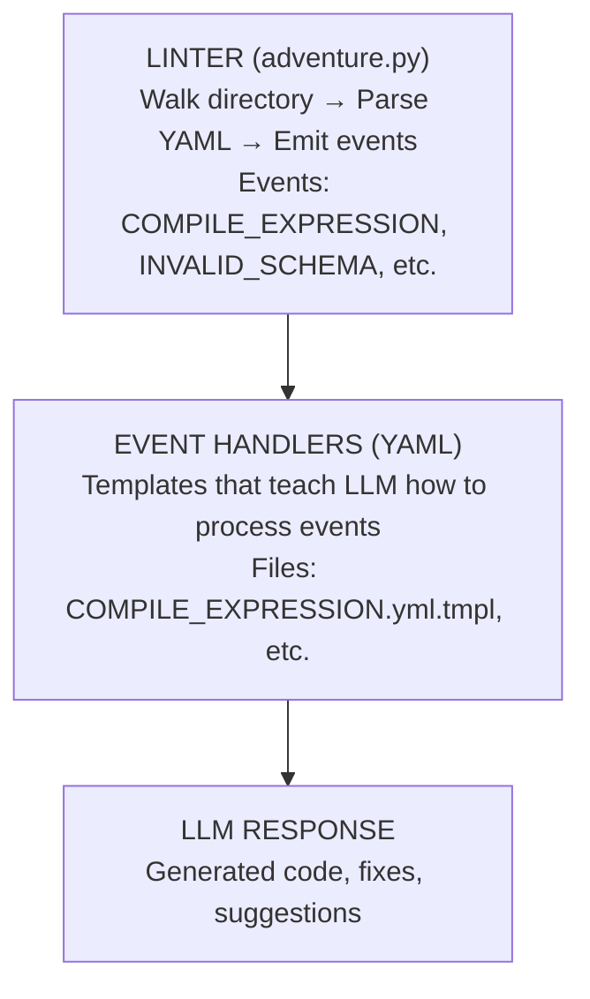

# 📬 Adventure Event Handlers

> *"Events flow. Handlers listen. Code emerges."*

## The Pattern

The adventure linter emits **events** describing what it found.
These YAML files are **handlers** that teach the LLM how to respond.



## Handler Files

| File | Handles | Purpose |
|------|---------|---------|
| `COMPILE_EXPRESSION.yml.tmpl` | COMPILE_EXPRESSION, COMPILE_GUARD, COMPILE_ACTION | Generate JS/PY from natural language |
| `INVALID_SCHEMA.yml.tmpl` | INVALID_SCHEMA, TYPE_MISMATCH | Suggest fixes for YAML errors |
| `BROKEN_REFERENCE.yml.tmpl` | BROKEN_REFERENCE | Fix or create missing references |
| `UNKNOWN_FILE_TYPE.yml.tmpl` | UNKNOWN_FILE_TYPE | Identify mystery YML files |
| `INDEX.yml` | (registry) | List all handlers |

## Handler Discovery

Handlers are found by:
1. **Filename** — `COMPILE_EXPRESSION.yml.tmpl` handles `COMPILE_EXPRESSION`
2. **INDEX.yml** — Explicit mapping of events to handlers
3. **Subdirectory** — `discovery/FOUND_ROOM.yml.tmpl`

## Handler Structure

Each handler has:

```yaml
event_handler:
  name: EVENT_TYPE
  handles: [EVENT_TYPE, RELATED_TYPE]
  description: "What this handler does"

input:
  event:
    type: EVENT_TYPE
    # ... event fields

output:
  # ... what handler produces

examples:
  # ... how to handle specific cases

procedure: |
  # ... step-by-step instructions
```

## Usage

The LLM reads:
1. The event from the linter
2. The matching handler template
3. Generates the appropriate response

```yaml
# Event from linter
event:
  type: COMPILE_EXPRESSION
  source_expression: "player has the key"
  expected_type: boolean

# LLM reads COMPILE_EXPRESSION.yml.tmpl
# LLM generates:
output:
  compiled:
    js: "(world) => world.player.inventory.includes('key')"
    py: "lambda world: 'key' in world.player.inventory"
```

## Adding New Handlers

1. Create `EVENT_TYPE.yml.tmpl` in this directory
2. Add to `INDEX.yml`
3. Define input, output, examples, procedure

## Philosophy

> *"The handlers are advertisements.
>   They advertise INTEREST in certain events.
>   The LLM is the agent that responds."*
>
> — SimAntics meets YAML Jazz
