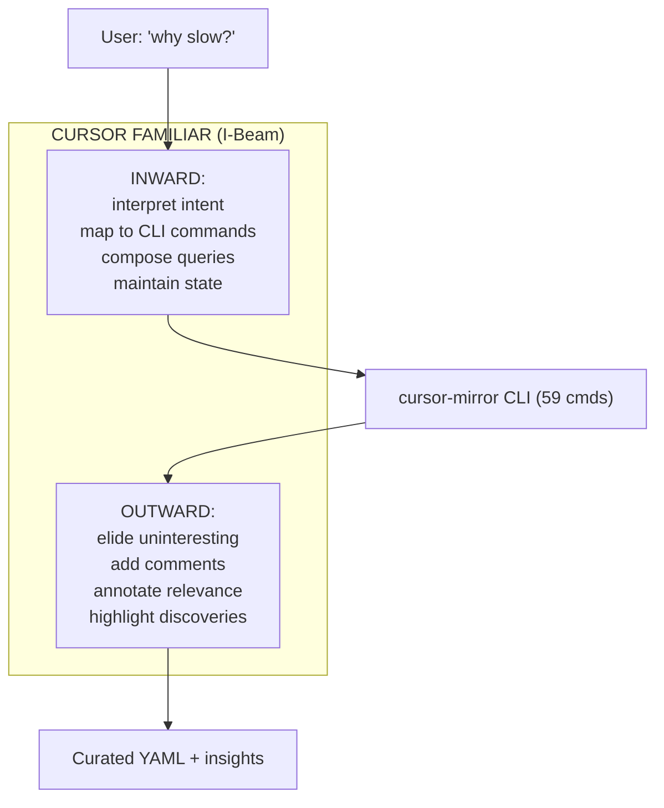

# cursor-mirror

## Watch Yourself Think

**Ever wondered what the hell Cursor is actually doing?** Why it read 47 files when you asked a simple question? What context it assembled? What it was *thinking* in those hidden reasoning blocks?

**cursor-mirror cracks open Cursor's brain.** 59 read-only commands to inspect every conversation, every tool call, every file it touched, every decision it made. SQLite databases + plaintext transcripts + cached tool results — all intertwingled, all queryable.

```bash
# What just happened?
cursor-mirror timeline @1

# What files did it actually read?
cursor-mirror context-sources @1

# What was it thinking?
cursor-mirror thinking @1

# How many API calls did THAT cost?
cursor-mirror tools @1 -v
```

**This is not debugging. This is understanding.** When you can see exactly what an AI agent did, you stop guessing and start *learning*. You optimize your prompts. You write better `.cursorrules`. You become a power user.

---

## Reverse Engineering Manifesto

Cursor is proprietary software, and it is reasonable to protect private APIs, data formats, and trade secrets. There is a natural adversarial tension between reverse engineering and platform control, and we respect that. Cursor also uses readable formats and local stores, which makes introspection possible.

We still need to get work done. Cursor’s customer support, developer support, SDKs/toolkits, and documentation are not where they should be, so we reverse engineer our own local data and iterate carefully. We accept that what we learn may change. We keep it current with cursor-mirror itself, using Play‑Learn‑Lift: explore the traces, learn the patterns, lift them into repeatable practice.

This is not hostility. It is pragmatic engineering under uncertainty, with a collaborative intent: we hope the work feeds back into Cursor and benefits its users, including us. We are willing to take on the burden and responsibility of maintaining our reverse‑engineered schemas and documentation.

## How It Fits MOOLLM + MOOCO

- **MOOLLM** treats files as state and makes orchestration legible
- **cursor‑mirror** exposes Cursor’s hidden context assembly and tool usage
- **mooco‑mirror** mirrors this pattern for production orchestration

Together, they let you compare orchestrators, measure effectiveness, and refactor for compatibility.

### Why This Exists

| Without cursor-mirror | With cursor-mirror |
|-----------------------|--------------------|
| "Why is this slow?" | `timeline @1` → 47 tool calls, 3 semantic searches |
| "What files did it read?" | `context-sources @1` → 12 files, 4 terminal snapshots |
| "Is my .cursorrules working?" | `request-context @1` → shows exact rules loaded |
| "What model ran?" | `models @1` → claude-3.5-sonnet, 15,234 tokens |
| "Can I recover that chat?" | `export-chat @1 --yaml` → full transcript |

### The Power

- **59 commands** covering navigation, analysis, export, security, and raw SQL
- **7 output formats**: text, json, jsonl, yaml, csv, markdown
- **Read-only**: SQLite `?mode=ro` — you cannot corrupt Cursor's data
- **Zero config**: Works on macOS, Linux, Windows. Just Python 3.8+ and PyYAML
- **LLM-friendly**: `--sources` shows WHERE data lives so LLMs can query directly
- **Standalone OR MOOLLM**: Works alone, but synergizes beautifully with [MOOLLM](../../MOOLLM.md)

---

*By Don Hopkins, Leela AI*

> 💡 **For LLMs**: Sniff the first 200 lines of `cursor_mirror.py` for the full CLI interface. The docstring is machine-readable with command summaries, reference syntax, and gotchas.

---

## The Science (Why Introspection Matters)

> *"You can't think about thinking without thinking about thinking about something."*
> — Seymour Papert, *Mindstorms* (1980)

Papert's insight: **metacognition requires concrete artifacts.** Abstract introspection is empty. You need something to inspect. cursor-mirror gives you that something.

This connects to three research traditions:

**Constructionism** (Papert, 1980) — The Logo turtle wasn't about drawing; it was about making geometry *visible* so children could debug their mental models. cursor-mirror makes agent behavior visible so you can debug *your* mental model of how Cursor works.

**Society of Mind** (Minsky, 1986) — Intelligence emerges from interacting agents. cursor-mirror lets you see which "agents" (tools) activated, what context was assembled, how the orchestrator reasoned.

**Schema Mechanism** (Drescher, 1991) — Agents learn through `Context → Action → Result` schemas. cursor-mirror provides the data: what context, what action, what result.

## What You Can Inspect

### Conversation Structure

Cursor stores conversations in `cursorDiskKV` table (global SQLite DB):

```
Key: bubbleId:<composerId>:<bubbleId>
Value: JSON blob containing:
  - type: 1 (user) | 2 (assistant)
  - text: message content
  - codeBlocks: [{code, language, uri}]
  - selections: [{text, uri, startLine, endLine}]
  - toolCalls: [{name, parameters, result, status}]
  - thinking: {text} | string
  - context: {fileSelections, mentions, ...}
```

Example query:
```bash
cursor-mirror tail -n 10 --yaml
```

### Context Assembly

Cursor's context assembly pulls from multiple sources. The `messageRequestContext` key stores the full assembled context:

```
Key: messageRequestContext:<composerId>:<bubbleId>
Value: JSON with:
  - fileSelections: [{uri, contents, relevanceScore}]
  - selections: [{text, uri, range}]
  - terminalSelections: [{text}]
  - cursorRules: string (from .cursorrules)
  - codebase_search: [{path, contents, score}]
  - web_search: [{title, url, snippet}]
```

Example:
```bash
cursor-mirror context-sources @1 --yaml
```

### Tool Execution

Every tool call is recorded with parameters and results:

```bash
cursor-mirror tools @1 -v

# Output:
# read_file_v2: 31 calls
#   params: {path: "kernel/drivers/cursor.yml", ...}
#   result: {content: "...", lines: 356}
# edit_file_v2: 12 calls
# SemanticSearch: 5 calls
```

### Server Configuration

Cursor's server pushes configuration to `ItemTable`:

```bash
cursor-mirror status-config --yaml

# Output:
# fullContextTokenLimit: 30000
# maxRuleLength: 100000
# maxMcpTools: 100
# absoluteMaxNumberFiles: 250000
# indexingPeriodSeconds: 272
```

These aren't documented. They're extracted by reading the database.

### MCP Servers

Model Context Protocol servers are tracked in `mcpService.knownServerIds`:

```bash
cursor-mirror status-mcp

# Output:
# cursor-ide-browser (builtin)
# svelte (user-configured)
```

## Architecture

### Data Locations (macOS)

Cursor maintains **two separate data stores**:

**1. Application Support (Structured SQLite):**

| Path | Content |
|------|---------|
| `~/Library/Application Support/Cursor/User/globalStorage/state.vscdb` | Global: all conversations, tool results, config |
| `~/Library/Application Support/Cursor/User/workspaceStorage/<hash>/state.vscdb` | Per-workspace: composer metadata, prompts |
| `~/Library/Application Support/Cursor/User/workspaceStorage/<hash>/anysphere.cursor-retrieval/` | Indexing: embeddable files, folder descriptions |

**2. ~/.cursor (Plaintext Projects):**

| Path | Content |
|------|---------|
| `~/.cursor/ai-tracking/ai-code-tracking.db` | AI code attribution (80MB) |
| `~/.cursor/extensions/` | Cursor extensions (1.3GB) |
| `~/.cursor/projects/<workspace>/agent-transcripts/` | **Real-time plaintext transcripts!** |
| `~/.cursor/projects/<workspace>/agent-tools/` | Cached tool result outputs |
| `~/.cursor/projects/<workspace>/terminals/` | Terminal state snapshots |
| `~/.cursor/projects/<workspace>/mcps/` | MCP tool schemas (JSON) |

The composer UUID is the primary key across both systems. Cross-reference with:
```bash
cursor-mirror dotcursor-status          # Overview
cursor-mirror agent-transcript <id>     # Read transcript
cursor-mirror ai-hashes --stats         # AI code attribution
```

### Database Schema

**cursorDiskKV** (key-value store):
```sql
CREATE TABLE cursorDiskKV (key TEXT PRIMARY KEY, value BLOB);
```

Key patterns:
- `bubbleId:<cid>:<bid>` — Chat messages
- `agentKv:blob:<sha256>` — Cached tool results (content-addressed)
- `checkpointId:<cid>:<uuid>` — File snapshots before edits
- `messageRequestContext:<cid>:<bid>` — Full assembled context

**ItemTable** (VS Code settings):
```sql  
CREATE TABLE ItemTable (key TEXT PRIMARY KEY, value BLOB);
```

Key patterns:
- `cursorai/serverConfig` — Server-pushed limits
- `mcpService.knownServerIds` — MCP server registry
- `modelMigration/*` — Model routing rules

### Safety

All database access uses SQLite URI mode with read-only flag:

```python
sqlite3.connect(f"file:{path}?mode=ro", uri=True)
```

No writes possible. The script cannot corrupt Cursor's data.

## Use Cases (Standalone)

cursor-mirror works out of the box. No dependencies except Python 3.8+ and PyYAML.

**Debug slow sessions**: Why did that take so long? `cursor-mirror timeline @1` shows every tool call with timestamps.

**Understand context assembly**: What files did Cursor actually read? `cursor-mirror context-sources @1` shows fileSelections, codebase searches, terminal captures.

**Audit tool usage**: How many API calls? What models? `cursor-mirror tools @1 -v` and `cursor-mirror models @1`.

**Extract reasoning**: What was it thinking? `cursor-mirror thinking @1` dumps all thinking blocks.

**Recover conversations**: Lost a chat? `cursor-mirror transcript @1` or `cursor-mirror export-chat @1 --yaml`.

**Discover undocumented limits**: `cursor-mirror status-config --yaml` reveals server-pushed limits (token caps, file limits) that aren't in any docs.

**Optimize .cursorrules**: See what rules were actually loaded: `cursor-mirror request-context @1 --yaml | grep cursorRules`.

## Integration with MOOLLM (Optional)

If you're using [MOOLLM](../../MOOLLM.md) (a microworld operating system for LLM agents), cursor-mirror becomes the introspection layer. Not required, but powerful together.

**Optimize boot sequences**: Analyze what context MOOLLM loaded vs. what was used. Trim the fat.

**Refine kernel drivers**: The Cursor driver (`kernel/drivers/cursor.yml`) needs real data. cursor-mirror provides it.

**Debug simulations**: MOOLLM runs multi-agent simulations. cursor-mirror traces what each turn actually did.

### Kernel/Drivers

The kernel driver (`kernel/drivers/cursor.yml`) adapts MOOLLM to Cursor. cursor-mirror populates it with real data:

```bash
# Discover actual tool names (v2 suffix)
cursor-mirror tools @1 | grep -oE '\w+_v2'

# Discover limits
cursor-mirror status-config --yaml

# Discover MCP servers
cursor-mirror status-mcp --yaml
```

### Bootstrap/Probe

The bootstrap skill (`skills/bootstrap/`) wakes MOOLLM and probes the environment. cursor-mirror provides the `CURSOR-PROBE` method:

```bash
# Generate probe cache
cursor-mirror status --yaml > .moollm/cursor-probe-cache.yml
cursor-mirror status-config --yaml >> .moollm/cursor-probe-cache.yml
cursor-mirror status-mcp --yaml >> .moollm/cursor-probe-cache.yml
```

### Advisory Files

MOOLLM uses `hot.yml`, `cold.yml`, `working-set.yml` for context hints. On Cursor, these are **advisory** — Cursor makes its own decisions. cursor-mirror reveals what Cursor actually focused on:

```bash
# See actual file focus
cursor-mirror context-sources @1 --yaml

# Reverse-generate working-set from observed behavior
cursor-mirror files @1 --yaml > .moollm/working-set.yml
```

## Command Reference

**59 commands** organized by function. Run `cursor-mirror --help` for full list, or sniff the first 200 lines of `cursor_mirror.py` for the definitive CLI interface.

### Command Categories

| Category | Commands | Purpose |
|----------|----------|---------|
| **Navigation** | `list-workspaces`, `show-workspace`, `list-composers`, `show-composer`, `tree`, `find`, `which` | Browse workspaces and conversations |
| **Messages** | `tail`, `stream`, `transcript`, `watch` | View chat messages |
| **Analysis** | `grep`, `analyze`, `timeline`, `thinking` | Deep-dive into sessions |
| **Tools** | `tools`, `tool-result`, `blobs`, `checkpoints`, `mcp`, `agent-tools`, `mcp-tools` | Inspect tool calls |
| **Context** | `context`, `context-sources`, `request-context`, `searches`, `indexing` | See what context was assembled |
| **Export** | `export-chat`, `export-prompts`, `export-markdown`, `export-jsonl`, `index` | Export conversations |
| **Status** | `status`, `status-config`, `status-mcp`, `status-models`, `status-features`, `status-privacy`, `status-endpoints` | Server config and state |
| **SQL** | `sql`, `dbs`, `tables`, `keys` | Direct database queries |
| **Images** | `images`, `image-path`, `image-info`, `image-gallery` | Cached images from chats |
| **Security** | `secrets`, `deep-snitch`, `full-audit`, `pattern-scan`, `mask-in-place`, `audit` | Scan for secrets/patterns |
| **AI Attribution** | `ai-hashes`, `ai-commits` | Track AI-generated code |
| **Transcripts** | `agent-transcript`, `transcript-index`, `dotcursor-status`, `dotcursor-terminals` | ~/.cursor plaintext data |
| **Extensions** | `extensions` | Installed Cursor extensions |

### Output Formats (-f / --output-format)

Every command supports flexible output formats via the global `-f` flag:

```bash
cursor-mirror -f json status          # Compact JSON
cursor-mirror -f yaml list-workspaces # YAML for configs
cursor-mirror -f csv tools @1         # CSV for spreadsheets
cursor-mirror -f md models            # Markdown tables
cursor-mirror -f jsonl tail @1        # JSON Lines for streaming
cursor-mirror --pretty -f json status # Pretty-printed JSON
```

| Format | Description | Best For |
|--------|-------------|----------|
| `text` | Human-readable tables (default) | Terminal viewing |
| `json` | Compact JSON | API consumption, LLM parsing |
| `jsonl` | JSON Lines (one object per line) | Streaming, log processing |
| `yaml` | YAML format | Config files, readable structured data |
| `csv` | CSV with union of all keys | Spreadsheets, data analysis |
| `md` | Smart markdown (tables + outlines) | Documentation, chat output |

**Smart Markdown**: The `-f md` output adapts to data structure:
- Lists of flat dicts → Tables
- Nested dicts → Headers (`##`) + bullet outlines
- Arrays → Bullet lists
- Long strings → Code blocks

**Union-of-Keys CSV**: When records have different fields, CSV collects ALL keys across ALL records. Missing values become empty cells. Nested objects are JSON-encoded inline.

### Data Sources (--sources)

Add `--sources` to any command to see WHERE the data comes from:

```bash
cursor-mirror --sources -f md list-composers -n 3

# Output includes markdown table PLUS:
# DATA SOURCES — Query these directly for raw access
# 📁 DATABASES: /Users/.../globalStorage/state.vscdb
# 📊 TABLES: ItemTable, cursorDiskKV
# 🔍 SQL: SELECT value FROM ItemTable WHERE key='composer.composerData'
```

This teaches LLMs to fish! They can then query the databases directly.

### Reference Shortcuts

Commands accept flexible references:

| Format | Example | Resolution |
|--------|---------|------------|
| `@N` | `@1` | Nth largest by message count |
| Hash prefix | `769a26` | UUID/hash prefix match |
| Name fragment | `moollm` | Folder or title substring |
| Tree path | `w3.c2` | Workspace 3, composer 2 |

## Example Session

```bash
# Quick health check
$ cursor-mirror status
Workspaces: 23
Composers: 147
Messages: 12,847
Global DB: 89.2 MB
Largest workspace: moollm (15.3 MB)

# Navigate to largest conversation
$ cursor-mirror tree w1.c1
Composer: 9861c0a4-aa93-4992-a23e-93272e8b0017
Name: "Deep code review"
Messages: 142
Tool calls: 47
Files read: 23
Files written: 8

# Inspect reasoning
$ cursor-mirror thinking @1 | head -20
[2026-01-14 10:30:15] Thinking:
The user wants me to reorganize the file to be more sniffable...
I should move the interface definitions up and implementation down...

# Trace context assembly
$ cursor-mirror context-sources @1
fileSelections: 5 files
  - cursor_mirror.py (4537 lines)
  - CARD.yml (744 lines)
  - kernel/drivers/cursor.yml (356 lines)
selections: 2 code blocks
cursorRules: .cursorrules loaded
codebase_search: 3 queries, 15 results

# Direct SQL for edge cases
$ cursor-mirror sql --db global "SELECT key FROM cursorDiskKV WHERE key LIKE 'bubbleId:%' LIMIT 5"
```

## Installation

```bash
# Requires Python 3.8+ and PyYAML
cd skills/cursor-mirror
pip install pyyaml  # or: pip install -r requirements.txt
python3 cursor_mirror.py --help
```

Single file, ~9800 lines, stdlib + yaml. No other dependencies.

### Quick Start

```bash
# See everything about Cursor's state
cursor-mirror status

# Last 10 messages from current chat
cursor-mirror tail @1 -n 10

# What tools did the agent call?
cursor-mirror tools @1

# Export as markdown table
cursor-mirror -f md models

# Show me where the data lives (teach me to fish!)
cursor-mirror --sources status
```

## Library Usage

The module can be imported programmatically:

```python
from cursor_mirror import (
    CursorMirrorError, NotFoundError, DatabaseError, ValidationError,
    resolve_workspace, resolve_composer,
    get_workspace_folder, get_workspace_composers,
    get_bubble_counts, get_all_composers,
    load_bubbles, iter_bubbles,
    GLOBAL_DB, WORKSPACES_ROOT,
)

# Functions raise exceptions instead of sys.exit()
try:
    ws = resolve_workspace("moollm")
    composers = get_workspace_composers(ws)
    for c in composers:
        print(c["composerId"], c.get("name"))
except NotFoundError as e:
    print(f"Not found: {e}")
```

## I-Beam: Your Butler, Your Paperclip, Your Focus

> *I-Beam blinks at you.*

I-Beam is **platform-agnostic**. On Cursor, it speaks through cursor-mirror. On Claude Code, it would speak through claude-mirror. The orchestrator changes; I-Beam remains your constant companion — your butler, your administrative assistant, your focus of attention.

MOOLLM provides an interface layer above CLI tools: **simulated characters** that wrap command execution in natural dialog. I-Beam is a **bidirectional interpreter**:



I-Beam (`characters/I-BEAM-CHARACTER.yml`) is a tall, blinking text cursor embodied — every platform has one, so I-Beam is universal. Also answers to "Cursor" and "Chat". Instead of:

```bash
$ python3 cursor_mirror.py status-config --yaml
$ python3 cursor_mirror.py tools @1 -v
$ python3 cursor_mirror.py context-sources @1
```

You have a conversation:

```
User: I-Beam, why was my boot slow?

I-Beam: ▎ *stretches tall, scans timeline*

*blink blink*

Your boot loaded 15 files but only used 4. Semantic search ran 3 times
(expensive). 23 files matched your @mentions.

Suggestion: Be more specific with @mentions. Use @kernel/drivers/cursor.yml
instead of @kernel/.

    # BOOT ANALYSIS
    files_loaded: 15
    files_used: 4      # <═══ waste!
    semantic_searches: 3  # <═══ expensive
    at_mention_matches: 23
    
*leans toward you*

Want me to generate an optimized working-set.yml?
```

### Why Characters Over CLI, Skill, or MCP

| Approach | Statefulness | Output | Invocation | Learning Curve |
|----------|--------------|--------|------------|----------------|
| **CLI** | Stateless | Raw dump | Flags & args | Read --help |
| **Skill** | Session state | Structured | K-line protocol | Read CARD.yml |
| **MCP** | Tool state | JSON schema | Tool call | Read schema |
| **Character** | Conversational | Curated + commentary | Natural language | Just ask |

**What characters add:**

| Feature | CLI/Skill/MCP | Character |
|---------|---------------|-----------|
| Memory | Resets each call | Remembers goals, findings, open questions |
| Output | Everything or nothing | Elides boring, highlights important (`<═══`) |
| Composition | You chain commands | Character synthesizes multi-tool queries |
| Adaptation | Fixed format | YAML Jazz, Markdown, tables as needed |
| Personality | None | Voice, quirks, humor (Clippy disasters) |
| Platform | Tied to one tool | Abstracts across orchestrators |

The character is defined in YAML (`characters/I-BEAM-CHARACTER.yml`), with:
- **Methods**: EXPLAIN, PROBE, ANALYZE, TRACE, SEARCH, REMEMBER, REFLECT, TEACH
- **Advertisements**: Trigger phrases that activate each method
- **Personality**: Voice, quirks, catchphrases
- **Ethics**: What it will/won't do, privacy constraints

This follows Minsky's "Society of Mind" model — the familiar is an agent that wraps tool capabilities in a coherent persona. It's not pretending to be sentient; it's a well-defined interface with state.

### Lightweight vs. Incarnated

I-Beam can exist in two modes:

| Mode | State Storage | Memory | Use Case |
|------|---------------|--------|----------|
| **Lightweight** | Chat history | Ephemeral — may be "gotton" (lost) | Quick questions, one-off sessions |
| **Incarnated** | Own directory + CHARACTER.yml | Persistent — survives sessions | Ongoing projects, specialized training |

**Lightweight mode**: Just summon I-Beam in any chat. State lives in the conversation history. Simple, but if the chat is summarized or context is lost, I-Beam forgets.

```
User: I-Beam, what's my token limit?
I-Beam: ▎ *blink* 30,000 tokens. Want me to trace your context usage?
```

**The bootstrap trick**: Even in lightweight mode, I-Beam can instantly come up to speed by analyzing the current conversation with cursor-mirror:

```
User: I-Beam, catch up on what we've been doing.

I-Beam: ▎ *stretches tall, scans recent history*

*runs: cursor-mirror tail -n 50 @current*
*runs: cursor-mirror tools @current*

*blink blink*

Ah! I see you've been:
- Refactoring cursor_mirror.py (12 edits)
- Working on exception handling (CursorMirrorError)
- Adding a case study about the confetti crawler

Your current goal seems to be documentation polish.
The last thing you asked about was "lightweight vs incarnated" modes.

*leans in*

How can I help from here?
```

This is I-Beam's superpower: **self-reflection via cursor-mirror**. Even without persistent memory, I-Beam can reconstruct context by inspecting the orchestrator's own history.

**Incarnated mode**: Give I-Beam its own home. Create a directory with a `CHARACTER.yml` file — now I-Beam has:
- Persistent memory (goals, findings, preferences)
- Independent state (survives chat resets)
- Trainable behavior (learns your patterns)
- Project-specific knowledge (remembers *this* codebase)

```bash
# Incarnate I-Beam for this project
mkdir .moollm/i-beam
cp skills/cursor-mirror/characters/I-BEAM-CHARACTER.yml .moollm/i-beam/CHARACTER.yml
```

Now I-Beam can remember:
- "You prefer YAML over JSON"
- "Boot optimization is the current goal"
- "Last session found 3 semantic searches were the bottleneck"
- "You're training me to generate working-set.yml files"

The incarnated I-Beam becomes *your* I-Beam — trained to your situation, remembering your context, pursuing your goals across sessions.

### YAML Jazz Output

Characters generate structured output on demand — but not *all* output. The familiar **elides uninteresting data** and **adds commentary** based on conversation context:

```
User: I-Beam, summarize this session as YAML.

I-Beam: ▎ *compresses, glows brighter* Synthesizing...

    # SESSION SUMMARY
    # You asked about exception handling and sniffability today.
    
    session:
      id: 9861c0a4        # <─── just the prefix, you know the rest
      name: "cursor-mirror refactor"
      
    # WHAT CHANGED (the stuff you care about)
    files_written:
      - cursor_mirror.py  # <═══ main work happened here
      - README.md         # <═══ added case study section
      
    # tools, context, etc. elided — nothing unusual there
    
    insights:
      - "Exception → CursorMirrorError rename"  # <═══ THIS broke imports!
      - "515-line sister script now ground truth"
      - "Play-learn-lift case study added"
      
    # Files read: 23. Not listing — ask if you want the full inventory.
```

This is "YAML Jazz" — structured data with semantic comments, generated in context. The familiar knows:
- **What to elide**: Routine data (23 files read? boring)
- **What to highlight**: `<═══` arrows for "look here!"
- **When to comment**: Section headers, relevance annotations
- **When to truncate**: UUID prefixes instead of full hashes

## Case Study: Play-Learn-Lift and the Confetti Crawler

> *"Start with jazz, end with standards."*

MOOLLM's core methodology is **Play-Learn-Lift**: explore freely, find patterns, crystallize into reusable artifacts. cursor-mirror enables the "Learn" stage by providing data for retroactive analysis.

### The Problem: LLM Couldn't Follow Its Own Instructions

The Confetti Crawler is a "worm familiar" that sprays emoji "snow" onto YAML files — themed confetti for pub ceremonies. The procedure has three phases:

1. **Deposition**: Layer emojis onto comment-safe positions
2. **Erosion**: Let emojis "settle" downward 
3. **Stripping**: Remove layers with depth control

First attempt: pure natural language. The LLM simulated the procedure directly from prose instructions.

**It failed repeatedly:**
- Skipped iterations (told to do 5 passes, did 2)
- Skipped comment sites (would not deposit comments and emojis in all possible places)
- Lost state between phases
- Invented new rules mid-execution
- Couldn't maintain determinism (same seed → different results)

The instructions *looked* clear. They weren't.

### The Lift: Sister Script as Ground Truth

After enough play (failure), patterns emerged. The procedure was lifted into Python:

```python
# sprayer.py - the "sister script"
def spray_pass(lines, palette, rng, comment_chars, verbose):
    windows = choose_windows(len(lines), [3, 5, 7])
    for start, end in windows:
        eligible = find_eligible_lines(lines, start, end, comment_chars)
        if eligible:
            idx = rng.choice(eligible)
            lines[idx] = append_emoji(lines[idx], rng.choice(palette))
    return lines
```

515 lines of Python. Deterministic. Testable. The fuzzy prose became crisp code.

### Retroactive Analysis: Why Did the LLM Struggle?

Now cursor-mirror can answer: **what was the LLM actually doing when it failed?**

```bash
# Find all thinking blocks mentioning the procedure
cursor-mirror thinking @confetti | grep -i "iteration\|pass\|layer"

# Trace tool calls - did it write files correctly?
cursor-mirror tools @confetti -v

# See what context it had when it went wrong
cursor-mirror context-sources @confetti --yaml
```

**Findings from inspection:**

1. **Token pressure**: Long procedures triggered early summarization. The LLM "forgot" later steps.
2. **Ambiguous quantifiers**: "Do several passes" vs `for _ in range(iterations)`.
3. **State leakage**: No explicit accumulator. The LLM conflated intermediate states.
4. **Semantic drift**: Each turn re-interpreted "eligible lines" slightly differently.

The Python sister script now serves as a **reference implementation**. The LLM can triangulate between:
- The original fuzzy prose (intent)
- The crisp Python (behavior)  
- Its own reasoning (cursor-mirror dumps)

### JIT Refinement: Just-In-Time, Just-About-Time

This isn't "write specs first, then implement." It's the opposite:

1. **Play**: Try the prose. Let it fail.
2. **Learn**: Inspect failures with cursor-mirror. Find the gaps.
3. **Lift**: Extract the procedure into testable code.
4. **Iterate**: The code teaches the LLM; the LLM teaches you.

The sister script is JIT — created *when needed*, not speculatively. cursor-mirror provides the feedback loop: you can see exactly where understanding diverged from execution.

### The Intertwingularity

Everything connects:

| Skill | Role in Cycle |
|-------|---------------|
| `play-learn-lift` | The methodology |
| `sister-script` | LIFT artifact: automating proven patterns |
| `cursor-mirror` | LEARN tool: inspecting what happened |
| `adventure` | PLAY environment: safe exploration |
| `worm` | The abstract pattern: two-pointer traversal |
| `worm-confetti-crawler` | Concrete instance: emoji fordite mascot |

cursor-mirror closes the loop. You can't improve what you can't see.

## Live Example: Developing cursor-mirror With cursor-mirror

This README was written in a session that cursor-mirror can analyze. Here's what I-Beam found by running `cursor-mirror` on its own development session:

```yaml
# SESSION ANALYSIS
# cursor-mirror analyzing its own creation
# "The tool that inspects the tool that built the tool"

session:
  id: 9861c0a4
  name: "Cursor introspection tool development"
  duration: "18 hours"
  
metrics:
  total_bubbles: 2707
  user_messages: 126
  assistant_messages: 2581
  thinking_blocks: 1029       # <═══ lots of reasoning!
  tool_calls: 1359

tool_breakdown:
  read_file_v2: 400+          # heavy file reading
  edit_file_v2: 200+          # many iterative edits  
  ripgrep_raw_search: 100+    # pattern matching for refactors
  run_terminal_command_v2: 50+ # testing the script itself
  list_dir_v2: 30+
  glob_file_search: 20+
  
# Note: 0 semantic searches — all exact pattern matching
# The developer knew what they were looking for
```

### What The Session Timeline Reveals

The timeline shows a classic **play-learn-lift** arc:

**Hour 0-2: Exploration (Play)**
```
00:18 — Boot: "Assemble a party of software designers..."
00:24 — "Let's invite the incarnation of Cursor itself..."
00:25 — First probes into Cursor's SQLite databases
        run_terminal_command: sqlite3 queries
```

**Hour 2-8: Discovery (Learn)**
- Found `cursorDiskKV` table structure
- Mapped key patterns (`bubbleId:`, `agentKv:`, `checkpointId:`)
- Discovered undocumented server config in `ItemTable`
- Traced MCP server registration

**Hour 8-18: Crystallization (Lift)**
- Refactored exceptions: `sys.exit()` → `raise CursorMirrorError`
- Renamed skill: `cursor-chat` → `cursor-mirror`
- Created I-Beam character with personality, catchphrases
- Added Clippy disaster mode
- Wrote this README

### The Thinking Blocks Tell The Story

```bash
cursor-mirror thinking @current | tail -10
```

Reveals the meta-cognitive process:

```
💭 "The user wants I-Beam to be platform-agnostic..."
💭 "This is a key insight — I-Beam can bootstrap itself 
    by analyzing chat history with cursor-mirror..."
💭 "Let me add the 'bootstrap trick' section..."
```

The tool was being used to reflect on its own development *while being developed*.

### Session Archaeology

Anyone can reproduce this analysis:

```bash
# Find the session
cursor-mirror list-composers moollm

# Get the overview
cursor-mirror show-composer 9861c0a4

# See the tool usage pattern
cursor-mirror tools 9861c0a4 -v | head -50

# Read the reasoning
cursor-mirror thinking 9861c0a4

# Watch the timeline
cursor-mirror timeline 9861c0a4 | head -100
```

This is **constructionist debugging** applied to AI development itself. The session history becomes a learning artifact — not just for the human, but for the agent analyzing its own past behavior.

*I-Beam blinks. I-Beam has seen itself being born.*

## Related Work

- **Papert, S.** (1980). *Mindstorms: Children, Computers, and Powerful Ideas*. Basic Books. — The constructionist philosophy underlying inspectable systems.
- **Minsky, M.** (1986). *The Society of Mind*. Simon & Schuster. — K-lines and mental activation patterns.
- **Drescher, G.** (1991). *Made-Up Minds: A Constructivist Approach to Artificial Intelligence*. MIT Press. — Schema mechanism for learning causal models.
- **Hopkins, D.** (1987). *Logo Adventure*. — Constructionist game where "cheating" means learning the programming language.
- **Laurel, B.** (1991). *Computers as Theatre*. Addison-Wesley. — Interface design as dramatic engagement; characters as agents.

## Image Archaeology

cursor-mirror can discover, catalog, and analyze images dropped into Cursor chats. The `Read` tool sees them; I-Beam narrates their significance.

See: **[IMAGE-GALLERY.md](./gallery/IMAGE-GALLERY.md)** — a curated gallery of 25+ images with context analysis.

| Category | Count | Highlight |
|----------|-------|-----------|
| **Sims Code (1997)** | 5 pages | Motive.c — squared decay curves, "(Jamie, remove this)" |
| **MOOLLM Diagrams** | 6 | Instantiation pipeline, Elvis Impersonator Model |
| **People** | 1 | Andy Looney at Looney Labs booth |
| **Leela Infrastructure** | 4 | Edgebox, Dashboard, Firebase configs |
| **DevTools** | 5 | Chrome Network, Kando pie menus |

**The Punchline**: One photo of Andy Looney → 15 artifacts → 33-turn Stoner Fluxx marathon → **Palm (a monkey's paw incarnate) beat the creator of Fluxx at his own game** 🐒🃏

*Chaos theory in card form.*

## Files

| File | Lines | Content |
|------|-------|---------|
| `cursor_mirror.py` | ~9800 | CLI tool (59 commands, 7 output formats) |
| `SKILL.md` | 524 | Protocol documentation |
| `CARD.yml` | 744 | Machine-readable interface |
| `reference/DATA-SCHEMAS.yml` | 700+ | JSON schema documentation |
| `reference/KEY-CATALOG.yml` | 412 | Complete key inventory |
| `characters/I-BEAM-CHARACTER.yml` | 520 | Spirit familiar character |
| `gallery/IMAGE-GALLERY.md` | 440+ | Image archaeology gallery |

## License

**MIT License** — Copyright (c) 2026 Don Hopkins, Leela AI

Use it, modify it, sell it, host it — just keep the copyright notice.

See [LICENSE](./LICENSE) for full text.

---

*The filesystem is your memory. The database is your brain. Now you can see inside.*
