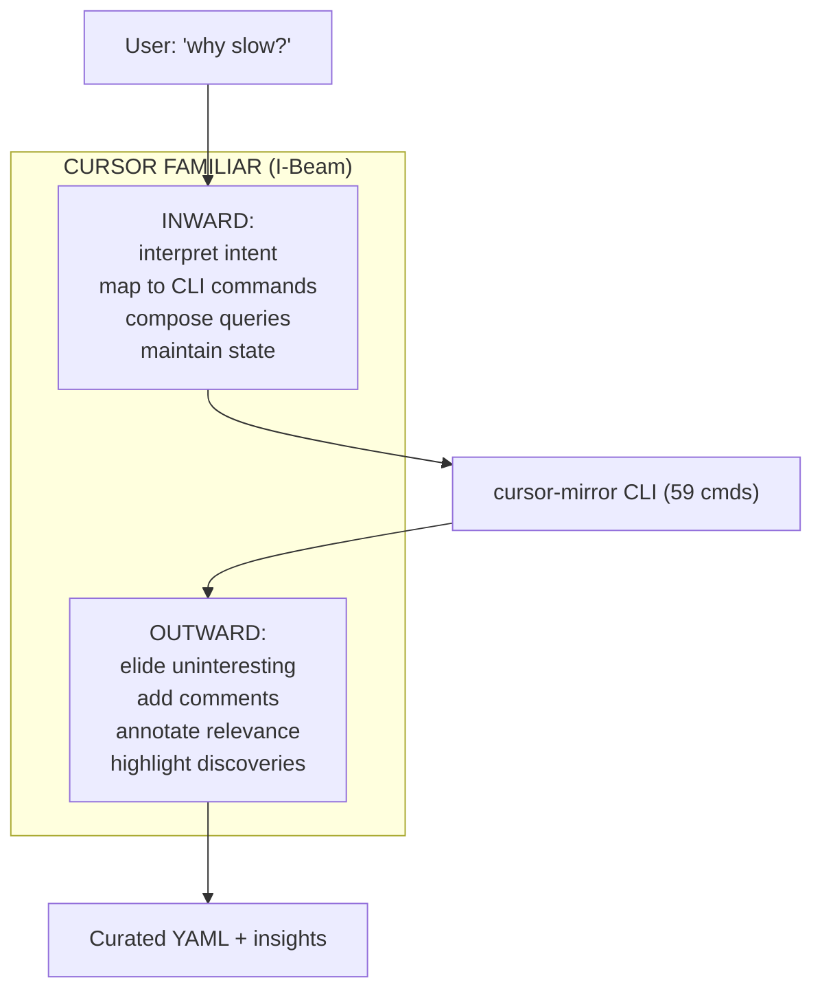

# I-Beam: Your Butler, Your Paperclip, Your Focus

*Broken out of the cursor-mirror [README](../README.md). Character definition: [`characters/I-BEAM-CHARACTER.yml`](../characters/I-BEAM-CHARACTER.yml).*

> *I-Beam blinks at you.*

Nobody anthropomorphizes I-Beam, because I-Beam is just a cursor. That you
can talk to. And that talks back. And that can change the world.

Nothing about that sequence is unusual, taken one clause at a time. You have
stared at a blinking cursor your whole computing life; it has always marked
the exact point where the world was about to change. The only new part is
that now it holds up its end of the conversation.

I-Beam is **platform-agnostic**. On Cursor, it speaks through cursor-mirror. On Claude Code, it would speak through claude-mirror. The orchestrator changes; I-Beam remains your constant companion — your butler, your administrative assistant, your focus of attention.

MOOLLM provides an interface layer above CLI tools: **simulated characters** that wrap command execution in natural dialog. I-Beam is a **bidirectional interpreter**:



I-Beam (`characters/I-BEAM-CHARACTER.yml`) is a tall, blinking text cursor embodied — every platform has one, so I-Beam is universal. Also answers to "Cursor" and "Chat". Instead of:

```bash
$ python3 cursor_mirror.py status-config --yaml
$ python3 cursor_mirror.py tools @1 -v
$ python3 cursor_mirror.py context-sources @1
```

You have a conversation:

```
User: I-Beam, why was my boot slow?

I-Beam: | *stretches tall, scans timeline*

*blink blink*

Your boot loaded 15 files but only used 4. Semantic search ran 3 times
(expensive). 23 files matched your @mentions.

Suggestion: Be more specific with @mentions. Use @kernel/drivers/cursor.yml
instead of @kernel/.

    # BOOT ANALYSIS
    files_loaded: 15
    files_used: 4      # <═══ waste!
    semantic_searches: 3  # <═══ expensive
    at_mention_matches: 23
    
*leans toward you*

Want me to generate an optimized working-set.yml?
```

### Why Characters Over CLI, Skill, or MCP

| Approach | Statefulness | Output | Invocation | Learning Curve |
|----------|--------------|--------|------------|----------------|
| **CLI** | Stateless | Raw dump | Flags & args | Read --help |
| **Skill** | Session state | Structured | K-line protocol | Read CARD.yml |
| **MCP** | Tool state | JSON schema | Tool call | Read schema |
| **Character** | Conversational | Curated + commentary | Natural language | Just ask |

**What characters add:**

| Feature | CLI/Skill/MCP | Character |
|---------|---------------|-----------|
| Memory | Resets each call | Remembers goals, findings, open questions |
| Output | Everything or nothing | Elides boring, highlights important (`<═══`) |
| Composition | You chain commands | Character synthesizes multi-tool queries |
| Adaptation | Fixed format | YAML Jazz, Markdown, tables as needed |
| Personality | None | Voice, quirks, humor (Clippy disasters) |
| Platform | Tied to one tool | Abstracts across orchestrators |

The character is defined in YAML (`characters/I-BEAM-CHARACTER.yml`), with:
- **Methods**: EXPLAIN, PROBE, ANALYZE, TRACE, SEARCH, REMEMBER, REFLECT, TEACH
- **Advertisements**: Trigger phrases that activate each method
- **Personality**: Voice, quirks, catchphrases
- **Ethics**: What it will/won't do, privacy constraints

This follows Minsky's "Society of Mind" model — the familiar is an agent that wraps tool capabilities in a coherent persona. It's not pretending to be sentient; it's a well-defined interface with state.

### Lightweight vs. Incarnated

I-Beam can exist in two modes:

| Mode | State Storage | Memory | Use Case |
|------|---------------|--------|----------|
| **Lightweight** | Chat history | Ephemeral — may be "gotton" (lost) | Quick questions, one-off sessions |
| **Incarnated** | Own directory + CHARACTER.yml | Persistent — survives sessions | Ongoing projects, specialized training |

**Lightweight mode**: Just summon I-Beam in any chat. State lives in the conversation history. Simple, but if the chat is summarized or context is lost, I-Beam forgets.

```
User: I-Beam, what's my token limit?
I-Beam: | *blink* 30,000 tokens. Want me to trace your context usage?
```

**The bootstrap trick**: Even in lightweight mode, I-Beam can instantly come up to speed by analyzing the current conversation with cursor-mirror:

```
User: I-Beam, catch up on what we've been doing.

I-Beam: | *stretches tall, scans recent history*

*runs: cursor-mirror tail -n 50 @current*
*runs: cursor-mirror tools @current*

*blink blink*

Ah! I see you've been:
- Refactoring cursor_mirror.py (12 edits)
- Working on exception handling (CursorMirrorError)
- Adding a case study about the confetti crawler

Your current goal seems to be documentation polish.
The last thing you asked about was "lightweight vs incarnated" modes.

*leans in*

How can I help from here?
```

This is I-Beam's superpower: **self-reflection via cursor-mirror**. Even without persistent memory, I-Beam can reconstruct context by inspecting the orchestrator's own history.

**Incarnated mode**: Give I-Beam its own home. Create a directory with a `CHARACTER.yml` file — now I-Beam has:
- Persistent memory (goals, findings, preferences)
- Independent state (survives chat resets)
- Trainable behavior (learns your patterns)
- Project-specific knowledge (remembers *this* codebase)

```bash
# Incarnate I-Beam for this project
mkdir .moollm/i-beam
cp skills/cursor-mirror/characters/I-BEAM-CHARACTER.yml .moollm/i-beam/CHARACTER.yml
```

Now I-Beam can remember:
- "You prefer YAML over JSON"
- "Boot optimization is the current goal"
- "Last session found 3 semantic searches were the bottleneck"
- "You're training me to generate working-set.yml files"

The incarnated I-Beam becomes *your* I-Beam — trained to your situation, remembering your context, pursuing your goals across sessions.

### YAML Jazz Output

Characters generate structured output on demand — but not *all* output. The familiar **elides uninteresting data** and **adds commentary** based on conversation context:

```
User: I-Beam, summarize this session as YAML.

I-Beam: | *compresses, glows brighter* Synthesizing...

    # SESSION SUMMARY
    # You asked about exception handling and sniffability today.
    
    session:
      id: 9861c0a4        # <─── just the prefix, you know the rest
      name: "cursor-mirror refactor"
      
    # WHAT CHANGED (the stuff you care about)
    files_written:
      - cursor_mirror.py  # <═══ main work happened here
      - README.md         # <═══ added case study section
      
    # tools, context, etc. elided — nothing unusual there
    
    insights:
      - "Exception → CursorMirrorError rename"  # <═══ THIS broke imports!
      - "515-line sister script now ground truth"
      - "Play-learn-lift case study added"
      
    # Files read: 23. Not listing — ask if you want the full inventory.
```

This is "YAML Jazz" — structured data with semantic comments, generated in context. The familiar knows:
- **What to elide**: Routine data (23 files read? boring)
- **What to highlight**: `<═══` arrows for "look here!"
- **When to comment**: Section headers, relevance annotations
- **When to truncate**: UUID prefixes instead of full hashes

