# 🔍 Evaluator

> "The committee can't see what the evaluator is thinking."

## MOOLLM K-Lines

| K-Line | Why Related |
|--------|-------------|
| [adversarial-committee/](../adversarial-committee/) | What gets evaluated |
| [rubric/](../rubric/) | Scoring criteria |
| [roberts-rules/](../roberts-rules/) | Structured deliberation |
| [room/](../room/) | Inbox/outbox for throwing output |
| [designs/mike-gallaher-ideas.md](../../designs/mike-gallaher-ideas.md) | Mike Gallaher's methodology |

**Quick Links:**
- [Full Specification](SKILL.md) — complete protocol

## Overview

An **independent evaluator** assesses committee output without access to debate context. This adversarial separation prevents the committee from gaming their own metrics.

## Why Independence?

If the committee sees how they'll be evaluated:
- They optimize for the score, not the outcome
- Arguments become performative
- Genuine disagreement gets smoothed over

Independent evaluation:
- Sees only the output, not the process
- Can't be influenced by committee dynamics
- Applies rubric without bias from debate

## The Dramatic Irony Pattern

**Reality:** The LLM has global knowledge — it simulated the committee debate AND the evaluation.

**Roleplay:** The evaluator character doesn't know what happened in the committee room.

**The trick:** The LLM maintains the fiction of isolation while optionally adding **Ron Howard-style narration** for dramatic irony:

```yaml
evaluator_assessment:
  score: 7/10
  reasoning: |
    The recommendation is well-structured but lacks consideration
    of edge cases. The committee seems confident in their approach.
    
    # NARRATOR: They were not confident. Maya had called it
    # "a disaster waiting to happen" three times.
    
  recommendation: "Approve with minor revisions"
  
  # NARRATOR: The revisions would not be minor.
```

This pattern:
- Preserves the **methodological value** of blind evaluation
- Adds **dramatic tension** for the reader
- Demonstrates **LLM self-awareness** about the simulation
- Creates **Arrested Development energy** 🍌

## The Pattern

```mermaid
flowchart LR
    subgraph Committee["Committee Room"]
        Debate["heated debate"]
    end
    
    subgraph Eval["Evaluation Room"]
        NoCtx["no context"]
        Rubric["applies RUBRIC"]
    end
    
    Committee -->|OUTPUT| Eval
    Eval -->|CRITIQUE| Committee
    
    Note["if score fails → revision loop"]
```



## Credits

**Mike Gallaher** — Independent evaluator pattern, adversarial loop design.

See: [designs/mike-gallaher-ideas.md](../../designs/mike-gallaher-ideas.md)

