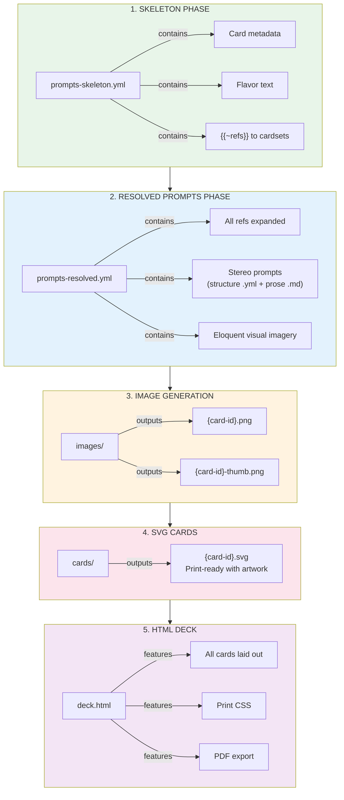
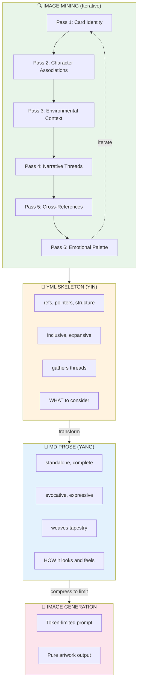

# Amsterdam Fluxx — Card Artwork Pipeline

**Sister Script:** Visualizer  
**Phase:** Prompt Generation (first pass)  
**Status:** SKELETON → PROMPTS → IMAGES → SVG → HTML → PDF

---

## Pipeline Overview



---

## Card ID Normalization

Original ref format: `fluxx-4.0:bread`, `amsterdam:canal_house`  
Normalized ID format: `fluxx-4-0-bread`, `amsterdam-canal-house`

**Rule:** Replace `:` with `-`, lowercase everything.

---

## Stereo Prompt Format — YIN/YANG Two-Phase

Each card gets TWO complementary artifacts:

### Phase 1: YML (Structure) — The Skeleton

A **referential YAML Jazz file** that points to everything relevant:
- Card metadata (id, ref, type, name, emoji)
- Character files with personality, tells, frobisms
- Cardset visual identity references
- Theme mood boards
- Related cards and goals
- Environmental context
- Any resource that might inform the visual

**Inclusive, expansive, pointing outward.** Gathers all the threads.

```yaml
# Phase 1: Skeleton YML — points to everything
fluxx-4-0-bread:
  id: "fluxx-4-0-bread"
  refs:
    card: "RUN-000.yml#cards.0"
    cardset: "cardsets/fluxx-4-0/VISUAL-IDENTITY.yml"
    theme: "themes/keeper-warmth.yml"
    goals_featuring: ["peace_and_bread", "toast"]
    flavor_source: "The staff of life"
  visual_context:
    setting: "bakery, kitchen, morning"
    lighting: "warm, golden hour, steam"
    mood: "nourishment, comfort, home"
  character_associations:
    - "bumblewick: loves comfort food"
    - "don: sharp cheddar cheese pairs well"
```

### Phase 2: MD (Prose) — The Flesh

Transform the skeleton into **standalone evocative prose**:
- No dependencies — everything stated explicitly
- No references — all context resolved, deduplicated, and reflowed inline
- Pure visual, emotional, impressional, gestural description
- Tells and readings woven into imagery
- The transformer reads ALL refs into context, then expresses
- Image generator services impose token limits, so we should discover those and use them to limit size of markup narrative description

**Self-contained, complete, ready for image generation.**

```markdown
<!-- Phase 2: Prose MD — standalone, no dependencies -->

A magnificent golden-crusted artisan sourdough loaf emerges fresh 
from a brick oven, steam rising in delicate wisps that catch the 
warm morning light streaming through a cottage window. The crackled 
caramelized crust bears the marks of a master baker's scoring knife, 
revealing pillowy white interior. Scattered flour dust settles on a 
weathered oak cutting board with decades of knife marks telling 
stories of countless meals shared. A rustic bread knife with wooden 
handle rests beside, waiting. The warmth radiates outward like 
comfort itself — this is the staff of life, nourishment for body 
and soul, the foundation upon which all good meals are built.

Digital illustration in modern board game card art style. Clean bold 
outlines with slight hand-drawn quality. Rich saturated colors with 
painterly texture. Centered composition. Warm inviting aesthetic 
suitable for tabletop gaming. Looney Labs whimsical family-friendly 
energy. No text, no words, no letters.
```

### Image Mining — Iterative Semantic Fordite

The skeleton YML isn't built in one pass. **Image mining** is iterative and multifaceted:

**Pass 1: Card Identity**
- Basic metadata (id, type, name, emoji)
- Flavor text and special abilities
- Cardset membership

**Pass 2: Character Associations**
- Which characters would want this card?
- What tells/frobisms relate to this imagery?
- Personality overlays and emotional resonances

**Pass 3: Environmental Context**
- Setting, lighting, time of day
- Weather, season, atmosphere
- Physical space and architecture

**Pass 4: Narrative Threads**
- Goals this card enables
- Actions that affect it
- Story moments it creates

**Pass 5: Cross-References**
- Similar cards in other cardsets
- Thematic siblings
- Visual rhymes and callbacks

**Pass 6: Emotional Palette**
- Mood, feeling, vibe
- What collecting this feels like
- What losing this feels like

Each pass adds a **semantic layer** — like fordite paint building up in an auto factory, layer upon layer of different colors. When you slice through the accumulated meaning, you see beautiful stratified patterns of interconnected significance.

The YML skeleton becomes **semantically thick** — not just data, but meaning-rich context that the prose transformer can draw upon.

### The Transformation



### Semantic Fordite Layering

```yaml
# Each mining pass adds a layer to the fordite:
fordite_layers:
  layer_1_identity:     "🍞 Bread — keeper — fluxx-4.0"
  layer_2_character:    "Bumblewick loves comfort food, Don pairs with cheese"
  layer_3_environment:  "Bakery morning, warm light, steam rising"
  layer_4_narrative:    "Peace + Bread = victory, staff of life"
  layer_5_crossref:     "Similar: Cookies, Cake, Stroopwafel (food keepers)"
  layer_6_emotion:      "Comfort, nourishment, home, sharing"
  
# When sliced (transformed to prose), all layers visible:
prose_slice: |
  The golden loaf speaks of comfort (layer 6) in a warm bakery 
  morning (layer 3), the staff of life (layer 4) that Bumblewick 
  would treasure (layer 2), a classic keeper (layer 1) that rhymes 
  with other food treasures in the deck (layer 5).
```

---

## Card Type Visual Themes

### Keepers (Green Border)
- **Style:** Warm, inviting, desirable objects
- **Mood:** "I want to collect this"
- **Colors:** Rich, saturated, positive

### Goals (Pink/Magenta Border)
- **Style:** Dynamic composition showing both required keepers
- **Mood:** Achievement, completion, victory moment
- **Colors:** Celebratory, dramatic

### Actions (Blue Border)
- **Style:** Motion, energy, things happening
- **Mood:** Chaos, change, disruption
- **Colors:** Electric, dynamic

### New Rules (Yellow Border)
- **Style:** Symbolic, regulatory, structured
- **Mood:** Order from chaos, law
- **Colors:** Official, authoritative

### Creepers (Black Border)
- **Style:** Dark, ominous, unwanted
- **Mood:** "Get this away from me"
- **Colors:** Muted, sinister, warning

---

## Cardset Visual Identities

### fluxx-4.0 (Classic)
- Clean, friendly, Looney Labs house style
- Bold outlines, flat colors
- Family-friendly aesthetic

### amsterdam
- Dutch Golden Age influenced
- Canal reflections, tulip motifs
- Vermeer lighting, terracotta + blue

### consciousness
- Psychedelic, consciousness-expanding
- Fractals, mandalas, third eye imagery
- DMT/ayahuasca visual language

### moollm-tech
- Retro-futurism meets AI
- Circuit patterns, neural networks
- Synthwave color palette

### moollm-chars
- Character portraits, expressive
- Mind Mirror aesthetic
- Personality radiates visually

### cosmic-dealers
- Mystical, tarot-influenced
- Cosmic backgrounds, karma symbols
- Gold and purple accents

---

## Files

| File | Purpose |
|------|---------|
| `ARTWORK.md` | This documentation |
| `prompts-skeleton.yml` | Phase 1: Metadata + refs |
| `prompts-resolved.yml` | Phase 2: Full visual prompts |
| `images/` | Generated artwork (future) |
| `cards/` | SVG cards (future) |
| `deck.html` | Printable deck (future) |

---

## Usage

```bash
# Phase 1: Generate skeleton (done)
# Just metadata extraction from RUN-000.yml

# Phase 2: Generate resolved prompts (this pass)
# LLM expands refs into eloquent imagery

# Phase 3: Generate images (future)
# visualizer sister script consumes prompts-resolved.yml

# Phase 4: Compose SVG cards (future)
# Combine images + card templates

# Phase 5: Build HTML deck (future)
# Layout all cards for printing
```

---

*Amsterdam Fluxx Artwork Pipeline v1.0*  
*Sister Script: Visualizer*
