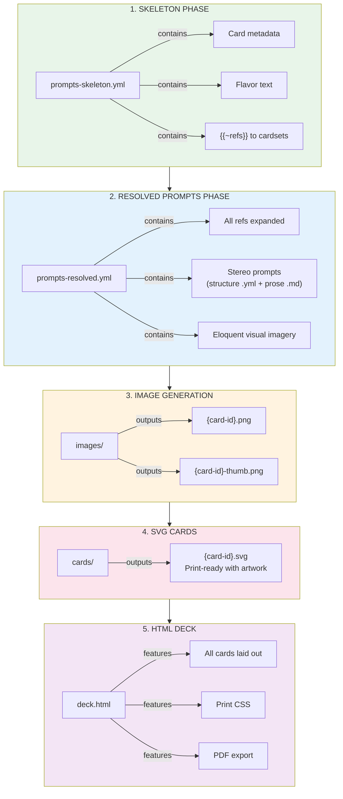

# Amsterdam Fluxx — Card Artwork Pipeline

**Sister Script:** Visualizer  
**Phase:** Prompt Generation (first pass)  
**Status:** SKELETON → PROMPTS → IMAGES → SVG → HTML → PDF

---

## Pipeline Overview



---

## Card ID Normalization

Original ref format: `fluxx-4.0:bread`, `amsterdam:canal_house`  
Normalized ID format: `fluxx-4-0-bread`, `amsterdam-canal-house`

**Rule:** Replace `:` with `-`, lowercase everything.

---

## Stereo Prompt Format

Each card gets TWO prompts:

1. **Positive Prompt:** What to include (eloquent visual imagery)
2. **Negative Prompt:** What to avoid (anti-patterns, style conflicts)

```yaml
prompts:
  fluxx-4-0-bread:
    id: "fluxx-4-0-bread"
    positive: |
      A golden loaf of freshly baked bread on a rustic wooden board,
      steam rising, warm morning light, artisan bakery aesthetic,
      visible crust texture, flour dusting, Fluxx card game style,
      bold colorful illustration, clean vector-like edges
    negative: |
      photorealistic, dark moody lighting, moldy, stale,
      industrial factory, plastic packaging
```

---

## Card Type Visual Themes

### Keepers (Green Border)
- **Style:** Warm, inviting, desirable objects
- **Mood:** "I want to collect this"
- **Colors:** Rich, saturated, positive

### Goals (Pink/Magenta Border)
- **Style:** Dynamic composition showing both required keepers
- **Mood:** Achievement, completion, victory moment
- **Colors:** Celebratory, dramatic

### Actions (Blue Border)
- **Style:** Motion, energy, things happening
- **Mood:** Chaos, change, disruption
- **Colors:** Electric, dynamic

### New Rules (Yellow Border)
- **Style:** Symbolic, regulatory, structured
- **Mood:** Order from chaos, law
- **Colors:** Official, authoritative

### Creepers (Black Border)
- **Style:** Dark, ominous, unwanted
- **Mood:** "Get this away from me"
- **Colors:** Muted, sinister, warning

---

## Cardset Visual Identities

### fluxx-4.0 (Classic)
- Clean, friendly, Looney Labs house style
- Bold outlines, flat colors
- Family-friendly aesthetic

### amsterdam
- Dutch Golden Age influenced
- Canal reflections, tulip motifs
- Vermeer lighting, terracotta + blue

### consciousness
- Psychedelic, consciousness-expanding
- Fractals, mandalas, third eye imagery
- DMT/ayahuasca visual language

### moollm-tech
- Retro-futurism meets AI
- Circuit patterns, neural networks
- Synthwave color palette

### moollm-chars
- Character portraits, expressive
- Mind Mirror aesthetic
- Personality radiates visually

### cosmic-dealers
- Mystical, tarot-influenced
- Cosmic backgrounds, karma symbols
- Gold and purple accents

---

## Files

| File | Purpose |
|------|---------|
| `ARTWORK.md` | This documentation |
| `prompts-skeleton.yml` | Phase 1: Metadata + refs |
| `prompts-resolved.yml` | Phase 2: Full visual prompts |
| `images/` | Generated artwork (future) |
| `cards/` | SVG cards (future) |
| `deck.html` | Printable deck (future) |

---

## Usage

```bash
# Phase 1: Generate skeleton (done)
# Just metadata extraction from RUN-000.yml

# Phase 2: Generate resolved prompts (this pass)
# LLM expands refs into eloquent imagery

# Phase 3: Generate images (future)
# visualizer sister script consumes prompts-resolved.yml

# Phase 4: Compose SVG cards (future)
# Combine images + card templates

# Phase 5: Build HTML deck (future)
# Layout all cards for printing
```

---

*Amsterdam Fluxx Artwork Pipeline v1.0*  
*Sister Script: Visualizer*
