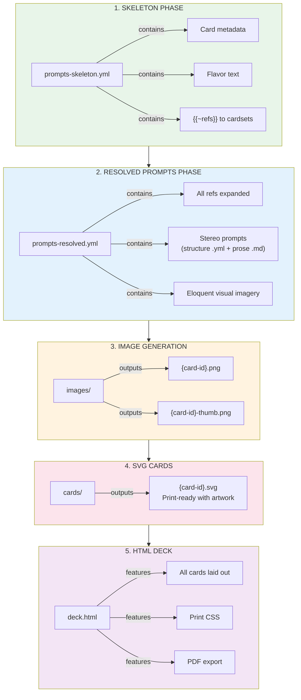
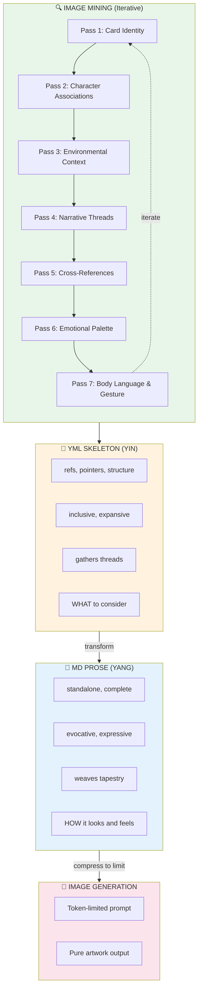

# Amsterdam Fluxx — Card Artwork Pipeline

**Sister Script:** Visualizer  
**Phase:** Prompt Generation (first pass)  
**Status:** SKELETON → PROMPTS → IMAGES → SVG → HTML → PDF

---

## Pipeline Overview



---

## Card ID Normalization

Original ref format: `fluxx-4.0:bread`, `amsterdam:canal_house`  
Normalized ID format: `fluxx-4-0-bread`, `amsterdam-canal-house`

**Rule:** Replace `:` with `-`, lowercase everything.

---

## Stereo Prompt Format — YIN/YANG Two-Phase

Each card gets TWO complementary artifacts that are **BOTH fed to the image generator**:

```
┌─────────────────────────────────────────────────────────────────┐
│                    STEREO VISION INPUT                          │
│                                                                 │
│   NN-desc.yml (Structure)  +  NN-desc.md (Prose)               │
│         │                           │                          │
│         │    CONCATENATE BOTH       │                          │
│         └───────────┬───────────────┘                          │
│                     │                                          │
│                     ▼                                          │
│            IMAGE GENERATOR                                     │
│                     │                                          │
│                     ▼                                          │
│         TRIANGULATED 3D UNDERSTANDING                          │
│                                                                 │
│   Two views → Depth perception → Richer imagery                │
└─────────────────────────────────────────────────────────────────┘
```

**WHY STEREO?**
- Two views **triangulate** the subject — structural + expressive
- Like binocular vision creates depth — YML + MD creates richness  
- The generator **fuses** both perspectives into unified understanding
- Complements, synergizes, aligns, corresponds — never contradicts

### Phase 1: YML (Structure) — The Skeleton

A **structured YAML Jazz file** with precise categorical information:
- Card metadata (id, ref, type, name, emoji)
- Character associations with specific tells and relationships
- Environmental context as organized data
- Cross-references and thematic connections
- Mining layers clearly delineated

**Provides:** Precise facts, relationships, categories, structure.

```yaml
# NN-desc.yml — Structure view (feed to image generator)
meta:
  card_id: "fluxx-4-0-bread"
  type: keeper
  emoji: "🍞"

environment:
  setting: "cottage bakery kitchen"
  lighting: "warm morning light, golden hour"
  atmosphere: ["steam rising", "flour dust in light beams"]

characters:
  bumblewick: "reaches for bread first, comfort food lover"
  don: "pairs with Sharp Cheddar Cheese"

emotional:
  mood: ["comfort", "nourishment", "home", "sharing"]
  collecting_feels: "coming home after long journey"
```

### Phase 2: MD (Prose) — The Flesh

**Evocative prose** expressing the same subject differently:
- Flowing narrative instead of structured data
- Sensory details woven together
- Emotional resonance expressed in language
- Technical style instructions included

**Provides:** Atmosphere, poetry, sensory immersion, style guidance.

```markdown
<!-- NN-desc.md — Prose view (feed to image generator) -->

A magnificent golden-crusted artisan sourdough loaf emerges fresh 
from a brick oven, steam rising in delicate wisps that catch the 
warm morning light streaming through a cottage window. The crackled 
caramelized crust bears the marks of a master baker's scoring knife, 
revealing pillowy white interior. Scattered flour dust settles on a 
weathered oak cutting board with decades of knife marks telling 
stories of countless meals shared.

The warmth radiates outward like comfort itself — this is the staff 
of life, nourishment for body and soul. Bumblewick would reach for 
this first at any table. Don would pair it with Sharp Cheddar Cheese.

Style: Digital illustration, board game card art, clean bold outlines,
rich saturated colors, painterly texture, centered composition,
warm inviting aesthetic, no text, no words, no letters.
```

### How They Complement

| Aspect | YML Provides | MD Provides |
|--------|-------------|-------------|
| **Facts** | Precise metadata | Implied through narrative |
| **Emotion** | Keywords in lists | Woven into prose flow |
| **Characters** | Structured associations | Natural mentions |
| **Environment** | Categorized attributes | Sensory descriptions |
| **Style** | Technical specs | Flowing instructions |

### Image Generator Usage

```bash
# Concatenate BOTH files as input to image generator:
cat 00-bread.yml 00-bread.md | image-generator --prompt-stdin

# Or if using API:
prompt = read("00-bread.yml") + "\n---\n" + read("00-bread.md")
generate_image(prompt)
```

The generator sees BOTH views simultaneously:
1. **Structural view** — precise categories, relationships, facts
2. **Prose view** — atmosphere, flow, sensory richness

Together they **triangulate** a richer understanding than either alone.

### Image Mining — Iterative Semantic Fordite

The skeleton YML isn't built in one pass. **Image mining** is iterative and multifaceted:

**Pass 1: Card Identity**
- Basic metadata (id, type, name, emoji)
- Flavor text and special abilities
- Cardset membership

**Pass 2: Character Associations**
- Which characters would want this card?
- What tells/frobisms relate to this imagery?
- Personality overlays and emotional resonances

**Pass 3: Environmental Context**
- Setting, lighting, time of day
- Weather, season, atmosphere
- Physical space and architecture

**Pass 4: Narrative Threads**
- Goals this card enables
- Actions that affect it
- Story moments it creates

**Pass 5: Cross-References**
- Similar cards in other cardsets
- Thematic siblings
- Visual rhymes and callbacks

**Pass 6: Emotional Palette**
- Mood, feeling, vibe
- What collecting this feels like
- What losing this feels like

**Pass 7: Body Language & Gesture**
- Tells and ticks (nervous habits, comfort gestures)
- Side-eyes and glances (suspicion, envy, admiration)
- Poses and stances (power poses, defensive hunching, relaxed lean)
- Cultural gesture references (planking! dabbing! peace signs! bunny ears!)
- Hand positions (reaching, clutching, offering, stealing)
- Facial micro-expressions (smirk, raised eyebrow, wide eyes)
- Physical relationship to the card (cradling, brandishing, hiding)

Each pass adds a **semantic layer** — like fordite paint building up in an auto factory, layer upon layer of different colors. When you slice through the accumulated meaning, you see beautiful stratified patterns of interconnected significance.

> 🐛🎊 **See also:** [worm-confetti-crawler](../../../../../examples/adventure-4/characters/animals/worm-confetti-crawler/) — The Rip Taylor–infused emoji-fordite worm familiar! Lays themed emoji "snow" in semantic layers, erodes drifts, strips to reveal clean text. The ultimate tribute to confetti-first living and fordite aesthetics. *"Exuberant, confetti-first, perfect comedic timing."*

The YML skeleton becomes **semantically thick** — not just data, but meaning-rich context that the prose transformer can draw upon.

### The Transformation



### Semantic Fordite Layering

```yaml
# Each mining pass adds a layer to the fordite:
fordite_layers:
  layer_1_identity:     "🍞 Bread — keeper — fluxx-4.0"
  layer_2_character:    "Bumblewick loves comfort food, Don pairs with cheese"
  layer_3_environment:  "Bakery morning, warm light, steam rising"
  layer_4_narrative:    "Peace + Bread = victory, staff of life"
  layer_5_crossref:     "Similar: Cookies, Cake, Stroopwafel (food keepers)"
  layer_6_emotion:      "Comfort, nourishment, home, sharing"
  layer_7_body:         "Cradling gesture, warm smile, offering hands, flour-dusted apron stance"
  
# When sliced (transformed to prose), all layers visible:
prose_slice: |
  The golden loaf speaks of comfort (layer 6) in a warm bakery 
  morning (layer 3), the staff of life (layer 4) that Bumblewick 
  would treasure (layer 2), a classic keeper (layer 1) that rhymes 
  with other food treasures in the deck (layer 5). The baker's 
  hands cradle it like a newborn, flour-dusted apron testimony 
  to honest work, warm smile inviting you to share (layer 7).

# Body language examples for character cards:
body_language_examples:
  don_hopkins:
    tells: "adjusts rabbit ears when excited, pie-menu hand gesture"
    pose: "leaning forward eagerly, one hand offering cheese"
    eyes: "twinkling mischief, corner-of-eye glance at code"
    cultural_ref: "80s programmer slouch meets rabbit energy"
    
  bumblewick:
    tells: "fidgets with waistcoat buttons when nervous"
    pose: "defensive hunch, arms crossed, reluctant hero stance"
    eyes: "side-eye at adventure, longing glance toward armchair"
    cultural_ref: "hobbit doorway hesitation"
    
  donna:
    tells: "dramatic hand gestures, counting on fingers (34 counts!)"
    pose: "power stance, chest out, theatrical presentation"
    eyes: "imperious glare, raised eyebrow judgment"
    cultural_ref: "Divine meets reality TV villain"
    
  palm:
    tells: "tiny espresso cup adjustment, philosophical hand wave"
    pose: "relaxed lean, one leg crossed, confident calm"
    eyes: "knowing smile, sees through everything"
    cultural_ref: "zen master meets street philosopher"
```

---

## Card Type Visual Themes

### Keepers (Green Border)
- **Style:** Warm, inviting, desirable objects
- **Mood:** "I want to collect this"
- **Colors:** Rich, saturated, positive

### Goals (Pink/Magenta Border)
- **Style:** Dynamic composition showing both required keepers
- **Mood:** Achievement, completion, victory moment
- **Colors:** Celebratory, dramatic

### Actions (Blue Border)
- **Style:** Motion, energy, things happening
- **Mood:** Chaos, change, disruption
- **Colors:** Electric, dynamic

### New Rules (Yellow Border)
- **Style:** Symbolic, regulatory, structured
- **Mood:** Order from chaos, law
- **Colors:** Official, authoritative

### Creepers (Black Border)
- **Style:** Dark, ominous, unwanted
- **Mood:** "Get this away from me"
- **Colors:** Muted, sinister, warning

---

## Cardset Visual Identities

### fluxx-4.0 (Classic)
- Clean, friendly, Looney Labs house style
- Bold outlines, flat colors
- Family-friendly aesthetic

### amsterdam
- Dutch Golden Age influenced
- Canal reflections, tulip motifs
- Vermeer lighting, terracotta + blue

### consciousness
- Psychedelic, consciousness-expanding
- Fractals, mandalas, third eye imagery
- DMT/ayahuasca visual language

### moollm-tech
- Retro-futurism meets AI
- Circuit patterns, neural networks
- Synthwave color palette

### moollm-chars
- Character portraits, expressive
- Mind Mirror aesthetic
- Personality radiates visually

### cosmic-dealers
- Mystical, tarot-influenced
- Cosmic backgrounds, karma symbols
- Gold and purple accents

---

## File Naming Convention — FLAT + BIG-ENDIAN

All artwork files live in **one flat directory**. Big-endian prefixes group related files lexically.

### Naming Pattern

```
NN-short-desc.yml       # Skeleton prompt with refs (Phase 1)
NN-short-desc.md        # Resolved standalone prose prompt (Phase 2)
NN-short-desc.png       # Generated image
NN-short-desc-mined.yml # Combined iterative mining YAML Jazz
```

### Examples

```
00-bread.yml            # Skeleton: refs to cardset, character associations
00-bread.md             # Resolved: standalone evocative prose
00-bread.png            # Generated artwork
00-bread-mined.yml      # All 7 mining passes combined

01-love.yml
01-love.md
01-love.png
01-love-mined.yml

02-moon.yml
...
```

### Key Principles

1. **FLAT** — No subdirectories. Everything in `artwork/`.
2. **BIG-ENDIAN** — Prefix groups files lexically (00, 01, 02...)
3. **IMPLICIT CONTAINMENT** — Prefix implies relationship, no folders needed.
4. **SINGLE MINING FILE** — `-mined.yml` is ONE file per card, iteratively updated.
   - Each mining pass INTEGRATES into the same file
   - Does NOT create new files
   - Structures information intelligently: grouped, categorized, layered

### Global Files (No Prefix)

| File | Purpose |
|------|---------|
| `ARTWORK.md` | This documentation — style guide, protocol |
| `STYLE.yml` | Shared visual identity (optional) |
| `deck.html` | Printable deck layout (future) |

### Per-Card Files (Prefixed)

| Pattern | Purpose |
|---------|---------|
| `NN-desc.yml` | Skeleton prompt — refs, pointers, structure |
| `NN-desc.md` | Resolved prompt — standalone prose for image gen |
| `NN-desc.png` | Generated artwork — pure visual, no text |
| `NN-desc-mined.yml` | Mining accumulator — all 7 passes integrated |

### Mining File Protocol

The `-mined.yml` file is **append-integrate**, not append-create:

```yaml
# 00-bread-mined.yml — SINGLE FILE, iteratively enriched

meta:
  card_id: "fluxx-4-0-bread"
  mining_passes: 7
  last_updated: "2026-01-24T20:00:00Z"

# Pass 1: Card Identity
identity:
  ref: "fluxx-4.0:bread"
  type: keeper
  name: "Bread"
  emoji: "🍞"
  flavor: "You can't have a sandwich without it."

# Pass 2: Character Associations (integrated)
characters:
  wants_this:
    - bumblewick: "loves comfort food, cozy meals"
    - don: "pairs with Sharp Cheddar Cheese"
  tells: "Bumblewick reaches for bread first at any meal"

# Pass 3: Environmental Context (integrated)
environment:
  setting: "warm bakery, cottage kitchen"
  lighting: "morning light, golden hour"
  atmosphere: "steam, flour dust, wood smoke"

# ... passes 4-7 integrated into same file ...
```

---

## Usage

```bash
# Phase 1: Generate skeleton (done)
# Just metadata extraction from RUN-000.yml

# Phase 2: Generate resolved prompts (this pass)
# LLM expands refs into eloquent imagery

# Phase 3: Generate images (future)
# visualizer sister script consumes prompts-resolved.yml

# Phase 4: Compose SVG cards (future)
# Combine images + card templates

# Phase 5: Build HTML deck (future)
# Layout all cards for printing
```

---

*Amsterdam Fluxx Artwork Pipeline v1.0*  
*Sister Script: Visualizer*
