# Amsterdam Fluxx — Card Artwork Pipeline

**Sister Script:** Visualizer  
**Phase:** Prompt Generation (first pass)  
**Status:** SKELETON → PROMPTS → IMAGES → SVG → HTML → PDF

---

## Pipeline Overview


---

## Card ID Normalization

Original ref format: `fluxx-4.0:bread`, `amsterdam:canal_house`  
Normalized ID format: `fluxx-4-0-bread`, `amsterdam-canal-house`

**Rule:** Replace `:` with `-`, lowercase everything.

---

## Stereo Prompt Format — YIN/YANG Two-Phase

Each card gets TWO complementary artifacts:

### Phase 1: YML (Structure) — The Skeleton

A **referential YAML Jazz file** that points to everything relevant:
- Card metadata (id, ref, type, name, emoji)
- Character files with personality, tells, frobisms
- Cardset visual identity references
- Theme mood boards
- Related cards and goals
- Environmental context
- Any resource that might inform the visual

**Inclusive, expansive, pointing outward.** Gathers all the threads.

```yaml
# Phase 1: Skeleton YML — points to everything
fluxx-4-0-bread:
  id: "fluxx-4-0-bread"
  refs:
    card: "RUN-000.yml#cards.0"
    cardset: "cardsets/fluxx-4-0/VISUAL-IDENTITY.yml"
    theme: "themes/keeper-warmth.yml"
    goals_featuring: ["peace_and_bread", "toast"]
    flavor_source: "The staff of life"
  visual_context:
    setting: "bakery, kitchen, morning"
    lighting: "warm, golden hour, steam"
    mood: "nourishment, comfort, home"
  character_associations:
    - "bumblewick: loves comfort food"
    - "don: sharp cheddar cheese pairs well"
```

### Phase 2: MD (Prose) — The Flesh

Transform the skeleton into **standalone evocative prose**:
- No dependencies — everything stated explicitly
- No references — all context resolved, deduplicated, and reflowed inline
- Pure visual, emotional, impressional, gestural description
- Tells and readings woven into imagery
- The transformer reads ALL refs into context, then expresses
- Image generator services impose token limits, so we should discover those and use them to limit size of markup narrative description

**Self-contained, complete, ready for image generation.**

```markdown
<!-- Phase 2: Prose MD — standalone, no dependencies -->

A magnificent golden-crusted artisan sourdough loaf emerges fresh 
from a brick oven, steam rising in delicate wisps that catch the 
warm morning light streaming through a cottage window. The crackled 
caramelized crust bears the marks of a master baker's scoring knife, 
revealing pillowy white interior. Scattered flour dust settles on a 
weathered oak cutting board with decades of knife marks telling 
stories of countless meals shared. A rustic bread knife with wooden 
handle rests beside, waiting. The warmth radiates outward like 
comfort itself — this is the staff of life, nourishment for body 
and soul, the foundation upon which all good meals are built.

Digital illustration in modern board game card art style. Clean bold 
outlines with slight hand-drawn quality. Rich saturated colors with 
painterly texture. Centered composition. Warm inviting aesthetic 
suitable for tabletop gaming. Looney Labs whimsical family-friendly 
energy. No text, no words, no letters.
```

### Image Mining — Iterative Semantic Fordite

The skeleton YML isn't built in one pass. **Image mining** is iterative and multifaceted:

**Pass 1: Card Identity**
- Basic metadata (id, type, name, emoji)
- Flavor text and special abilities
- Cardset membership

**Pass 2: Character Associations**
- Which characters would want this card?
- What tells/frobisms relate to this imagery?
- Personality overlays and emotional resonances

**Pass 3: Environmental Context**
- Setting, lighting, time of day
- Weather, season, atmosphere
- Physical space and architecture

**Pass 4: Narrative Threads**
- Goals this card enables
- Actions that affect it
- Story moments it creates

**Pass 5: Cross-References**
- Similar cards in other cardsets
- Thematic siblings
- Visual rhymes and callbacks

**Pass 6: Emotional Palette**
- Mood, feeling, vibe
- What collecting this feels like
- What losing this feels like

**Pass 7: Body Language & Gesture**
- Tells and ticks (nervous habits, comfort gestures)
- Side-eyes and glances (suspicion, envy, admiration)
- Poses and stances (power poses, defensive hunching, relaxed lean)
- Cultural gesture references (planking! dabbing! peace signs! bunny ears!)
- Hand positions (reaching, clutching, offering, stealing)
- Facial micro-expressions (smirk, raised eyebrow, wide eyes)
- Physical relationship to the card (cradling, brandishing, hiding)

Each pass adds a **semantic layer** — like fordite paint building up in an auto factory, layer upon layer of different colors. When you slice through the accumulated meaning, you see beautiful stratified patterns of interconnected significance.

> 🐛🎊 **See also:** [worm-confetti-crawler](../../../../../examples/adventure-4/characters/animals/worm-confetti-crawler/) — The Rip Taylor–infused emoji-fordite worm familiar! Lays themed emoji "snow" in semantic layers, erodes drifts, strips to reveal clean text. The ultimate tribute to confetti-first living and fordite aesthetics. *"Exuberant, confetti-first, perfect comedic timing."*

The YML skeleton becomes **semantically thick** — not just data, but meaning-rich context that the prose transformer can draw upon.

### The Transformation

```mermaid
flowchart TB
    subgraph MINING["🔍 IMAGE MINING (Iterative)"]
        direction TB
        P1[Pass 1: Card Identity]
        P2[Pass 2: Character Associations]
        P3[Pass 3: Environmental Context]
        P4[Pass 4: Narrative Threads]
        P5[Pass 5: Cross-References]
        P6[Pass 6: Emotional Palette]
        P7[Pass 7: Body Language & Gesture]
        
        P1 --> P2 --> P3 --> P4 --> P5 --> P6 --> P7
        P7 -.->|"iterate"| P1
    end

    subgraph YML["📄 YML SKELETON (YIN)"]
        Y1[refs, pointers, structure]
        Y2[inclusive, expansive]
        Y3[gathers threads]
        Y4[WHAT to consider]
    end

    subgraph MD["📝 MD PROSE (YANG)"]
        M1[standalone, complete]
        M2[evocative, expressive]
        M3[weaves tapestry]
        M4[HOW it looks and feels]
    end

    subgraph IMG["🎨 IMAGE GENERATION"]
        I1[Token-limited prompt]
        I2[Pure artwork output]
    end

    MINING --> YML
    YML -->|"transform"| MD
    MD -->|"compress to limit"| IMG

    style MINING fill:#e8f5e9
    style YML fill:#fff3e0
    style MD fill:#e3f2fd
    style IMG fill:#fce4ec
```



### Semantic Fordite Layering

```yaml
# Each mining pass adds a layer to the fordite:
fordite_layers:
  layer_1_identity:     "🍞 Bread — keeper — fluxx-4.0"
  layer_2_character:    "Bumblewick loves comfort food, Don pairs with cheese"
  layer_3_environment:  "Bakery morning, warm light, steam rising"
  layer_4_narrative:    "Peace + Bread = victory, staff of life"
  layer_5_crossref:     "Similar: Cookies, Cake, Stroopwafel (food keepers)"
  layer_6_emotion:      "Comfort, nourishment, home, sharing"
  layer_7_body:         "Cradling gesture, warm smile, offering hands, flour-dusted apron stance"
  
# When sliced (transformed to prose), all layers visible:
prose_slice: |
  The golden loaf speaks of comfort (layer 6) in a warm bakery 
  morning (layer 3), the staff of life (layer 4) that Bumblewick 
  would treasure (layer 2), a classic keeper (layer 1) that rhymes 
  with other food treasures in the deck (layer 5). The baker's 
  hands cradle it like a newborn, flour-dusted apron testimony 
  to honest work, warm smile inviting you to share (layer 7).

# Body language examples for character cards:
body_language_examples:
  don_hopkins:
    tells: "adjusts rabbit ears when excited, pie-menu hand gesture"
    pose: "leaning forward eagerly, one hand offering cheese"
    eyes: "twinkling mischief, corner-of-eye glance at code"
    cultural_ref: "80s programmer slouch meets rabbit energy"
    
  bumblewick:
    tells: "fidgets with waistcoat buttons when nervous"
    pose: "defensive hunch, arms crossed, reluctant hero stance"
    eyes: "side-eye at adventure, longing glance toward armchair"
    cultural_ref: "hobbit doorway hesitation"
    
  donna:
    tells: "dramatic hand gestures, counting on fingers (34 counts!)"
    pose: "power stance, chest out, theatrical presentation"
    eyes: "imperious glare, raised eyebrow judgment"
    cultural_ref: "Divine meets reality TV villain"
    
  palm:
    tells: "tiny espresso cup adjustment, philosophical hand wave"
    pose: "relaxed lean, one leg crossed, confident calm"
    eyes: "knowing smile, sees through everything"
    cultural_ref: "zen master meets street philosopher"
```

---

## Card Type Visual Themes

### Keepers (Green Border)
- **Style:** Warm, inviting, desirable objects
- **Mood:** "I want to collect this"
- **Colors:** Rich, saturated, positive

### Goals (Pink/Magenta Border)
- **Style:** Dynamic composition showing both required keepers
- **Mood:** Achievement, completion, victory moment
- **Colors:** Celebratory, dramatic

### Actions (Blue Border)
- **Style:** Motion, energy, things happening
- **Mood:** Chaos, change, disruption
- **Colors:** Electric, dynamic

### New Rules (Yellow Border)
- **Style:** Symbolic, regulatory, structured
- **Mood:** Order from chaos, law
- **Colors:** Official, authoritative

### Creepers (Black Border)
- **Style:** Dark, ominous, unwanted
- **Mood:** "Get this away from me"
- **Colors:** Muted, sinister, warning

---

## Cardset Visual Identities

### fluxx-4.0 (Classic)
- Clean, friendly, Looney Labs house style
- Bold outlines, flat colors
- Family-friendly aesthetic

### amsterdam
- Dutch Golden Age influenced
- Canal reflections, tulip motifs
- Vermeer lighting, terracotta + blue

### consciousness
- Psychedelic, consciousness-expanding
- Fractals, mandalas, third eye imagery
- DMT/ayahuasca visual language

### moollm-tech
- Retro-futurism meets AI
- Circuit patterns, neural networks
- Synthwave color palette

### moollm-chars
- Character portraits, expressive
- Mind Mirror aesthetic
- Personality radiates visually

### cosmic-dealers
- Mystical, tarot-influenced
- Cosmic backgrounds, karma symbols
- Gold and purple accents

---

## File Naming Convention — FLAT + BIG-ENDIAN

All artwork files live in **one flat directory**. Big-endian prefixes group related files lexically.

### Naming Pattern

```
NN-short-desc.yml       # Skeleton prompt with refs (Phase 1)
NN-short-desc.md        # Resolved standalone prose prompt (Phase 2)
NN-short-desc.png       # Generated image
NN-short-desc-mined.yml # Combined iterative mining YAML Jazz
```

### Examples

```
00-bread.yml            # Skeleton: refs to cardset, character associations
00-bread.md             # Resolved: standalone evocative prose
00-bread.png            # Generated artwork
00-bread-mined.yml      # All 7 mining passes combined

01-love.yml
01-love.md
01-love.png
01-love-mined.yml

02-moon.yml
...
```

### Key Principles

1. **FLAT** — No subdirectories. Everything in `artwork/`.
2. **BIG-ENDIAN** — Prefix groups files lexically (00, 01, 02...)
3. **IMPLICIT CONTAINMENT** — Prefix implies relationship, no folders needed.
4. **SINGLE MINING FILE** — `-mined.yml` is ONE file per card, iteratively updated.
   - Each mining pass INTEGRATES into the same file
   - Does NOT create new files
   - Structures information intelligently: grouped, categorized, layered

### Global Files (No Prefix)

| File | Purpose |
|------|---------|
| `ARTWORK.md` | This documentation — style guide, protocol |
| `STYLE.yml` | Shared visual identity (optional) |
| `deck.html` | Printable deck layout (future) |

### Per-Card Files (Prefixed)

| Pattern | Purpose |
|---------|---------|
| `NN-desc.yml` | Skeleton prompt — refs, pointers, structure |
| `NN-desc.md` | Resolved prompt — standalone prose for image gen |
| `NN-desc.png` | Generated artwork — pure visual, no text |
| `NN-desc-mined.yml` | Mining accumulator — all 7 passes integrated |

### Mining File Protocol

The `-mined.yml` file is **append-integrate**, not append-create:

```yaml
# 00-bread-mined.yml — SINGLE FILE, iteratively enriched

meta:
  card_id: "fluxx-4-0-bread"
  mining_passes: 7
  last_updated: "2026-01-24T20:00:00Z"

# Pass 1: Card Identity
identity:
  ref: "fluxx-4.0:bread"
  type: keeper
  name: "Bread"
  emoji: "🍞"
  flavor: "You can't have a sandwich without it."

# Pass 2: Character Associations (integrated)
characters:
  wants_this:
    - bumblewick: "loves comfort food, cozy meals"
    - don: "pairs with Sharp Cheddar Cheese"
  tells: "Bumblewick reaches for bread first at any meal"

# Pass 3: Environmental Context (integrated)
environment:
  setting: "warm bakery, cottage kitchen"
  lighting: "morning light, golden hour"
  atmosphere: "steam, flour dust, wood smoke"

# ... passes 4-7 integrated into same file ...
```

---

## Usage

```bash
# Phase 1: Generate skeleton (done)
# Just metadata extraction from RUN-000.yml

# Phase 2: Generate resolved prompts (this pass)
# LLM expands refs into eloquent imagery

# Phase 3: Generate images (future)
# visualizer sister script consumes prompts-resolved.yml

# Phase 4: Compose SVG cards (future)
# Combine images + card templates

# Phase 5: Build HTML deck (future)
# Layout all cards for printing
```

---

*Amsterdam Fluxx Artwork Pipeline v1.0*  
*Sister Script: Visualizer*
