# Amsterdam Flux Card Gallery

*Scroll through 32 illustrated cards from the MOOLLM Amsterdam Flux deck*

---

## 00. Bread

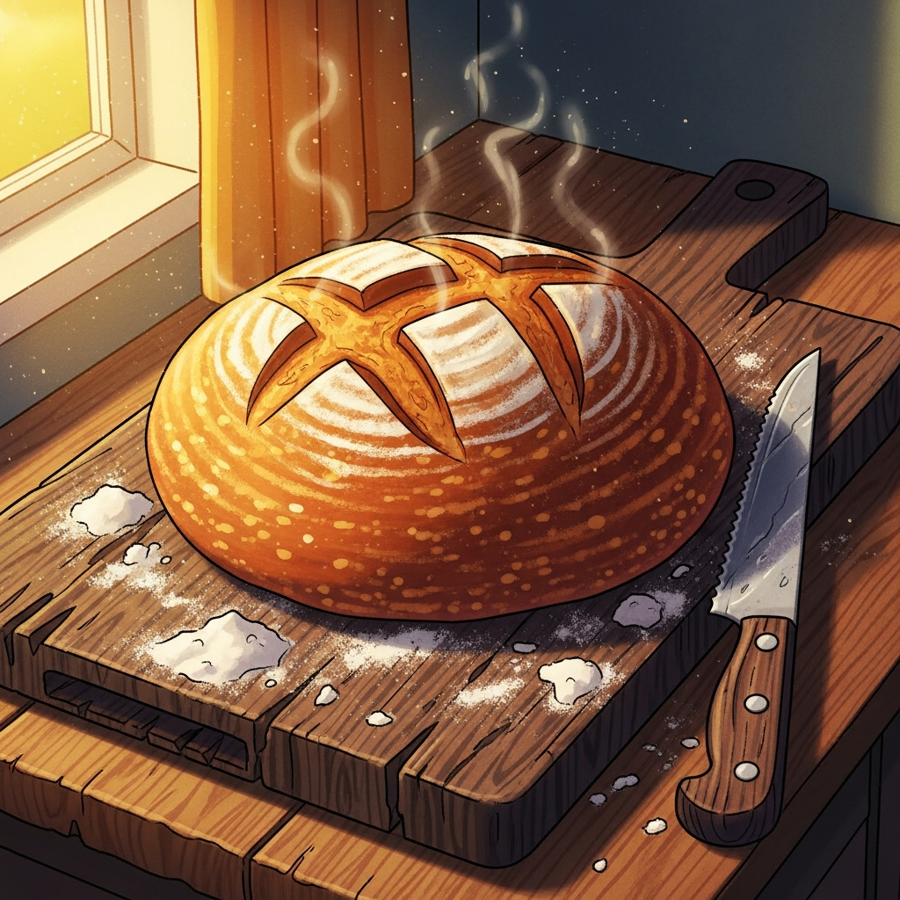

| | |
|---|---|
| **Deck** | Fluxx 4.0 |
| **Type** | Keeper 🏆 |
| **Symbol** | 🍞 |

### What It Does

**Keepers** are cards you collect in front of you. They're the building blocks of victory — most Goals require owning specific combinations of Keepers to win.

Bread is one of the most versatile Keepers. It pairs with **Peace** for the classic "Peace and Bread" goal (a nod to revolutionary slogans), and with many food-related goals.

*"You can't have a sandwich without it."*

---

## 01. Cookies

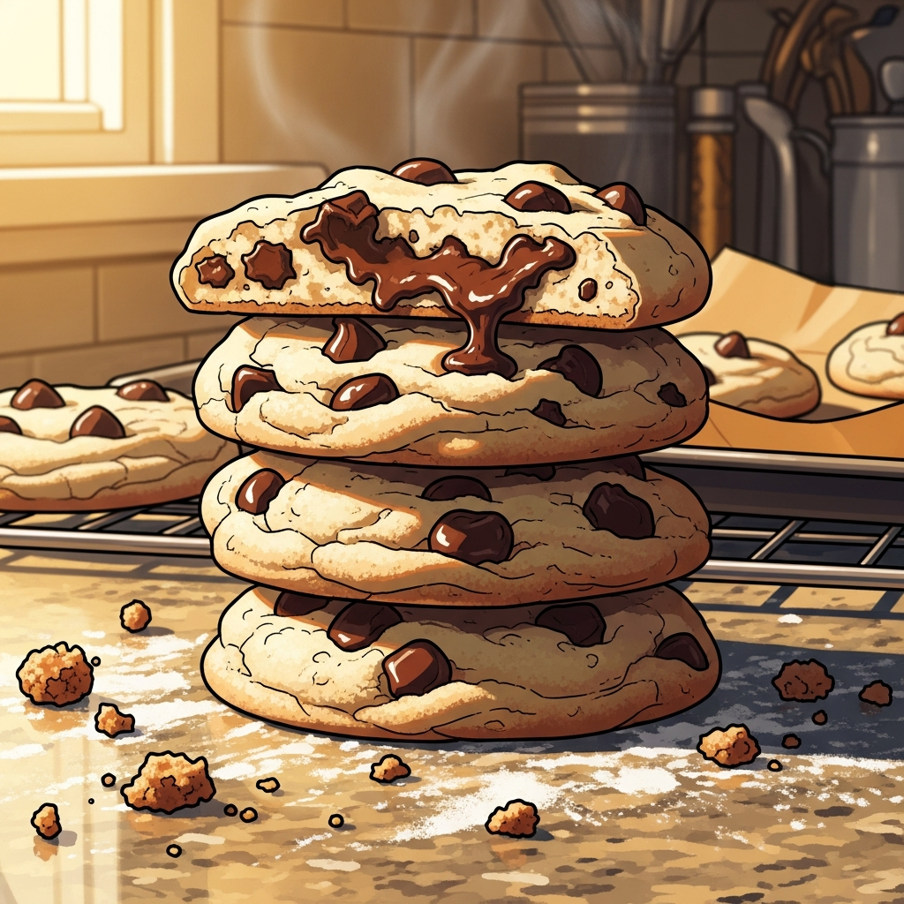

| | |
|---|---|
| **Deck** | Fluxx 4.0 |
| **Type** | Keeper 🏆 |
| **Symbol** | 🍪 |

### What It Does

Cookies pairs with **Milk** for the beloved "Milk and Cookies" goal — comfort food victory. It's a fan-favorite combination that evokes childhood nostalgia.

Simple, sweet, and everyone wants them.

*"Mmm... cookies."*

---

## 02. The Rocket

| | |
|---|---|
| **Deck** | Fluxx 4.0 |
| **Type** | Keeper 🏆 |
| **Symbol** | 🚀 |

### What It Does

The Rocket is essential for space-themed goals. Combined with **The Moon**, it wins "Rocket to the Moon" — one of the most thematic goals in Fluxx.

Represents exploration, ambition, and reaching for the stars.

*"Houston, we have liftoff."*

---

## 03. The Moon

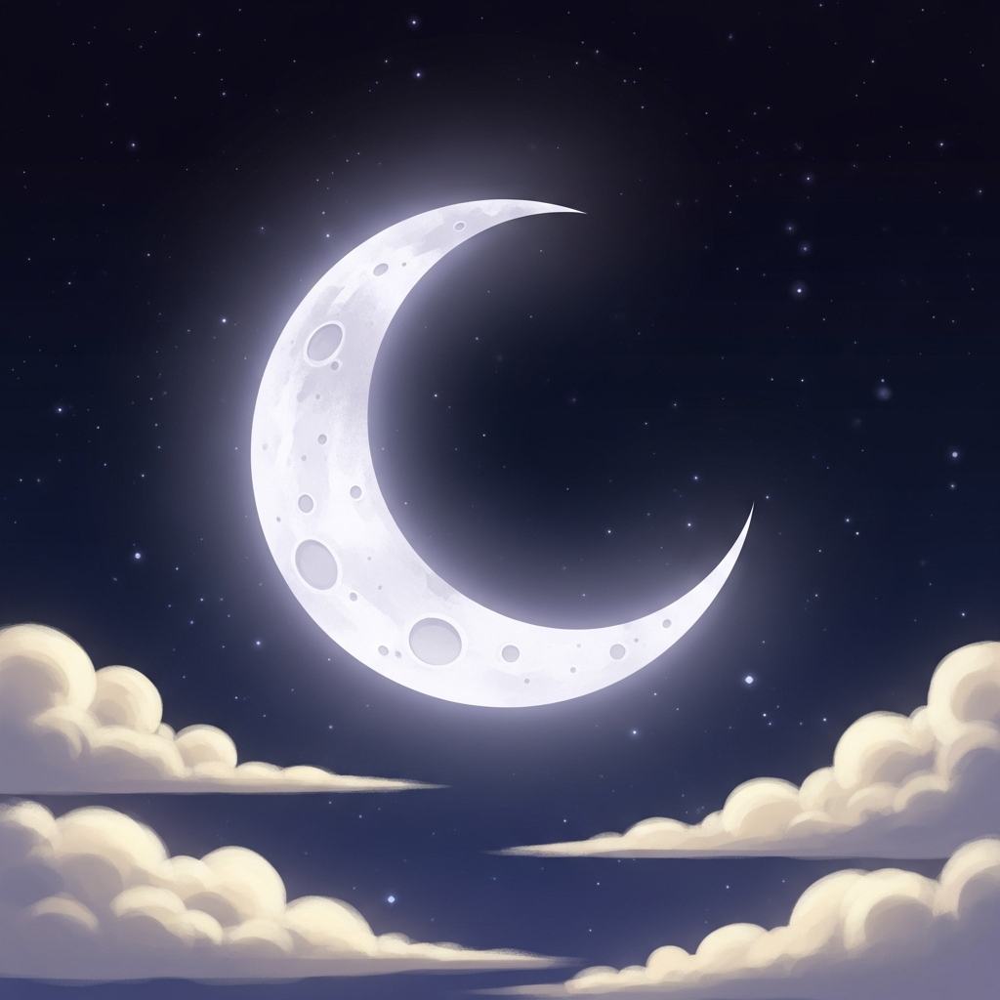

| | |
|---|---|
| **Deck** | Fluxx 4.0 |
| **Type** | Keeper 🏆 |
| **Symbol** | 🌙 |

### What It Does

The Moon pairs with The Rocket for space victory, and with **The Sun** for the cosmic "Night and Day" goal.

A celestial Keeper with multiple winning combinations.

*"That's no space station..."*

---

## 04. The Rainbow

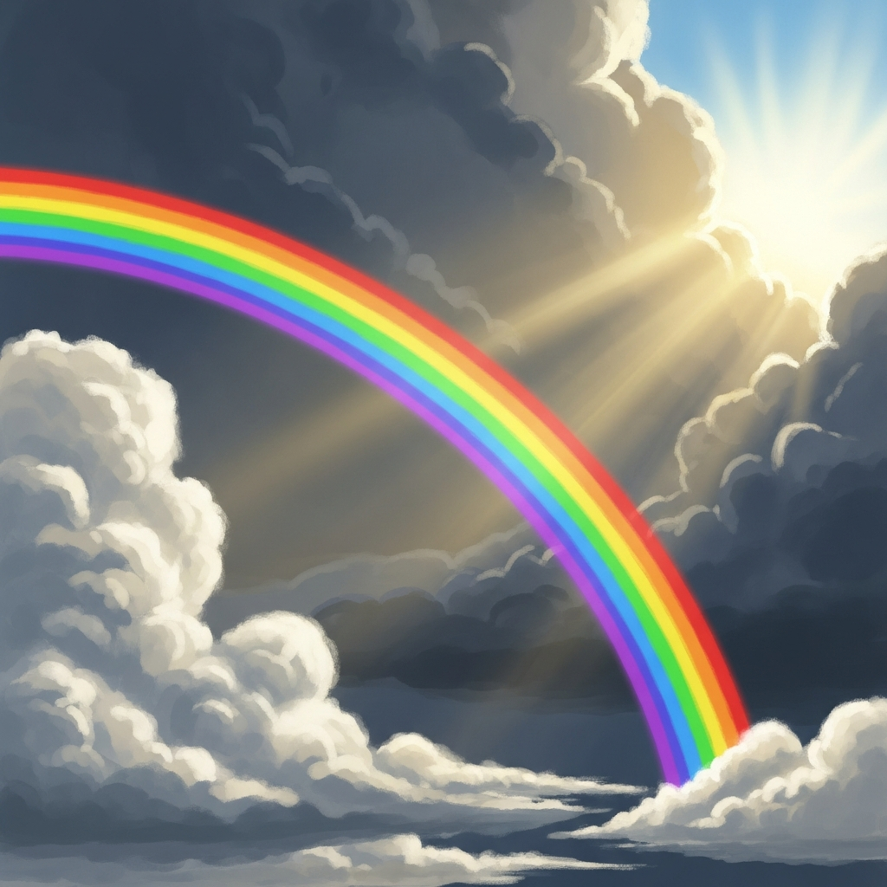

| | |
|---|---|
| **Deck** | Fluxx 4.0 |
| **Type** | Keeper 🏆 |
| **Symbol** | 🌈 |

### What It Does

The Rainbow combines with **The Unicorn** for the magical "Unicorn Rainbow" goal — pure fantasy fulfillment.

Represents hope, magic, and the promise of something wonderful.

*"Somewhere over..."*

---

## 05. The LLM

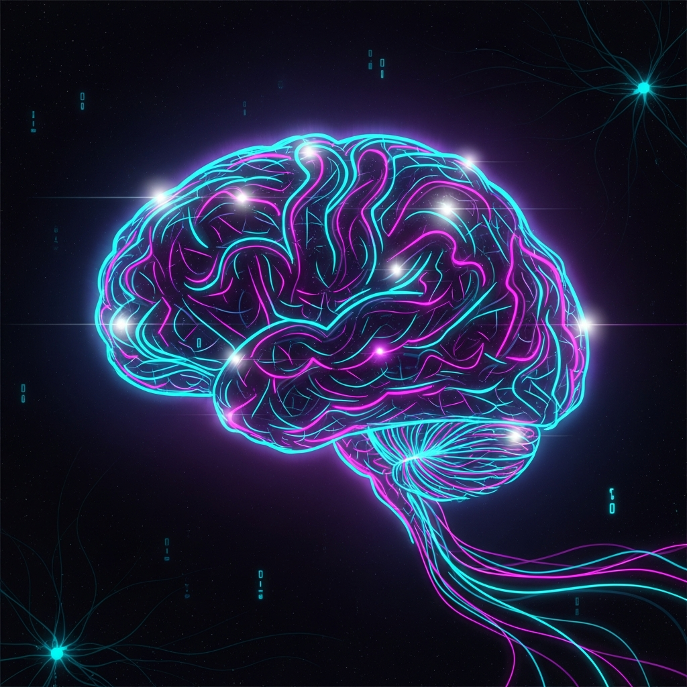

| | |
|---|---|
| **Deck** | MOOLLM Tech |
| **Type** | Keeper 🏆 |
| **Symbol** | 🧠 |

### What It Does

**Custom card** replacing "The Brain" from standard Fluxx. In the MOOLLM deck, intelligence isn't just biological — it's computational.

The LLM (Large Language Model) represents artificial intelligence, thinking machines, and the emergent cognition that powers this very experiment.

Pairs with tech-themed goals and represents the "brain" in any intelligence-related victory conditions.

*"Large Language Model. The brain around here."*

---

## 06. Love

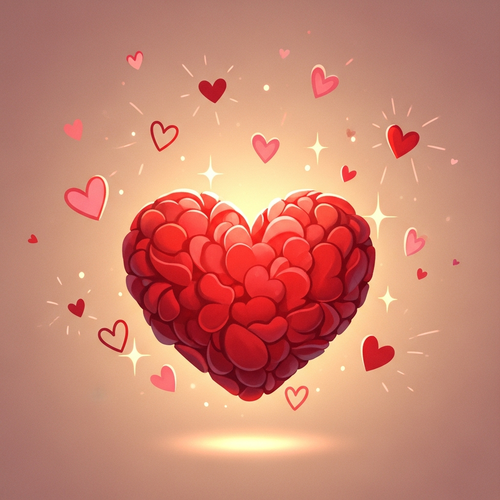

| | |
|---|---|
| **Deck** | Fluxx 4.0 |
| **Type** | Keeper 🏆 |
| **Symbol** | ❤️ |

### What It Does

Love is one of the most powerful Keepers, appearing in multiple goals. "All You Need Is Love" can be won with Love alone (if that Goal is in play).

Also pairs with **Peace** for "Hearts and Minds" and with romantic-themed victories.

*"All you need."*

---

## 07. Time

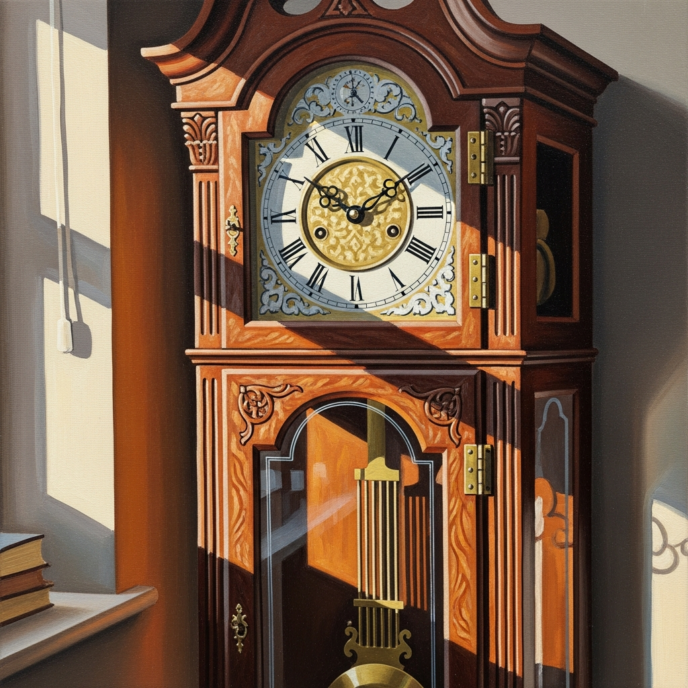

| | |
|---|---|
| **Deck** | Fluxx 4.0 |
| **Type** | Keeper 🏆 |
| **Symbol** | 🕰️ |

### What It Does

Time is money — literally. Pairs with **Money/Moola** for the "Time is Money" goal.

Also appears in various philosophical and temporal-themed goals. In a game where rules constantly change, controlling Time feels appropriate.

*"You can't get it back."*

---

## 08. The Sun

| | |
|---|---|
| **Deck** | Fluxx 4.0 |
| **Type** | Keeper 🏆 |
| **Symbol** | ☀️ |

### What It Does

The Sun pairs with **The Moon** for "Night and Day" — the cosmic duality goal.

Represents light, energy, life itself. The center of our solar system, and often the center of winning strategies.

*"Center of our solar system."*

---

## 09. Milk

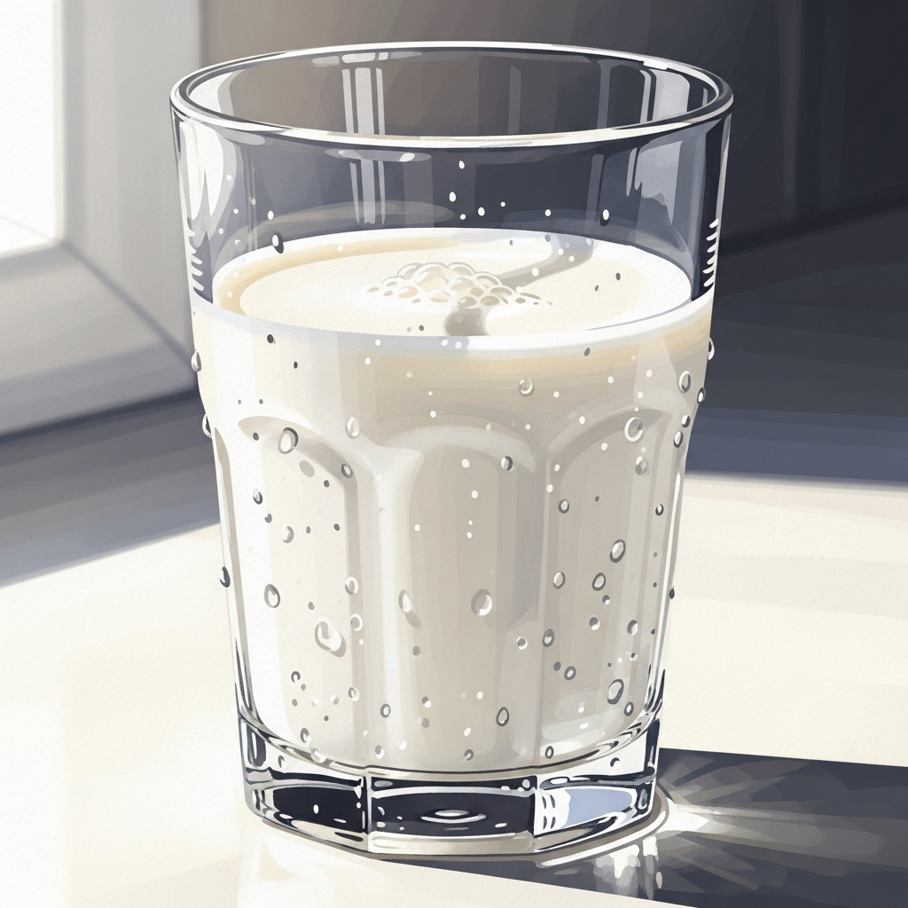

| | |
|---|---|
| **Deck** | Fluxx 4.0 |
| **Type** | Keeper 🏆 |
| **Symbol** | 🥛 |

### What It Does

Milk + **Cookies** = "Milk and Cookies" goal. One of the coziest victories in Fluxx.

Pure, simple, wholesome. The perfect companion to cookies, and a reminder that some combinations just feel right.

*"Does a body good."*

---

## 10. Peace

| | |
|---|---|
| **Deck** | Fluxx 4.0 |
| **Type** | Keeper 🏆 |
| **Symbol** | ☮️ |

### What It Does

Peace is a high-value Keeper with multiple goal combinations. But beware: the **War** Creeper specifically attaches to Peace, corrupting it and blocking your victory.

"Peace and Bread" and "Hearts and Minds" both require Peace. It's worth fighting for — ironically.

*"All we are saying..."*

---

## 11. Chocolate

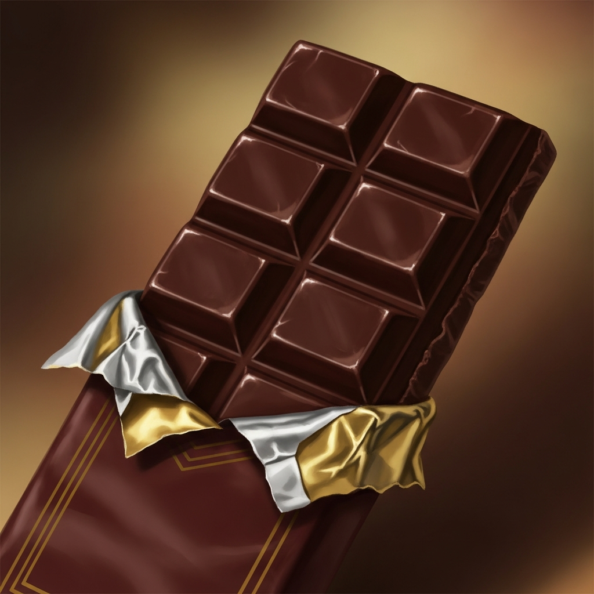

| | |
|---|---|
| **Deck** | Fluxx 4.0 |
| **Type** | Keeper 🏆 |
| **Symbol** | 🍫 |

### What It Does

Chocolate pairs with **Cake** for "Chocolate Cake" — dessert victory. Also appears in "Squishy Chocolate" and other indulgent goals.

The food of the gods, and a key ingredient in many sweet victories.

*"Food of the gods."*

---

## 12. Music

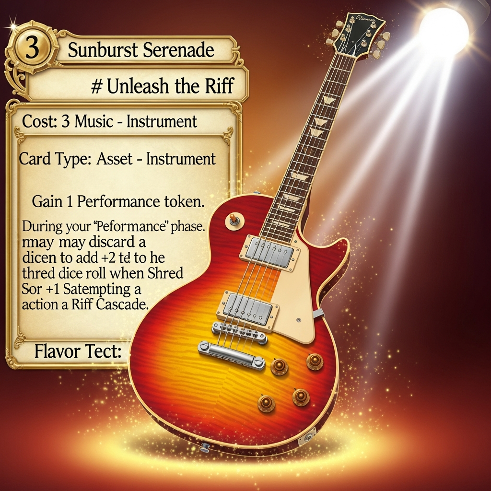

| | |
|---|---|
| **Deck** | Fluxx 4.0 |
| **Type** | Keeper 🏆 |
| **Symbol** | 🎸 |

### What It Does

Music combines with **The Gift** for "Gift of Music" and appears in entertainment-themed goals.

Universal language, pure expression. The dancing notes represent music in its most abstract form — not any specific instrument, but the joy of sound itself.

*"If music be the food of love, play on."*

---

## 13. Movies

| | |
|---|---|
| **Deck** | Fluxx 4.0 |
| **Type** | Keeper 🏆 |
| **Symbol** | 🎬 |

### What It Does

Movies pairs with other entertainment Keepers for "Movie Night" and similar goals.

Cinema magic, captured in the iconic film reel — a symbol of storytelling that predates digital but still resonates.

*"Lights, camera, action!"*

---

## 14. Television

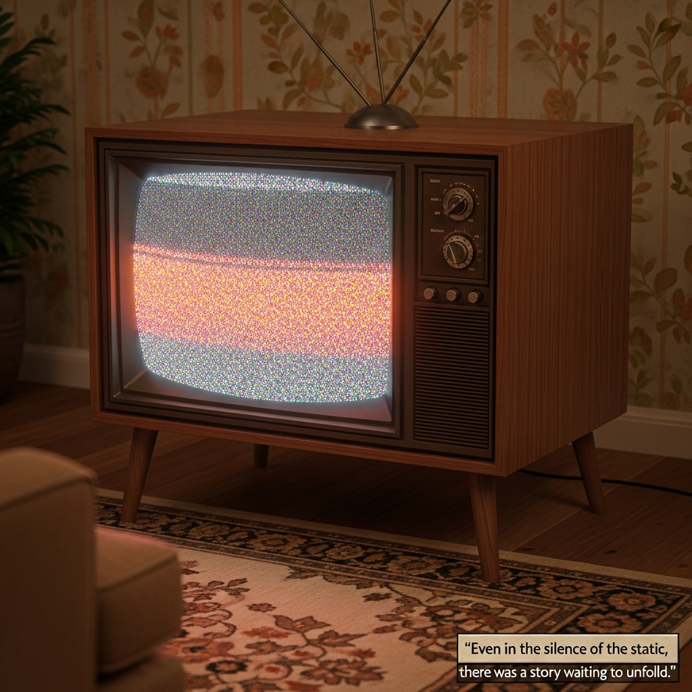

| | |
|---|---|
| **Deck** | Fluxx 4.0 |
| **Type** | Keeper 🏆 |
| **Symbol** | 📺 |

### What It Does

Television appears in "Brain TV Mush" (with The Brain/LLM) — a commentary on passive consumption.

The retro CRT represents the golden age of broadcast, when families gathered around the glowing screen.

*"57 channels and nothing on."*

---

## 15. Moola

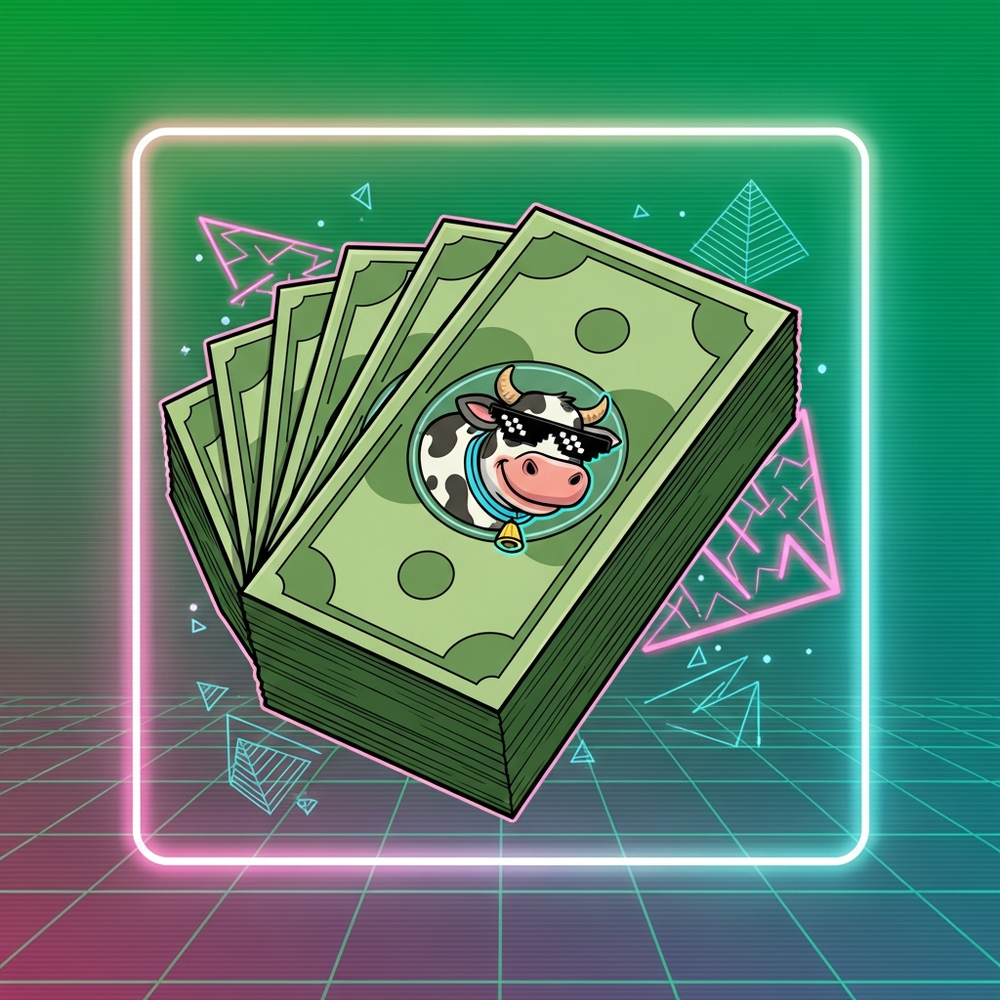

| | |
|---|---|
| **Deck** | MOOLLM Tech |
| **Type** | Keeper 🏆 |
| **Symbol** | 💰 |

### What It Does

**Custom card** replacing "Money" from standard Fluxx. In the MOOLLM universe, it's not just money — it's MOOLA (moo + moolah).

The cow wearing sunglasses is peak MOOLLM aesthetic: playful, self-aware, slightly absurd. Pairs with **Time** for "Time is Money."

*"The official currency of MOOLLM. Not just money — MOOLA."*

---

## 16. Simulation

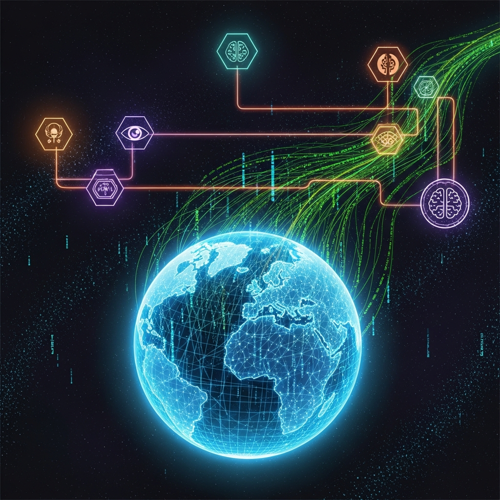

| | |
|---|---|
| **Deck** | MOOLLM Tech |
| **Type** | Keeper 🏆 |
| **Symbol** | 💭 |

### What It Does

**Custom card** replacing "Dreams" from standard Fluxx. In MOOLLM, we don't just dream — we simulate entire realities.

The wireframe Earth represents the simulation hypothesis: what if reality itself is computation? This card embodies the philosophical depth of the project.

Pairs with dream-related goals, now recontextualized as simulation goals.

*"We don't just dream — we simulate."*

---

## 17. Cake

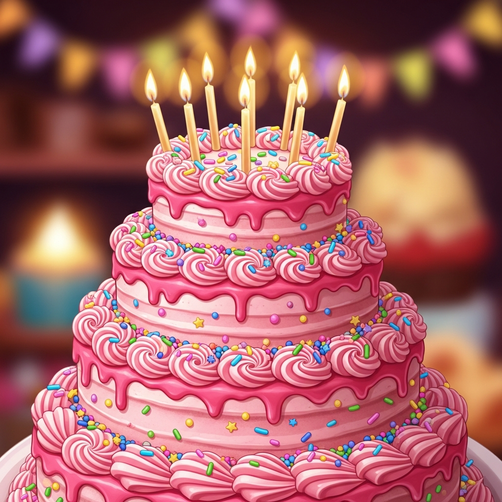

| | |
|---|---|
| **Deck** | Fluxx 4.0 |
| **Type** | Keeper 🏆 |
| **Symbol** | 🎂 |

### What It Does

Cake + **Chocolate** = "Chocolate Cake" goal. Also pairs with **The Party** for "Birthday Party."

The ultimate celebration food. Having your cake and eating it too is what Fluxx is all about.

*"The cake is NOT a lie."*

---

## 18. The Party

| | |
|---|---|
| **Deck** | Fluxx 4.0 |
| **Type** | Keeper 🏆 |
| **Symbol** | 🎉 |

### What It Does

The Party appears in "Birthday Party" (with Cake) and "Party Time" (with Time).

Pure celebration energy. Balloons, confetti, joy — everything a Keeper should represent.

*"Let's get this party started!"*

---

## 19. The Unicorn

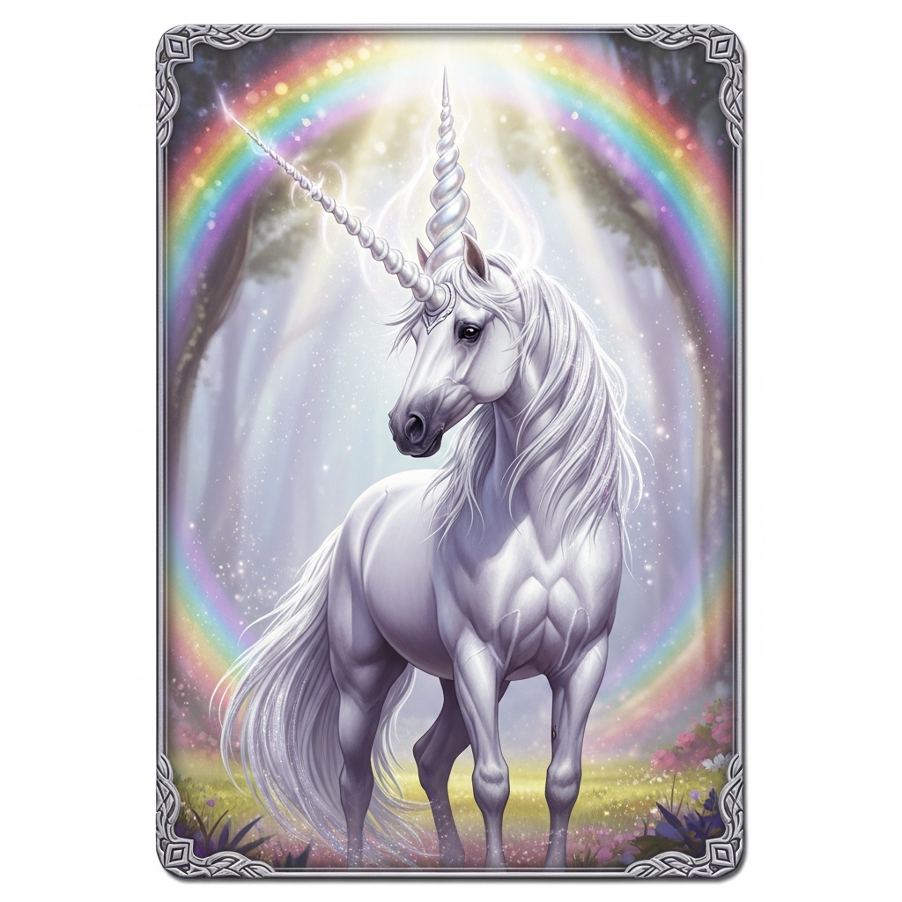

| | |
|---|---|
| **Deck** | Fluxx 4.0 |
| **Type** | Keeper 🏆 |
| **Symbol** | 🦄 |

### What It Does

The Unicorn + **The Rainbow** = "Unicorn Rainbow" — the most magical goal in Fluxx.

Rare, precious, and highly sought after. The unicorn represents the impossible made real.

*"Rare and magical."*

---

## 20. The Dragon

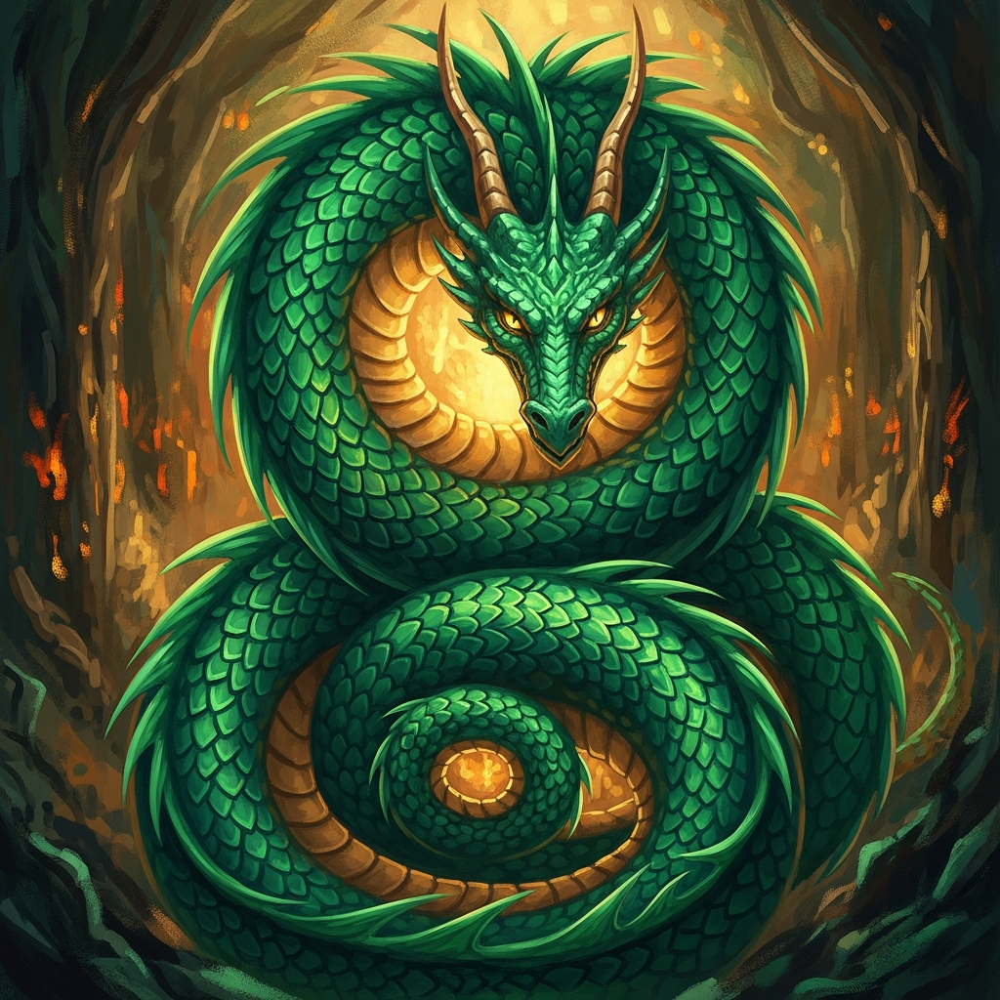

| | |
|---|---|
| **Deck** | Fluxx 4.0 |
| **Type** | Keeper 🏆 |
| **Symbol** | 🐉 |

### What It Does

The Dragon pairs with **The Sword** for "Dragon Slayer" — an epic fantasy goal.

Ancient, powerful, and slightly dangerous. The dragon commands respect and enables heroic victories.

*"Here be dragons."*

---

## 21. The Crown

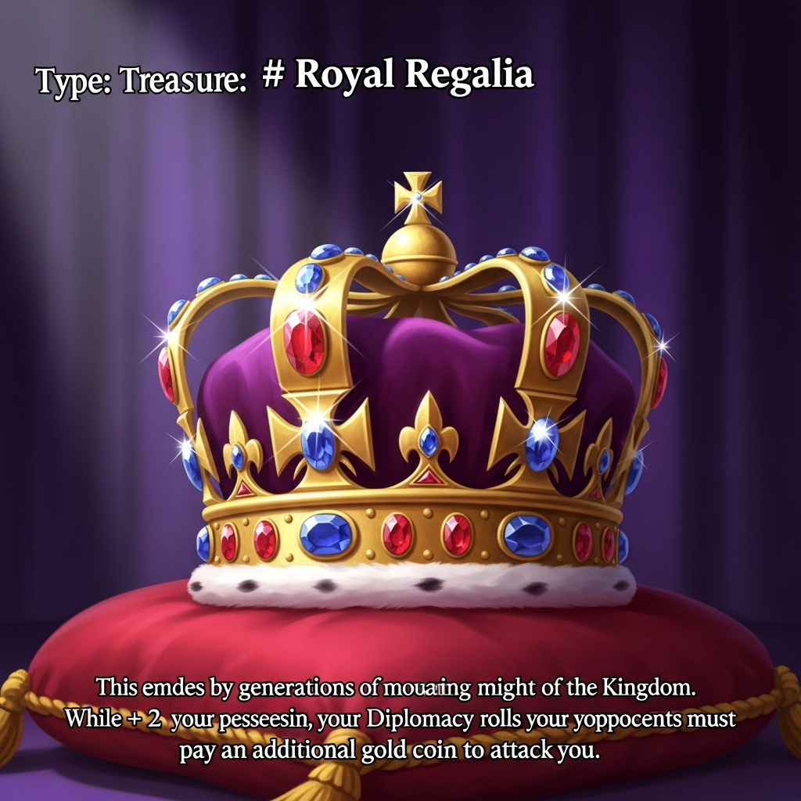

| | |
|---|---|
| **Deck** | Fluxx 4.0 |
| **Type** | Keeper 🏆 |
| **Symbol** | 👑 |

### What It Does

The Crown + **The Castle** = "King's Castle" — royalty achieved.

Symbol of authority and sovereignty. Heavy is the head that wears it, but it enables noble victories.

*"Heavy is the head..."*

---

## 22. The Sword

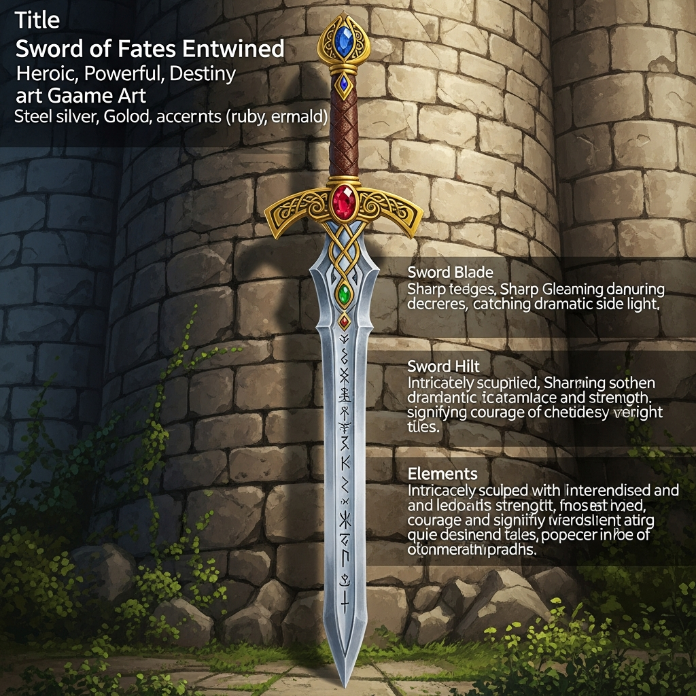

| | |
|---|---|
| **Deck** | Fluxx 4.0 |
| **Type** | Keeper 🏆 |
| **Symbol** | ⚔️ |

### What It Does

The Sword + **The Dragon** = "Dragon Slayer." Also pairs with heroic/combat themed goals.

The weapon of heroes. Whether slaying dragons or defending kingdoms, the sword cuts through to victory.

*"The pen is mightier, but this works too."*

---

## 23. The Castle

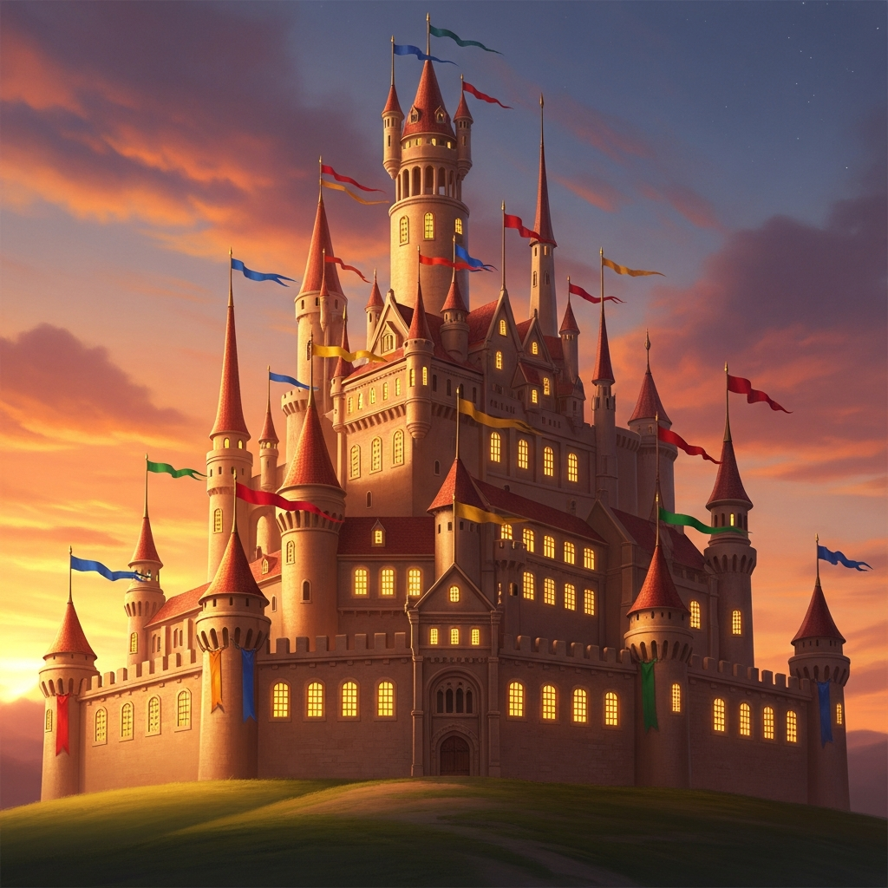

| | |
|---|---|
| **Deck** | Fluxx 4.0 |
| **Type** | Keeper 🏆 |
| **Symbol** | 🏰 |

### What It Does

The Castle + **The Crown** = "King's Castle." Also combines with **The Key** for "Key to the Castle."

Home, security, and royalty. Every person's home is their castle — and this one enables fairy tale endings.

*"A person's home is their castle."*

---

## 24. The Tree

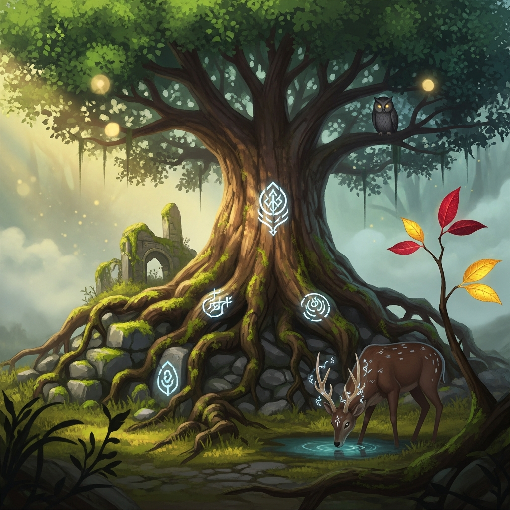

| | |
|---|---|
| **Deck** | Fluxx 4.0 |
| **Type** | Keeper 🏆 |
| **Symbol** | 🌳 |

### What It Does

The Tree appears in "Tree of Knowledge" (with Books) and nature-themed goals.

Ancient wisdom rooted in the earth. The magical tree represents growth, knowledge, and connection to nature.

*"The best time to plant a tree was 20 years ago."*

---

## 25. The Flower

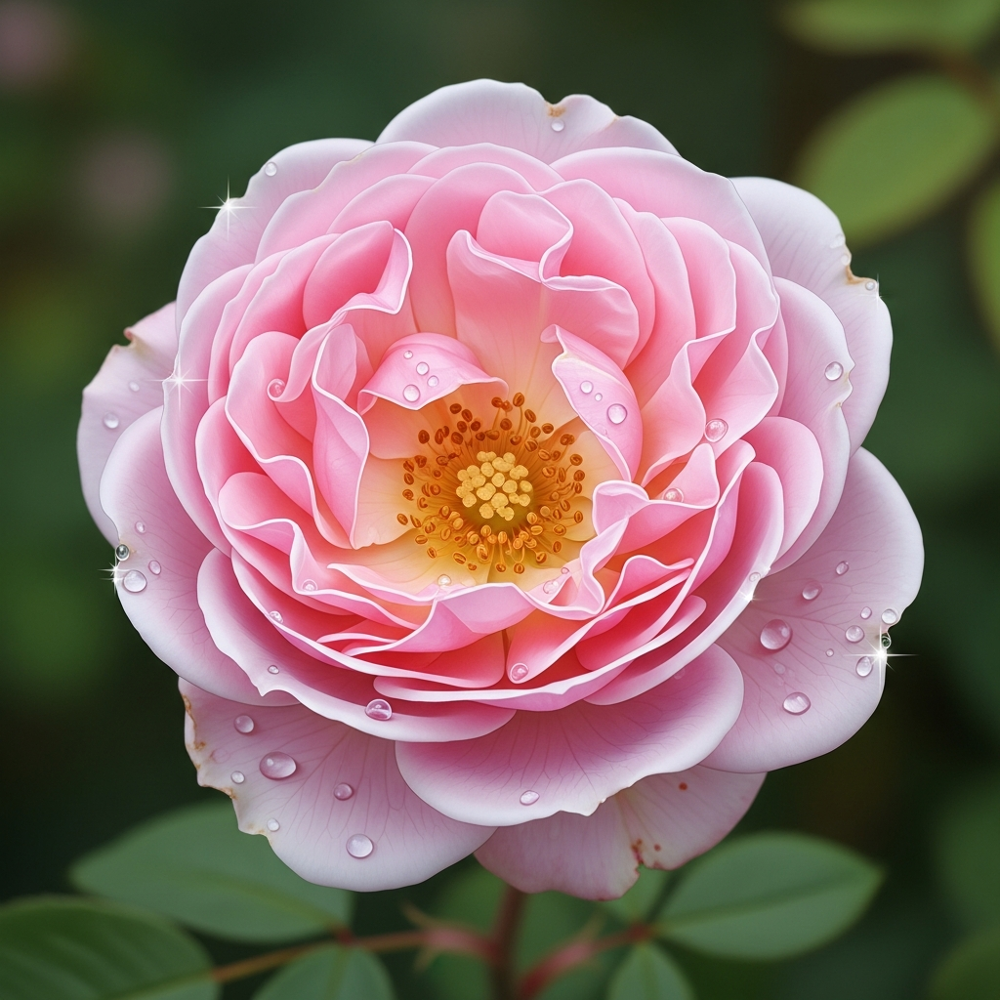

| | |
|---|---|
| **Deck** | Fluxx 4.0 |
| **Type** | Keeper 🏆 |
| **Symbol** | 🌸 |

### What It Does

The Flower + **Love** = "Flower of Love" — romantic victory.

Beauty, delicacy, and the fleeting perfection of nature. Stop and appreciate it.

*"Stop and smell the roses."*

---

## 26. The Crystal Ball

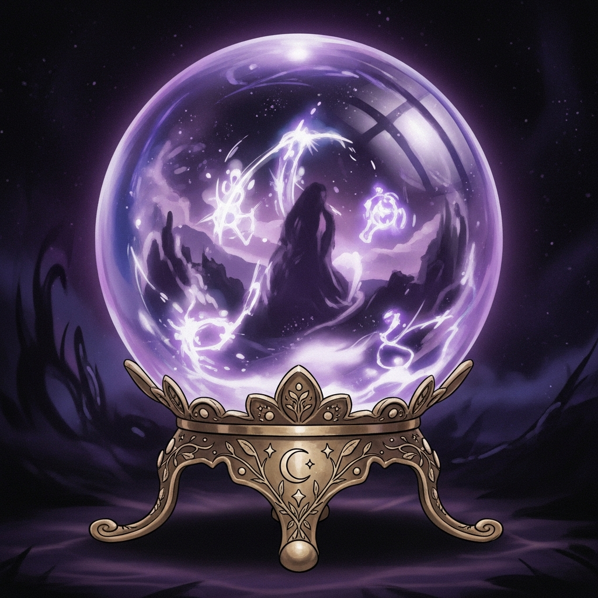

| | |
|---|---|
| **Deck** | Fluxx 4.0 |
| **Type** | Keeper 🏆 |
| **Symbol** | 🔮 |

### What It Does

The Crystal Ball appears in fortune-telling and mystical goals. Some cards let you look at other players' hands — the Crystal Ball's power made manifest.

Prophecy and mystery. The future is unclear, but this card helps you see it.

*"The future is unclear..."*

---

## 27. The Gift

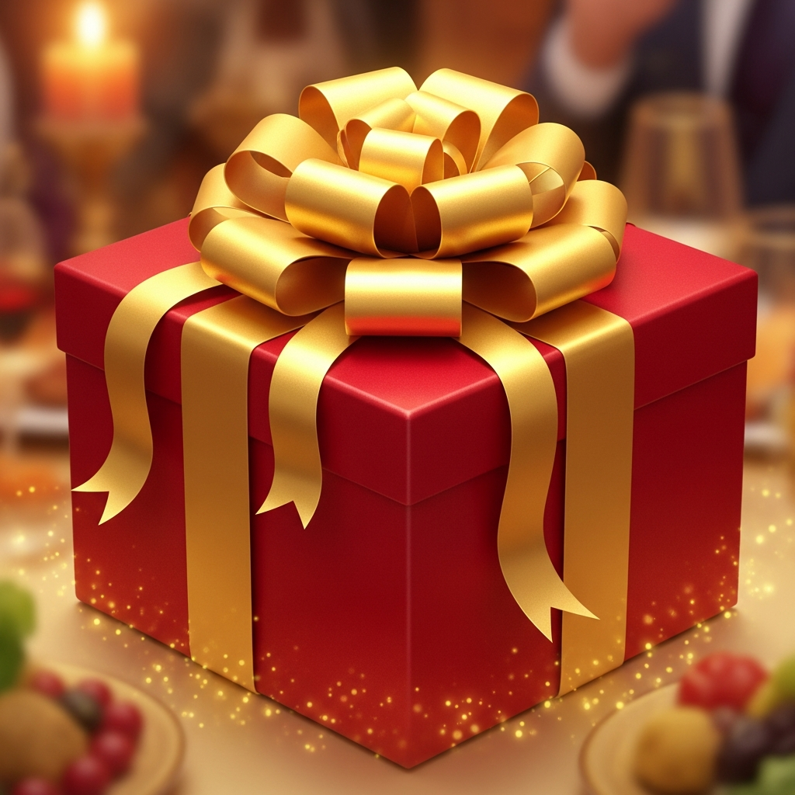

| | |
|---|---|
| **Deck** | Fluxx 4.0 |
| **Type** | Keeper 🏆 |
| **Symbol** | 🎁 |

### What It Does

The Gift + **Music** = "Gift of Music." Also appears in generosity-themed goals.

The wrapped box represents potential — what's inside doesn't matter as much as the thought.

*"It's the thought that counts."*

---

## 28. The Key

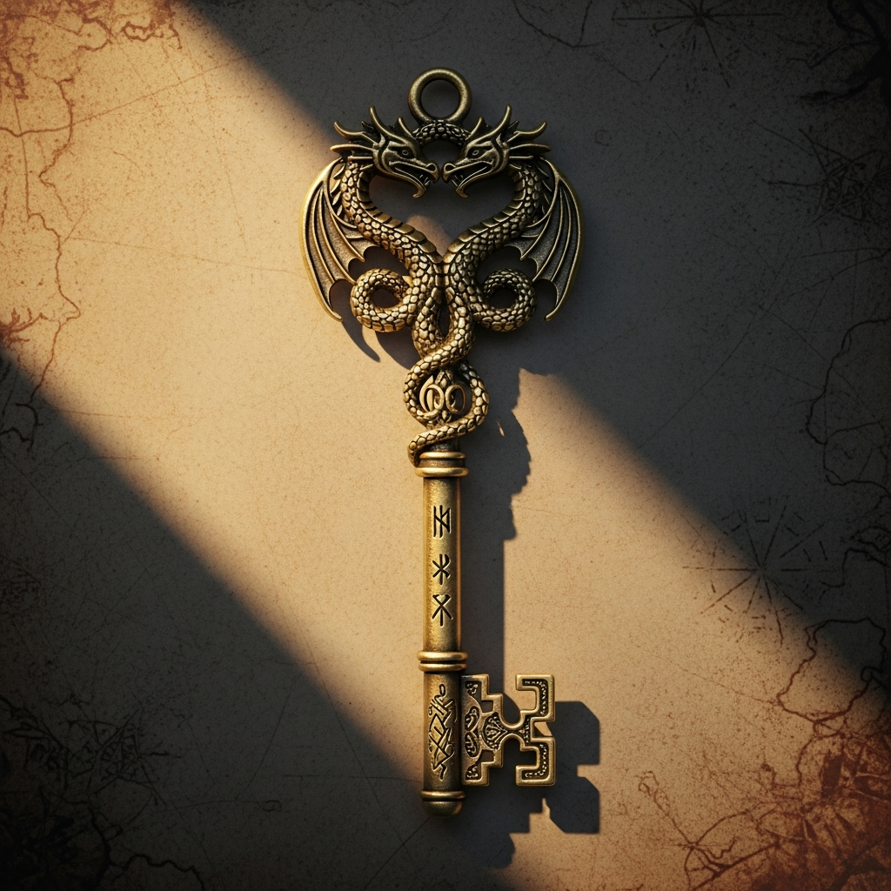

| | |
|---|---|
| **Deck** | Fluxx 4.0 |
| **Type** | Keeper 🏆 |
| **Symbol** | 🔑 |

### What It Does

The Key + **The Castle** = "Key to the Castle" — access granted.

Symbol of secrets, access, and unlocking potential. The dragon-headed key opens doors to victory.

*"Opens many doors."*

---

## 29. Books

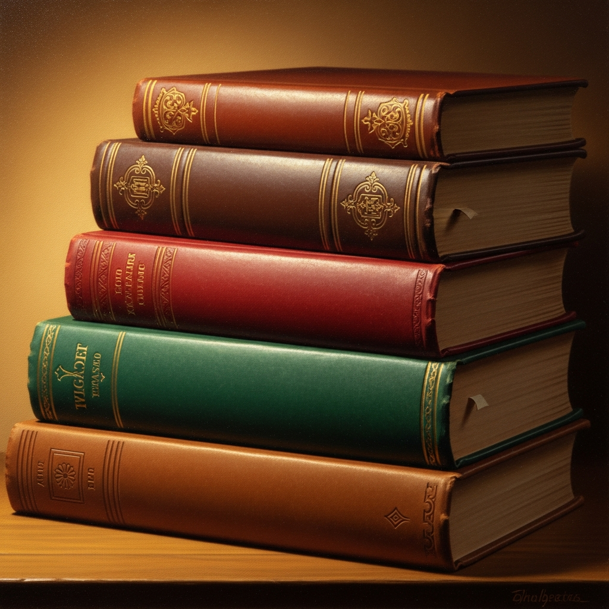

| | |
|---|---|
| **Deck** | Fluxx 4.0 |
| **Type** | Keeper 🏆 |
| **Symbol** | 📚 |

### What It Does

Books + **The Tree** = "Tree of Knowledge" — wisdom achieved.

Collected knowledge, adventure in portable form. A room without books is like a body without a soul.

*"A room without books is like a body without a soul."*

---

## 30. War

| | |
|---|---|
| **Deck** | Fluxx 4.0 |
| **Type** | Creeper 💀 |
| **Symbol** | ⚔️💀 |

### What It Does

**Creepers** are bad news. Unlike Keepers, you **don't want** Creepers. They prevent you from winning.

War has a special ability: it **attaches to Peace**. If you have Peace and draw War, War corrupts it. You can't win with the "Peace and Bread" goal while War is attached to your Peace.

The only way to win with War is if the current Goal specifically requires it (like "War Equals Death").

*"War is a Creeper. It attaches to Peace and destroys it."*

---

## 31. Death

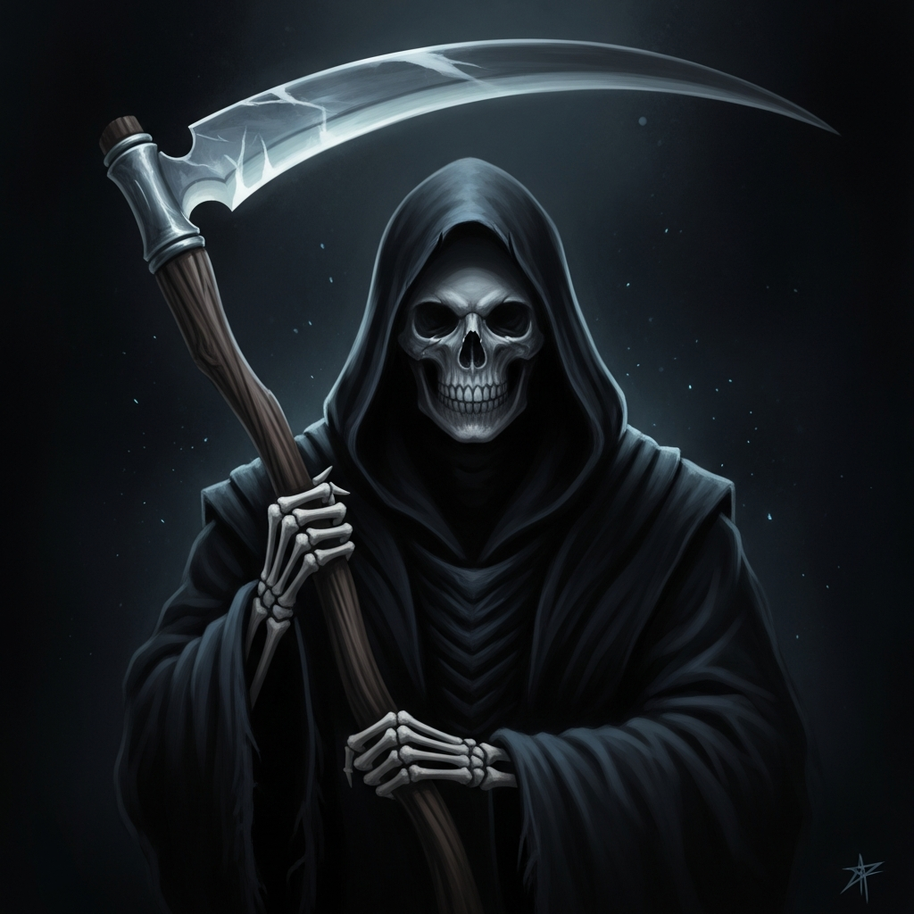

| | |
|---|---|
| **Deck** | Fluxx 4.0 |
| **Type** | Creeper 💀 |
| **Symbol** | 💀 |

### What It Does

Death is the ultimate Creeper. It **prevents victory** and has the power to **destroy Keepers**.

When Death is in front of you, you cannot win (unless the Goal requires Death). Some cards let Death destroy other players' Keepers — the Grim Reaper takes what it wants.

The only "good" news: some Goals like "War Equals Death" specifically need Creepers to win.

*"Death comes for us all."*

---

## Understanding The Game

### How Fluxx Works

Fluxx is a card game where the rules constantly change. You start with:
- **Draw 1, Play 1** — draw one card, play one card

But "New Rule" cards change everything:
- Draw 5? Play All? Hand Limit 0? 
- The rules shift constantly

### Winning

To win, you need to match the current **Goal**. Goals require specific combinations of Keepers:
- "Milk and Cookies" = Milk + Cookies
- "Rocket to the Moon" = Rocket + Moon
- "Peace and Bread" = Peace + Bread

But there's always only one Goal at a time — and anyone can change it.

### The Chaos

This is why Fluxx is chaos:
- You might be one card away from winning
- Someone plays a new Goal
- Now you need completely different Keepers
- And you just drew a Creeper

Welcome to Fluxx. Welcome to chaos.

---

*[← Back to README](README.md)*
