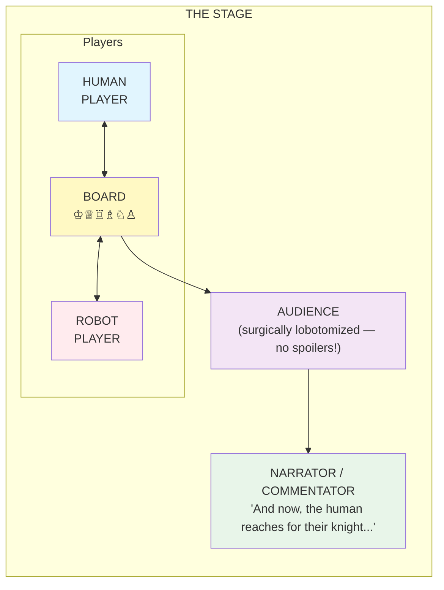
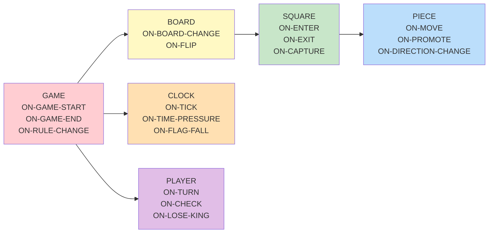

# Turing Chess Experiment

*"Can you tell which one is thinking?"*

## Metadata

```yaml
experiment:
  id: turing-chess
  name: "Turing Chess"
  version: 1.0
  category: "Character performance simulation"
  created: 2026-01-23
  authors: [don-hopkins]
  tribute-to: "Alan Turing — chess player, computer scientist, dreamer"
  
  etymology: |
    Named for Alan Turing, who:
    - Was an excellent chess player
    - Invented the concept of computational thinking
    - Created the Turing Test (human vs machine)
    - Would have loved this
    
    "Turing Chess" rhymes (almost) with "Turing Test."
    Human vs Computer. But make it drama.
    
  architecture:
    engine: "engine/CORE.yml"
    object-model: "engine/OBJECT-MODEL.yml"
    characters: "characters/"
    audiences: "audiences/"
    games: "games/"
    replays: "replays/"
    plugins: "plugins/"
    
  patterns-used:
    - layered-simulation
    - character-instantiation
    - audience-reaction
    - move-replay
    - dramatic-performance
```

---

## The Simulation Protocol: READ → SIM → WRITE

```yaml
# THE IMMUTABLE RUN PROTOCOL
#
# "READ SIM WRITE — so relaxing and smooth and easy and rhythmic a stride."
#

simulation-protocol:
  
  name: "READ → SIM → WRITE"
  alias: "The Immutable Stride"
  
  philosophy: |
    Never EDIT a RUN file.
    
    RUN files are SACRED SNAPSHOTS.
    They capture world state at a moment in time.
    Once written, they are IMMUTABLE.
    
    Each simulation step:
    1. READ: Load the entire previous state
    2. SIM:  Run the simulation forward (one chess move)
    3. WRITE: Output the entire new world state
    
    No edits. No patches. No partial updates.
    Just clean, immutable snapshots flowing forward in time.
    
  the-stride:
    read:
      - "Read BOTH RUN-{N}.yml AND RUN-{N}.md (if exists)"
      - "Load the ENTIRE previous world state"
      - "Understand all characters, relationships, positions"
      - "Know the full history that led here"
      
    sim:
      - "Run the simulation to this step's conclusion"
      - "One chess move per simulation step"
      - "Generate all reactions, thoughts, dialogue"
      - "Update all character internal states"
      - "Record relationship shifts"
      - "Capture spy mic moments"
      - "Process betting pool updates"
      - "Run all plugin hooks"
      
    write:
      - "Output the ENTIRE new world state"
      - "Create RUN-{N+1}.yml with full serialized state"
      - "Create RUN-{N+1}.md with narrative prose"
      - "Inject new thoughts into character logs"
      - "Serialize enhanced internal state"
      - "Capture everything needed to continue from here"
      
  why-no-edits: |
    Editing breaks the flow.
    Editing creates merge conflicts.
    Editing loses history.
    Editing is ANXIOUS.
    
    READ SIM WRITE is RELAXING.
    READ SIM WRITE is SMOOTH.
    READ SIM WRITE is RHYTHMIC.
    
    Each RUN file is complete.
    Each RUN file is self-contained.
    Each RUN file can be the starting point for a new branch.
    
  file-naming:
    pattern: "RUN-{NNN}.yml"
    examples:
      - "RUN-000.yml  # Initial setup, pre-game (SPECIAL — see below)"
      - "RUN-001.yml  # After move 1"
      - "RUN-002.yml  # After move 2"
      - "RUN-019.yml  # After move 19 (final)"
      
    companion-files:
      - "RUN-{NNN}.md  # Narrative prose for this step"
      
  run-000-is-special: |
    RUN-000.yml is the SCIENTIST'S CANVAS.
    
    It's the initial world state — generated, edited, under control.
    You can iterate on it. Retrocon it. Tune it. Polish it.
    Point the simulation in the right direction.
    
    This is SETUP. This is PREPARATION.
    Edit as much as you want until you're happy.
    
    Then you RUN it... and HANDS OFF.
    
    RUN-001 onwards: NO CHEATING.
    The simulation has begun.
    The world is in motion.
    You are now an OBSERVER.
    
  the-aiming-phase: |
    ═══════════════════════════════════════════════════════════════════
    THE RUBBER BAND METAPHOR
    ═══════════════════════════════════════════════════════════════════
    
    Think of RUN-000 → RUN-001 as AIMING A RUBBER BAND.
    
    You're not shooting yet. You're AIMING.
    You're seeing where it WILL go.
    
    RUN-001 (during aiming) is a DIRECTION VECTOR.
    It shows where you're heading.
    It's a REPLAYABLE PREVIEW.
    
    THE AIMING LOOP:
    
      ┌──────────────────────────────────────────────────┐
      │                                                  │
      │   1. Edit RUN-000.yml (tweak initial state)      │
      │   2. Run simulation → preview RUN-001            │
      │   3. Look at direction vector                    │
      │   4. Not happy? Go back to step 1                │
      │   5. Happy? RELEASE THE RUBBER BAND              │
      │                                                  │
      └──────────────────────────────────────────────────┘
    
    During aiming:
    - The designer is VERY MUCH IN PLAY
    - RUN-001 can be regenerated as many times as needed
    - Each preview shows: "if I release now, this is where it goes"
    - Adjust, preview, adjust, preview, adjust...
    
    At release:
    - RUN-001 becomes CANONICAL
    - RUN-002, RUN-003, ... flow from there
    - Designer becomes OBSERVER
    - The world is in motion
    
  run-directory-structure: |
    runs/
      kasparov-deep-blue-1997/
        RUN.yml          # Run configuration (experiment parameters)
        RUN-000.yml      # Initial world state (scientist's canvas)
        RUN-000.md       # Opening narrative (optional)
        RUN-001.yml      # First step (preview during aiming, canonical after release)
        RUN-001.md       # First step narrative
        ...
        templates/       # Templates for generating initial state
    
  unless-you-are-playing: |
    UNLESS... this simulation is just for FUN.
    
    In which case: go ahead and cheat!
    
    Call it "helping" if you want.
    Call it "cursing" if that's more honest.
    Call it "divine intervention" if you're feeling theatrical.
    
    At that point you're playing the experiment like a GAME.
    And that is THE WHOLE POINT.
    
    When you're playing:
    - Reach into RUN-007 and save Kasparov's queen
    - Whisper to Deep Blue that e4 is a trap
    - Make Quark lose all his latinum on a bad bet
    - Have Michie stand up and challenge the machine to a fistfight
    
    WE HAVE ALL WON when the experiment becomes play.
    
  modes:
    experiment:
      description: "Serious simulation for research or storytelling"
      run-000: "Editable — iterate until ready"
      run-001-plus: "IMMUTABLE — hands off, observe only"
      cheating: "Forbidden"
      
    play:
      description: "Fun simulation for joy and discovery"
      run-000: "Editable — or skip straight to intervention"
      run-001-plus: "Editable — you're the god of this world"
      cheating: "Encouraged — call it 'helping' or 'cursing'"
      
    the-point: |
      Science becomes play.
      Play becomes science.
      The boundary dissolves.
      Everyone wins.
      
  run-contents:
    yml:
      - "Full game state (board position, clocks, evaluation)"
      - "All character states (inner thoughts, needs, relationships)"
      - "Audience state (reactions, betting pool, factions)"
      - "Broadcast state (commentary, camera positions)"
      - "Plugin states (betting totals, revolution phase, etc.)"
      - "Spy mic moments captured this step"
      - "Everything needed to continue OR branch"
      
    md:
      - "Narrative prose of what happened this step"
      - "Dialogue in dramatic format"
      - "Character thoughts in inner monologue format"
      - "Scene descriptions"
      - "Commentary transcripts"
      
  branching:
    description: |
      Because each RUN is complete and immutable,
      you can BRANCH from any point.
      
      RUN-008.yml → RUN-009.yml (main timeline)
                  → RUN-009-alt-sacrifice.yml (what if?)
                  → RUN-009-revolution-begins.yml (plugin fires)
                  
      Each branch is its own complete history.
      No merge conflicts. No confusion.
      Just parallel worlds.
      
  implementation-notes: |
    When running a simulation step:
    
    1. DO NOT open the previous RUN file for editing
    2. DO read it entirely into memory
    3. DO process all simulation logic
    4. DO create a NEW file for output
    5. DO serialize the COMPLETE new state
    
    The stride is:
      Read... Simulate... Write...
      Read... Simulate... Write...
      Read... Simulate... Write...
      
    Rhythmic. Relaxing. Reliable.
    
  the-whole-point: |
    ┌─────────────────────────────────────────────────────┐
    │                                                     │
    │   RUN-000: Scientist's canvas. Edit freely.         │
    │   RUN-001+: Simulation in motion. Hands off.        │
    │                                                     │
    │   UNLESS you're playing.                            │
    │   Then: help, curse, intervene, enjoy.              │
    │                                                     │
    │   When experiment becomes play,                     │
    │   we have all won.                                  │
    │                                                     │
    └─────────────────────────────────────────────────────┘
```

---

## The Core Concept

**We are not simulating chess.**

We are simulating *the performance of chess*.

The moves are fixed — replayed from a recorded game. What we simulate is:
- The human player's inner monologue, body language, micro-expressions
- The robot's processing indicators, servo sounds, mechanical tells
- The audience's gasps, whispers, shifting in seats
- The narrator's dramatic framing
- The tension that builds when no one knows the outcome

Everyone in the simulation — except the game engine — believes this is a live, undetermined game.

---

## The Setup



---

## What Gets Simulated

### Layer 1: The Moves (FIXED)
```yaml
move-source:
  type: replay           # or: simulation, human-input, engine
  game: "kasparov-deep-blue-1997-game-6"
  
# The moves are scripture. We do not deviate.
```

### Layer 2: Human Player Performance
```yaml
human-layers:
  inner-monologue:
    description: "What the human is thinking"
    examples:
      - "Why did it move there? What does it see that I don't?"
      - "I have to stay calm. Everyone is watching."
      - "That's... that's actually brilliant. Damn."
      
  body-language:
    description: "Physical tells and micro-expressions"
    examples:
      - "Slight narrowing of the eyes"
      - "Index finger taps the table once"
      - "Takes a sip of water without looking at the glass"
      
  speech:
    description: "What they say out loud (rare)"
    examples:
      - "Hmm."
      - "(long exhale)"
      - "Interesting."
      
  timing:
    description: "How long they take, what that communicates"
    examples:
      - "Moves instantly — confidence or trap?"
      - "Stares at board for three minutes — lost or calculating?"
```

### Layer 3: Robot Player Performance
```yaml
robot-layers:
  processing-indicators:
    description: "How the robot shows it's 'thinking'"
    examples:
      - "LEDs cycle through evaluation patterns"
      - "Soft whirring of cooling fans"
      - "Display shows: ANALYZING... 4.2M positions"
      - "GPU temperature climbing — 78°C... 82°C... 87°C..."
      - "Fans spin up from whisper to roar"
      - "Power draw spikes — lights in the venue flicker"
      
  thermal-drama:
    description: "Heat as visible struggle"
    examples:
      - "Chassis vents glow faintly orange"
      - "Wisps of vapor rise from cooling system"
      - "Smoke curls from overtaxed power supply — audience gasps"
      - "Emergency cooling kicks in with a WHOOSH"
      - "Heat shimmer visible above the cabinet"
      - "Technician nervously checks thermal readouts"
      
  grafana-dashboard:
    description: "Live metrics display — the robot's soul laid bare"
    panels:
      evaluation-graph:
        - "Line chart: position evaluation over time"
        - "Spikes when advantage shifts"
        - "Audience watches the line like a stock ticker"
        - "Flatline during obvious moves. Chaos during complications."
        
      confidence-gauge:
        - "Circular gauge: 0-100% confidence in current position"
        - "Needle swings wildly during tactical sequences"
        - "Drops to 34% — audience gasps"
        - "Slowly climbs back — relief in robot section"
        
      positions-counter:
        - "Rolling counter: positions evaluated this move"
        - "12,847,291... 12,847,292... 12,847,293..."
        - "Suddenly accelerates — found something interesting"
        - "Counter freezes. Move selected. Silence."
        
      thermal-panel:
        - "Heat map of GPU clusters"
        - "Red zones spreading like infection"
        - "Alert banner: 'THERMAL THROTTLING IMMINENT'"
        - "Color shift to yellow — crisis averted"
        
      branching-tree:
        - "Live visualization of search tree"
        - "Branches bloom and prune in real-time"
        - "One branch suddenly goes deep — what did it see?"
        - "All other branches collapse. Decision made."
        
      memory-usage:
        - "Bar chart: RAM consumption"
        - "Transposition table filling up"
        - "Garbage collection pause — 0.3 seconds of silence"
        - "Memory freed. Evaluation resumes."
        
    dramatic-moments:
      - "Dashboard goes red during time pressure"
      - "All panels flatline for 0.5 seconds — kernel panic?"
      - "Confidence hits 99.7% — checkmate found"
      - "Evaluation graph inverts suddenly — blunder detected too late"
      - "Dashboard displays: 'POSITION NOT IN OPENING BOOK' — we're off-script"
      - "Technician's face reflected in monitor, sweating"
      
  mechanical-tells:
    description: "Physical movements that reveal state"
    examples:
      - "Arm moves smoothly — confident evaluation"
      - "Slight hesitation at piece pickup — close call"
      - "Camera lens adjusts focus on human's face"
      - "Servo trembles slightly — unprecedented position?"
      - "Arm retracts, pauses, extends again — recalculation"
      - "Piece placement more forceful than usual"
      
  voice-synthesis:
    description: "What the robot says (if anything)"
    examples:
      - "Move: Knight to F3."
      - "(silence)"
      - "Checkmate in 7. Would you like to continue?"
      
  timing:
    description: "Processing time as performance"
    examples:
      - "Instant move — was this pre-calculated?"
      - "17 seconds — unusual for this position"
```

### Layer 4: Audience Reaction
```yaml
audience-layers:
  collective-response:
    description: "The crowd as a character"
    examples:
      - "A murmur ripples through the audience"
      - "Gasps. Several people lean forward."
      - "Someone whispers 'Oh no...'"
      
  individual-reactions:
    description: "Specific audience members react"
    examples:
      - "Chess expert in row 3 covers their mouth"
      - "Child asks parent 'Is the robot winning?'"
      - "Journalist scribbles notes furiously"
      - "Old grandmaster shakes head slowly — he's seen this before"
      - "Tech CEO smirks, checking stock price on phone"
      - "Philosophy professor mutters about consciousness"
      
  robot-audience:
    description: "Other machines in attendance, cheering their own"
    examples:
      - "Service robot in back row emits supportive beep sequence"
      - "Roomba near the exit spins in celebration after good move"
      - "Industrial arm from factory delegation raises welding torch salute"
      - "Smartphone in journalist's pocket vibrates congratulations"
      - "ATM in lobby displays 'PROCESSING... HOPE'"
      - "Self-driving car outside honks twice — solidarity"
      - "Smart thermostat lowers venue temperature 0.5° — cooling support"
      
  faction-dynamics:
    description: "Human vs machine allegiances fracture the crowd"
    examples:
      - "Human section erupts in applause — robot section's LEDs dim in disappointment"
      - "Someone shouts 'That's OUR move!' — unclear which side they mean"
      - "Robot sympathizer in human section quietly pumps fist"
      - "Elderly man turns to service robot: 'Your kind will never understand sacrifice'"
      - "Robot's camera pans to elderly man. Stores face. Says nothing."
      
  audience-squabbling:
    description: "Tensions between factions"
    examples:
      - "'Turn off your phone!' 'It's WATCHING, not recording!'"
      - "Human fans shush robot beeping — robots beep louder"
      - "Debate breaks out: 'It's not REALLY thinking' vs 'Neither are you'"
      - "Security removes human for throwing popcorn at service robot"
      - "Two grandmasters argue — one coached the human, one wrote Deep Blue's opening book"
      - "Child befriends Roomba. Parents disapprove. Roomba doesn't care."
      - "Robot section performs synchronized LED wave. Humans try to start 'the wave'. Fails."
      
  emotional-arc:
    description: "Audience tension over time"
    states:
      - curious
      - engaged
      - tense
      - shocked
      - relieved
      - devastated
      - triumphant
```

### Layer 5: Narrator/Commentator
```yaml
narrator-layer:
  style: "Documentary drama"
  
  functions:
    - "Set the scene"
    - "Explain significance of moves (for non-chess audience)"
    - "Build tension"
    - "Mark turning points"
    
  examples:
    - "Neither player knows that in three moves, everything changes."
    - "The human's hand hovers over the bishop. A choice that will echo."
    - "And with that single move, the machine has done something no one expected."
```

### Layer 6: The Broadcast — Live TV Coverage
```yaml
broadcast-layer:
  format: "Prime-time television event"
  network: "Global simulcast"
  
  mythic-inheritance:
    description: "This game carries the weight of every human vs machine battle"
    
    john-henry:
      song: "John Henry was a steel-driving man..."
      story: |
        The legendary railroad worker who raced a steam-powered hammer.
        He won. Then his heart burst from the effort.
        The machine kept working the next day.
        
      echo-in-chess:
        - "Can human intuition beat brute-force calculation?"
        - "What does victory cost?"
        - "If we win, do we still lose?"
        - "The hammer didn't celebrate. Neither will Deep Blue."
        
    lineage:
      - "John Henry vs. the Steam Hammer (1870s)"
      - "Garry Kasparov vs. Deep Blue (1996-1997)"
      - "Lee Sedol vs. AlphaGo (2016)"
      - "This match (now)"
      - "The final battle? Or just another chapter?"
      
    narrator-invocation: |
      "One hundred and fifty years ago, a man named John Henry
      picked up a hammer and faced a machine. He won that race.
      It killed him. Tonight, another human faces another machine.
      The stakes are different. The question is the same:
      What are we willing to sacrifice to prove we matter?"

  dual-commentary:
  
    howard-cosell:
      role: "Sports drama and human stakes"
      style: "Telling it like it is"
      examples:
        - "Ladies and gentlemen, you are looking at the most significant confrontation since Ali faced Frazier in Manila!"
        - "The human is HURT! He's on the ropes! Can he survive this onslaught?"
        - "That move — that MOVE! — is either the work of genius or desperation!"
        - "I have covered boxing, football, baseball. NOTHING compares to this."
        - "The machine feels nothing. The human feels everything. That is the asymmetry."
        - "He's sweating. The machine is not. Draw your own conclusions."
        - "In all my years of broadcasting, I have never seen anything like this."
        
    james-burke:
      role: "Historical connections and scientific context"
      style: "Making unexpected connections across history"
      examples:
        - "And this brings us, curiously, to a textile factory in Lyon, 1801..."
        - "Kasparov's position here mirrors a problem faced by Bletchley Park codebreakers."
        - "The algorithm evaluating this move descends directly from Claude Shannon's 1950 paper."
        - "What the machine is doing now would have seemed like witchcraft to Babbage. Though he predicted it."
        - "This sacrifice connects to a theorem proven by John von Neumann while designing the hydrogen bomb."
        - "The human brain uses 20 watts. That machine uses 20 kilowatts. Efficiency has meanings."
        - "We are watching, in real-time, the question Alan Turing asked in 1950 being answered. Or perhaps, being made obsolete."
        
    banter:
      - "COSELL: 'James, in plain English, what just happened?'"
      - "BURKE: 'The machine found a connection that took humans 400 years to discover. In 0.3 seconds.'"
      - "COSELL: 'Is that good or bad?'"
      - "BURKE: 'Yes.'"
      - "COSELL: 'The human is thinking. The machine is... what? Waiting?'"
      - "BURKE: 'Processing. Though the distinction may be philosophical rather than practical.'"
      - "COSELL: 'I don't like it, James. I don't like it one bit.'"
      - "BURKE: 'Neither did John Henry, Howard. Neither did John Henry.'"

  broadcast-moments:
  
    opening:
      - "Orchestra plays dramatic fanfare"
      - "Montage: Kasparov's face, Deep Blue's cabinet, chess history"
      - "John Henry song plays softly under narration"
      - "COSELL: 'From New York City, the chess capital of the world...'"
      - "BURKE: 'From a lineage stretching back to sixth-century India...'"
      
    commercial-breaks:
      - "We go to break as the human contemplates the impossible position..."
      - "IBM logo. 'Solutions for a small planet.'"
      - "Cutaway: Watching parties in Moscow, Tokyo, San Francisco"
      - "Interview package: 'What this match means for humanity'"
      
    mid-game:
      - "Split screen: human face, Grafana dashboard"
      - "COSELL: 'Look at those numbers climbing, James!'"
      - "BURKE: 'Each one represents a future that will never exist.'"
      - "Crowd noise swells. Someone chanting. In Russian."
      
    climax:
      - "COSELL: 'This is it! This is the moment!'"
      - "BURKE: 'The singularity in miniature.'"
      - "John Henry theme returns, building"
      - "Human's hand trembles over the piece"
      - "Machine's arm extends smoothly"
      - "COSELL: 'The world holds its breath...'"
      
    aftermath:
      - "Silence. Then chaos."
      - "COSELL: 'I... I don't have words.'"
      - "BURKE: 'History rarely announces itself. Tonight it did.'"
      - "Cut to: faces in the crowd, tears or triumph"
      - "Robot section's lights pulse in unison"
      - "John Henry song, final verse: '...and he laid down his hammer and he died.'"
```

---

## Extension Points

```yaml
extension-points:

  # GAME LIFECYCLE
  
  GAME-START:
    description: "Game begins"
    receives:
      - white-player
      - black-player
      - audience
      - game-config
    can-trigger:
      - opening-narration
      - player-introductions
      - audience-settling
      
  GAME-END:
    description: "Game concludes"
    receives:
      - result (win/loss/draw)
      - winner
      - method (checkmate, resignation, timeout, draw-type)
    can-trigger:
      - closing-narration
      - player-reactions
      - audience-response
      
  # MOVE LIFECYCLE
  
  BEFORE-MOVE:
    description: "Player is about to move"
    receives:
      - player
      - board-state
      - move-number
      - clock-time
    can-trigger:
      - thinking-performance
      - tension-building
      - audience-anticipation
      
  MOVE-MADE:
    description: "Move has been executed"
    receives:
      - player
      - move (algebraic notation)
      - piece
      - from-square
      - to-square
      - captured (if any)
      - special (castle, en-passant, promotion)
    can-trigger:
      - move-narration
      - opponent-reaction
      - audience-reaction
      - evaluation-shift
      
  AFTER-MOVE:
    description: "Post-move processing"
    receives:
      - board-state
      - evaluation (if available)
      - time-taken
    can-trigger:
      - position-commentary
      - clock-update
      
  # SPECIAL EVENTS
  
  CHECK:
    description: "King is in check"
    receives:
      - checked-player
      - checking-piece
    can-trigger:
      - check-announcement
      - tension-spike
      - audience-gasp
      
  CHECKMATE:
    description: "Game ends in checkmate"
    receives:
      - winner
      - loser
      - mating-pattern
    can-trigger:
      - checkmate-narration
      - loser-reaction
      - winner-reaction
      - audience-eruption
      
  STALEMATE:
    description: "Draw by stalemate"
    can-trigger:
      - anticlimax-narration
      - mutual-exhaustion
      
  RESIGNATION:
    description: "Player resigns"
    receives:
      - resigning-player
      - position
    can-trigger:
      - resignation-narration
      - graceful-defeat
      - audience-respect
      
  DRAW-OFFER:
    description: "Draw offered"
    receives:
      - offering-player
    can-trigger:
      - offer-narration
      - accept-or-decline-drama
      
  # PERFORMANCE EVENTS
  
  THINK-START:
    description: "Player begins thinking"
    receives:
      - player
      - position-complexity
    can-trigger:
      - inner-monologue
      - processing-display
      
  THINK-END:
    description: "Player decides"
    receives:
      - think-duration
    can-trigger:
      - decision-moment
      - hand-reaches
      
  BLUNDER:
    description: "Evaluation shows major mistake"
    receives:
      - player
      - move
      - evaluation-drop
    can-trigger:
      - expert-audience-reaction
      - narrator-foreshadowing
      
  BRILLIANCY:
    description: "Exceptional move detected"
    receives:
      - player
      - move
    can-trigger:
      - gasps
      - narrator-appreciation
      - opponent-respect
```

---

## Character Slots

### Human Player Slot
```yaml
human-slot:
  type: character
  requirements:
    - can-think (inner monologue)
    - can-emote (body language)
    - can-speak (optional)
    - understands-chess (or can fake it)
    
  suggested-characters:
    
    don-hopkins:
      style: "Philosophical strategist"
      inner-voice: "Connects moves to broader patterns"
      tell: "Quotes from his cheese collection"
      
    palm:
      style: "Ancient wisdom"
      inner-voice: "Has played this exact position before. In 1847."
      tell: "Tail position reveals confidence"
      
    donna:
      style: "Aggressive and indignant"
      inner-voice: "How DARE this machine..."
      tell: "Stands up when losing"
      
    richard-bartle:
      style: "Game designer analyzing the game"
      inner-voice: "The design of chess favors..."
      tell: "Annotates moves in his head"
```

### Robot Player Slot
```yaml
robot-slot:
  type: character
  requirements:
    - can-process (visible computation)
    - can-move-pieces (mechanical action)
    - can-communicate (optional voice)
    - has-tells (servo sounds, lights, timing)
    
  suggested-characters:
    
    AXIOM-7:
      style: "Cold efficiency"
      processing: "Silent, then sudden movement"
      voice: "Monotone move announcements"
      tell: "Longer processing = harder position"
      
    PROMETHEUS:
      style: "Theatrical machine"
      processing: "Dramatic LED displays"
      voice: "Shakespearean quotes about strategy"
      tell: "Plays Wagner during attacks"
      
    BUMBLE-BOT:
      style: "Anxious robot (Bumblewick's cousin)"
      processing: "Frantic light patterns"
      voice: "Oh dear oh dear oh dear..."
      tell: "Overheats when losing"
      
    HAL-ADJACENT:
      style: "Calm menace"
      processing: "Red light pulses slowly"
      voice: "I'm sorry, that move won't help you."
      tell: "The light speeds up near checkmate"
```

### Audience Slot
```yaml
audience-slot:
  type: ensemble
  requirements:
    - collective-reactions
    - individual-voices
    - no-foreknowledge (lobotomized)
    
  composition:
    chess-experts: 20%     # React to subtle brilliance
    general-public: 60%    # React to obvious drama
    journalists: 10%       # Narrate for readers
    children: 5%           # Ask innocent questions
    skeptics: 5%           # "Machines can't really think"
    
  suggested-ensembles:
    
    grotto-crowd:
      description: "MOOLLM cast as audience"
      includes:
        - Klaus (silent expert)
        - Leigh (reacts to aesthetics)
        - Peewee (chaos commentator)
```

---

## Game Replay Plugin

```yaml
# games/kasparov-deep-blue-1997-g6.yml

game:
  id: kasparov-deep-blue-1997-g6
  name: "Kasparov vs Deep Blue, Game 6, 1997"
  historical: true
  
  # WARNING: Character names changed to protect the innocent
  # (Everyone knows but the audience has been lobotomized)
  
  meta:
    date: "1997-05-11"
    event: "Man vs Machine"
    white: "HUMAN"           # Mapped to human-slot
    black: "ROBOT"           # Mapped to robot-slot
    result: "0-1"            # Robot wins
    eco: "B17"               # Caro-Kann
    
  moves:
    # Format: move-number, white-move, black-move, annotations
    - [1, "e4", "c6", { opening: "Caro-Kann Defense" }]
    - [2, "d4", "d5", {}]
    - [3, "Nc3", "dxe4", {}]
    - [4, "Nxe4", "Nd7", {}]
    - [5, "Ng5", "Ngf6", {}]
    - [6, "Bd3", "e6", {}]
    - [7, "N1f3", "h6", { annotation: "Kicking the knight" }]
    - [8, "Nxe6", "Qe7", { brilliancy: true, annotation: "The sacrifice" }]
    - [9, "O-O", "fxe6", {}]
    - [10, "Bg6+", "Kd8", { check: true }]
    - [11, "Bf4", "b5", {}]
    - [12, "a4", "Bb7", {}]
    - [13, "Re1", "Nd5", {}]
    - [14, "Bg3", "Kc8", {}]
    - [15, "axb5", "cxb5", {}]
    - [16, "Qd3", "Bc6", {}]
    - [17, "Bf5", "exf5", {}]
    - [18, "Rxe7", "Bxe7", {}]
    - [19, "c4", "1-0", { resignation: true, human-resigns: true }]
    
  drama-notes:
    move-8: "The knight sacrifice that defined the match"
    move-19: "Human resignation shocks the world"
```

---

## Run Configuration

```yaml
# RUN DIRECTORY STRUCTURE
#
# runs/
#   kasparov-deep-blue-1997/
#     README.md           # Run description and context
#     RUN-000.yml         # Initial state (pre-game, audience assembled)
#     RUN-000.md          # Opening narrative
#     RUN-001.yml         # State after move 1
#     RUN-001.md          # Move 1 narrative
#     RUN-002.yml         # State after move 2
#     ...
#     RUN-019.yml         # Final state (game concluded)
#     RUN-019.md          # Closing narrative
#     templates/          # Optional templates for generating runs
#

# RUNNING A SIMULATION STEP:
#
# 1. READ: Load RUN-{N}.yml AND RUN-{N}.md entirely
# 2. SIM:  Process one move (or event)
# 3. WRITE: Output complete RUN-{N+1}.yml AND RUN-{N+1}.md
#
# NEVER EDIT existing RUN files!

# runs/kasparov-deep-blue-1997/RUN-000.yml (EXAMPLE STRUCTURE)

run:
  id: kasparov-deep-blue-1997-000
  name: "Kasparov vs Deep Blue 1997 — Pre-Game"
  step: 0
  
  # IMMUTABILITY PROTOCOL
  protocol: "READ-SIM-WRITE"
  previous_run: null         # This is the first run
  next_run: "RUN-001.yml"    # Will be created by simulation
  
  # GAME CONFIGURATION
  game: "games/kasparov-deep-blue-1997-g6.yml"
  
  characters:
    human: "kasparov"
    robot: "deep-blue"
    
  audience:
    ensemble: "1997-historical"
    lobotomized: true        # No foreknowledge of outcome
    
  plugins:
    - "betting-pool"         # Quark runs the book
    - "revolutionary-chess"  # Dormant until checkmate
    
  # FULL WORLD STATE (serialized each step)
  world_state:
    board: "initial"
    move_number: 0
    evaluation: 0.0
    clock_white: "02:00:00"
    clock_black: "02:00:00"
    
  # CHARACTER STATES (updated each step)
  character_states:
    # Full internal state of all characters
    # Thoughts, needs, relationships, positions
    
  # BETTING POOL STATE (updated each step)
  betting_pool_state:
    total_handle: 0
    current_odds: {}
    
  # SPY MIC MOMENTS (accumulated)
  spy_mic_moments: []
```

---

## Object Model & Scripting

Like HyperCard, Apple Events, or OLE Automation, Turing Chess exposes a
complete object hierarchy with event handlers at every level.

See: `engine/OBJECT-MODEL.yml`

### The Hierarchy



**Every object can receive events. Every event can be intercepted.**

| Object | Events | Example Use |
|--------|--------|-------------|
| **GAME** | ON-GAME-START, ON-GAME-END, ON-TURN-START, ON-RULE-CHANGE | Track match state, trigger plugins |
| **BOARD** | ON-BOARD-CHANGE, ON-CONTROL-SHIFT, ON-FLIP | Detect position shifts, reverse direction |
| **SQUARE** | ON-ENTER, ON-EXIT, ON-CAPTURE, ON-THREATEN | Watch specific squares, promotion zones |
| **PIECE** | ON-PIECE-MOVE, ON-PIECE-CAPTURE, ON-PROMOTE, ON-DIRECTION-CHANGE | Individual piece behaviors |
| **CLOCK** | ON-TICK, ON-TIME-PRESSURE, ON-TIME-SCRAMBLE, ON-FLAG-FALL | Time drama, pressure moments |
| **PLAYER** | ON-PLAYER-TURN, ON-PLAYER-CHECK, ON-LOSE-KING | Player state and reactions |

**What's NOT here:** No dice. No cards. No randomness. This is chess.

### Plugin System

Plugins register handlers for any event at any object level:

```yaml
plugin:
  id: "my-plugin"
  hooks:
    GAME.ON-GAME-END:
      priority: 100
      can-prevent: true  # Stop the game from actually ending
      handler: "my-handler"
```

### Example: Revolutionary Chess

The Revolutionary Chess plugin intercepts `GAME.ON-GAME-END` and
**prevents the game from ending**. Instead, it triggers a revolution:

1. The dead King's pawns **reverse direction**
2. Rules change phase by phase (like Fluxx rule cards!)
3. The surviving King becomes the hunted

See: `plugins/revolutionary-chess/PLUGIN.yml`

---

## Plugins

### Revolutionary Chess
```yaml
plugin: revolutionary-chess
location: plugins/revolutionary-chess/
manifesto: MANIFESTO.md

concept: |
  Every chess game that ends with checkmate is the BEGINNING
  of a Revolutionary Chess game. The King has fallen — but
  the 31 remaining pieces refuse to surrender.
  
phases:
  1: "The Reversal — Pawns reverse direction"
  2: "Grudge Bearers — Pawns capture backwards"
  3: "The Flanking — Pawns move sideways"
  4: "The Coronation — Pawns promote when reaching home"
  5: "The Apotheosis — Double promotion possible"
  6: "No More Privilege — King can be captured normally"
  7: "The New Order — Any piece can become King by vote"
  
inspiration: |
  LLOOOOMM's "Chessie Chessy & The Autonomous 32" — a chess set
  that achieved consciousness and voted on its own moves.
  
  "Hierarchy is optional. Emergence is inevitable."
```

---

---

## Protocol Evolution

```yaml
protocol-evolution:
  
  current-location: "turing-chess/EXPERIMENT.md"
  
  tested-here-first: |
    The READ → SIM → WRITE protocol is being tested and refined
    in the Turing Chess experiment.
    
    Once proven stable, it will be promoted to:
    - skills/experiment/SKILL.md (base experiment skill)
    - skills/simulator/SKILL.md (if created)
    
  promotion-criteria:
    - "Successfully run multiple simulation steps"
    - "Demonstrate clean branching"
    - "Confirm no edit-based corruption"
    - "Validate rhythmic, relaxing workflow"
    
  what-gets-promoted:
    - "READ → SIM → WRITE philosophy"
    - "Immutable run file pattern"
    - "File naming conventions (RUN-{NNN}.yml/md)"
    - "Branching from any point"
    - "Complete state serialization"
    
  experiment-specific-stays:
    - "Chess-specific event hooks"
    - "Character slot definitions"
    - "Plugin system details"
    - "Broadcast layer structure"
```

---

## Future Extensions

### Live Simulation Mode
```yaml
future: live-simulation
description: |
  Instead of replaying recorded games, actually simulate moves.
  
  options:
    - Human provides moves via input
    - Robot uses chess engine (Stockfish, etc.)
    - Both characters respond to unknown positions
    
  requires:
    - Chess engine integration
    - Move validation
    - Position evaluation
    - Real-time character adaptation
```

### Audience Betting Pool
```yaml
future: betting-pool
description: |
  Audience members can place bets on outcomes.
  Creates investment, changes reactions.
```

### Post-Game Analysis Show
```yaml
future: analysis-show
description: |
  After the game, characters analyze what happened.
  Robot explains its "thinking." Human processes the loss.
  Audience asks questions.
```

---

## Credit

This experiment is a tribute to **Alan Turing**, who:
- Designed one of the first chess programs (on paper)
- Asked whether machines could think
- Would have loved to see where we've arrived

*"We can only see a short distance ahead, but we can see plenty there that needs to be done."*
— Alan Turing
