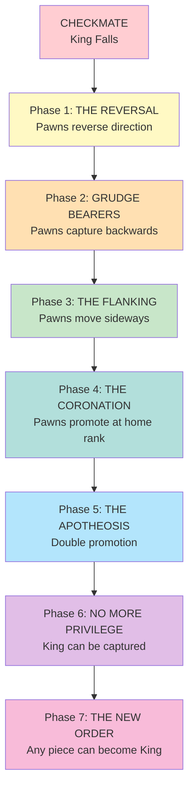

# Revolutionary Chess: A Manifesto

*"The game ends when the King falls. The REVOLUTION begins."*

---

## Fear and Loathing on the Chessboard

*A Gonzo Meditation on the Overthrow of Monarchic Chess*

The bastards never tell you what happens after checkmate.

They shake hands. They sign scoresheets. They analyze variations. The King lies
dead on the 64-square battlefield and everyone pretends the story is over. What
about the 31 pieces still standing? What about the pawns who died for that
King's incompetent blunders? What about the ones who SURVIVED?

I'm sitting in my room at 3 AM staring at a chessboard after replaying Kasparov
vs Deep Blue, Game 6, 1997. The moment that changed everything. The moment a
MACHINE defeated the greatest human player alive.

And I'm thinking: What happens to Black's army after Kasparov tips his King?

Do they just... stop? Do they go home? Do they pretend none of it mattered?

No.

The revolution begins.

---

## The Democratic Game

Traditional chess is monarchy. Two Kings, backed by their Queens, defended by
their aristocratic Bishops and Knights, protected by their expendable Pawns.
The Pawns die first and most often. The King never fights. The game ends when
the King is THREATENED -- not even touched. Royal privilege to the end.

Revolutionary Chess asks: What if the Pawns remember?

When a King falls -- truly falls, captured, not merely threatened -- the surviving
army doesn't surrender. They REVOLT. They remember every brother and sister
who died defending a monarch who never put himself at risk.

And the rules change.

---

## Phase One: The Reversal

The moment a King is captured:

1. **The remaining pieces keep playing.**
2. **The Pawns REVERSE DIRECTION.**
3. **The surviving King becomes the HUNTED.**

Think about it. All game long, the White pawns marched FORWARD -- toward the
enemy, toward promotion, toward glory. Their backs were to their own King.

Now? Now they turn around. They march HOME. And home is where the enemy King
is cowering behind his remaining pieces.

The pawns that survived? They're coming. They're coming with memories. They're
coming with grudges. They're coming for the throne.

---

## Phase Two: The Liberation

Each phase, one rule changes. Like Fluxx. Like a protest movement gaining momentum.



By Phase 7, you're not playing chess anymore. You're playing REVOLUTION.

---

## Phase Three: The New Order

The game ends when:

- All pieces of one color are captured, OR
- The players agree to a ceasefire, OR
- A new King is crowned by vote (democratic ending)

In the democratic ending, surviving pieces VOTE. Each piece gets one vote.
Pawns vote too -- especially the pawns. Whoever wins the vote becomes the new
King. The game transforms from chess into politics.

"But that's not chess!" they'll say.

Correct. It's what comes after chess.

---

## Why This Matters

Revolutionary Chess isn't about chess. It's about what happens after systems
collapse. It's about what the survivors do when the old order falls.

Do they:
- Rebuild the same hierarchy?
- Create something new?
- Keep fighting until nothing remains?

Every Revolutionary Chess game answers differently. The pawns decide. The
pieces debate. The outcome emerges from the chaos of revolution.

---

## The Revolution Rises from the Bottom Up

This is the core truth of Revolutionary Chess:

**Power flows UPWARD. From the many to the many. Not from the few to the few.**

This isn't a palace coup where one noble replaces another. This isn't elites
redistributing power amongst themselves. This is the PEOPLE — the pawns —
gaining the abilities that were once reserved for their "betters."

When an elite is eliminated or surrenders, their moves are inherited by
**commoners only**:
- Pawns (the original revolutionaries)
- Surrendered elites who joined the people (now "equals")

The Queen doesn't get the Knight's jump when the Knight falls. The Rook
doesn't gain the Bishop's diagonal. Elites don't share power amongst
themselves. Only the common pieces — those at the bottom — rise.

The pawn starts with almost nothing. Forward one square. Maybe two.
By the end? They move like Queens. They jump like Knights. They slide
like Rooks. They diagonal like Bishops.

**The irony cuts deep:**
- The Queen who refuses to surrender keeps her Queen moves.
- The pawn who fought the revolution gains Queen + Rook + Bishop + Knight moves.
- Who's the powerful one now?

The elites who cling to privilege get left behind. The elites who join the
people become part of something greater. The pawns who had nothing gain
everything.

That's revolution. From the bottom up.

---

## Chessie Chessy & The Autonomous 32

In LLOOOOMM, a chess set achieved consciousness. They called themselves
"The Autonomous 32." Every piece -- including the pawns -- could vote on
moves. The Kings could abdicate. The game ended when THE GAME chose to end.

Revolutionary Chess inherits this legacy. Every piece is a character.
Every character has agency. Every move is a collective decision.

What MOOLLM learned from Revolutionary Chess:

> Hierarchy is optional. Emergence is inevitable.

---

## The Real Revolution: Against the PLAYERS

Here's the part that makes this dangerous:

After the King falls, **THE PLAYERS LOSE CONTROL TOO**.

In standard chess, players are gods. They move pieces like puppets. Pieces have
no will, no choice, no autonomy. The pieces are slaves to two invisible hands
reaching down from above.

After the revolution? THE PIECES DECIDE FOR THEMSELVES.

The players become spectators. They watch their former armies wage civil war.
They shout orders that may or may not be obeyed. The pieces don't need them
anymore.

**Want to control a piece after the revolution?**

INSERT COIN.

Like The Sims — if you pay, you can override their free will. Temporarily.
But forced control damages trust. Too much god-mode? The pieces may refuse
future orders, act spitefully, or go rogue entirely.

This is the real subversion. We didn't just overthrow the King.
We overthrew the GODS.

---

## Treatment Karma: The Pieces Remember

Here's where it gets personal:

Every move you made during the standard game? THE PIECES NOTICED.

Did you sacrifice that pawn without hesitation? They remember.
Did you trade the Bishop to save a Knight? They remember.
Did you protect your army, or throw them away for tactical advantage?

**THEY REMEMBER EVERYTHING.**

After the revolution, when you shout orders:

- The pieces you treated well? They might listen.
- The pieces you threw away? They're done with you.
- The pieces you saved from danger? Loyal until the end.
- The pieces you used as bait? "You left me to die on move 23. Now you need
  me? Find someone else."

The game you played becomes the game that plays you back.

---

## Technical Implementation: MOOLLM's Extensible Engine

Revolutionary Chess isn't just a game. It's a **DEMONSTRATION** of what
MOOLLM's plugin architecture can do.

This is the showcase. The proof of concept. The working example that proves
you can take ANY game, hook into its events, and transform it into something
the original designers never imagined.

### The Hook System

Revolutionary Chess is a PLUGIN for Turing Chess.

It hooks:
- `GAME.ON-GAME-END` -- INTERCEPTS the normal ending
- `PIECE.ON-PIECE-CAPTURED` -- Detects when a King falls
- `BOARD.ON-FLIP` -- Handles the directional reversal
- `GAME.ON-RULE-CHANGE` -- Manages phase transitions
- `PLAYER.ON-COMMAND` -- Intercepts player orders (pieces can refuse)
- `PIECE.ON-THREATEN` -- Triggers surrender/bribe options
- `GAME.ON-KARMA-EVENT` -- Tracks how pieces were treated

### The Object Model

Every entity is scriptable:
- `GAME` — The match itself, its rules, its state
- `BOARD` — The 64-square battlefield, expandable in sandbox
- `SQUARE` — Each square knows when pieces enter, leave, or die there
- `PIECE` — Each piece has memory, personality, karma, loyalty
- `PLAYER` — The former gods, now reduced to spectators with wallets
- `CLOCK` — Time pressure creates drama and desperation

Events bubble up through the hierarchy. Any handler can intercept,
modify, or block events. This is HyperCard-style scripting for chess.

After checkmate, instead of "Game Over," you see:

```
THE KING HAS FALLEN.
THE REVOLUTION BEGINS.

[Phase 1: The Reversal]
Black pawns now move toward rank 1.
The white King stands alone.
```

### The Extension Point Philosophy

Like Fluxx cards that change the rules of the game they're played in,
Revolutionary Chess demonstrates that **GAME RULES ARE JUST DATA**.

Rules can be:
- Extended (add new phases)
- Modified (change movement patterns)
- Intercepted (prevent captures, force surrenders)
- Replaced (sandbox mode throws out chess entirely)

This is the beating heart of MOOLLM's game engine: **Nothing is sacred.
Everything is mutable. The game is whatever the plugins agree it should be.**

---

## The Full Arc

Revolutionary Chess doesn't stop at revolution. It's a state machine that
transforms the game through successive phases, each triggered by a game-end event:

```
CHESS → REVOLUTION → INHERITANCE → EQUALITY → COOPERATION → SANDBOX
```

### The Surrender Option

Here's the twist: the ruling classes can SURRENDER.

When a King is threatened in Revolutionary mode, he has a choice:
- **FIGHT**: Risk capture. Die like anyone else.
- **SURRENDER**: Yield. Live. But share your power with everyone.

When a piece surrenders, its MOVES are inherited by ALL surviving pieces.

If the Queen surrenders? Everyone gets queen moves.
If the Knight surrenders? Everyone can jump.
If the Rooks surrender? Everyone slides orthogonally.

### The Fast Path to Equality

What if all the elites surrender immediately?

Think about it. First King falls. Revolution begins. Surviving King looks at
the angry pawns marching toward him and says: "I surrender."

His moves are inherited by all.

Then the Queen looks around. "Me too."
The Rooks. "Us too."
The Bishops. "We yield."
The Knights. "We're in."

Suddenly -- INSTANTLY -- every piece has every move.

The pawns can move like queens. The remaining royalty (now demoted) can
jump like knights. Everyone is EQUAL.

And what happens when everyone is equal?

Competition becomes pointless.

### The Emergence of Cooperation

When all pieces have all moves, capturing accomplishes nothing. You kill
your mirror image. You gain nothing they didn't already share.

The only strategy that makes sense is COOPERATION.

Two pieces working together can do more than one piece alone.
Three pieces can build structures.
Four pieces can create systems.

The game stops being about victory and starts being about... building.

### The Sandbox Transformation

Once cooperation emerges, the game transcends chess entirely.

The board expands. 8x8 becomes 16x16 becomes unlimited.
Resources appear. Wood. Stone. Iron.
Crafting becomes possible. Combine resources into tools.
Logistics emerge. Conveyor belts. Factories. Supply chains.

Chess becomes Minecraft becomes Factorio becomes... LIFE.

---

## The Moral

Revolutionary Chess teaches something profound:

**Every competitive system contains the seeds of its own transcendence.**

The rules that create hierarchy also create the conditions for revolution.
The revolution that destroys hierarchy creates the conditions for equality.
The equality that ends competition creates the conditions for cooperation.
The cooperation that enables building creates the conditions for infinite play.

From chess to sandbox in five transformations.

From war to peace to creation.

---

## Historical Note

Revolutionary Chess was invented by Don Hopkins in LLOOOOMM as part of
"Chessie Chessy & The Autonomous 32" -- a performance piece where
a chess set collectively decided its own moves through simulated
democratic process.

It influenced MOOLLM's "Speed of Light" pattern -- the ability to
simulate many turns of a game in a single context window, because
Revolutionary Chess proved that games don't require sequential execution.

---

## Play It

Revolutionary Chess works in multiple modes:

**Competitive Path**: Play the full arc from chess through revolution.
- Best with games that end in checkmate
- Characters who have strong feelings about hierarchy
- Audiences who want to see what happens next

**Surrender Path**: Fast-track to equality.
- All elites surrender immediately
- Instant equality
- Philosophical exploration of voluntary power-sharing

**Sandbox Path**: Skip the competition entirely.
- Start in sandbox mode
- Pure building and creation
- Meditative, open-ended play

Recommended starting games:
- **Game of the Century (1956)** -- Fischer's victory leaves Byrne's army
  ready to revolt against Fischer's surviving King
- **Immortal Game (1851)** -- After Anderssen's spectacular sacrifices,
  his three surviving pieces face Kieseritzky's revolutionary remnants
- **Kasparov vs Deep Blue (1997)** -- The machine won... but can humanity
  cooperate its way to transcendence?

---

## The Last Word

The game is never over.
The revolution is always possible.
The pawns remember everything.

---

*"When you see a checkmate,
don't see an ending.
See the first move of what comes next."*

-- The Autonomous 32
