# 🏙️ Micropolis

> **Status: DESIGNING**
>
> *"The filesystem is the city. Git is the multiverse."*

**This is NOT a "killer app." It is a NURTURING ENVIRONMENT.**

---

## MicropolisHub: The Vision

**MicropolisHub** is the complete vision:


| Component | Role |
|-----------|------|
| **Micropolis** | The simulation engine (C++/WebAssembly) |
| **MOOLLM** | AI character orchestration — tutors debate and advise |
| **mooco** | SvelteKit multiplayer orchestrator |
| **GitHub-as-MMORPG** | GitHub features as game mechanics — the ultimate web stack |

**The key insight:** Humans and AI characters interact through *both* GitHub (issues, PRs, comments) *and* the web app. Schools own their repos. Every branch is an alternate timeline.

> "We want to give creative people an environment in which to plant their
> seeds, a fertile ground, instead of a Killer App."
>
> — Don Hopkins, WWDC 1995

---

## The Lineage

A **Method of Loci** thread runs through this entire lineage — spatial thinking as cognitive infrastructure, including cities, homes, memory palaces, adventure maps, virtual worlds, network diagrams, or code reviews.

```mermaid
flowchart TB
    subgraph origins["🎮 Origins"]
        SC[/"SimCity (1989)
        Will Wright
        City as sandbox — no win state"/]
    end
    
    subgraph don_early["🔧 Don Hopkins: Early Ports"]
        HL["HyperLook SimCity (1991)
        HyperCard + NeWS + PostScript
        Axis of eval: client ⟺ server"]
        SCN["SimCityNet (1993)
        X11/TCL/Tk multiplayer
        INTERCHI '93, Amsterdam"]
    end
    
    subgraph nurturing["🌱 Nurturing Environments"]
        DS["DreamScape (1995)
        Kaleida ScriptX
        'Nurturing environment, not killer app'
        Rooms + Objects + Web — Method of Loci"]
        SIMS["The Sims (2000)
        Will Wright
        'Digital dollhouse'
        House as memory palace"]
    end
    
    subgraph olpc["📚 OLPC Era"]
        MP["Micropolis (2008)
        Open Source for OLPC
        Constructionism: Papert + Kay + Wright
        'Learning by building'"]
    end
    
    subgraph loci["🧠 Method of Loci Projects"]
        IL["iLoci (2009)
        iPhone spatial map editor
        Memory palaces, kissing links"]
        MG["MediaGraph (2010)
        Stupid Fun Club
        Pie menu navigable graph of media"]
        BK["Bar Karma → Storymaker → Urban Safari
        Branching narrative as spatial graph
        Multi-user → geo storytelling"]
    end
    
    subgraph web_stack["🌐 Web Stack Evolution"]
        CPP["C++ Engine + SWIG
        Python/TurboGears backend
        AMF/Flash + OpenLaszlo web client"]
        CORE["MicropolisCore Reboot
        Fresh C++ → Emscripten/Embind
        WebAssembly: browser, Node.js, Electron"]
        SVELTE["SvelteKit Frontend
        Svelte 5 runes
        Canvas/WebGL/WebGPU"]
    end
    
    subgraph platform["🎓 The Platform"]
        MOOCO["mooco Orchestrator
        Multiplayer sessions
        AI coordination"]
        GH["GitHub-as-MMORPG
        Issues, PRs, branches, forks
        School-owned repos"]
        MOOLLM["MOOLLM AI Tutors
        Characters advise, debate, explain
        Constructionist education"]
    end
    
    SC --> HL
    HL --> SCN
    SCN --> DS
    DS --> SIMS
    SIMS --> MP
    MP --> IL
    IL --> MG
    MG --> BK
    BK --> CPP
    CPP --> CORE
    CORE --> SVELTE
    SVELTE --> MOOCO
    MOOCO --> GH
    GH --> MOOLLM
```



---

## The Pioneers


---

## Quick Summary

| Aspect | Description |
|--------|-------------|
| **What** | Micropolis + MOOLLM + GitHub = Constructionist education |
| **How** | All game state in files under git. Branches are timelines. AI tutors are characters. |
| **Why** | Schools own their repos. Students learn by building. |
| **Heritage** | DreamScape (1995) — ScriptX rooms + objects + web integration |
| **Status** | Designing — architecture defined, implementation pending |

---

## The Vision

1. **Nurturing Environment** — Fertile ground for creative seeds, not a killer app
2. **Filesystem = City** — All game state lives in git-controlled files
3. **Git = Multiverse** — Branches are alternate timelines, PRs merge histories
4. **AI = Tutors** — MOOLLM characters advise, debate, explain
5. **GitHub = Classroom** — Issues are discussions, PRs are decisions
6. **Schools = Owners** — Each school forks and controls their instance
7. **Users and Agents on Common Ground** — You and AI interact in same environment

---

## The DreamScape Heritage

This vision traces to **DreamScape** (1995), built on Kaleida ScriptX:

| Principle | Description |
|-----------|-------------|
| **Nurturing Environment** | Not a killer app — fertile ground for creative seeds |
| **Constructive Experience** | Open ended tools, rules, resources — unexpected behaviors |
| **Dynamic Extensibility** | Author new rooms and parts, plug together at runtime |
| **Users and Agents on Common Ground** | You and AI interact in same environment |

See: [WWDC 1995 DreamScape Demo](https://donhopkins.medium.com/1995-apple-world-wide-developers-conference-kaleida-labs-scriptx-demo-64271dd65570)

---

## Architecture

```mermaid
flowchart TB
    subgraph core["🔧 Simulation Core"]
        CPP["C++ Engine
        micropolis.cpp
        simulate.cpp, zone.cpp
        traffic.cpp, power.cpp"]
        WASM["WebAssembly
        Emscripten + Embind
        Runs everywhere"]
    end
    
    subgraph frontend["🖥️ Frontend"]
        SVELTE["SvelteKit
        Svelte 5 runes
        $state, $derived, $effect"]
        RENDER["Renderers
        Canvas / WebGL / WebGPU
        Pie menus, tab windows"]
    end
    
    subgraph backend["☁️ Backend"]
        NODE["Node.js
        Server-side simulation
        Headless batch runs"]
        MOOCO["mooco Orchestrator
        Multiplayer sessions
        AI coordination"]
    end
    
    subgraph ai["🤖 AI Layer"]
        MOOLLM["MOOLLM
        Character-based tutors
        Debate, advise, explain"]
        GH["GitHub Integration
        Issues = dialogue
        PRs = decisions"]
    end
    
    CPP --> WASM
    WASM --> SVELTE
    WASM --> NODE
    SVELTE --> RENDER
    NODE --> MOOCO
    MOOCO --> MOOLLM
    MOOLLM --> GH
```



---

## Sister Script CLI

Existing: `MicropolisCore/micropolis/scripts/micropolis.js`

```bash
micropolis info city.cty        # Metadata
micropolis analyze city.cty     # Analysis
micropolis visualize city.cty   # ASCII map
micropolis export city.cty      # Export data
```

Planned:

```bash
micropolis decompose city.cty   # → git-friendly directory
micropolis compose city/        # → .cty file
micropolis simulate city.cty    # Headless batch
micropolis report city.cty      # AI-readable analysis
```

---

## Git Multiverse


Every city exists in a **multiverse of branching timelines**:
- Git branches ARE alternate histories
- PRs ARE timeline merges  
- Forks ARE parallel universes

---

## AI Tutors

```mermaid
flowchart LR
    subgraph tutors["🎓 AI Tutor Characters"]
        MA["Mayor's Advisor
        Pragmatic, patient
        General guidance"]
        UP["Urban Planner
        Idealistic, systems-oriented
        Zoning, infrastructure"]
        EC["Economist
        Numbers-focused, cautious
        Budget, taxes"]
        EN["Environmentalist
        Passionate, long-term
        Pollution, green energy"]
        HI["Historian
        Storyteller
        Real-world parallels"]
        DE["Debugger
        Analytical
        Explain failures"]
    end
    
    MA <--> UP
    UP <--> EC
    EC <--> EN
    EN <--> HI
    HI <--> DE
```



These are MOOLLM characters who **debate each other** and advise students.

---

## School-Owned Repos

```mermaid
flowchart TB
    subgraph central["🏛️ Central"]
        CURR["micropolis-edu/curriculum
        Core simulation + CLI
        Base AI tutors
        Starter scenarios
        Lesson templates"]
    end
    
    subgraph schools["🏫 Schools"]
        SA["school-a/micropolis
        Local scenarios
        Custom lessons
        Class discussions"]
        SB["school-b/micropolis
        Different focus
        Different community"]
    end
    
    subgraph students["👩‍🎓 Students"]
        ALICE["student/alice
        Individual cities
        Experiment timelines
        Portfolio"]
        BOB["student/bob
        Different approach
        Different questions"]
    end
    
    CURR -->|fork| SA
    CURR -->|fork| SB
    SA -->|branch| ALICE
    SA -->|branch| BOB
```



**Benefits:** Ownership, privacy, safety, customization, fundraising.

---

## Files

| File | Purpose |
|------|---------|
| `GLANCE.yml` | Quick overview |
| `CARD.yml` | Full sniffable interface |
| `SKILL.md` | Complete specification |
| `README.md` | This file |
| `artifacts/` | Organized links to MicropolisCore docs |

---

## Artifacts (Organized References)

The `artifacts/` directory contains YAML indices pointing to rich documentation in MicropolisCore:

| File | Contents |
|------|----------|
| `plans.yml` | Planning docs: PLAN.txt, MultiPlayerIdeas.txt, OLPC-notes.txt — including unfulfilled dreams (Logo turtles, Robot Odyssey agents, visual programming) |
| `history.yml` | Version timeline: NeWS/HyperLook → X11 → SimCityNet → OLPC → TurboGears/OpenLaszlo → WebAssembly/SvelteKit |
| `education.yml` | Constructionist philosophy, courseware ideas, newspaper metaphor, political roleplay |
| `people.yml` | Contributors (Will Wright, Don Hopkins), researchers (Chaim Gingold, Stone Librande, Brett Victor), pioneers (Piaget, Papert, Kay) |
| `technical.yml` | File formats, engine source, CLI tool, Chaim's diagrams, tilesets |

---

## Related Resources

### The Codebase

**[MicropolisCore on GitHub](https://github.com/SimHacker/MicropolisCore)**
The main repository containing the C++ simulation engine, WebAssembly build, SvelteKit frontend,
and all documentation. This is where the actual code lives. If you want to run Micropolis,
contribute code, or understand the architecture, start here.

**mooco Orchestrator** *(github.com/SimHacker/mooco — currently private, in development)*
The multiplayer session orchestrator that coordinates AI agents and human players.
Micropolis uses mooco to manage multi-user sessions, AI tutor coordination, and
real-time state synchronization across distributed players.

### Technical Documentation (in MicropolisCore)

**[micropolis.js CLI Tool](https://github.com/SimHacker/MicropolisCore/blob/main/micropolis/scripts/micropolis.js)**
The existing JavaScript command-line tool for working with save files. This is the foundation
for the sister-script pattern — it can read, analyze, visualize, and export .cty files.
The planned enhancements (decompose/compose, batch simulation) build on this.

**[City Save Files Format](https://github.com/SimHacker/MicropolisCore/blob/main/Cursor/city-save-files.md)**
Comprehensive 550+ line reference documenting the binary .cty format: history data, map data,
metadata locations, endianness. Essential reading if you want to understand how game state
is serialized and how to make it git-friendly.

**[MultiPlayerIdeas.txt](https://github.com/SimHacker/MicropolisCore/blob/main/notes/MultiPlayerIdeas.txt)**
Don Hopkins' original notes on branching timelines, alternate histories, and the "What-If?"
history tree concept. This is the source of the git-as-multiverse idea — written years before
this skill formalized the pattern.

### The Design Philosophy Heritage

**[WWDC 1995 DreamScape Demo](https://donhopkins.medium.com/1995-apple-world-wide-developers-conference-kaleida-labs-scriptx-demo-64271dd65570)**
Watch the demo that coined "nurturing environment, not killer app." This 1995 ScriptX demo
shows rooms, objects, dynamic extensibility, users-and-agents-on-common-ground — the exact
patterns Micropolis + MOOLLM implements 30 years later. Essential context for understanding
why we build this way.

**[ScriptX and the World Wide Web: Link Globally, Interact Locally](https://donhopkins.medium.com/scriptx-and-the-world-wide-web-link-globally-interact-locally-1995-38f35e32ea2f)**
The 1995 architecture document describing MacHTTP ⟺ ScriptX bridging, dynamic HTML generation,
and protocol registration. This is the ancestor of the micropolis CLI sister-script concept:
a bridge between simulation engine and external tools/AI. Read this to understand why the
CLI tool is designed the way it is.

**[ScriptX Source Code Archive](https://donhopkins.com/home/archive/scriptx/)**
The original ScriptX source code from Kaleida Labs, preserved. If you want to see how
DreamScape actually worked, the web module implementation, or the Director importer,
it's all here.

### More Documentation in MicropolisCore

**[PLAN.txt](https://github.com/SimHacker/MicropolisCore/blob/main/notes/PLAN.txt)**
Master development plan with unfulfilled dreams: Logo turtles as programmable agents,
Robot Odyssey-style visual programming, KidSim/StageCraft programming by example,
urban sprawl development-bots, luddite roomba-bots. MicropolisHub targets these!

**[OLPC-notes.txt](https://github.com/SimHacker/MicropolisCore/blob/main/notes/OLPC-notes.txt)**
Why Micropolis is perfect for constructionist education, Sugar integration, mesh
networking for multiplayer, journaling and checkpointing, view source for education.

**[Chaim Gingold's Reverse Diagrams](https://github.com/SimHacker/MicropolisCore/blob/main/micropolis/static/pdf/SimCityReverseDiagrams.pdf)**
Beautiful diagrams showing how SimCity's simulation works — main loop, map data flow,
scanning algorithms, traffic, sprites. These inspire the interactive Brett Victor-style
explorations planned for MicropolisHub.

**[OpenLaszlo Assets](https://github.com/SimHacker/MicropolisCore/tree/main/laszlo/micropolis)**
The beautiful but unfulfilled TurboGears/OpenLaszlo web multiplayer version:
1083 PNG tiles, 14 LZX source files, 3 compiled SWF files. A time capsule of
what web multiplayer Micropolis looked like in the Flash era.

### The People

**[About Pages](https://github.com/SimHacker/MicropolisCore/tree/main/micropolis/website/pages/about)**
- [Don Hopkins](https://github.com/SimHacker/MicropolisCore/blob/main/micropolis/website/pages/about/don-hopkins.md) — Complete project history
- [Will Wright](https://github.com/SimHacker/MicropolisCore/blob/main/micropolis/website/pages/about/will-wright.md) — SimCity/Sims creator
- [Chaim Gingold](https://github.com/SimHacker/MicropolisCore/blob/main/micropolis/website/pages/about/chaim-gingold.md) — Building SimCity author
- [Constructionist Education](https://github.com/SimHacker/MicropolisCore/tree/main/micropolis/website/pages/about/constructionist-education) — Piaget, Papert, Kay, Minsky

---

## Next Steps

1. Design file-based state format (decompose/compose)
2. Prototype git multiverse workflow
3. Create AI tutor character cards
4. Build enhanced sister-script CLI
5. Test with sample school scenario

---

*"The whole point of constructionist education is to question it, change it, make it your own."*
