# 🏙️ Micropolis

> **Engine: RUNNING** | **Web UI: IN PROGRESS** | **MicropolisHub: DESIGNING**
>
> *"The filesystem is the city. Git is the multiverse."*

**This is NOT a "killer app." It is a NURTURING ENVIRONMENT.**

---

## MicropolisHub: The Vision

**MicropolisHub** is the complete vision:


| Component | Role |
|-----------|------|
| **Micropolis** | The simulation engine (C++/WebAssembly) |
| **MOOLLM** | AI character orchestration — tutors debate and advise |
| **mooco** | SvelteKit multiplayer orchestrator |
| **GitHub-as-MMORPG** | GitHub features as game mechanics — the ultimate web stack |

**The key insight:** Humans and AI characters interact through *both* GitHub (issues, PRs, comments) *and* the web app. Schools own their repos. Every branch is an alternate timeline.

> "We want to give creative people an environment in which to plant their
> seeds, a fertile ground, instead of a Killer App."
>
> — Don Hopkins, WWDC 1995

---

## The Lineage

A **Method of Loci** thread runs through this entire lineage — spatial thinking as cognitive infrastructure, including cities, homes, memory palaces, adventure maps, virtual worlds, network diagrams, or code reviews.

```mermaid
flowchart TB
    subgraph origins["🎮 Origins"]
        SC[/"SimCity (1989)
        Will Wright
        City as sandbox — no win state"/]
    end
    
    subgraph don_early["🔧 Don Hopkins: Early Ports"]
        HL["HyperLook SimCity (1991)
        HyperCard + NeWS + PostScript
        Axis of eval: client ⟺ server"]
        SCN["SimCityNet (1993)
        X11/TCL/Tk multiplayer
        INTERCHI '93, Amsterdam"]
    end
    
    subgraph nurturing["🌱 Nurturing Environments"]
        DS["DreamScape (1995)
        Kaleida ScriptX
        'Nurturing environment, not killer app'
        Rooms + Objects + Web — Method of Loci"]
        SIMS["The Sims (2000)
        Will Wright
        'Digital dollhouse'
        House as memory palace"]
    end
    
    subgraph olpc["📚 OLPC Era"]
        MP["Micropolis (2008)
        Open Source for OLPC
        Constructionism: Papert + Kay + Wright
        'Learning by building'"]
    end
    
    subgraph loci["🧠 Method of Loci Projects"]
        IL["iLoci (2009)
        iPhone spatial map editor
        Memory palaces, kissing links"]
        MG["MediaGraph (2010)
        Stupid Fun Club
        Pie menu navigable graph of media"]
        BK["Bar Karma → Storymaker → Urban Safari
        Branching narrative as spatial graph
        Multi-user → geo storytelling"]
    end
    
    subgraph web_stack["🌐 Web Stack Evolution"]
        CPP["C++ Engine + SWIG
        Python/TurboGears backend
        AMF/Flash + OpenLaszlo web client"]
        CORE["MicropolisCore Reboot
        Fresh C++ → Emscripten/Embind
        WebAssembly: browser, Node.js, Electron"]
        SVELTE["SvelteKit Frontend
        Svelte 5 runes
        Canvas/WebGL/WebGPU"]
    end
    
    subgraph platform["🎓 The Platform"]
        MOOCO["mooco Orchestrator
        Multiplayer sessions
        AI coordination"]
        GH["GitHub-as-MMORPG
        Issues, PRs, branches, forks
        School-owned repos"]
        MOOLLM["MOOLLM AI Tutors
        Characters advise, debate, explain
        Constructionist education"]
    end
    
    SC --> HL
    HL --> SCN
    SCN --> DS
    DS --> SIMS
    SIMS --> MP
    MP --> IL
    IL --> MG
    MG --> BK
    BK --> CPP
    CPP --> CORE
    CORE --> SVELTE
    SVELTE --> MOOCO
    MOOCO --> GH
    GH --> MOOLLM
```



---

## The Pioneers


---

## Quick Summary

| Aspect | Description |
|--------|-------------|
| **What** | Micropolis + MOOLLM + GitHub = Constructionist education |
| **How** | All game state in files under git. Branches are timelines. AI tutors are characters. |
| **Why** | Schools own their repos. Students learn by building. |
| **Heritage** | [Logo Adventure (1984)](https://donhopkins.medium.com/logo-adventure-for-c64-terrapin-logo-b1f240ef498f), DreamScape (1995), iLoci (2009), MediaGraph (2010) — spatial thinking as cognitive infrastructure |
| **Status** | Engine running, web UI in progress, MicropolisHub designing |

---

## The Vision

1. **Nurturing Environment** — Fertile ground for creative seeds, not a killer app
2. **Filesystem = City** — All game state lives in git-controlled files
3. **Git = Multiverse** — Branches are alternate timelines, PRs merge histories
4. **AI = Tutors** — MOOLLM characters advise, debate, explain
5. **GitHub = Classroom** — Issues are discussions, PRs are decisions
6. **Schools = Owners** — Each school forks and controls their instance
7. **Users and Agents on Common Ground** — You and AI interact in same environment

---

## The DreamScape Heritage

This vision traces to **DreamScape** (1995), built on Kaleida ScriptX:

| Principle | Description |
|-----------|-------------|
| **Nurturing Environment** | Not a killer app — fertile ground for creative seeds |
| **Constructive Experience** | Open ended tools, rules, resources — unexpected behaviors |
| **Dynamic Extensibility** | Author new rooms and parts, plug together at runtime |
| **Users and Agents on Common Ground** | You and AI interact in same environment |

See: [WWDC 1995 DreamScape Demo](https://donhopkins.medium.com/1995-apple-world-wide-developers-conference-kaleida-labs-scriptx-demo-64271dd65570)

---

## Architecture

```mermaid
flowchart TB
    subgraph core["🔧 Simulation Core"]
        CPP["C++ Engine
        micropolis.cpp
        simulate.cpp, zone.cpp
        traffic.cpp, power.cpp"]
        WASM["WebAssembly
        Emscripten + Embind
        Runs everywhere"]
    end
    
    subgraph frontend["🖥️ Frontend"]
        SVELTE["SvelteKit
        Svelte 5 runes
        $state, $derived, $effect"]
        RENDER["Renderers
        Canvas / WebGL / WebGPU
        Pie menus, tab windows"]
    end
    
    subgraph backend["☁️ Backend"]
        NODE["Node.js
        Server-side simulation
        Headless batch runs"]
        MOOCO["mooco Orchestrator
        Multiplayer sessions
        AI coordination"]
    end
    
    subgraph ai["🤖 AI Layer"]
        MOOLLM["MOOLLM
        Character-based tutors
        Debate, advise, explain"]
        GH["GitHub Integration
        Issues = dialogue
        PRs = decisions"]
    end
    
    CPP --> WASM
    WASM --> SVELTE
    WASM --> NODE
    SVELTE --> RENDER
    NODE --> MOOCO
    MOOCO --> MOOLLM
    MOOLLM --> GH
```



---

## Sister Script CLI

Existing: `MicropolisCore/micropolis/scripts/micropolis.js`

```bash
micropolis info city.cty        # Metadata
micropolis analyze city.cty     # Analysis
micropolis visualize city.cty   # ASCII map
micropolis export city.cty      # Export data
```

Planned:

```bash
micropolis decompose city.cty   # → git-friendly directory
micropolis compose city/        # → .cty file
micropolis simulate city.cty    # Headless batch
micropolis report city.cty      # AI-readable analysis
```

---

## Git Multiverse


Every city exists in a **multiverse of branching timelines**:
- Git branches ARE alternate histories
- PRs ARE timeline merges  
- Forks ARE parallel universes

---

## AI Tutors

```mermaid
flowchart LR
    subgraph tutors["🎓 AI Tutor Characters"]
        MA["Mayor's Advisor
        Pragmatic, patient
        General guidance"]
        UP["Urban Planner
        Idealistic, systems-oriented
        Zoning, infrastructure"]
        EC["Economist
        Numbers-focused, cautious
        Budget, taxes"]
        EN["Environmentalist
        Passionate, long-term
        Pollution, green energy"]
        HI["Historian
        Storyteller
        Real-world parallels"]
        DE["Debugger
        Analytical
        Explain failures"]
    end
    
    MA <--> UP
    UP <--> EC
    EC <--> EN
    EN <--> HI
    HI <--> DE
```



These are MOOLLM characters who **debate each other** and advise students.

---

## School-Owned Repos

```mermaid
flowchart TB
    subgraph central["🏛️ Central"]
        CURR["micropolis-edu/curriculum
        Core simulation + CLI
        Base AI tutors
        Starter scenarios
        Lesson templates"]
    end
    
    subgraph schools["🏫 Schools"]
        SA["school-a/micropolis
        Local scenarios
        Custom lessons
        Class discussions"]
        SB["school-b/micropolis
        Different focus
        Different community"]
    end
    
    subgraph students["👩‍🎓 Students"]
        ALICE["student/alice
        Individual cities
        Experiment timelines
        Portfolio"]
        BOB["student/bob
        Different approach
        Different questions"]
    end
    
    CURR -->|fork| SA
    CURR -->|fork| SB
    SA -->|branch| ALICE
    SA -->|branch| BOB
```



**Benefits:** Ownership, privacy, safety, customization, fundraising.

---

## Files

| File | Purpose |
|------|---------|
| [`GLANCE.yml`](GLANCE.yml) | Quick overview (5-70 lines) |
| [`CARD.yml`](CARD.yml) | Full sniffable interface |
| [`SKILL.md`](SKILL.md) | Complete specification |
| [`README.md`](README.md) | This file — entry point |
| [`artifacts/`](artifacts/) | Organized links to MicropolisCore docs |

---

## Artifacts (Organized References)

The [`artifacts/`](artifacts/) directory contains YAML indices pointing to rich documentation in MicropolisCore:

| File | Contents |
|------|----------|
| [`INDEX.yml`](artifacts/INDEX.yml) | Master index with quick links to all artifacts |
| [`plans.yml`](artifacts/plans.yml) | Planning docs: PLAN.txt, MultiPlayerIdeas.txt, OLPC-notes.txt |
| [`history.yml`](artifacts/history.yml) | Version timeline + 6 YouTube demo videos |
| [`education.yml`](artifacts/education.yml) | Constructionist philosophy, courseware ideas, newspaper metaphor |
| [`people.yml`](artifacts/people.yml) | Contributors, researchers, pioneers (Wright, Papert, Kay, Robinett) |
| [`technical.yml`](artifacts/technical.yml) | File formats, engine source, CLI tool, Chaim's diagrams |
| [`unfulfilled-dreams.yml`](artifacts/unfulfilled-dreams.yml) | 1990s visions now realized by GitHub+MOOLLM |
| [`connections.yml`](artifacts/connections.yml) | Stanford Generative Agents, MOOLLM pitch, GitHub-as-MMORPG, Demoscene |

---

## Related Resources

### The Codebase

**[MicropolisCore on GitHub](https://github.com/SimHacker/MicropolisCore)**
The main repository containing the C++ simulation engine, WebAssembly build, SvelteKit frontend,
and all documentation. This is where the actual code lives. If you want to run Micropolis,
contribute code, or understand the architecture, start here.

**mooco Orchestrator** *(github.com/SimHacker/mooco — currently private, in development)*
The multiplayer session orchestrator that coordinates AI agents and human players.
Micropolis uses mooco to manage multi-user sessions, AI tutor coordination, and
real-time state synchronization across distributed players.

### Technical Documentation (in MicropolisCore)

**[micropolis.js CLI Tool](https://github.com/SimHacker/MicropolisCore/blob/main/micropolis/scripts/micropolis.js)**
The existing JavaScript command-line tool for working with save files. This is the foundation
for the sister-script pattern — it can read, analyze, visualize, and export .cty files.
The planned enhancements (decompose/compose, batch simulation) build on this.

**[City Save Files Format](https://github.com/SimHacker/MicropolisCore/blob/main/Cursor/city-save-files.md)**
Comprehensive 550+ line reference documenting the binary .cty format: history data, map data,
metadata locations, endianness. Essential reading if you want to understand how game state
is serialized and how to make it git-friendly.

**[MultiPlayerIdeas.txt](https://github.com/SimHacker/MicropolisCore/blob/main/notes/MultiPlayerIdeas.txt)**
Don Hopkins' original notes on branching timelines, alternate histories, and the "What-If?"
history tree concept. This is the source of the git-as-multiverse idea — written years before
this skill formalized the pattern.

### The Design Philosophy Heritage

**[WWDC 1995 DreamScape Demo](https://donhopkins.medium.com/1995-apple-world-wide-developers-conference-kaleida-labs-scriptx-demo-64271dd65570)**
Watch the demo that coined "nurturing environment, not killer app." This 1995 ScriptX demo
shows rooms, objects, dynamic extensibility, users-and-agents-on-common-ground — the exact
patterns Micropolis + MOOLLM implements 30 years later. Essential context for understanding
why we build this way.

**[ScriptX and the World Wide Web: Link Globally, Interact Locally](https://donhopkins.medium.com/scriptx-and-the-world-wide-web-link-globally-interact-locally-1995-38f35e32ea2f)**
The 1995 architecture document describing MacHTTP ⟺ ScriptX bridging, dynamic HTML generation,
and protocol registration. This is the ancestor of the micropolis CLI sister-script concept:
a bridge between simulation engine and external tools/AI. Read this to understand why the
CLI tool is designed the way it is.

**[ScriptX Source Code Archive](https://donhopkins.com/home/archive/scriptx/)**
The original ScriptX source code from Kaleida Labs, preserved. If you want to see how
DreamScape actually worked, the web module implementation, or the Director importer,
it's all here.

### More Documentation in MicropolisCore

**[PLAN.txt](https://github.com/SimHacker/MicropolisCore/blob/main/notes/PLAN.txt)**
Master development plan with unfulfilled dreams: Logo turtles as programmable agents,
Robot Odyssey-style visual programming, KidSim/StageCraft programming by example,
urban sprawl development-bots, luddite roomba-bots. MicropolisHub targets these!

**[OLPC-notes.txt](https://github.com/SimHacker/MicropolisCore/blob/main/notes/OLPC-notes.txt)**
Why Micropolis is perfect for constructionist education, Sugar integration, mesh
networking for multiplayer, journaling and checkpointing, view source for education.

**[Chaim Gingold's Reverse Diagrams](https://github.com/SimHacker/MicropolisCore/blob/main/micropolis/static/pdf/SimCityReverseDiagrams.pdf)**
Beautiful diagrams showing how SimCity's simulation works — main loop, map data flow,
scanning algorithms, traffic, sprites. These inspire the interactive Brett Victor-style
explorations planned for MicropolisHub.

**[OpenLaszlo Assets](https://github.com/SimHacker/MicropolisCore/tree/main/laszlo/micropolis)**
The beautiful but unfulfilled TurboGears/OpenLaszlo web multiplayer version:
1083 PNG tiles, 14 LZX source files, 3 compiled SWF files. A time capsule of
what web multiplayer Micropolis looked like in the Flash era.

### The People

**[About Pages](https://github.com/SimHacker/MicropolisCore/tree/main/micropolis/website/pages/about)**
- [Don Hopkins](https://github.com/SimHacker/MicropolisCore/blob/main/micropolis/website/pages/about/don-hopkins.md) — Complete project history
- [Will Wright](https://github.com/SimHacker/MicropolisCore/blob/main/micropolis/website/pages/about/will-wright.md) — SimCity/Sims creator
- [Chaim Gingold](https://github.com/SimHacker/MicropolisCore/blob/main/micropolis/website/pages/about/chaim-gingold.md) — Building SimCity author
- [Constructionist Education](https://github.com/SimHacker/MicropolisCore/tree/main/micropolis/website/pages/about/constructionist-education) — Piaget, Papert, Kay, Minsky

---

## Live Demos and Videos

**[micropolisweb.com](https://micropolisweb.com)** -- the C++ engine compiled to WASM via Emscripten/Embind, running in the browser with a TypeScript/WebGL tile renderer. The simulator runs, tile rendering works, Space Inventory works. User interface is in progress.

**[Micropolis Web Demo 1](https://www.youtube.com/watch?v=wlHGfNlE8Os)** -- video walkthrough of the WASM version.

**[Tile Sets, Space Inventory, Cellular Automata + Jerry Martin's Chill Resolve](https://www.youtube.com/watch?v=319i7slXcbI)** -- all classic tile sets, cellular automata rules, and the game simulator, set to original music by Jerry Martin (composer of The Sims and SimCity soundtracks).

**[Multi Player SimCityNet for X11 on Linux (1993)](https://www.youtube.com/watch?v=_fVl4dGwUrA)** -- the original multiplayer version demonstrated at INTERCHI '93 in Amsterdam.

**[Micropolis Online Web Demo](https://www.youtube.com/watch?v=8snnqQSI0GE)** -- the Python/TurboGears/Flash version with PacMan agent and Church of Pacmania zone.

---

## micropolis.js CLI Tool

The `micropolis.js` tool (1826 lines) in `MicropolisCore/micropolis/scripts/` provides command-line analysis and visualization of .cty save files:

```bash
# From MicropolisCore/micropolis/
npm run micropolis -- city info haight.cty        # Metadata, stats, zone counts
npm run micropolis -- city analyze haight.cty     # RCI balance, power, transport
npm run micropolis -- city export --format json haight.cty  # JSON export
npm run micropolis -- city dump haight.cty        # Raw hex dump
npm run micropolis -- visualize ascii haight.cty  # ASCII map
npm run micropolis -- visualize emoji haight.cty  # Emoji map
npm run micropolis -- visualize filtered --style traffic --traffic-min 50 haight.cty
```

All commands support region bounds (`--row --col --width --height`) and stdin (`-` as file). Full reference in [SKILL.md](SKILL.md#micropolis-js-cli-tool).

---

## The Micropolis Ecosystem (2026)

People keep building on Micropolis. Three independent approaches to AI + city simulation:

### Hallucinating Splines (Andrew Dunn, 2026) -- IMPLEMENTED

**[hallucinatingsplines.com](https://hallucinatingsplines.com)** | **[GitHub](https://github.com/andrewedunn/hallucinating-splines)**

Headless city simulation platform where LLM agents play mayor via REST API or MCP server. Built on [micropolisJS](https://www.graememcc.co.uk/micropolisJS/) (GPL v3). Each city runs inside a Cloudflare Durable Object. 94+ mayors, 601+ cities, 10M+ total population.

- REST API and MCP server for any AI agent
- Public city gallery with timelapse playback
- "Mayor Bungeling Anthill" -- evolutionary agent with 26 tunable parameters, running natural selection across 250+ cities
- LLM mayors: Opus 4.6 ("Compounded Wonder") vs Codex 3.6 ("Bronze Offramp") -- Opus won

### gym-city (Sam Earle, 2019) -- IMPLEMENTED

**[Paper: Fractal Neural Networks](https://arxiv.org/pdf/2002.03896)** | **[GitHub](https://github.com/smearle/gym-city)**

RL agents trained via A2C with fractal neural networks on the Micropolis C++ engine (via PyGTK). Key findings:
- Fractal weight-sharing lets agents transfer local strategies into deeper networks with larger receptive fields
- Deepest column gets 33x33 receptive field -- enough to connect power across a 32x32 map in one forward pass
- Agents discovered power-plant + residential pairing, road placement for density, zone clustering by type
- Human player can intervene during training (deleting power plants) to force re-exploration
- Even RL agents couldn't manage demand at larger scales -- spatial reasoning is hard for both RL and LLMs

Discussion with Don Hopkins: **[GitHub Issue #86](https://github.com/SimHacker/micropolis/issues/86)**

### Christopher Ehrlich (2026) -- IMPLEMENTED

Used Codex 5.3 to port the Micropolis C codebase to TypeScript in two days ("not reading any code, very little steering"). Deeply familiar with the code -- modded the OLPC version, read "Building SimCity" by Chaim Gingold.

### VitaMoo / SimObliterator -- IMPLEMENTED

**[vitamoo.space](https://vitamoo.space)** | **[GitHub](https://github.com/SimHacker/SimObliterator_Suite/tree/don-persondata-fix-and-wrapper/vitamoo)**

VitaMoo is a TypeScript library that reads, writes, and plays The Sims 1 character animation content. Part of [SimObliterator](https://github.com/DnfJeff/SimObliterator_Suite), a Python library for reading and writing The Sims 1 save files. "Spin the Sims" also reticulates splines. [Technical details](https://github.com/SimHacker/SimObliterator_Suite/blob/don-persondata-fix-and-wrapper/vitamoo/README.md).

---

## Naming: SimCity, Micropolis, and the Godzilla Story

The open source license from EA requires using **"Micropolis"** rather than "SimCity" (which is EA's trademark). The **[Micropolis Public Name License](https://github.com/SimHacker/MicropolisCore/blob/main/MicropolisPublicNameLicense.md)** allows use of the original name.

**How SimCity became Micropolis:**

Don Hopkins asked Will Wright for a name suggestion after EA's QA process for the "SimCity" trademark proved to be an ordeal. Will recommended its original working title: **Micropolis**. At the time, [Micropolis Corporation](https://en.wikipedia.org/wiki/Micropolis_Corporation) was a hard disk drive manufacturer -- Will had to change the name to SimCity because of them. They eventually changed names and went out of business, but were recently restructured as Micropolis GmbH. The owner is an old school hacker who generously granted the Public Name License. Check out his [BBS primer](https://www.micropolis.com/micropolis-bbs-primer), [robotics primer](https://www.micropolis.com/micropolis-robotics-primer), and [data storage primer](https://www.micropolis.com/micropolis-data-storage-primer).

**Why this matters -- the Godzilla/Toho story:**

Jeff Braun, CEO of Maxis, told Don Hopkins:

> "Maxis was sued by Toho. We never referred to the name Godzilla, our monster on the box cover was a T-Rex looking character, but... a few magazine reviews called the monster, Godzilla. That was all it took. Toho called it 'confusion in the marketplace'. We paid $50k for Godzilla to go away. In all honesty, Toho liked Maxis, they said $50k was the minimum they take for Godzilla infringement."

Please call the game Micropolis, not SimCity.

---

## The Open Sourcing Story

Don Hopkins tells the full story: **[Open Sourcing SimCity](https://donhopkins.medium.com/open-sourcing-simcity-58470a275446)**

It began with an email from Don to Will Wright on November 17, 2006:

> "I know this is futile, but I'm asking anyway... Is it possible for EA to release a version of SimCity classic for the 'One Laptop Per Child' project?"

Two weeks later, Will forwarded it to EA:

> "Rod, Scott, Don -- I'd really like to see this happen, it seems like a very worthwhile project at no risk to us. Please let me know what I can do to move it forward if it hits a snag." -- Will Wright, December 1, 2006

The code was released under GPL-3 in 2008.

---

## Status: What's Implemented vs Planned

### Implemented

| Component | Status |
|-----------|--------|
| C++ simulation engine (MicropolisCore) | Running, compiles to WASM |
| TypeScript/WebGL tile renderer | Running at micropolisweb.com |
| micropolis.js CLI tool | 1826 lines, dump/info/export/analyze/visualize |
| Save file format documentation | Comprehensive (city-save-files.md) |
| MOOLLM skill specification | CARD.yml + SKILL.md + README.md + artifacts/ |
| Hallucinating Splines (external) | Live platform with REST API + MCP |
| gym-city (external) | RL environment with published paper |
| VitaMoo character animation | TypeScript library at vitamoo.space |

### In Progress

| Component | Status |
|-----------|--------|
| SvelteKit user interface | Tile rendering works, UI pending |
| Space Inventory | Working |
| Cellular automata modes | Working |

### Planned (MicropolisHub)

| Component | Description |
|-----------|-------------|
| mooco orchestrator | Multiplayer sessions, AI coordination |
| GitHub-as-MMORPG integration | Issues=discussions, PRs=decisions, branches=timelines |
| AI tutor characters | Mayor's Advisor, Urban Planner, Economist, etc. |
| School-owned repos | Fork template, teacher dashboard, student view |
| decompose/compose CLI | .cty to git-friendly YAML directory and back |
| Batch simulation | Headless runs with checkpoints |
| AI command interface | Accept city edits via stdin/API |

---

## Community

### HN Discussion (Feb 2026)

Don Hopkins' posts on the Hallucinating Splines thread cover Sam Earle's RL work, MicropolisCore recommendation, the naming/trademark issue, and the GitHub-as-MMORPG vision:

- [Main post: Micropolis developer context](https://news.ycombinator.com/item?id=46886791)
- [Fractal neural networks and spatial reasoning](https://news.ycombinator.com/item?id=46886830)
- [MicropolisCore, demos, and MOOLLM plans](https://news.ycombinator.com/item?id=46886811)
- [VitaMoo and SimObliterator](https://news.ycombinator.com/item?id=46887193)
- [Naming history and Micropolis GmbH](https://news.ycombinator.com/item?id=46887318)

### Support

If you find value in this work:
- **Use it** -- fork the repo, run your own adventures
- **Extend it** -- write skills, create characters, build worlds
- **Share it** -- tell others who might benefit
- **[Patreon](https://www.patreon.com/DonHopkins)** -- support ongoing development

> *"For the past 35 years, this simulated city has been my home, school and work."* -- Don Hopkins

---

## Files

| File | Purpose |
|------|---------|
| [`GLANCE.yml`](GLANCE.yml) | Quick overview (5-70 lines) |
| [`CARD.yml`](CARD.yml) | Full sniffable interface |
| [`SKILL.md`](SKILL.md) | Complete specification |
| [`README.md`](README.md) | This file -- entry point |
| [`artifacts/`](artifacts/) | Organized links to MicropolisCore docs |

---

## Artifacts (Organized References)

The [`artifacts/`](artifacts/) directory contains YAML indices pointing to rich documentation in MicropolisCore:

| File | Contents |
|------|----------|
| [`INDEX.yml`](artifacts/INDEX.yml) | Master index with quick links to all artifacts |
| [`plans.yml`](artifacts/plans.yml) | Planning docs: PLAN.txt, MultiPlayerIdeas.txt, OLPC-notes.txt |
| [`history.yml`](artifacts/history.yml) | Version timeline + 6 YouTube demo videos |
| [`education.yml`](artifacts/education.yml) | Constructionist philosophy, courseware ideas, newspaper metaphor |
| [`people.yml`](artifacts/people.yml) | Contributors, researchers, pioneers (Wright, Papert, Kay, Robinett) |
| [`technical.yml`](artifacts/technical.yml) | File formats, engine source, CLI tool, Chaim's diagrams |
| [`unfulfilled-dreams.yml`](artifacts/unfulfilled-dreams.yml) | 1990s visions now realized by GitHub+MOOLLM |
| [`connections.yml`](artifacts/connections.yml) | Stanford Generative Agents, MOOLLM pitch, GitHub-as-MMORPG, Demoscene |

---

## Related Resources

### The Codebase

**[MicropolisCore on GitHub](https://github.com/SimHacker/MicropolisCore)** -- the main repository. C++ simulation engine, WebAssembly build, SvelteKit frontend. Start here.

**[micropolis (legacy repo)](https://github.com/SimHacker/micropolis)** -- the old repo with X11/TCL/Tk, PyGTK, TurboGears/Flash versions. Historical reference. Use MicropolisCore for new work.

**mooco Orchestrator** *(github.com/SimHacker/mooco -- currently private)*

### Key Documentation

- **[micropolis.js CLI Tool](https://github.com/SimHacker/MicropolisCore/blob/main/micropolis/scripts/micropolis.js)** -- save file analysis and visualization
- **[City Save Files Format](https://github.com/SimHacker/MicropolisCore/blob/main/Cursor/city-save-files.md)** -- binary .cty format reference
- **[Chaim Gingold's Reverse Diagrams](https://github.com/SimHacker/MicropolisCore/blob/main/micropolis/static/pdf/SimCityReverseDiagrams.pdf)** -- how the simulation works
- **[PLAN.txt](https://github.com/SimHacker/MicropolisCore/blob/main/notes/PLAN.txt)** -- unfulfilled dreams
- **[MultiPlayerIdeas.txt](https://github.com/SimHacker/MicropolisCore/blob/main/notes/MultiPlayerIdeas.txt)** -- git-as-multiverse origin

### Articles

- **[Open Sourcing SimCity](https://donhopkins.medium.com/open-sourcing-simcity-58470a275446)** -- the full story
- **[WWDC 1995 DreamScape Demo](https://donhopkins.medium.com/1995-apple-world-wide-developers-conference-kaleida-labs-scriptx-demo-64271dd65570)** -- "nurturing environment, not killer app"
- **[HAR 2009 Lightning Talk](https://donhopkins.medium.com/har-2009-lightning-talk-transcript-constructionist-educational-open-source-simcity-by-don-3a9e010bf305)** -- constructionist education vision
- **[SimCity Multiplayer & Micropolis (MOOLLM design doc)](https://github.com/SimHacker/moollm/blob/main/designs/sims/simcity-multiplayer-micropolis.md)** -- the full multiplayer history
- **[GitHub as MMORPG (MOOLLM design doc)](https://github.com/SimHacker/moollm/blob/main/designs/GITHUB-AS-MMORPG.md)** -- GitHub features as game mechanics

### The People

- **[Don Hopkins](https://github.com/SimHacker/MicropolisCore/blob/main/micropolis/website/pages/about/don-hopkins.md)** -- all ports, open source release, The Sims core team
- **[Will Wright](https://github.com/SimHacker/MicropolisCore/blob/main/micropolis/website/pages/about/will-wright.md)** -- SimCity/Sims creator
- **[Chaim Gingold](https://github.com/SimHacker/MicropolisCore/blob/main/micropolis/website/pages/about/chaim-gingold.md)** -- Building SimCity book, reverse diagrams
- **[Constructionist Education Pioneers](https://github.com/SimHacker/MicropolisCore/tree/main/micropolis/website/pages/about/constructionist-education)** -- Piaget, Papert, Kay, Minsky

---

*"The whole point of constructionist education is to question it, change it, make it your own."*
