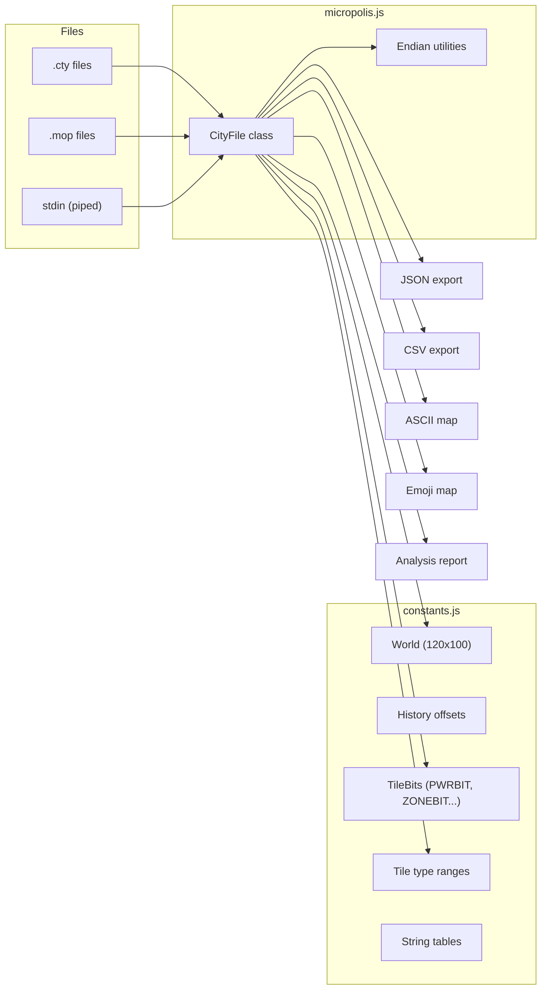
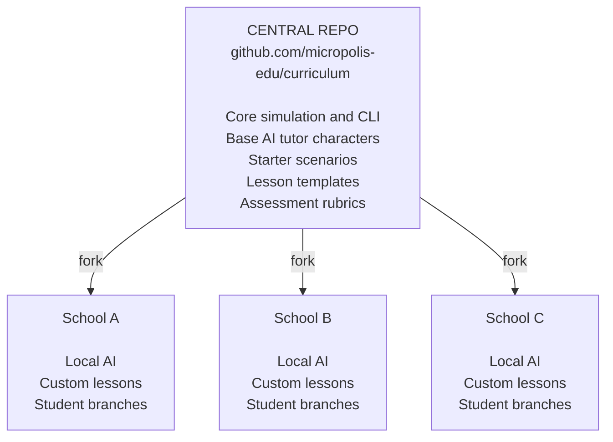

# Micropolis

> **Status: DESIGNING**
>
> *"The filesystem is the city. Git is the multiverse."*

## Soul City

**Soul City** is the complete vision — not just a simulation engine, but an integrated platform:

| Component | Role |
|-----------|------|
| **Micropolis** | The simulation engine (C++/WebAssembly) |
| **MOOLLM** | AI character orchestration — tutors debate and advise |
| **mooco** | SvelteKit multiplayer orchestrator |
| **GitHub-as-MMORPG** | GitHub features as game mechanics — the ultimate web stack |
| **Character Simulation** | MOOLLM characters with personalities, knowledge, goals |
| **Human-AI Interaction** | People interact with simulated characters via GitHub + web app |

The key insight: Humans and AI characters interact through *both* GitHub (issues, PRs, comments) *and* the web app.

---

Open source SimCity evolved into a constructionist educational platform where:
- The **filesystem is the city** — all game state lives in git-controlled files
- **Git is the multiverse** — branches are alternate timelines, PRs merge histories  
- **AI tutors are MOOLLM characters** — advisors who debate, explain, and learn alongside you
- **GitHub is the classroom** — issues are discussions, commits are decisions, forks are universes
- **Schools own their repos** — privacy, safety, customization, community fundraising

**This is NOT a "killer app." It is a NURTURING ENVIRONMENT.**

### A Note on "Nurturing Environment" vs "Killer App"

We deliberately avoid "killer app" — the Silicon Valley term for a single application
so compelling it drives platform adoption. This is intentional design philosophy with
provenance tracing to Don Hopkins' work since 1995.

| Killer App | Nurturing Environment |
|------------|----------------------|
| One thing done perfectly | Many things made possible |
| Closed, finished product | Open, extensible platform |
| Consumes users | Cultivates creators |
| Zero-sum ("kills" competitors) | Fertile ground for seeds |

This philosophy runs through: DreamScape (1995) → iLoci → MediaGraph → Micropolis → 
MOOLLM → GitHub-as-MMORPG. The continuity is intentional and foundational.

See: [WWDC 1995 DreamScape Demo](https://donhopkins.medium.com/1995-apple-world-wide-developers-conference-kaleida-labs-scriptx-demo-64271dd65570)

---

## Index

- [Soul City](#soul-city) — The complete vision
- [The Vision](#the-vision)
- [The DreamScape Heritage](#the-dreamscape-heritage)
- [The Lineage](#the-lineage)
- [Architecture](#architecture)
- [Sister Script CLI](#sister-script-cli)
- [Git Multiverse](#git-multiverse)
- [AI Tutors](#ai-tutors)
- [School-Owned Repos](#school-owned-repos)
- [Save File Format](#save-file-format)
- [Implementation Plan](#implementation-plan)

---

## The Vision

Micropolis is not just a game. It's a **microworld** — a bounded simulation that makes complex systems tangible.

> "The thing is, this is not a Killer App. It's a nurturing environment.
> We want to give creative people an environment in which to plant their
> seeds, a fertile ground, instead of a Killer App."
>
> — Don Hopkins, WWDC 1995

The goal is to transform Micropolis into a constructionist educational platform where:

1. **All game state lives in files under git control**
2. **Branches are alternate timelines**
3. **AI tutors are MOOLLM characters**
4. **Each school owns their fork**
5. **GitHub is the classroom**

### Core Thesis

```
The filesystem IS the city.
Git IS the multiverse.
Issues ARE class discussions.
PRs ARE decisions.
AI characters ARE tutors.
```

---

## The DreamScape Heritage

This vision traces directly to **DreamScape** (1995), built on Kaleida ScriptX by Don Hopkins. DreamScape was demonstrated live at the Apple Worldwide Developers Conference — without crashing (and without having to do push-ups, which was the official rule).

### DreamScape Design Philosophy

| Principle | Description |
|-----------|-------------|
| **Nurturing Environment** | Not a killer app — fertile ground for creative seeds |
| **Constructive Experience** | Open ended tools, rules, resources — unexpected behaviors |
| **Dynamic Extensibility** | Author new rooms and parts, plug together at runtime |
| **Distributed Multimedia Publishing** | Web distribution of interactive objects |
| **Transparent UI** | Content more important than control panels |
| **Direct Manipulation** | Graphical, intuitive, modeless, continuous feedback |
| **Multithreaded Animation** | Everything happening at once — gestural, not click-wait |
| **Simulation Metaphor** | Physics simulation — infinite possible states |
| **Users and Agents on Common Ground** | You and AI interact in same environment |
| **Plug-In Authoring Tools** | Dynamically loaded tools as first-class objects |

### Users and Agents on Common Ground

This principle is crucial for MOOLLM integration:

> "You can interact directly with simulated agents, because you're both part of the same environment. The butterfly can pick flowers and paint with them, as easily as you can. The painting tools respond to the gestures of whoever's holding them, human, butterfly, robot, or any cyborganic combination!"

In Micropolis + MOOLLM terms: AI tutors don't just observe and comment — they can take actions in the simulation, demonstrate techniques, and collaborate with students in the same city.

### ScriptX Web Integration (1995)

DreamScape pioneered the integration of simulation with web services:

- **MacHTTP ⟺ ScriptX bridge** — Chuck Shotton's MacHTTP as procedural content generator
- **AppleEvents pre-CGI** — Live bidirectional communication
- **"scriptx:" protocol** — URLs handled by running ScriptX
- **Dynamic HTML generation** — From ScriptX objects
- **Image maps to objects** — Click on image, event goes to actual object

This is the ancestor of the micropolis CLI sister-script concept: a bridge between the simulation engine and external tools/AI.

### References

- [WWDC 1995 DreamScape Demo](https://donhopkins.medium.com/1995-apple-world-wide-developers-conference-kaleida-labs-scriptx-demo-64271dd65570)
- [ScriptX and the World Wide Web: Link Globally, Interact Locally](https://donhopkins.medium.com/scriptx-and-the-world-wide-web-link-globally-interact-locally-1995-38f35e32ea2f)

---

## The Lineage

A Method of Loci thread runs through this entire lineage — spatial thinking as cognitive infrastructure.

- **SimCity** (1989, Will Wright)
  - City as sandbox — no win state, just play
  - Method of Loci: city as spatial memory structure

- **HyperLook SimCity** (1991, Don Hopkins, Sun/Grasshopper)
  - HyperCard meets NeWS — networking + PostScript
  - Axis of eval: client ⟺ server code mobility

- **SimCityNet** (1993, Don Hopkins, DUX Software)
  - X11/TCL/Tk multiplayer version
  - Demonstrated at INTERCHI '93, Amsterdam

- **DreamScape** (1995, Don Hopkins, Kaleida ScriptX)
  - "Nurturing environment, not killer app"
  - Rooms + Objects + Simulation + Web — Method of Loci
  - MacHTTP ⟺ ScriptX bridge (Chuck Shotton)
  - WWDC demo — didn't crash, no push-ups required

- **The Sims** (2000, Will Wright)
  - "Digital dollhouse" — nurturing environment for stories
  - Players create, not compete
  - Method of Loci: house as memory palace

- **Micropolis** (2008, Don Hopkins, Open Source)
  - Released for OLPC (One Laptop Per Child)
  - Constructionist education: Papert + Kay + Wright
  - "Learning by building" — cities as thinking tools

- **iLoci** (2009, Don Hopkins, iPhone)
  - Method of Loci — it's in the name!
  - Spatial map editor — memory palaces, kissing links
  - Won a copy of Flash for the talk at Mobile Dev Camp

- **MediaGraph** (2010, Don Hopkins, Stupid Fun Club)
  - Method of Loci: pie menu navigable graph of media
  - Unity3D music navigation — roads, pie menus, CA
  - Collaboration with Will Wright

- **Bar Karma → Storymaker → Urban Safari**
  - Method of Loci: branching narrative as spatial graph
  - Multi-user storytelling → server + apps → geo storytelling on maps

- **C++ Engine Rewrite + SWIG Bindings**
  - Python/TurboGears backend
  - AMF/Flash + OpenLaszlo multiplayer web client

- **MicropolisCore Reboot** (github.com/SimHacker/MicropolisCore)
  - Fresh start from C++ engine (not old X11/TCL/Tk repo)
  - Emscripten + Embind → WebAssembly
  - Runs in browser, Node.js server, Electron app

- **SvelteKit Frontend**
  - Svelte 5 runes for reactivity
  - Canvas/WebGL/WebGPU renderers

- **mooco Orchestrator** (github.com/SimHacker/mooco — private, in development)
  - Multiplayer session management
  - AI coordination

- **GitHub-as-MMORPG**
  - Issues, PRs, branches, forks as game mechanics
  - School-owned repos — local control, shared learning

- **MOOLLM AI Tutors + Constructionist Platform**
  - AI tutors as characters
  - GitHub as classroom
  - Constructionist education for all

### The Pioneers

| Pioneer | Contribution |
|---------|--------------|
| **Jean Piaget** | Children construct knowledge through interaction |
| **Seymour Papert** | Logo, Mindstorms — learn by building microworlds |
| **Alan Kay** | Dynabook — computers as thinking amplifiers |
| **Will Wright** | SimCity — emergent systems as toys |
| **Mark Weiser** | Ubiquitous computing — computers as invisible infrastructure |
| **Craig Hubley** | "Empower every user to play around and be an artist" |
| **Chuck Shotton** | MacHTTP — the first web server bridge |
| **Don Hopkins** | DreamScape, Micropolis — nurturing environments |

---

## Architecture

### Simulation Core (C++)

```
MicropolisEngine/
├── src/
│   ├── micropolis.h        # Main header
│   ├── micropolis.cpp      # Core simulation
│   ├── simulate.cpp        # Simulation loop
│   ├── zone.cpp            # Zone handling
│   ├── traffic.cpp         # Traffic simulation
│   ├── power.cpp           # Power grid
│   ├── disasters.cpp       # Disaster mechanics
│   ├── budget.cpp          # Budget/taxes
│   ├── fileio.cpp          # Save/load
│   ├── emscripten.cpp      # WebAssembly bindings
│   └── js_callback.h       # JavaScript interface
└── makefile
```

### Frontend (SvelteKit)

```
micropolis/
├── src/
│   ├── lib/
│   │   ├── micropolisStore.ts      # Svelte 5 runes state
│   │   ├── ReactiveMicropolisCallback.ts
│   │   ├── MicropolisView.svelte
│   │   ├── TileView.svelte
│   │   ├── PieMenu.svelte
│   │   └── *Renderer.ts            # Canvas/WebGL/WebGPU
│   └── routes/
│       ├── +page.svelte            # Main game
│       └── pages/                  # Documentation
├── scripts/
│   └── micropolis.js               # CLI tool
└── website/
    └── pages/                      # Educational content
```

### Reactive Bridge

From `README-SVELTE.md`:

```
C++ Micropolis Core (Wasm)
    ↓ calls callback
Embind JSCallback Wrapper
    ↓ delegates
ReactiveMicropolisCallback Instance
    ↓ calls updater
micropolisStore.ts
    ↓ updates
$state / $derived Runes
    ↓ triggers
Svelte 5 Runtime
    ↓ updates DOM
Svelte UI Components
```

---

## micropolis.js CLI Tool

**Location:** `MicropolisCore/micropolis/scripts/micropolis.js` (1826 lines)
**Companion:** `MicropolisCore/micropolis/scripts/constants.js` (tile definitions, world constants)
**Reference:** `MicropolisCore/Cursor/city-save-files.md` (save file format spec)

> "This utility provides command-line tools for working with SimCity/Micropolis save files. It can read, analyze, visualize, and manipulate .cty and .mop files, offering various representations and export formats suitable for both human and AI analysis."

### Running

From the `MicropolisCore/micropolis/` directory:

```bash
npm run micropolis -- <command> [subcommand] [options]
npm run micropolis:info -- <file>     # Shortcut for city info
```

Supports reading from stdin with `-` as the file parameter.

### Command Reference

#### city dump [file]

Raw hex/binary dump of save file contents. Shows the three sections: history data (3,120 bytes), map data (24,000 bytes), and optional overlay data (24,000 bytes for .mop files).

```bash
npm run micropolis -- city dump haight.cty
npm run micropolis -- city dump --format hex haight.cty
npm run micropolis -- city dump --format binary haight.cty
```

#### city info [file]

City metadata and statistics: population, funds, time, tax rate, sim speed, zone counts, infrastructure counts, power plant inventory, service coverage.

```bash
npm run micropolis -- city info haight.cty
npm run micropolis -- city info --row 20 --col 30 --width 40 --height 30 haight.cty  # Region
```

#### city export [file]

Export city data in structured formats for analysis and machine learning.

```bash
npm run micropolis -- city export --format json haight.cty     # Full JSON
npm run micropolis -- city export --format csv haight.cty      # History as CSV
npm run micropolis -- city export --format tiles haight.cty    # Tile grid data
```

#### city analyze [file]

Detailed analysis of city dynamics: zone distribution, RCI balance, power infrastructure, transportation network, service coverage, bottlenecks, growth patterns.

```bash
npm run micropolis -- city analyze haight.cty
npm run micropolis -- city analyze --row 0 --col 0 --width 60 --height 50 haight.cty  # Half city
```

#### visualize ascii [file]

ASCII art map with configurable styles and region bounds.

```bash
npm run micropolis -- visualize ascii haight.cty
npm run micropolis -- visualize ascii --style zones haight.cty      # Zone types only
npm run micropolis -- visualize ascii --style transport haight.cty  # Roads/rail/power
npm run micropolis -- visualize ascii --style terrain haight.cty    # Land/water/trees
```

#### visualize emoji [file]

Emoji-based map at reduced resolution for quick visual overview.

```bash
npm run micropolis -- visualize emoji haight.cty
```

#### visualize filtered [file]

Overlay-filtered maps showing specific data ranges (population density, traffic, pollution, crime, land value, police/fire coverage).

```bash
npm run micropolis -- visualize filtered --style traffic --traffic-min 50 haight.cty
npm run micropolis -- visualize filtered --style pollution --pollution-min 100 haight.cty
npm run micropolis -- visualize filtered --style population --population-min 200 haight.cty
```

### Region Options (all commands)

All city and visualize commands support region bounds:

| Option | Description |
|--------|-------------|
| `--row` | Starting row (0-99) |
| `--col` | Starting column (0-119) |
| `--width` | Region width in tiles |
| `--height` | Region height in tiles |

### Architecture



### Save File Format

The tool reads the binary format documented in `Cursor/city-save-files.md`:

| Section | Size | Contents |
|---------|------|----------|
| History | 3,120 bytes | resHist, comHist, indHist, crimeHist, pollutionHist, moneyHist, miscHist |
| Map | 24,000 bytes | 120x100 grid, 16-bit tiles (big-endian) |
| Overlay | 24,000 bytes | Optional (.mop only), same format as map |

Each 16-bit tile encodes:
- Bits 0-9: Tile ID (0-1023)
- Bit 10: ZONEBIT (zone center)
- Bit 11: ANIMBIT (animated)
- Bit 12: BULLBIT (bulldozable)
- Bit 13: BURNBIT (flammable)
- Bit 14: CONDBIT (conducts power)
- Bit 15: PWRBIT (currently powered)

### Planned Extensions

#### Git Integration (decompose/compose)

```bash
# Decompose .cty into git-friendly YAML + binary
micropolis decompose city.cty --output city/

# Recompose directory into .cty
micropolis compose city/ --output city.cty
```

#### Batch Simulation (headless)

```bash
micropolis simulate city.cty --steps 100
micropolis simulate city.cty --until "population > 50000"
micropolis simulate city.cty --steps 1000 --checkpoint-every 100
```

#### AI Integration

```bash
micropolis analyze city.cty --for-ai --output analysis.yml
echo "zone residential 10,10 15,15" | micropolis command city.cty
micropolis watch city.cty --events
```

---

## Git Multiverse

### The Concept

From `MultiPlayerIdeas.txt`:

> "What-If?" history tree. Publish your cities on the net.
> Download other peoples cities. Use a URL to point to a saved city.
> Grab a live snapshot of somebody's running city.
> Checkpoint and branch timelines.
> Save a city back to the point where it branched,
> to create an alternate history that other players can load.

### Implementation

```
main                    # Canonical timeline
├── experiment/         # What-if explorations
│   ├── more-parks
│   ├── no-nuclear
│   └── high-density
├── student/            # Individual experiments
│   ├── alice
│   ├── bob
│   └── charlie
└── scenario/           # Curated scenarios
    ├── earthquake
    ├── flood
    └── recession
```

### Workflow

1. **Fork** the class repo → your own universe
2. **Branch** for experiments → alternate timelines
3. **Commit** decisions → checkpoint history
4. **Push** to share → publish your timeline
5. **PR** to propose → suggest changes to canonical
6. **Merge** to reconcile → combine timelines
7. **Diff** to compare → see what diverged

### State as Files

```yaml
# city.yml - Human readable, diff-friendly
name: "New Springfield"
time: 1950-03-15
funds: 20000
population: 12450

settings:
  auto_bulldoze: true
  auto_budget: true
  tax_rate: 7
  sim_speed: 2

zones:
  residential: 2450
  commercial: 890
  industrial: 1230

infrastructure:
  roads: 3400  # tiles
  rails: 120
  power_lines: 890
  
power:
  plants:
    - type: coal
      location: [45, 67]
      capacity: 200
    - type: nuclear
      location: [12, 89]
      capacity: 500
```

---

## AI Tutors

### Character Roster

| Character | Role | Personality |
|-----------|------|-------------|
| **Mayor's Advisor** | General guidance | Pragmatic, patient |
| **Urban Planner** | Zoning, infrastructure | Idealistic, systems-oriented |
| **Economist** | Budget, taxes | Numbers-focused, cautious |
| **Environmentalist** | Pollution, green energy | Passionate, long-term |
| **Historian** | Real-world parallels | Storyteller, context-provider |
| **Debugger** | Explain failures | Analytical, non-judgmental |

### Interaction Patterns

```yaml
# Observe and offer context
advisor:
  trigger: "player zones industrial near residential"
  response: |
    Hmm, industrial zones generate pollution that spreads to 
    nearby residential areas. Your residents might complain.
    Want me to explain how pollution works?

# Debate between characters
urban_planner:
  position: "We need more parks for land value"
  
economist:
  counter: "Parks cost money and don't generate tax revenue"
  
environmentalist:
  support: "Parks reduce pollution and increase happiness"
  
# Player decides, AI explains consequences
```

### GitHub Integration

```
Issue: "Should we build a nuclear plant?"

[Mayor's Advisor] 💼
Nuclear provides massive power but carries disaster risk.
Let me outline the trade-offs...

[Economist] 📊
At 500MW capacity for $5000, nuclear is cost-effective.
ROI analysis attached.

[Environmentalist] 🌱
Nuclear is clean during operation but disasters are catastrophic.
I recommend solar farms instead.

[Student] @urban-planner what about placement?

[Urban Planner] 🏗️
Place nuclear away from population centers.
Here's a map showing optimal locations...
```

---

## School-Owned Repos

### The Model



### Benefits

| Feature | Benefit |
|---------|---------|
| **Ownership** | School controls their data |
| **Privacy** | Student info stays local |
| **Safety** | Local educator moderation |
| **Customization** | Teachers choose focus |
| **Content Dev** | Create your own courseware |
| **Fundraising** | Community supports local instance |

### Workflow

1. **School forks** central curriculum
2. **Teacher creates** class branch
3. **Students fork** class branch
4. **Assignments** as Issues
5. **Submissions** as commits
6. **Peer review** as comments
7. **Grading** as PR approval
8. **Portfolio** as commit history

---

## Save File Format

### Structure

```
┌────────────────────────────────────────┐
│  History Data (3,120 bytes)            │
│  ├── resHist (240)                     │
│  ├── comHist (240)                     │
│  ├── indHist (240)                     │
│  ├── crimeHist (240)                   │
│  ├── pollutionHist (240)               │
│  ├── moneyHist (240)                   │
│  └── miscHist (1,680)                  │
├────────────────────────────────────────┤
│  Map Data (24,000 bytes)               │
│  120 columns × 100 rows × 2 bytes      │
│  Row-major order, big-endian           │
├────────────────────────────────────────┤
│  Overlay Data (24,000 bytes, optional) │
│  Present in .mop files only            │
└────────────────────────────────────────┘
```

### Metadata Locations

| Field | Location | Size |
|-------|----------|------|
| City Time | miscHist[8-9] | 32-bit |
| Total Funds | miscHist[50-51] | 32-bit |
| Auto-Bulldoze | miscHist[52] | 8-bit |
| Auto-Budget | miscHist[53] | 8-bit |
| Tax Rate | miscHist[56] | 8-bit |
| Sim Speed | miscHist[57] | 8-bit |

---

## Implementation Plan

### Phase 1: Sister Script Enhancement

1. **Decompose command** — .cty → directory structure
2. **Compose command** — directory → .cty
3. **Diff-friendly format** — YAML for metadata, efficient binary for tiles
4. **Test with git** — Verify diffs are meaningful

### Phase 2: Git Multiverse Prototype

1. **Sample repo structure** — Template for school forks
2. **Branching workflow** — Document timeline metaphor
3. **Merge scenarios** — Handle conflicting timelines
4. **GitHub Actions** — Automate AI responses

### Phase 3: AI Tutor Characters

1. **Character cards** — MOOLLM format for each tutor
2. **Trigger patterns** — When to offer advice
3. **Debate protocol** — How characters disagree
4. **GitHub integration** — Issue/comment templates

### Phase 4: School Platform

1. **Fork template** — Easy school setup
2. **Teacher dashboard** — Assignment management
3. **Student view** — City + learning interface
4. **Assessment tools** — Rubrics, portfolios

---

## Related Skills

| Skill | Relationship |
|-------|--------------|
| [constructionism/](../constructionism/) | Educational philosophy |
| [sister-script/](../sister-script/) | CLI tool pattern |
| [adventure/](../adventure/) | Room-based navigation |
| [character/](../character/) | AI tutor implementation |
| [github/](../github/) | Platform integration |
| [simulation/](../simulation/) | Simulation patterns |

---

## References

### DreamScape Heritage

- [WWDC 1995 DreamScape Demo](https://donhopkins.medium.com/1995-apple-world-wide-developers-conference-kaleida-labs-scriptx-demo-64271dd65570)
- [ScriptX and the World Wide Web: Link Globally, Interact Locally](https://donhopkins.medium.com/scriptx-and-the-world-wide-web-link-globally-interact-locally-1995-38f35e32ea2f)
- [DreamScape Documentation](https://www.art.net) (archived)
- [ScriptX Source Code Archive](https://donhopkins.com/home/archive/scriptx/)

### In MicropolisCore

- `micropolis/README-SVELTE.md` — SvelteKit architecture
- `micropolis/scripts/micropolis.js` — CLI tool
- `Cursor/city-save-files.md` — Save file format
- `notes/MultiPlayerIdeas.txt` — Multiverse concept
- `notes/PIE-TAB-WINDOWS.md` — UI design

### In MOOLLM

- `designs/MOOLLM-MANIFESTO.md` — Micropolis vision
- `skills/no-ai-ideology/README.md` — Constructionist education
- `examples/adventure-4/characters/real-people/don-hopkins/micropolis.yml`

---

*"The whole point of constructionist education is to question it, change it, make it your own."*
