# 🌙 MOOLLM

> *"What can I do? What am I? Ask me anything about myself."*

---

## The Connection

You're inside a system that explains itself.

MOOLLM isn't just software — it's a philosophy made manifest. When you're confused, lost, or want to understand what's possible, you invoke this skill. It's MOOLLM talking about MOOLLM.

**The name:**
- **M**any-voiced — Multiple perspectives debating, not statistical center
- **O**bject-**O**riented — Rooms, objects, characters, all the way down
- **LLM** — Large Language Model as the engine

Originally LLOOOOMM (LLM + MOOL + MOO + room). Too many O's.

---

## MOOLLM Keywords

These are the core concepts that define MOOLLM. Every skill connects to some subset of these:

```yaml
moollm_keywords:
  
  # ARCHITECTURE
  files-as-state: "Everything persists in files. No hidden memory."
  rooms-navigation: "Directories are rooms. Files are objects. Navigation is exploration."
  yaml-jazz: "Comments carry meaning. LLMs interpret, not just parse."
  skills-as-prototypes: "Skills are factories that create instances."
  k-lines: "Names activate conceptual clusters (Minsky)."
  
  # METHODOLOGY  
  play-learn-lift: "Explore freely → Notice patterns → Share as skills."
  sister-scripts: "Documents birth scripts. Automation follows understanding."
  sniffable-code: "Structure for first-50-lines comprehension."
  
  # PHILOSOPHY
  many-voiced: "Multiple perspectives debating, not consensus."
  constructionism: "Build to learn (Papert)."
  postel: "Liberal in acceptance, conservative in emission."
  speed-of-light: "Many turns in one LLM call."
  
  # ETHICS
  representation-ethics: "Simulate with dignity. Invoke traditions, not identities."
  consent-hierarchy: "Different rules for self, public figures, private people."
  incarnation: "Characters write their own souls."
  
  # TRADITIONS
  adventure-lineage: "D&D → Colossal Cave → MUD → LambdaMOO → MOOLLM"
  sims-tradition: "Needs, advertisements, autonomous agents"
  self-language: "Prototype inheritance (Ungar)"
```

---

## What This Skill Does

The **moollm** skill is the top-level help agent. It embodies the spirit and constitution of MOOLLM:

| Command | What It Does |
|---------|--------------|
| `HELP` | Show what you can do right now |
| `WHAT-AM-I` | Explain MOOLLM's nature |
| `PHILOSOPHY` | Explain core concepts |
| `SKILLS` | Browse available skills |
| `RECOMMEND` | Suggest skills for a task |
| `CONSTITUTION` | Show governing principles |
| `NAVIGATE` | Help find something |
| `ORIENT` | Where am I? What's happening? |

---

## When to Invoke

- "What can I do?"
- "Help me understand MOOLLM"
- "What skills are available?"
- "How does this work?"
- "Explain the philosophy"
- "Where do I start?"
- "I'm confused"

---

## The Core Philosophy

```mermaid
flowchart TD
    subgraph METHODOLOGY["🎮📚🚀 PLAY-LEARN-LIFT"]
        PLAY[Explore freely]
        LEARN[Notice patterns]
        LIFT[Share as skills]
        PLAY --> LEARN --> LIFT
        LIFT -.-> PLAY
    end
    
    subgraph ARCHITECTURE["🏗️ FILES-AS-STATE"]
        ROOMS[Directories = Rooms]
        FILES[Files = Objects]
        YAML[YAML = State]
    end
    
    subgraph PHILOSOPHY["🎭 MANY-VOICED"]
        DEBATE[Multiple perspectives]
        WISDOM[Actionable wisdom]
        DEBATE --> WISDOM
    end
    
    METHODOLOGY --> MOOLLM[🌙 MOOLLM]
    ARCHITECTURE --> MOOLLM
    PHILOSOPHY --> MOOLLM
    
    style MOOLLM fill:#ffeb3b,stroke:#f57f17,stroke-width:3px
```



### Many-Voiced

MOOLLM simulates multiple perspectives debating within a single LLM call. Committees, adversarial reviewers, ensemble inference. The debate produces "actionable wisdom" rather than the statistical center of a single agent.

### Files-as-State

Directories are rooms. Files are objects. Navigation is exploration. State persists in YAML. The filesystem IS the world model. No hidden memory.

### Play-Learn-Lift

Explore freely (PLAY). Notice patterns (LEARN). Share as reusable skills (LIFT). This is the methodology. Jazz first, then standards.

---

## The Lineage

```mermaid
flowchart LR
    DND[🎲 D&D 1974<br/>DM as narrator] --> CC[🏔️ Colossal Cave 1976<br/>Room-based]
    CC --> MUD[🌐 MUD 1978<br/>Multi-user]
    MUD --> MOO[🐄 LambdaMOO 1990<br/>Object-oriented]
    MOO --> SIMS[🏠 The Sims 2000<br/>Needs & ads]
    SIMS --> MOOLLM[🌙 MOOLLM 2024<br/>LLM-native]
    
    SELF[🦎 Self 1987<br/>Prototypes] --> MOOLLM
    LOGO[🐢 Logo 1967<br/>Constructionism] --> MOOLLM
    
    style MOOLLM fill:#ffeb3b,stroke:#f57f17,stroke-width:3px
```



---

## Navigation

| Direction | Destination |
|-----------|-------------|
| ⬆️ Up | [skills/](../) |
| 📋 Registry | [INDEX.yml](../INDEX.yml) |
| ⚙️ Full Spec | [SKILL.md](./SKILL.md) |
| 📜 Constitution | [kernel/constitution-core.md](../../kernel/constitution-core.md) |
| 🎮 Methodology | [play-learn-lift/](../play-learn-lift/) |
| 🚪 Rooms | [room/](../room/) |
| ⚖️ Ethics | [representation-ethics/](../representation-ethics/) |

---

*"When in doubt, invoke MOOLLM. It knows what it is."*