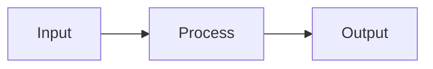

# TODO: ASCII Art Linter

> *LLMs can't count spaces. They're blind to alignment. Loop them with a linter.*

---

## The Problem

LLMs always fuck up ASCII art:

- Wrong number of spaces
- Misaligned columns
- Jingle-jangle right edges on boxes
- Can't fix it when asked — blind spot
- Emojis throw off fixed-width assumptions

```
They produce this:          Instead of this:
┌───────────┐               ┌───────────┐
│ Name   │ Age │            │ Name  │ Age │
├────────────┤              ├───────┼─────┤
│ Alice │ 30  │             │ Alice │  30 │
│ Bob  │ 25    │            │ Bob   │  25 │
└─────────────┘             └───────┴─────┘
```

And when you ask them to fix it, they make it worse.

---

## The Solution

**Don't ask the LLM to fix it. Give it mechanical instructions.**

A Python linter that:
1. **Analyzes** ASCII art structure (boxes, tables, alignment)
2. **Reports** specific edits: "insert 2 spaces at line 4, column 12"
3. **Optionally repairs** automatically
4. **Loops** with the LLM until stable

---

## Tool Design

### Command Line Interface

```bash
# Lint and suggest edits (safe — no changes)
python ascii_lint.py input.txt

# Lint and auto-repair
python ascii_lint.py input.txt --repair

# Lint and repair iteratively until stable
python ascii_lint.py input.txt --repair --iterate

# Lint a code block in markdown
python ascii_lint.py README.md --block 3

# Output format for LLM consumption
python ascii_lint.py input.txt --llm-instructions
```

### Output Modes

#### 1. Human-Readable Report

```
ASCII Art Lint Report
=====================

Line 3: Column alignment issue
  Expected: 12 characters before '│'
  Found: 10 characters
  Fix: Insert 2 spaces at column 8

Line 5: Right edge misaligned
  Expected: Column 20
  Found: Column 22
  Fix: Delete 2 characters at column 18
```

#### 2. LLM-Consumable Instructions

```yaml
instructions:
  - line: 3
    action: insert
    count: 2
    char: " "
    column: 8
    reason: "align column separator"
    
  - line: 5
    action: delete
    count: 2
    column: 18
    reason: "fix right edge alignment"
```

The LLM can follow these mechanically without thinking.

---

## Detection Heuristics

### Box Detection

Look for patterns:
- `┌ ┐ └ ┘` corners (Unicode box drawing)
- `+ - |` ASCII boxes
- `╔ ╗ ╚ ╝` double-line boxes

### Table Detection

- Consistent use of `│` or `|` as column separators
- Header separators: `├───┼───┤` or `+---+---+`
- Row alignment expectations

### Alignment Rules

1. **Vertical alignment**: All `│` characters in same column should align
2. **Horizontal spans**: `───` should connect corners properly
3. **Row consistency**: All rows in a table should have same width
4. **Right edge**: All lines in a box should end at same column

---

## Unicode Width Problem

Emojis and CJK characters have variable display width:

| Character | Display Width | `len()` |
|-----------|---------------|---------|
| `A`       | 1             | 1       |
| `あ`      | 2             | 1       |
| `🎉`      | 2             | 1       |
| `👨‍👩‍👧‍👦`      | 2             | 7       |

### Current Approach: Ignore It

```python
# For now, treat all characters as width 1
# This will be wrong for emojis but at least consistent
char_width = 1  # TODO: Use wcwidth library later
```

### Future Approach: wcwidth

```python
import wcwidth

def display_width(s):
    return sum(max(0, wcwidth.wcwidth(c)) for c in s)
```

But this adds complexity. Start simple, iterate.

---

## Implementation Plan

### Phase 1: Basic Linter (Lint Only)

```python
# ascii_lint.py

def detect_structure(lines):
    """Find boxes, tables, alignment expectations."""
    pass

def find_issues(lines, structure):
    """Compare actual vs expected alignment."""
    pass

def format_instructions(issues):
    """Output mechanical fix instructions."""
    pass
```

### Phase 2: Auto-Repair

```python
def apply_fix(line, instruction):
    """Insert/delete characters at position."""
    pass

def repair(lines, issues):
    """Apply all fixes, return repaired text."""
    pass
```

### Phase 3: Iterate Until Stable

```python
def lint_until_stable(text, max_iterations=10):
    """Loop: lint → repair → lint → repair until no issues."""
    for i in range(max_iterations):
        issues = lint(text)
        if not issues:
            return text  # Done!
        text = repair(text, issues)
    raise Exception("Could not stabilize after {max_iterations} iterations")
```

---

## Integration with LLM Workflow

### The Loop

```
┌─────────────────────────────────────────────┐
│                                             │
│   LLM generates ASCII art                   │
│            │                                │
│            ▼                                │
│   ascii_lint.py --llm-instructions          │
│            │                                │
│            ▼                                │
│   Issues found?                             │
│   ├── No  → Done! ✓                         │
│   └── Yes → Feed instructions back to LLM   │
│            │                                │
│            ▼                                │
│   LLM applies instructions mechanically     │
│            │                                │
│            └────────────────────────────────┘
│                      (repeat)
└─────────────────────────────────────────────┘
```

### Example LLM Prompt

```
The ASCII art you generated has alignment issues.
Apply these fixes EXACTLY as specified:

1. Line 3: Insert 2 spaces at column 8
2. Line 5: Delete 2 characters at column 18
3. Line 7: Insert 1 space at column 4

Do not think about it. Just apply the changes mechanically.
```

---

## File Location

```
skills/no-ai-slop/
├── CARD.yml
├── SKILL.md
├── scripts/
│   └── ascii_lint.py       # ← NEW
├── examples/
│   └── ...
└── TODO-ascii-art-linter.md  # ← THIS FILE
```

---

## Alternatives to ASCII Art

When suggesting the LLM avoid ASCII art, recommend:

| Alternative | When to Use | GitHub Renders |
|-------------|-------------|----------------|
| **Mermaid** | Flowcharts, sequences, ERDs | ✓ |
| **YAML code block** | Structured data, hierarchies | ✓ |
| **Outline** | Lists, steps, hierarchies | ✓ |
| **SVG** | Complex diagrams | ✓ |
| **Table (Markdown)** | Tabular data | ✓ |

```markdown
<!-- Instead of ASCII box, use Mermaid -->


<!-- Instead of ASCII table, use Markdown table -->
| Name  | Age |
|-------|-----|
| Alice | 30  |
| Bob   | 25  |
```

---

## Cardinal Sin Addition

Add to `CARD.yml` cardinal sins:

```yaml
ASCII-ART-MISALIGNMENT:
  what: "Producing ASCII art with wrong spacing/alignment"
  fix: "Use mermaid, markdown tables, or YAML instead. If ASCII art is required, run through ascii_lint.py"
  check: "Do all columns align? Do box edges match?"
```

---

## Status

- [ ] Phase 1: Basic linter (lint only)
- [ ] Phase 2: Auto-repair mode
- [ ] Phase 3: Iterate until stable
- [ ] Phase 4: Markdown code block extraction
- [ ] Phase 5: Unicode width handling (wcwidth)
- [ ] Integration: Add cardinal sin to CARD.yml
- [ ] Integration: Add recommendation to SKILL.md

---

*"LLMs can't count spaces. Don't ask them to. Give them a machine that can."*
