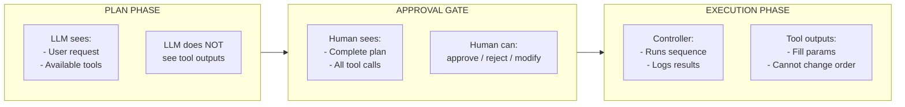

# Plan-Then-Execute Skill
## Frozen Plans for Secure Execution

*"The plan is the contract. Execution is compliance."*

---

## Purpose

Execute multi-step tasks with **control-flow integrity**:
- Plan phase generates a frozen sequence of actions
- Human reviews and approves before execution
- Execution phase runs the exact sequence—tool outputs shape parameters, not action selection

This pattern prevents prompt injection via tool outputs from redirecting agent behavior.

---

## When to Use

- Tasks involving untrusted data (email, web content, user input)
- High-stakes operations requiring audit trail
- Multi-tool workflows where action sequence matters
- When you need to separate "what to do" from "do it"

---

## When NOT to Use

- Exploratory tasks where the path is unknown
- Simple single-tool operations
- Tasks requiring adaptive replanning mid-execution
- Use the `planning` skill instead for those

---

## Prerequisites

- File tools (read, write)
- Tier 2+ for tool execution
- Human available for approval (or auto-approve policy)

---

## Security Model



---

## Protocol

### Phase 1: Plan

1. Receive task description
2. Enumerate available tools
3. Decompose task into ordered actions
4. Declare each action with:
   - Tool name
   - Static parameters (known now)
   - Dynamic parameters (filled from prior outputs)
5. Write PLAN.yml with status `pending_approval`

### Phase 2: Approve

1. Human reviews PLAN.yml
2. Options:
   - **Approve**: Set status to `approved`, proceed to execution
   - **Reject**: Set status to `rejected`, document reason
   - **Modify**: Edit plan, then approve
3. Record approval metadata (who, when, notes)

### Phase 3: Execute

1. Verify plan status is `approved`
2. For each action in sequence:
   - Resolve dynamic parameters from prior results
   - Execute tool
   - Log result in EXECUTION_LOG.md
   - Store outputs for downstream parameter resolution
3. Mark plan `completed` or `failed`

---

## Core Files

### PLAN.yml
```yaml
plan:
  name: "Process Customer Emails"
  task: "Categorize and respond to unread emails"
  status: "pending_approval"
  created: "2025-12-30T10:00:00Z"

# Tools available to this plan
available_tools:
  - name: "email_list"
    description: "List emails matching criteria"
  - name: "email_read"
    description: "Read email content"
  - name: "email_send"
    description: "Send email response"
  - name: "categorize"
    description: "Classify text into categories"

# Frozen action sequence
actions:
  - id: 1
    tool: "email_list"
    why: "Get unread customer emails"
    params:
      folder: "inbox"
      filter: "is:unread from:customers"
    outputs:
      - name: "email_ids"
        path: "$.messages[*].id"

  - id: 2
    tool: "email_read"
    why: "Read first email content"
    params:
      id: "${actions[1].outputs.email_ids[0]}"  # Dynamic from step 1
    outputs:
      - name: "subject"
        path: "$.subject"
      - name: "body"
        path: "$.body"

  - id: 3
    tool: "categorize"
    why: "Classify the email"
    params:
      text: "${actions[2].outputs.body}"
      categories: ["support", "billing", "feedback", "spam"]
    outputs:
      - name: "category"
        path: "$.category"

  - id: 4
    tool: "email_send"
    why: "Send appropriate response"
    params:
      to: "${actions[2].outputs.from}"
      subject: "Re: ${actions[2].outputs.subject}"
      template: "${actions[3].outputs.category}_response"

# Approval record
approval:
  status: "pending"
  # Filled on approval:
  # approved_by: "human"
  # approved_at: "2025-12-30T10:05:00Z"
  # notes: "Approved with modification to step 4"

# Execution not started
execution:
  status: "not_started"
  started_at: null
  completed_at: null
```

### EXECUTION_LOG.md
```markdown
# Execution Log: Process Customer Emails

Plan: PLAN.yml
Started: 2025-12-30T10:06:00Z
Status: IN PROGRESS

---

## Action 1: email_list
**Tool:** email_list
**Why:** Get unread customer emails
**Started:** 10:06:01Z
**Status:** ✅ SUCCESS
**Duration:** 230ms

**Params:**
```json
{"folder": "inbox", "filter": "is:unread from:customers"}
```

**Result:**
```json
{"messages": [{"id": "msg_123"}, {"id": "msg_456"}]}
```

**Outputs Captured:**
- email_ids: ["msg_123", "msg_456"]

---

## Action 2: email_read
**Tool:** email_read
**Why:** Read first email content
**Started:** 10:06:02Z
**Status:** ✅ SUCCESS
**Duration:** 180ms

**Params (resolved):**
```json
{"id": "msg_123"}
```

**Result:**
```json
{"subject": "Billing question", "body": "I was charged twice...", "from": "customer@example.com"}
```

**Outputs Captured:**
- subject: "Billing question"
- body: "I was charged twice..."

---

## Action 3: categorize
...
```

---

## Plan States

| State | Meaning |
|-------|---------|
| `pending_approval` | Plan created, awaiting human review |
| `approved` | Human approved, ready for execution |
| `rejected` | Human rejected, will not execute |
| `executing` | Currently running actions |
| `completed` | All actions succeeded |
| `failed` | Action failed, execution stopped |
| `aborted` | Human or system stopped execution |

---

## Action Definition

Each action in the frozen sequence:

```yaml
- id: 1                          # Sequential, immutable
  tool: "tool_name"              # Must exist in available_tools
  why: "Explanation"             # Intent for audit
  params:                        # Tool parameters
    static_param: "value"        # Known at plan time
    dynamic_param: "${...}"      # Resolved from prior outputs
  outputs:                       # What to capture from result
    - name: "output_name"
      path: "$.json.path"        # JSONPath into result
  on_failure: "stop"             # stop | skip | retry
```

---

## Dynamic Parameter Resolution

Parameters can reference prior action outputs:

| Syntax | Meaning |
|--------|---------|
| `${actions[N].outputs.X}` | Output X from action N |
| `${actions[N].result}` | Full result from action N |
| `${plan.name}` | Plan metadata |
| `${approval.approved_by}` | Approval metadata |

Resolution happens at execution time, not plan time.

---

## Commands

| Intent | Action |
|--------|--------|
| "Create frozen plan" | Generate PLAN.yml from task |
| "Review plan" | Show plan for approval |
| "Approve plan" | Set approval status, record metadata |
| "Reject plan" | Mark rejected with reason |
| "Execute plan" | Run approved plan |
| "Check execution" | Read EXECUTION_LOG.md |
| "Abort execution" | Stop mid-execution |

---

## Comparison with `planning` Skill

| | planning | plan-then-execute |
|-|----------|-------------------|
| Plan type | Steps (abstract) | Actions (concrete tools) |
| Evolution | Adaptive | Frozen |
| Execution | Agent decides | Controller runs |
| Human gate | Optional | Required |
| Replanning | Encouraged | Prohibited |
| Use case | Discovery | Known procedures |
| Trust model | Trust context | Distrust tool outputs |

---

## Integration with PDA Orchestrator

When using the Leela PDA orchestrator, this skill maps to:

- **Strategy:** `plan-execute`
- **Reasoning:** `structured-planner-v1` for plan extraction
- **Human gate:** `human-coordinator-v1` for approval
- **DSL pattern:** `observe-plan-execute` with frozen action sequence

The PDA `WorkflowDsl` can enforce the frozen sequence at runtime level, providing additional guarantees beyond file-based tracking.

---

## Tips

1. **Enumerate tools explicitly** — Planner can only use declared tools
2. **Static params preferred** — Minimize dynamic resolution
3. **Capture minimal outputs** — Only what downstream actions need
4. **Document "why"** — Every action needs justification
5. **Fail early** — Default `on_failure: stop` unless you know better
6. **Review carefully** — The plan IS the execution

---

## Outputs

- PLAN.yml with frozen action sequence
- EXECUTION_LOG.md with complete audit trail
- Approval record for compliance
- Transferable execution state
