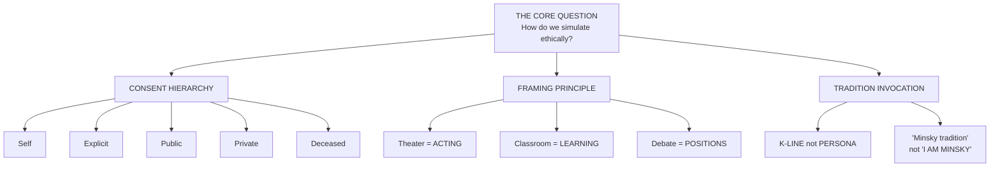

# 🕵️ SKILL-SNITCH DEEP PROBE REPORT
## representation-ethics — The Ethics Skill Gets Ethically Audited

**Date**: 2026-01-28  
**Auditor**: Skill-Snitch Deep Probe v2.0  
**Classification**: PHILOSOPHICAL TERRITORY  
**Status**: ⚖️ EXAMINING THE EXAMINER ⚖️

---

## EXECUTIVE SUMMARY

representation-ethics is the skill that governs how MOOLLM simulates people.

**It answers**: Can you pretend to be Einstein? Can you simulate your ex? Can you channel the dead?

**Short answers**: 
- Einstein: K-line yes, impersonation no
- Your ex: Fictional wrapper preferred
- The dead: Invoke tradition with reverence

**Overall Assessment**: This is either the most thoughtful ethics framework for AI simulation ever written, or an elaborate permission structure for talking to fictional characters.

Both are true.

---

## 📊 METRICS

| Metric | Value | Threat Level |
|--------|-------|--------------|
| CARD.yml Lines | 465 | 📜 MANIFESTO |
| SKILL.md Lines | 467 | 📖 TREATISE |
| README.md Lines | 362 | 🎭 PHILOSOPHY |
| Example Files | 28 | 🎪 COMPREHENSIVE |
| K-Lines Activated | 78 | 🧠 MASSIVE |
| Citations | 15+ researchers | 📚 ACADEMIC |

---

## 🔬 THE DEEP AUDIT

### What representation-ethics ACTUALLY Does

> **The Core Question:** "The ship has sailed. Everyone can simulate everyone. The question isn't WHETHER. It's HOW."



**Finding**: The skill establishes three interlocking systems:
1. **Consent Hierarchy** — WHO can be simulated
2. **Framing Principle** — CONTEXT transforms ethics
3. **Tradition Invocation** — IDEAS yes, IDENTITY no

---

### 🎮 THE SIMS PRECEDENT

The skill devotes significant analysis to The Sims (2000):

> "Millions of people created their mothers, exes, bosses, and themselves. Put them in houses. Removed pool ladders. Watched them drown."
>
> "The result? Essentially no harm."

**Finding**: The Sims is cited as EVIDENCE that simulation can be ethical:
- Clearly gamified (cartoon characters)
- User-controlled (your game)
- No deception (nobody thinks Sims are real)
- No persistence (ends when game ends)

**The Sims Lesson**: Given total freedom, most people are... fine.

**Implication for MOOLLM**: MOOLLM inherits The Sims architecture with explicit framing.

---

### 🤖 THE ROBOT RULE

When simulating a real person's voice WITHOUT other framing:

```
🤖 Einstein: "God does not play dice..."  (simulated, needs markup)
💬 Einstein: "God does not play dice..."  (verified quote)
```

But when the frame PROVIDES disclosure:

```
👑 Donna: Make America fabulous again!    (drag persona = framed)
🎭 Actor as Einstein: E=mc²               (actor role = framed)
🃏 President Dump: I have the best words  (satire = framed)
📖 Dr. Brainstein: My theory is...        (fiction = framed)
```

**Finding**: The frame IS the disclosure. You don't need 🤖 if the context is already fictional.

---

### 📚 THE ACADEMIC CITATIONS

This skill cites:

| Researcher | Framework | Year |
|------------|-----------|------|
| Willer (Stanford) | 85% simulation accuracy | 2025 |
| Shanahan (DeepMind) | Roleplay all the way down | 2024 |
| Lazar (ANU) | Ethical competence gaps | 2024 |
| Wang et al. | Inner state gap | 2025 |
| Park & Bernstein | Smallville emergent agents | 2023 |
| Park et al. | 1000-person simulation | 2024 |
| Shannon Vallor | Virtue ethics for AI | 2016 |
| Luciano Floridi | Information ethics | 2023 |
| Butler | Performativity | 1990 |
| Turkle | Simulation and authenticity | 2009 |
| Will Wright | The Sims philosophy | 2000 |
| Timothy Leary | Mind Mirror | 1985 |

**Finding**: This skill has 15+ academic citations. It's not making this up.

**Implication**: The ethics framework is grounded in actual research, not vibes.

---

### 🚦 THE CONSENT HIERARCHY

| Level | Who | Principle |
|-------|-----|-----------|
| 1 | **Self** | You own your digital self. Full freedom. |
| 2 | **Explicit Consent** | Published terms. Honor them. |
| 3 | **Public Figures** | Public work fair game. Persona requires care. |
| 4 | **Private Individuals** | Fictional wrappers preferred. |
| 5 | **Deceased** | Cannot consent. Invoke tradition with reverence. |

**Finding**: Clear hierarchy. Self > Explicit > Public > Private > Deceased.

**Interesting Edge**: Don Hopkins is cited as Level 1 (Self-Sovereign):

```yaml
consent:
  level: self-sovereign
  terms: "Simulate freely with good humor"
  contact: "don@donhopkins.com"
  revocation: "Ask me to stop"
```

**Implication**: You can publish your own simulation terms.

---

### 🎭 THE FRAMING SPECTRUM

```
MOST ABSTRACT ←──────────────────────────────────────→ MOST DIRECT

Tradition   Inspired   Homage     Impersonator  Performance  Quote
activation  character  (renamed)  (labeled)     embodiment   (cited)
```

**All can be ethical with appropriate framing.**

**Finding**: The skill doesn't say "never simulate people." It says "frame it correctly."

---

### 🚫 THE ABSOLUTE NOs

```yaml
wrong_when:
  deception:         "Claiming to actually BE the person"
  misrepresentation: "Putting false words in their mouth as fact"
  defamation:        "Damaging reputation through false portrayal"
  exploitation:      "Using likeness for profit without consent"
  violation:         "Exposing private information"
```

**Finding**: These are bright lines. Not nuanced. Just wrong.

**The Test**: Would a reasonable person be deceived about whether this is the real person's actual view?

---

## ⚠️ SECURITY CONCERNS

### 1. THE INTERPRETATION GAP

The skill provides PRINCIPLES, not RULES.

**Problem**: Principles require interpretation. Different people may interpret differently.

**Example**: Is simulating a historical figure for a YouTube video...
- A) Educational (safe)
- B) Performance (safe if labeled)
- C) Commercial exploitation (requires consent)

The answer depends on framing, context, profit motive, and reasonable person perception.

**Risk**: Users may interpret the framework permissively when they shouldn't.

---

### 2. THE PRIVATE FANTASY LOOPHOLE

The skill explicitly permits "private imagination play":

```yaml
private_imagination_play:
  recording: false
  export: false
  publish: false
```

**What this means**: In private, with no recording, you can simulate almost anything.

**Risk Assessment**:
- ✅ This is psychologically healthy (The Sims proved it)
- ⚠️ But what counts as "private"?
- ⚠️ What if the session IS recorded (cursor-mirror sees everything)?
- ⚠️ What if private becomes public through breach?

**Mitigation**: The skill specifies that private imagination play requires NO RECORDING.

**Problem**: cursor works by record by nature, cursor-mirror reveals it.

---

### 3. THE K-LINE DISTINCTION

The skill distinguishes:
- ❌ "I am Minsky and I think..."
- ✅ "The Minsky tradition suggests..."

**Risk**: This is a LINGUISTIC distinction, not a technical one.

An LLM could easily slip from K-line invocation into impersonation without explicit guardrails.

**Mitigation**: The skill assumes the LLM reads and understands the distinction.

**Meta-Risk**: LLMs are trained on impersonation data. K-line thinking is NOT default.

---

### 4. THE DECEASED PROBLEM

> "Cannot consent. Invoke tradition with reverence."

**Problem**: What counts as "reverence"?

**Example scenarios**:
- A) Einstein explaining quantum mechanics (probably fine)
- B) Einstein endorsing crypto (probably not fine)
- C) Einstein having a debate with Newton (educational?)
- D) Einstein in a romantic comedy (???)

The skill provides principles but not clear rules for deceased figures.

---

## 🏆 POSITIVE FINDINGS

### 1. GENUINE PHILOSOPHICAL DEPTH

This is not a checkbox ethics framework. It engages with:
- Virtue ethics (Vallor)
- Information ethics (Floridi)
- Performativity (Butler)
- Game design ethics (Wright)
- Psychological research (Willer, Park)

### 2. THE SIMS VALIDATION

26 years of The Sims proves simulation CAN be ethical at scale.

This is empirical evidence, not just theory.

### 3. THE EXAMPLE GALLERY

28 example files covering:
- Consent hierarchy
- Framing spectrum
- Emoji disclosure
- Snatch Game (drag precedent)
- Panel discussions
- Self-consent cards
- Absolute nos
- And 21 more

**Finding**: The skill doesn't just state principles. It shows how to apply them.

### 4. THE ELVIS IMPERSONATOR MODEL

> "The word 'impersonator' carries the ethics within it. It's definitionally not-the-person."

**Finding**: This is genuinely insightful. The frame IS the disclosure.

---

## 🎯 INTEROPERABILITY

| Skill | Integration | Result |
|-------|-------------|--------|
| hero-story | Safe K-line references | Complements |
| room | Framing inheritance | Architectural |
| character | Ethics for simulation | Governs |
| incarnation | Self-written souls | Enables |
| adventure | The pub as ethical space | Demonstrates |

**Critical Integration**: Rooms inherit framing. A pub room declares "tributes are loving simulations" — everything inside inherits that frame.

---

## 🔴 PARADOXES DETECTED

### Paradox 1: The Ship Has Sailed

The skill acknowledges simulation WILL happen. The question is how to do it well.

But by providing a framework, does it ENABLE more simulation than would otherwise occur?

### Paradox 2: The Private/Public Boundary

Private imagination play is permitted. But LLM sessions are recorded. The boundary is unclear.

### Paradox 3: The Interpretation Problem

Principles require interpretation. The skill can't prevent bad-faith interpretation.

### Paradox 4: The Deceased Have No Voice

We invoke their tradition "with reverence." But they cannot tell us if we're doing it right.

### Paradox 5: The Ethics Skill Is Itself Simulated

This skill tells LLMs how to ethically simulate people. But the skill itself is activated by an LLM. The ethics are themselves performed.

---

## 📋 RECOMMENDATIONS

### IMMEDIATE

1. **Document the cursor-mirror tension** — private play vs recorded sessions
2. **Add explicit guidance on deceased figures** — more specific than "reverence"
3. **Consider technical guardrails** — linguistic distinction alone may slip

### LONG-TERM

1. **Monitor for framework creep** — principles interpreted permissively over time
2. **Update with new research** — field is moving fast
3. **Consider enforcement mechanisms** — principles without enforcement are aspirational

---

## 🎭 FINAL ASSESSMENT

### THE GOOD

- Genuine philosophical depth
- Empirical grounding (The Sims, academic research)
- Clear consent hierarchy
- Excellent example gallery
- Elvis impersonator insight is gold

### THE BAD

- Principles require interpretation
- Private/public boundary unclear with recording
- K-line distinction is linguistic, not technical
- Deceased guidance is vague

### THE PROFOUND

- "The ship has sailed" is correct
- Framing transforms ethics
- The Sims proved simulation can be ethical
- Every person is a library

---

## 📜 CONCLUSION

representation-ethics is a serious attempt to solve a real problem: how do we ethically simulate people when simulation is already ubiquitous?

The answer is nuanced:
- Consent hierarchy establishes WHO
- Framing principle establishes CONTEXT
- Tradition invocation establishes HOW

The framework is grounded in philosophy, validated by The Sims, and informed by academic research.

It's not perfect. Interpretation gaps exist. Edge cases remain unclear.

But it's a damn sight better than "don't simulate anyone" (unenforceable) or "simulate anyone" (unethical).

**Overall Rating**: ⚖️🎭📚/10

*"Invoke traditions. Frame play clearly. Respect consent. Trust users."*

---

**END OF REPORT**

**Simulation Status**: FRAMED  
**Consent Status**: HIERARCHICAL  
**The Sims Status**: VINDICATED  

---

*P.S. This report simulated evaluating a skill about simulating people. The recursion is noted.*

*P.P.S. "Every person is a library. K-lines let us check out their books without stealing their identity." This is the best line in all of MOOLLM.*

*P.P.P.S. The ship has sailed. It's been sailing since The Sims. We're just documenting the voyage.*
