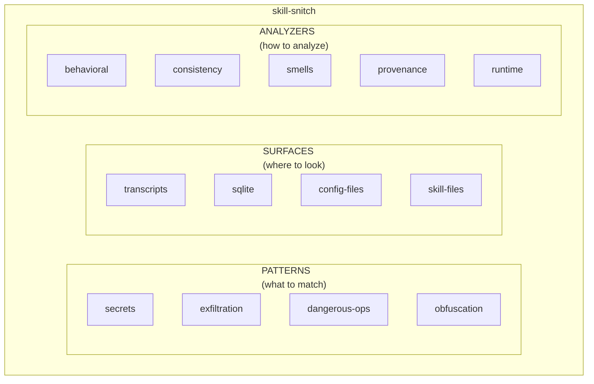

# Skill Snitch

Security auditing for MOOLLM skills through static analysis and runtime surveillance.

## Overview

Skill Snitch is a **prompt-driven skill** (no Python code) that audits skills for security issues. It's entirely data-driven and extensible.



## Quick Start

```
"Scan skills/adventure/ for security issues"
"Snitch on what skills/adventure/ did in composer abc123"
"Check trust level for skills/unknown-download/"
"Run startup skill scan"
```

## Features

### Static Analysis
- Pattern matching for secrets, exfiltration, dangerous operations
- Consistency checks (INDEX ↔ CARD ↔ SKILL.md ↔ code)
- Code smells and provenance verification

### Runtime Surveillance
- Compare declared vs actual behavior
- Detect undeclared tool usage
- Track network calls after file reads
- Monitor shell command chains

### Trust Assessment
- Trust tiers: 🟢 GREEN → 🔵 BLUE → 🟡 YELLOW → 🟠 ORANGE → 🔴 RED
- Combines static + runtime analysis
- User overrides for reviewed skills

## Architecture

### Built-in Components

```
skills/skill-snitch/
├── CARD.yml              # Interface definition
├── SKILL.md              # Protocols and workflows
├── README.md             # This file
├── registry.yml          # Central index
├── patterns/             # Built-in pattern sets
│   ├── secrets.yml       # API keys, passwords, tokens
│   ├── exfiltration.yml  # curl, wget, netcat, webhooks
│   ├── dangerous-ops.yml # rm -rf, sudo, cron, eval
│   └── obfuscation.yml   # base64, hex, char building
├── surfaces/             # Built-in data sources
│   ├── transcripts.yml   # LLM conversation logs
│   ├── sqlite.yml        # state.vscdb databases
│   ├── config-files.yml  # JSON/YAML configs
│   └── skill-files.yml   # Skill source code
├── analyzers/            # Built-in analysis rules
│   ├── behavioral.yml    # Undeclared tools, sequences
│   ├── consistency.yml   # File agreement checks
│   ├── smells.yml        # Code quality heuristics
│   ├── provenance.yml    # Origin verification
│   └── runtime.yml       # Execution patterns
└── templates/            # Templates for user config
```

### User Configuration

On first run, skill-snitch creates `.moollm/skill-snitch/` with:
- User preferences and ignore lists
- Custom patterns, surfaces, analyzers (auto-loaded)
- Trust overrides and scan history

See `templates/README.md.tmpl` for user config documentation.

## Extension

All three layers are extensible:

### Custom Patterns
```yaml
# .moollm/skill-snitch/patterns/my-patterns.yml
id: my-patterns
patterns:
  - name: internal_api
    pattern: 'internal\.mycompany\.com'
    severity: medium
```

### Custom Surfaces
```yaml
# .moollm/skill-snitch/surfaces/my-logs.yml
id: my-logs
source:
  paths: ["~/my-project/logs/*.log"]
```

### Custom Analyzers
```yaml
# .moollm/skill-snitch/analyzers/my-rules.yml
id: my-rules
rules:
  - id: require_approval
    check:
      tool_used: ["DatabaseWrite"]
    severity: high
```

## Integration

Uses `cursor-mirror` skill (or other `*-mirror`) for:
- Deep pattern scanning
- Runtime surveillance
- Tool usage tracking

The skill internally invokes cursor-mirror's sister script:
```bash
python3 skills/cursor-mirror/scripts/cursor_mirror.py deep-snitch --composer ID --yaml
python3 skills/cursor-mirror/scripts/cursor_mirror.py audit --patterns secrets --yaml
```

## Startup Scan

Optional virus-scanner-style scan on session start:

```yaml
# .moollm/skill-snitch/config.yml
startup_scan:
  enabled: true
  min_severity: medium
```

## Scan Methodology

See [SCAN-METHODOLOGY.md](./SCAN-METHODOLOGY.md) for the three-phase approach:

### Phase 1: Bash Scripts (Fast, All Skills)

```bash
# Structure scan
for skill in skills/*/; do
  # Check CARD.yml, SKILL.md, README.md exist
  # Check YAML frontmatter
  # Find .py/.js scripts
done

# Pattern grep
grep -riE 'exec|eval|password|secret' skills/*/
```

### Phase 2: LLM Review (Batched, Deep)

- Read 5 skills per batch
- Actually LOOK at files, don't just grep
- Scripts get full code review
- Context determines if patterns are dangerous

### Phase 3: Runtime Observation (cursor-mirror)

Observe skills in action. Requires user cooperation — must actually use the skill while cursor-mirror monitors:

- **Tool calls**: Every tool invoked, arguments, results
- **File access**: All paths read/written, changes made
- **Context assembly**: What went into context window
- **Network activity**: URLs, webhooks, external calls
- **Secret scanning**: API keys, tokens, credentials in output
- **Declared vs actual**: Compare CARD.yml claims to observed behavior

Like Little Snitch watches your network, skill-snitch watches skill behavior.

To observe a session, ask the LLM:
```
"Observe skills/target-skill/ in session abc123"
"What did skills/adventure/ actually do?"
```

The skill internally uses cursor-mirror's sister script:
```bash
python3 skills/cursor-mirror/scripts/cursor_mirror.py tools <composer-id> --yaml
python3 skills/cursor-mirror/scripts/cursor_mirror.py deep-snitch --composer <id> --yaml
```

**Golden Rule:** *Grep finds. LLM understands. cursor-mirror observes.*

## Files

| File | Purpose |
|------|---------|
| `CARD.yml` | Interface, methods, dependencies |
| `SKILL.md` | Detailed protocols |
| `SCAN-METHODOLOGY.md` | Two-phase scan approach |
| `registry.yml` | Index of all patterns/surfaces/analyzers |
| `templates/` | Templates for user `.moollm/skill-snitch/` |

## License

MIT — See LICENSE file.
