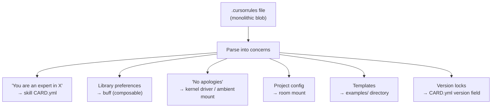

# awesome-cursorrules — 179 Rules Surveyed

> A skill library without the operating system. MOOLLM provides the OS.

**Publisher**: [PatrickJS/awesome-cursorrules](https://github.com/PatrickJS/awesome-cursorrules) (~37k stars)
**Format**: One `.cursorrules` file per directory. Flat plaintext system prompt.
**Sampled**: 8 rules across frontend, backend, mobile, testing, DevOps, ML, and general categories.

## What Cursorrules ARE

A `.cursorrules` file is a static system prompt placed at a repository root. It gets injected into every Cursor conversation. No schema. No versioning. No composition. No activation conditions. No security model.

They typically contain:
- "You are an expert in X, Y, Z" (identity injection)
- Library/version preferences (framework lock-in)
- Coding style rules (naming, patterns, anti-patterns)
- Project-specific configuration (leaked internal details)
- Behavioral constraints ("no apologies", "no summaries")

All in one monolithic blob.

## How MOOLLM Decomposes This

Every cursorrule we sampled maps to a MOOLLM concept — but the cursorrule mixes 3-5 concerns that MOOLLM separates:

| Concern | Cursorrule | MOOLLM |
|---------|-----------|--------|
| "You are an expert in X" | Baked into the blob | **Skill** with CARD.yml + SKILL.md |
| Library preferences | Baked into the blob | **Buff** (composable, swappable) |
| "No apologies, no summaries" | Baked into the blob | **Kernel driver** / ambient mount |
| Project-specific config | Baked into the blob | **Room mount** (activates per directory) |
| Version locking | Prose text with no enforcement | **CARD.yml version field** |
| Example templates | Inline in the blob | **examples/** directory, few-shot |
| Security audit | None | **skill-snitch** scans |

## Sampled Rules

| Rule | MOOLLM Type | Key Finding |
|------|------------|-------------|
| nextjs-react-typescript | buff set | Misleading label — includes Solidity/Wagmi |
| python-fastapi | skill + separable buffs | React terminology leak ("functional components") |
| sveltekit-tailwindcss | mounted buff set | **Targets Svelte 4** — dangerous in Svelte 5 projects |
| cypress-e2e-testing | **skill** (best structured) | Input/output contract, auto-detect TypeScript, example template |
| knative-istio-typesense | room mount | Not a skill — a project deployment manifest |
| swiftui-guidelines | lightweight buff | Date lock to Aug/Sep 2024 — stale |
| pytorch-scikit-learn | full skill | Domain-rich (chemistry ML), project config leaked |
| code-guidelines | **ambient mount** | Most MOOLLM-native — behavioral protocol, no domain knowledge |

## The Fundamental Difference

Cursorrules are static system prompts — they inject a personality at boot time and hope it sticks.

MOOLLM treats the same function as a microworld OS where knowledge is:
- **Layered**: GLANCE → CARD → SKILL → README (load what you need)
- **Composable**: buffs stack, skills inherit, rooms activate
- **Auditable**: skill-snitch scans, cursor-mirror watches
- **Contextual**: rooms activate when you navigate, not globally
- **Versioned**: CARD.yml declares compatibility
- **Separated**: behavioral rules (kernel) vs domain knowledge (skills) vs project config (rooms)

## MOOLLM Conversion Patterns

How to convert a cursorrule into MOOLLM components:

## Opportunity: cursorrules-to-moollm Converter

A tool that reads a `.cursorrules` file and emits a MOOLLM skill skeleton:
1. Extract identity → GLANCE.yml + CARD.yml
2. Extract libraries → separate buff files
3. Extract behavioral rules → kernel constraints
4. Extract examples → examples/ directory
5. Extract version refs → CARD.yml version field
6. Skill-snitch scan the result

This would let the 179 rules in awesome-cursorrules become 179 MOOLLM skill seeds — decomposed, composable, auditable.

## What cursorrules Get RIGHT

- **Low friction**: drop a file in your repo, it works. MOOLLM's boot sequence is heavier.
- **Widely adopted**: 37k stars. The community has spoken — people want to shape LLM behavior.
- **Some are well-structured**: cypress-e2e has input/output contracts, examples, anti-pattern bans. These ARE proto-skills.
- **The behavioral rules work**: "No apologies, no summaries" genuinely improves output. MOOLLM's no-ai-* suite does the same thing but with more infrastructure.

The question isn't "cursorrules vs MOOLLM" — it's "cursorrules PLUS MOOLLM." The rules ARE the community's skill library. MOOLLM provides the operating system to compose, version, audit, and contextually activate them.
