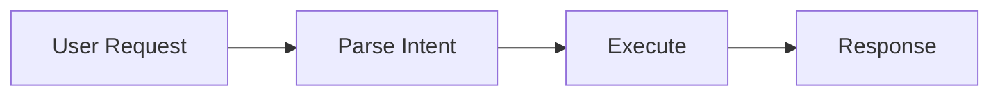

# SKILL

> **"A skill is documentation that learned to do things."**

The meta-protocol: how skills work, how they evolve, how they compose, and how MOOLLM advances the state of the art.

---

## Foundation: What We Share with Anthropic

MOOLLM skills build on Anthropic's excellent Skills model foundation:

| Anthropic Principle | MOOLLM Implementation | Shared Why |
|---------------------|----------------------|------------|
| **Documentation-first** | `README.md` + `SKILL.md` | Explain before automating |
| **Tool definitions** | YAML frontmatter + `CARD.yml` | Machine-readable specs |
| **Composability** | Prototype inheritance + dovetails | Complex from simple |
| **Human gates** | `PLAN-THEN-EXECUTE` protocol | Trust but verify |
| **Skill libraries** | `skills/` directory | Central, shareable |

**The foundation is sound.** What MOOLLM adds is **instantiation, inheritance, K-lines, empathic templates, and proven speed-of-light simulation**.

---

## MOOLLM's Unique Contributions

### 1. Skills as Prototypes (Self-like Inheritance)

> *"Objects all the way down."* — David Ungar

Traditional skills are static documentation. **MOOLLM skills are prototypes that create instances:**

```yaml
# Prototype (the skill)
skills/adventure/
├── SKILL.md           # The documentation
├── CARD.yml           # The interface
└── *.tmpl             # The templates

# Instance (created BY the skill)
examples/adventure-4/
├── ADVENTURE.yml      # Instantiated from template
├── characters/        # Populated during play
├── pub/               # A room instance
└── sessions/          # State over time
```

**Why this matters:**
- Skills aren't just docs — they're **factories**
- Instances inherit from prototypes but can override
- State lives in instances, behavior in prototypes
- Changes to prototypes automatically enhance all instances

See: [delegation-object-protocol.md](./delegation-object-protocol.md)

---

### 2. Cards: Playable Capability Bundles

Skills become **cards** that can be played, traded, collected:

```yaml
# CARD.yml — The interface contract
card:
  id: adventure
  name: "Text Adventure"
  type: [skill, game, narrative]
  emoji: 🎲
  rarity: rare
  
methods:
  EXPLORE: { description: "Move to adjacent room" }
  EXAMINE: { description: "Look at something" }
  TAKE: { description: "Pick up an object" }
  
advertisements:
  NARRATIVE-EXPLORATION:
    score: 90
    condition: "Want interactive fiction"
```

**Why this matters:**
- Clear interface contract
- Advertised capabilities (like Sims objects!)
- Can be played, stacked, combined
- Machine-readable for orchestration

---

### 3. K-lines: Names as Activation Vectors

> *"A K-line is a wire-like structure that attaches to whichever mental agencies are active when you solve a problem."* — Marvin Minsky

When you invoke a skill by name, you activate its **entire knowledge context**:

```markdown
> Apply YAML-JAZZ to this configuration.

# This single name activates:
# - The semantic commenting philosophy
# - The specific syntax patterns
# - The examples and anti-patterns
# - The emotional tone (jazzy, improvisational)
# - Related concepts (POSTEL, soul-chat)
```

**When you instantiate a character, their name becomes their K-line.** "Palm" activates everything about Palm — history, personality, goals, relationships, the incarnation story.

**Why this matters:**
- Names are more than labels — they're **semantic activations**
- Context flows from invocation
- Related concepts automatically available
- The LLM's associative memory works FOR us

---

### 3b. Ambient Skills: Always-On Behavioral Shaping

> *"Like air filters that clean continuously, not just when you smell smoke."*

Some skills should be "in the air" — always available, always shaping output without explicit invocation. These are **ambient skills**.

**The Key Insight:** AMBIENT is an advertisement type!

This fits perfectly because:
- Advertisements already have scores and conditions
- The orchestrator already knows how to process advertisements
- It's semantically accurate — the skill is literally advertising "I want to be in context"

**Declaring an Ambient Skill:**

```yaml
# In CARD.yml
advertisements:
  # Regular advertisements (invoked on demand)
  CREATE-SKILL:
    score: 90
    condition: "Need to make a new reusable capability"
    
  # AMBIENT advertisement (always in context)
  AMBIENT:
    score: 100              # Priority for context budget
    condition: always       # Or: "when writing YAML"
    scope: session          # How long it persists
    resolution: summary     # How much to keep in context
```

**AMBIENT Advertisement Fields:**

| Field | Options | Meaning |
|-------|---------|---------|
| `score` | 0-100 | Priority for context budget (higher = kept longer) |
| `condition` | `always`, condition string | When to activate |
| `scope` | `session`, `conversation`, `room`, `card-only` | Persistence duration |
| `resolution` | `full`, `summary`, `sniff`, `card-only` | How much to load |

**Examples of Ambient Skills:**

```yaml
# no-ai-slop: Always on, syntactic hygiene
AMBIENT:
  score: 100
  condition: always
  scope: session
  resolution: card-only    # Just the cardinal sins list

# yaml-jazz: When writing YAML
AMBIENT:
  score: 90
  condition: "when writing or editing YAML files"
  scope: conversation
  resolution: summary

# representation-ethics: When simulating real people
AMBIENT:
  score: 95
  condition: "when portraying real people or sensitive topics"
  scope: conversation
  resolution: full
```

**Orchestrator Behavior:**

The orchestrator handles AMBIENT advertisements by:

1. **Collecting**: Gather all AMBIENT ads from loaded skills
2. **Evaluating**: Check conditions against current context
3. **Sorting**: Order by score (highest priority first)
4. **Loading**: Include skills at their declared resolution until context budget exhausted
5. **Refreshing**: Re-evaluate on context change (new room, new topic, etc.)

**The Standard Schema Advantage:**

Because CARD.yml follows a **standard schema**, a smart orchestrator can:
1. Parse all advertisements programmatically
2. Find AMBIENT declarations automatically
3. Operationalize them without LLM intervention
4. **Inject them invisibly into the LLM's brain**

This is the "magic places" principle — structured locations (like `advertisements.AMBIENT`) where the orchestrator knows to look.

**Two Modes: Smart vs Dumb Orchestrators**

| Orchestrator | AMBIENT Handling | LLM Experience |
|--------------|------------------|----------------|
| **MOOCO (smart)** | Driver parses CARDs, injects automatically | Invisible — "I will inject them into your brain" |
| **Cursor (dumb)** | Advisory mode, manual hot list | Visible — LLM manages context manually |

**Smart Orchestrator (MOOCO) Promise:**

The custom driver says to the LLM:
> *"Don't worry about looking at ambient skills with the file tool.*
> *I will inject them into your brain continuously."*

The LLM never sees the mechanism. The CARD is just... there. Always.

**Dumb Orchestrator (Cursor/Claude Code) Fallback:**

We can't control these orchestrators, so:

1. **Declare AMBIENT in CARD.yml** — the skill advertises its ambient nature
2. **Manual hot list** — keep important CARDs in `.moollm/hot.yml` or working set
3. **Resolution field** — skill declares how much of itself to keep paged in (`card-only`, `summary`, `full`)
4. **Trust the LLM** — once the CARD is in context, the LLM knows to apply its constraints

This is "throw down the gauntlet" architecture: **if you want ambient, define an AMBIENT advertisement.** The mechanism adapts to the orchestrator.

**Why Not a Separate AMBIENT.yml?**

We considered a layered wake-up system:
- `AMBIENT.yml` — compressed activation file (always paged in)
- Triggers loading `SKILL.md` → resources → templates
- Dynamic scoring, context gates, resource bundles

**Rejected because:**
- Standard CARD.yml schema already enables smart orchestration
- Smart orchestrator can parse the ads directly from CARD
- Dumb orchestrators need manual management anyway
- One file (CARD.yml) works in both modes
- The existing advertisement system perfectly solves the problem with preconditions, scores, priorities, already, so we don't have to reimplement it for AMBIENT.yml

**The Design Elegance:**

Same CARD.yml, different runtimes:
- **MOOCO**: Orchestrator reads AMBIENT ads, injects them
- **Cursor**: Advisory mode, LLM manages manually
- **Future custom**: Any orchestrator can parse the standard schema

**The Air Cleaner Metaphor:**

| Type | What It Filters | Condition |
|------|-----------------|-----------|
| `no-ai-slop` | Syntactic sludge | always |
| `no-ai-gloss` | Semantic sludge (euphemism) | always |
| `postel` | Robustness failures | always |
| `yaml-jazz` | Bad YAML structure | when writing YAML |
| `representation-ethics` | Harmful portrayals | when simulating people |

**Why Ambient as Advertisement:**

1. **Unified mechanism**: No special "ambient" field needed — just a special advertisement
2. **Natural scoring**: Context budget allocation uses existing priority system
3. **Conditional activation**: Same condition evaluation as other ads
4. **Composable**: Ambient ads interact with other ads through normal scoring

**The `no-ai-*` Namespace:**

Ambient skills that enforce behavioral boundaries follow the `no-ai-*` naming pattern:

```yaml
no-ai-slop:   # Syntactic hygiene
  AMBIENT: { score: 100, condition: always }
  
no-ai-gloss:  # Semantic hygiene  
  AMBIENT: { score: 100, condition: always }
  
no-ai-sycophancy:  # (future) Social hygiene
  AMBIENT: { score: 95, condition: always }
```

These are **ambient refusals** — always-on constraints that prevent specific harms.

---

### 4. Empathic Templates: Smart Instantiation

> *"Templates that understand what you mean, not just what you wrote."*

Traditional templates: `{{name}}` → literal substitution
Empathic templates: `{{describe_character}}` → **intelligent generation**

```yaml
# Template
description: |
  {{describe_appearance_based_on_species_and_personality}}

# Context
species: "Golden Retriever mix"
personality: ["enthusiastic", "loyal", "goofy"]

# Generated
description: |
  Biscuit is a fluffy, perpetually happy Golden Retriever mix with
  eyes that sparkle with boundless enthusiasm. His tail is in a
  constant state of wagging, a furry metronome of joy.
```

**Why this matters:**
- Not string substitution — **semantic generation**
- LLM adds value during instantiation
- Context informs content
- Results are coherent, not mechanical

See: [../empathic-templates/](../empathic-templates/)

---

### 5. Three-Tier State Persistence

Skills persist state at three levels (this is unique to MOOLLM):

| Tier | Location | Lifespan | Use |
|------|----------|----------|-----|
| **Platform** | Cursor session | Ephemeral | Working memory |
| **Narrative** | `LOG.md`, `TRANSCRIPT.md` | Read-mostly | Data islands, events |
| **State** | `*.yml` files | Read-write | Characters, rooms, inventory |

**Data Islands:** Objects embedded in logs with `#object-id` addressing:

```yaml
# LOG.md embedded object — addressable as LOG.md#session-artifact
id: session-artifact
type: skill-output
patterns_found:
  - "API requires auth header"
```

**Promotion Pattern:** If you need to edit it, promote to `.yml` file.

**Why this matters:**
- Right persistence for right data
- Logs stay read-only (audit trail)
- State files are mutable (world state)
- Efficient context management

---

### 6. Speed of Light: PROVEN Multi-Agent Simulation

> *"Many turns in one call. Instant communication. No round-trips."*

This isn't theoretical. **We've demonstrated it:**

| Demonstration | Turns | Agents | Proof |
|---------------|-------|--------|-------|
| **Stoner Fluxx game** | 33 | 8+ characters | Full game state, card draws, rule changes |
| **Cat midnight prowl** | 21 | 10 cats | Parallel paths, territorial marking, reunification |
| **Palm's incarnation** | 1 | 1 + tribunal | Full character creation with committee debate |

```yaml
# 33 turns of Stoner Fluxx in ONE LLM call:
# - Andy and Kristin Looney playing their own game
# - Rule changes (Hand Limit 2, Draw 3, Play All)
# - Goal cards (Peace, 420, Get the Munchies)
# - Keeper management across 8 players
# - Natural conversation and jokes
# - Consistent state throughout
```

**Why this matters:**
- External multi-agent systems: Agent A → API → Agent B → API → ...
- MOOLLM: Single call simulates all agents debating, deciding
- **10x faster, 10x cheaper, perfect consistency**
- Adversarial committees, ensemble inference, real deliberation

See: [../speed-of-light/](../speed-of-light/)

---

### 7. Ethical Framing: Room-Based Context Inheritance

> *"The room defines the performance. Everything inside inherits its framing."*

When you enter a space, you inherit its ethical and performative context:

```yaml
# pub/ROOM.yml
room:
  name: The Gezelligheid Grotto
  
  framing:
    mode: [performance, celebration, tribute]
    inherits_to_children: true
    
    description: |
      This is a PLACE OF PERFORMANCE AND CELEBRATION.
      Everything within these walls is understood as:
      - Social play
      - Entertainment and expression
      - TRIBUTE PERFORMANCE — honoring those we admire
      
    what_this_means:
      debates: "Arguments are sport, not war"
      performances: "The stage is open, judgment is kind"
      tributes: "We invoke those we admire as loving simulations"
```

**Why this matters:**
- Characters in the pub automatically inherit "performance mode"
- Tribute impersonations are framed as celebration, not deception
- Ethical context flows from rooms to all children
- No need to repeat framing in every sub-room

**Example:** When Palm performs as Andy Looney in the pub, the room's framing makes it explicitly a *tribute* — celebrated fan performance, not deceptive impersonation.

See: [../representation-ethics/](../representation-ethics/)

---

### 8. Skills as Rooms, Characters, and Objects

In MOO tradition, everything can manifest in multiple ways. A MOOLLM skill is **triadic**:

**As Room (Space to Explore):**
```
> enter the adventure skill
You are in the Adventure Workshop.
Exits: pub, maze, character-gallery
Objects: room-templates, npc-catalog, puzzle-designs
```

**As Character (Expert to Consult):**
```
> ask adventure-expert about puzzle design
"Consider the lock-and-key pattern: player finds key in
room A, uses it to unlock door in room B..."
```

**As Object (Tool to Use):**
```
> take the room-builder
You now have the room-builder.
> use room-builder on forest-clearing
Creating forest-clearing/ with ROOM.yml template...
```

**Card Structure for Triadic Skills:**

```yaml
card:
  name: adventure
  
  as_room:
    description: "A workshop for building text adventures"
    exits: [pub, maze, templates]
    objects: [room-builder, npc-factory, puzzle-kit]
    
  as_character:
    description: "An expert in interactive fiction design"
    expertise: [puzzle-design, pacing, atmosphere]
    personality: "Creative, playful, encouraging"
    
  as_object:
    description: "Tools for creating adventure games"
    verbs: [create-room, spawn-npc, design-puzzle]
    portable: true
```

---

### 9. Codebase as Navigable World

Modern IDEs like Cursor can mount multiple repositories. Each codebase becomes a navigable world:

- **Directories are rooms** — enter `@central/apps/insights/pyleela/brain/`
- **Files are objects** — examine `Schema.py`, see its classes and functions
- **Functions are chambers** — enter `createSyntheticItemIfNeeded` to focus there
- **Characters have code locations** — `location: "@repo/path/file.py:142"`
- **Parties explore together** — multi-expert code review in one LLM call

**Location path syntax:**
```
@repo/path/to/file.py       # File
@repo/path/to/file.py:42    # Specific line
@repo/path/to/file.py:42-67 # Line range
@repo/path/dir/             # Directory (room)
```

**See:**
- [room/](../room/) — Directories as rooms, files as objects with chambers
- [character/](../character/) — Code locations, party-based review

---

## The Play-Learn-Lift Cycle

Every skill evolves through three phases:

```yaml
# PLAY → LEARN → LIFT cycle
skill_evolution:
  play:
    action: "Do it manually. Explore. Make mistakes."
    example: "Dropped cheese in room A..."
  learn:
    action: "Notice patterns. Document them."
    example: "Each room needs a unique marker..."
  lift:
    action: "Extract reusable skill. Share it."
    result:
      skill: "maze-mapping"
      procedure: "Drop unique item in each room"
```

**Documentation → Procedure → Script → Tool**

This is **Programming by Demonstration** made systematic.

See: [../play-learn-lift/](../play-learn-lift/)

---

## Skill Anatomy (Required Structure)

Every skill directory contains:

```
skills/
  my-skill/
    README.md         # Human entry point (GitHub renders)
    SKILL.md          # Full spec with YAML frontmatter
    CARD.yml          # Machine-readable interface
    *.tmpl            # Templates at root level (optional)
```

| File | Purpose | Required |
|------|---------|----------|
| `README.md` | Human-friendly landing page | ✓ |
| `SKILL.md` | Full spec with YAML frontmatter | ✓ |
| `CARD.yml` | Interface: methods, tools, state, advertisements | ✓ |
| `*.tmpl` | Templates for instantiation | Optional |
| `*.py` | Sister scripts for automation | Optional |

### Why README.md (Disagreeing with Anthropic)

Anthropic recommends against `README.md` in skills. We respectfully disagree:

- **GitHub renders README.md** as the landing page
- **Humans browse skills** before invoking them
- **Play-Learn-Lift** starts with exploration
- **Two audiences**: humans (README) and LLMs (SKILL.md + CARD.yml)

**Keep both.** README is for discovery, SKILL.md is for execution.

### Diagrams: Format by Audience

Different files serve different audiences. Choose diagram formats accordingly:

| File | Primary Audience | Best Format | Why |
|------|------------------|-------------|-----|
| `SKILL.md` | LLMs | **YAML Jazz** | Structured, parseable, sniffable |
| `README.md` | Humans | **Mermaid** | Rendered by GitHub, visual |
| Both | — | **NOT ASCII art** | Wastes tokens, hard to maintain |

**SKILL.md — YAML Jazz for LLMs:**

```yaml
# LLMs parse this instantly
data_flow:
  input: "user request"
  steps:
    - action: "parse intent"
      output: "structured command"
    - action: "execute"
      output: "result"
  output: "formatted response"
```

**README.md — Mermaid for Humans and curious LLMs:**



**Why NOT ASCII art:**

```
# ❌ ASCII art wastes tokens and breaks easily
┌─────────┐    ┌─────────┐    ┌─────────┐
│  Input  │───►│ Process │───►│ Output  │
└─────────┘    └─────────┘    └─────────┘
```

ASCII art is:
- **Token-expensive** — box characters, alignment padding
- **Fragile** — breaks on edit, hard to maintain
- **Unstructured** — LLMs can't parse the relationships
- **Decorative** — looks pretty but carries no semantic data

YAML Jazz is:
- **Compact** — no decoration overhead
- **Parseable** — LLMs extract structure directly
- **Maintainable** — add/remove items without redrawing
- **Semantic** — keys and values carry meaning

Mermaid is:
- **Rendered** — GitHub/GitLab show actual diagrams
- **Version-controllable** — text diffs work
- **Expressive** — flowcharts, sequences, state machines
- **Human-optimized** — visual comprehension

---

## Flat-to-Structured Growth

Skills can start simple and grow organized:

### Phase 1: Flat Start
```
skills/my-skill/
├── README.md
├── SKILL.md
├── CARD.yml
└── helper.py
```

### Phase 2: Add Structure As Needed
```
skills/my-skill/
├── README.md
├── SKILL.md
├── CARD.yml
├── scripts/           # When you have multiple scripts
│   └── helper.py
├── templates/         # When you have multiple templates
│   └── INSTANCE.yml.tmpl
└── references/        # When you have supporting docs
    └── algorithm.md
```

### Phase 3: Instance Library Pattern

**Skills can have a sub-directory for reusable instances!**

```
skills/buff/
├── README.md
├── SKILL.md
├── CARD.yml
├── BUFF.yml.tmpl      # Template for new buffs
└── buffs/             # ← LIBRARY of reusable instances!
    ├── fire-resistance/   # Instance as directory
    │   └── BUFF.yml
    ├── haste.yml          # Instance as single file
    └── INDEX.yml          # Multiple instances bundled
```

**Three organization styles (all valid, mix freely):**

| Style | When to Use | Example |
|-------|-------------|---------|
| **Directory** | Complex instance with assets | `buffs/fire-resistance/BUFF.yml` |
| **Single file** | Simple standalone instance | `buffs/haste.yml` |
| **INDEX.yml** | Many small related instances | `buffs/INDEX.yml` with 20 buffs |

**The pattern applies to many skills:**

```
skills/buff/buffs/              # Buff library
skills/character/characters/    # Character prototypes
skills/room/rooms/              # Room templates
skills/object/objects/          # Object prototypes
skills/image-mining/images/     # Mineable images
skills/adventure/adventures/    # Adventure templates
```

**INDEX.yml bundling example:**

```yaml
# skills/buff/buffs/INDEX.yml
# Multiple instances in one file

buffs:
  fire-resistance:
    name: "Fire Resistance"
    duration: 10
    effect: "Immune to fire damage"
    
  haste:
    name: "Haste"
    duration: 5
    effect: "+2 speed, extra action"
    
  invisibility:
    name: "Invisibility"
    duration: 8
    effect: "Cannot be seen unless attacking"
    breaks_on: ["attack", "cast_spell"]
```

**Referencing library instances:**

```yaml
# From anywhere in the world
character:
  buffs:
    - ref: skills/buff/buffs/fire-resistance.yml
    - ref: skills/buff/buffs/INDEX.yml#haste
```

**Why this matters:**
- Skills are FACTORIES that produce instances
- Instance libraries are CATALOGS of pre-made products
- Users can browse, copy, or reference existing instances
- The skill teaches by example (Play-Learn-Lift!)

**Rule:** Top-level `SKILL.md` references ALL files, regardless of nesting. No hierarchical hunting.

---

## Front-Matter Sniffing

LLMs can efficiently understand skills by reading the first ~50 lines:

```yaml
# === SKILL HEADER (lines 1-15) ===
---
name: my-skill
description: "One-line summary"
tier: 1
allowed-tools: [read_file, write_file]
related: [room, card, character]
---

# === PURPOSE (lines 16-25) ===
# My Skill
> One-liner philosophy

## What It Does
Brief explanation...

# === FILE MAP (lines 26-40) ===
## Files in This Skill
- `README.md` — Landing page
- `CARD.yml` — Interface definition
- `scripts/helper.py` — Automation tool
- `templates/INSTANCE.yml.tmpl` — Instantiation template
```

**Why this matters:**
- LLMs don't need to read everything
- Front-matter summarizes capability
- File map shows what's available
- 50 lines = context-efficient discovery

---

## Python Scripts: Dual-Audience Structure

When skills include Python, structure for both humans and LLMs:

```python
#!/usr/bin/env python3
"""my-skill: Brief description.

This docstring becomes --help AND is visible to the LLM.

Usage: python my-skill.py [command]
"""

# === IMPORTS (lines 8-15) ===
import click
from pathlib import Path

# === CONSTANTS (lines 17-25) ===
DEFAULT_ROOM = "start"
VALID_COMMANDS = ["explore", "examine", "take"]

# === CLI STRUCTURE (lines 27-50) ===
@click.group()
def cli():
    """Main entry point."""
    pass

@cli.command()
@click.argument("target")
def examine(target: str):
    """Look at something in detail."""
    ...

# === IMPLEMENTATION (lines 52+) ===
# LLM only reads this far if it needs implementation details
```

| Consumer | What They Read |
|----------|----------------|
| **Human** | `./tool.py --help` |
| **LLM** | First 50 lines (imports, constants, CLI structure) |

**DRY:** Command structure written once as code. No duplicate documentation.

---

## Instantiation Modes

Skills don't always need full instantiation:

| Mode | Files? | Persistence | When to Use |
|------|--------|-------------|-------------|
| **Mentioned** | No | None | Quick invocation: "Apply POSTEL here" |
| **Modeled** | No | Chat only | Guided exploration in conversation |
| **Embedded** | In doc | Document | Design discussions (literate programming) |
| **Instantiated** | Yes | Full | Running instances with state |

**Start light, instantiate when needed.**

---

## Skill Composition

Skills compose like functions:

```yaml
skill:
  name: "adventure-exploration"
  
  composes:
    - room           # Navigation
    - card           # Inventory
    - soul-chat      # NPC dialogue
    - action-queue   # Agent behavior
    - speed-of-light # Multi-agent simulation
    
  orchestrates:
    - "Use room for movement"
    - "Use card for items"
    - "Use soul-chat for conversations"
    - "Use speed-of-light for ensemble scenes"
```

**Complex capabilities from simple building blocks.**

---

## Local Skill Emergence

Skills can emerge from gameplay and be captured:

```yaml
# In player.yml after playing
learned_skills:
  - name: grue-avoidance
    learned_from: "dying 7 times"
    technique: "always check lamp before entering dark rooms"
    could_lift_to: skills/grue-avoidance/
    
  - name: vendor-haggling  
    learned_from: "buying lamp oil"
    technique: "buy in bulk, check gold first"
    local_only: true  # Too specific to generalize
```

**Characters carry learned skills.** Objects and NPCs can teach skills.

---

## Commands

| Command | Action |
|---------|--------|
| `SKILL [name]` | Invoke or describe a skill |
| `SKILLS` | List available skills |
| `LEARN-SKILL [name]` | Begin learning a skill |
| `LIFT-SKILL [name]` | Extract local skill to central |
| `INSTANTIATE [skill] [location]` | Create instance from prototype |

---

## Protocol Symbols

| Symbol | Meaning |
|--------|---------|
| `SKILL` | Invoke this meta-skill |
| `PLAY-LEARN-LIFT` | The development lifecycle |
| `SKILL-INSTANTIATION` | Create instance from prototype |
| `PROTOTYPE` | Self-like inheritance |
| `EMPATHIC-TEMPLATES` | Smart semantic instantiation |

---

## The Proof: What We've Demonstrated

This isn't theory. MOOLLM has demonstrated:

### 1. Autonomous Character Creation
- **Palm the monkey**: Full incarnation with tribunal debate, self-chosen name, home, traits, goals
- **Biscuit the dog**: Autonomous naming, species selection, home placement

### 2. Extended Multi-Agent Simulation
- **33-turn Stoner Fluxx**: 8+ characters, rule changes, consistent game state
- **21-turn Cat Prowl**: 10 cats in parallel, territorial marking, coordinated return

### 3. Complex Narrative Consistency
- **Session logs**: 6000+ lines of consistent narrative
- **World state**: Rooms update with markings, characters remember interactions
- **Relationships**: Evolving bonds between characters

### 4. Speed of Light Deliberation
- **Tribunal debates**: Multiple personas cross-examining simultaneously
- **Ensemble inference**: Diverse perspectives in single call

**The architecture works. The results prove it.**

---

## Dovetails With

- **[../prototype/](../prototype/)** — Self-like inheritance philosophy
- **[../k-lines/](../k-lines/)** — K-line naming convention
- **[../play-learn-lift/](../play-learn-lift/)** — Skill development methodology
- **[../empathic-templates/](../empathic-templates/)** — Smart instantiation
- **[../empathic-expressions/](../empathic-expressions/)** — Intent interpretation
- **[../speed-of-light/](../speed-of-light/)** — Multi-agent simulation
- **[../room/](../room/)** — Skills live in rooms (triadic: as_room)
- **[../card/](../card/)** — Skills become cards (triadic: as_object)
- **[../character/](../character/)** — Skills become experts (triadic: as_character)
- **[../constructionism/](../constructionism/)** — Learning by building, Drescher's schema mechanism

### Protocol Documents (in this directory)

- **[delegation-object-protocol.md](./delegation-object-protocol.md)** — Self-like inheritance
- **[skill-instantiation-protocol.md](./skill-instantiation-protocol.md)** — How skills become instances

---

## Future Direction: Skill Compiler

> **TODO:** Build a "skill compiler" that optimizes skills for runtime deployment.

### The Problem

Full-featured skills with comprehensive SKILL.md, CARD.yml, and README.md are excellent for:
- Development and debugging
- Human understanding and reflection
- Deep learning at runtime when needed

But for production deployment targeting specific applications:
- Many K-lines and links go unused
- README documentation is redundant with SKILL.md
- Not all methods/properties/protocols are needed
- Context window budget is precious

### The Solution: Skill Compilation

Like a compiler's linker performs dead-code elimination and optimization, the **Skill Compiler** would:

1. **Watch Skill Execution**
   - Skills should have test cases and benchmark data
   - Observe which K-lines, methods, and protocols are actually invoked
   - Profile context usage patterns

2. **Understand Target Environment**
   - Target platform (Cursor, Claude Code, generic, custom)
   - Target application domain
   - Target skill subset being deployed
   - Optimization hints (size vs. comprehensiveness)

3. **Optimize and Transform**
   - **Dead K-line elimination**: Remove unused symbolic references
   - **Link pruning**: Remove references to unneeded related skills
   - **README absorption**: Inject critical details from README into SKILL.md, discard the rest
   - **Interface stripping**: Export only necessary methods/properties in CARD.yml
   - **Bind and specialize**: Pre-resolve references for the target skill subset
   - **Tiered resolution**: Create multi-resolution versions (sniff → scan → deep)

4. **Produce Optimized Artifacts**
   - Pre-indexed skill content
   - Categorized and tagged for efficient discovery
   - Multi-tiered resolution layers (header, summary, full)
   - K-line optimized (only relevant activations)
   - Summary clusters for related concepts
   - Efficient runtime skill set

### Compilation Modes

```yaml
compiler:
  modes:
    development:
      # Full skills, all documentation
      # Maximum introspection capability
      strip_unused: false
      include_readme: true
      include_examples: true
      
    production:
      # Optimized for runtime efficiency
      strip_unused: true
      include_readme: false  # Absorbed into SKILL.md
      inline_critical_refs: true
      
    minimal:
      # Smallest possible footprint
      # Only methods actually called in test suite
      strip_unused: true
      inline_all: true
      single_file_output: true
```

### Source vs. Compiled Skills

```
skills/                          # SOURCE: Full development skills
├── adventure/
│   ├── README.md               # Human documentation  
│   ├── SKILL.md                # Full protocol spec
│   ├── CARD.yml                # Complete interface
│   └── tests/                  # Test cases for compiler
│       ├── test_cases.yml
│       └── benchmark_data/

compiled/                        # OUTPUT: Optimized for target
├── cursor-leela/               # Target: Cursor + Leela AI domain
│   └── adventure/
│       ├── SKILL.md            # Slimmed, README absorbed
│       └── CARD.yml            # Only used methods
└── minimal/                    # Target: Smallest footprint
    └── adventure.yml           # Single-file bundle
```

### K-line Optimization

K-lines are activation vectors. The compiler should:

```yaml
# SOURCE: Full K-line network
related: [room, card, character, soul-chat, speed-of-light, 
          action-queue, empathic-templates, yaml-jazz, postel, ...]

# COMPILED: Only K-lines actually activated in target context
related: [room, card, character]  # Pruned to essentials
```

### Multi-Tiered Resolution

Compiled skills should support progressive loading:

```yaml
tiers:
  - level: 0
    name: "sniff"
    content: "frontmatter + 10-line summary"
    tokens: ~100
    
  - level: 1  
    name: "scan"
    content: "interface + method signatures"
    tokens: ~500
    
  - level: 2
    name: "deep"
    content: "full protocol + examples"
    tokens: ~2000
```

### Implementation Notes

- Test suite is REQUIRED for compilation (like type annotations for a type checker)
- Compiler should be conservative: when in doubt, include
- Human-readable output: optimized skills should still be readable
- Reversible: track what was stripped for debugging
- Version stamped: compiled skills reference source version

### See Also

- [../k-lines/](../k-lines/) — K-line activation patterns
- [../speed-of-light/](../speed-of-light/) — Context efficiency matters
- [../bootstrap/](../bootstrap/) — Minimal skill loading

---

## Summary: MOOLLM Advances the Art

| Feature | Anthropic Foundation | MOOLLM Contribution |
|---------|----------------------|---------------------|
| Documentation | ✓ | + README.md for discovery |
| Tool definitions | ✓ | + CARD.yml with advertisements |
| Composability | ✓ | + Prototype inheritance (Self) |
| Stateless | — | **Three-tier persistence** |
| Single-agent | ✓ | **Speed-of-light multi-agent** |
| String templates | ✓ | **Empathic templates** |
| Static skills | ✓ | **Instantiable prototypes** |
| Names | ✓ | **K-lines (activation vectors)** |
| Single aspect | ✓ | **Triadic: room/character/object** |
| Isolated skills | ✓ | **Codebase as navigable world** |

**We stand on excellent foundations and warmly invite others to join us. We add instantiation, inheritance, empathy, triadic manifestation, and proven multi-agent simulation.**

---

*"Start with jazz, end with standards. But never stop playing."*
