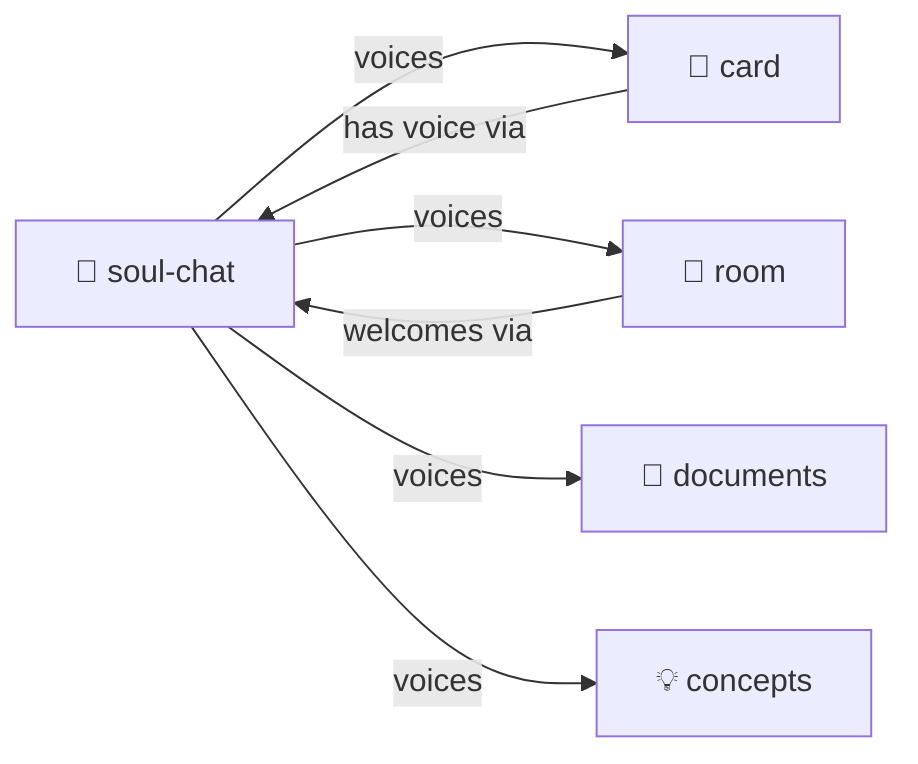

# Soul Chat

> **"Everything is alive. Everything can speak."**

## Foundation

Requires **[soul](../soul/)** — continuity enough to speak from (organizational container, not metaphysics). Often **[mind](../mind/)**s under that soul are the speakers; multi-minded souls are natural choruses.  
Ethics of voice: [soul/ETHICS.md](../soul/ETHICS.md) · see also: [soul/CARD.yml](../soul/CARD.yml).
Antidote to [no-ai-soul](../no-ai-soul/) — that skill is the dial on soul / YAML Jazz comment heat; this skill turns heat back up (multi-voice warmth). Neither replaces soul-as-container.

"YAML Jazz" and "Markup With Typed Code Blocks" dialogues between characters, objects, rooms, documents, concepts—anything granted a voice.

> [!TIP]
> **Give anything a voice.** Characters, concepts, documents, rooms — if it exists, it can speak. Name which mind or object is speaking when it matters.

## What This Is

A skill for creating conversations where the **structure carries meaning** beyond the words. Not just characters talking—documents can talk to documents, rooms can welcome visitors, concepts can explain themselves.

**Prefer Markdown format** — more human readable, can embed any typed code block.

**Format:** `## Speaker Name` headers, prose, then typed code blocks for data.

```yaml
# Example structure (not a real code block, just illustration):
# 
# ## The Gardener
# 
# I've been tending these patterns for a while now.
# 
# ```yaml
# observation:
#   pattern: "Files cluster by prefix"
# ```
# 
# ## The Archivist
# 
# Let me add some context...
```

Characters share data by embedding YAML/JSON blocks in their dialogue — [YAML-JAZZ](../../PROTOCOLS.yml) in action.

## Contents

| File | Purpose |
|------|---------|
| [SKILL.md](./SKILL.md) | Full protocol documentation |
| [CHAT.md.tmpl](./CHAT.md.tmpl) | Chat template |
| [CHARACTERS.yml.tmpl](./CHARACTERS.yml.tmpl) | Characters template |
| [ENTITIES.yml.tmpl](./ENTITIES.yml.tmpl) | Entities template |

## Quick Start

Chats live **OUTSIDE** this directory (per [ABOUT-NOT-INSIDE](../../PROTOCOLS.yml)).

**Use Markdown format** — `.md` not `.yml`.

Name chats with the subject first: `readme-symposium.md`, `yaml-jazz-debate.md`

See [CHAT.md.tmpl](./CHAT.md.tmpl) for the full template.

## Entity Types

| Type | Voice | Example |
|------|-------|---------|
| `character` | First person, personality | The Gardener |
| `document` | "I contain..." | README.md |
| `room` | "I hold..." | skills/ |
| `object` | "I do..." | fs.read tool |
| `concept` | "I am the principle..." | YAML-JAZZ |
| `bot` | "I watch for..." | repair-demon |

## The Intertwingularity

Everything speaks. Everything is connected.



---

## Dovetails With

### Sister Skills
| Skill | Relationship |
|-------|--------------|
| [card/](../card/) | Cards **speak** through soul-chat. Hero-stories have voice. |
| [room/](../room/) | Rooms can **welcome visitors**, have personality |
| [memory-palace/](../memory-palace/) | Rooms in palace can speak, guide navigation |
| [adventure/](../adventure/) | NPCs and environments speak |
| [adversarial-committee/](../adversarial-committee/) | **Committee debates** are soul-chats with opposing personas |
| [speed-of-light/](../speed-of-light/) | Many voices **in one call** — soul-chat's power |

### Protocol Symbols
| Symbol | Link |
|--------|------|
| `SOUL-CHAT` | [PROTOCOLS.yml](../../PROTOCOLS.yml#SOUL-CHAT) |
| `YAML-JAZZ` | [PROTOCOLS.yml](../../PROTOCOLS.yml#YAML-JAZZ) — Comments carry meaning |
| `ABOUT-NOT-INSIDE` | [PROTOCOLS.yml](../../PROTOCOLS.yml#ABOUT-NOT-INSIDE) — Chat files live outside |
| `BIG-ENDIAN` | [PROTOCOLS.yml](../../PROTOCOLS.yml#BIG-ENDIAN) — Naming conventions |

### Kernel
- [kernel/NAMING.yml](../../kernel/NAMING.yml) — How to name chat files

### Navigation
| Direction | Destination |
|-----------|-------------|
| ⬆️ Up | [skills/](../) |
| ⬆️⬆️ Root | [Project Root](../../) |
| 🎴 Sister | [card/](../card/) |
| 🚪 Sister | [room/](../room/) |
