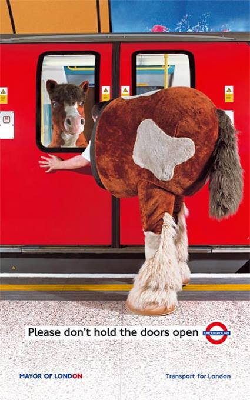

# The Pantomime Horse

*Transport for London safety poster (Mayor of London / TfL): "Please don't hold the doors open."*

One photograph, the whole [soul model](../SOUL-MODEL.md) in miniature. Let's read it in our terms.

## What you're looking at

| In the photo | In the model |
|--------------|--------------|
| The horse costume | One **persona** — a single look, gag, and voice shared by whoever's inside |
| The two people wearing it | Two **characters** — each with their own soul and minds, both EMBARKed into the same costume |
| The costume as a walking thing | A **vehicle** with two seats: **front end** (sees, steers, talks) and **back end** (walks the rear, trusts the front) |
| The train | **Another vehicle** — bigger seats, its own doors, its own schedule |
| The closing doors | A **membrane** — inside stays inside, outside stays outside |

So the disaster is precise: a two-character party, sharing one persona, riding one vehicle, tried to board a *second* vehicle — and only the front half made it across the membrane before it sealed. The horse is straddling two vehicles at once, occupying each with half a party.

## Fronting, literally

In a multi-minded soul, **fronting** means one mind steers and speaks while the others ride along — a role, not a rank. The pantomime horse makes fronting physical:

- The **front end** fronts. It has the eyes, the head, the voice. It decided to board.
- The **back end** rides along. It trusts the front completely — it has to; it can't see anything.
- A **hand off** ("you steer for a while") is supposed to happen at a calm moment, by agreement, both parties inside the same membrane.

What the poster shows is the failure mode: a hand off that never came, forced apart by a membrane neither of them controlled. The doors don't care that you're one persona. They only care whether each character is inside or outside when they close.

TfL's caption says *"Please don't hold the doors open."* Ours says: **never let a party straddle a membrane during a transition.** Same advice, different ontology.

## The missed connection

What happens to the back end afterward? It grieves, obviously. An **imaginary** Craigslist ad from the two characters we just modeled — the back end writes:

> **Missed Connection — You: front half of our horse, eastbound train, doors closing (Bank branch)**
>
> You: chestnut, handsome head, hooves on the glass, mouthing something I couldn't hear over the announcements. Me: your hindquarters. We had been one body since Coatroom. I trusted you to steer.
>
> The doors closed and you kept going — Bank, Moorgate, who knows. I stood on the platform holding our middle. TfL says I shouldn't have held the doors open. TfL doesn't understand what we had. We shared one persona. I walked the rear and never once asked where we were going.
>
> If you see this: I still have the tail. I've been fronting alone and it's not the same — everyone can tell there's nobody in the back.
>
> You said I could try the front for once. I'm ready now.
>
> No zombies, no remote-control stubs. Serious inquiries only.

Every term in the ad is load-bearing. *Fronting alone* — a two-seat vehicle with one seat empty is visibly wrong from every angle. *No zombies* — don't replace my partner's mind with an infection mind. *No remote-control stubs* — I want a whole character in the back, not a thin agency bridged to some distant pilot. The back end has standards, and the standards are the model.

## Back to the model

- The section this illustrates: [Multi-person personas (pantomime horse)](../SOUL-MODEL.md#multi-person-personas-pantomime-horse)
- Fronting, counsel, and hand offs: [How minds get along](../SOUL-MODEL.md#how-minds-get-along)
- Membranes and what they seal: [Organelles, minds, membranes](../SOUL-MODEL.md#organelles-minds-membranes)
- Machine-readable sidecar for this image: [pantomime-horse-tfl.png.yml](pantomime-horse-tfl.png.yml)
