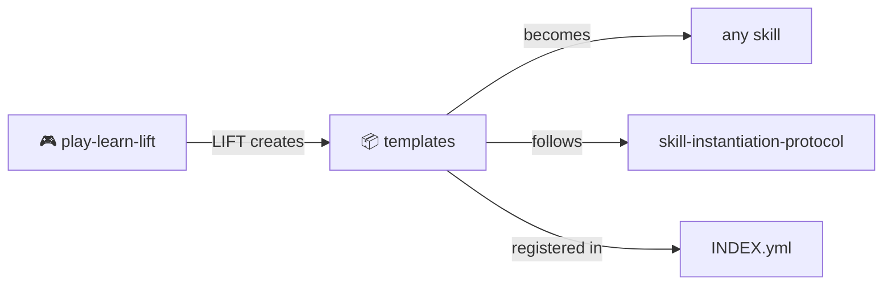

# Skill Templates

> *How to create new MOOLLM skills.*

Start here when building a new skill from scratch.

---

## What's Here

```
templates/
└── basic-skill/          # Starter template
    ├── SKILL.md          # Protocol documentation
    ├── PROTOTYPE.yml     # Machine-readable definition
    └── template/         # Files copied on instantiation
        ├── TASK.yml.tmpl
        ├── CHECKLIST.md
        └── working_set.yml
```

---

## Creating a New Skill

### 1. Copy the Template

```bash
cp -r skills/templates/basic-skill skills/my-new-skill
```

### 2. Rename and Edit

| File | What to Change |
|------|----------------|
| `SKILL.md` | Purpose, steps, inputs/outputs |
| `PROTOTYPE.yml` | Name, tier, tools required |
| `template/*.tmpl` | Instance file templates |

### 3. Add README.md

Every skill needs a `README.md` — the human entry point:

```markdown
# My New Skill

> *One-line description*

What it does in 2-3 sentences.

## Contents

| File | Purpose |
|------|---------|
| [SKILL.md](./SKILL.md) | Full protocol |
| [PROTOTYPE.yml](./PROTOTYPE.yml) | Machine definition |

## See Also

- Related skills
- Protocol symbols
```

### 4. Register in INDEX.yml

Add to `skills/INDEX.yml`:

```yaml
- name: "my-new-skill"
  path: "skills/my-new-skill"
  description: "What it does"
  tier: 2
  entry: "SKILL.md"
  tags: ["category"]
```

---

## Skill Structure

Every skill follows this pattern:

```
skill-name/
├── README.md         # Human entry (GitHub renders this)
├── SKILL.md          # Full protocol documentation
├── PROTOTYPE.yml     # Machine-readable definition
└── template/         # Copied on instantiation
    ├── *.yml.tmpl    # Templates with {{placeholders}}
    └── *.md          # Static files
```

---

## Template Variables

Files ending in `.tmpl` support placeholders:

```yaml
# TASK.yml.tmpl
task:
  name: "{{task_name}}"
  created: "{{timestamp}}"
  objective: "{{objective}}"
```

Common variables:
- `{{task_name}}` — User-provided name
- `{{timestamp}}` — ISO 8601 creation time
- `{{session_id}}` — Current session ID
- `{{objective}}` — What the user wants

---

## Capability Tiers

Set the `tier` in PROTOTYPE.yml based on what tools your skill needs:

| Tier | Needs | Example Skills |
|------|-------|----------------|
| 0 | Nothing (prompt only) | Guidelines |
| 1 | File read | Memory palace |
| 2 | File read/write | Planning, logging |
| 3 | + Search | Research notebook |
| 4 | + Terminal | Debugging, builds |
| 5 | + Custom tools | External integrations |

---

## The Intertwingularity

Templates are the starting point. All skills began here.



---

## Navigation

| Direction | Destination |
|-----------|-------------|
| ⬆️ Up | [skills/](../) |
| ⬆️⬆️ Root | [Project Root](../../) |
| 📋 Registry | [INDEX.yml](../INDEX.yml) |
| 📖 Protocol | [skill-instantiation-protocol.md](../skill-instantiation-protocol.md) |
| 🎮 Sister | [play-learn-lift/](../play-learn-lift/) — LIFT creates templates |

---

*Start simple. Let the skill grow through use.*
