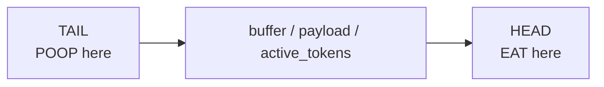

# Worm 🪱

> Two-pointer reversible cursor for filesystem traversal and data pipelines.

## Overview

A worm is a **two-pointer cursor** (head + tail) that can:
- Crawl directories and follow links
- Ingest content (EAT/CHOMP) into a normalized buffer
- Emit data at head or tail (POOP/BARF)
- Pipe between documents or into a worm network



## The Reversible Verb Basis

The worm's verbs form a reversible basis for undo/redo:

| Verb | Action | Reverse |
|------|--------|---------|
| **EAT** | Ingest at head | BARF |
| **CHOMP** | Pattern-scan + ingest | BARF |
| **POOP** | Emit at tail | EAT |
| **BARF** | Emit at head | EAT |
| **STICK-UP-BUM** | Inject data | POOP |

*"Every EAT has a POOP. Every CHOMP has a BARF."*

## Quick Start

```
"Move the worm to skills/adventure/"
"EAT the CARD.yml"
"POOP what you learned to .moollm/skills/worm/out/"
```

## Movement

| Verb | Effect |
|------|--------|
| **MOVE-WORM** | Move head (and optionally tail) |
| **MOVE-HEAD** | Move head only |
| **MOVE-ASS** | Move tail only |
| **NEXT-UNIT** | Advance head by char/word/sentence/paragraph/section/page |
| **PREV-UNIT** | Move head backward by unit |
| **SELECT-RANGE** | Select N units into buffer |

### Tree Navigation

```
TREE-UP / TREE-DOWN / TREE-NEXT / TREE-PREV
TREE-OPEN / TREE-CLOSE / TREE-HIDE / TREE-SHOW
```

## Worm Variants

| Variant | Behavior |
|---------|----------|
| **Bulldozer** | Moves and overwrites |
| **Link-hopper** | Follows symlinks like an inchworm |
| **Mapper** | Maps trees, leaves markers |
| **Dream** | Speed-of-light ephemeral synthesis |
| **Tree** | Climbs hierarchies with context |
| **Search** | Crawls search results |

## Use Cases

### Copy with Transform
```
1. CHOMP source (pattern-aware)
2. Tokens normalize in buffer  
3. POOP to destination
```

### Doc-to-Doc Pipeline
```
Head in doc A, tail in doc B
EAT from A → POOP to B
Streaming pipeline!
```

### Casting Network
```
Worm A: POOPs YAML to emit_dir
Worm B: EATs from emit_dir → POOPs processed output
Worm C: Builds taxonomy from B's castings
```

## State

```yaml
head: "."           # Current head position
tail: "."           # Current tail position
buffer: []          # Ingested content
payload: null       # Last consumed chunk
active_tokens: []   # Parsed tokens in worm's "brain"
emit_dir: ".moollm/skills/worm/out"
reversible: true    # Enable undo/redo basis
```

## Integration

| Skill | How Worm Integrates |
|-------|---------------------|
| **adventure** | Worm traverses rooms, head = location |
| **room** | Rooms expose FEED-WORM ads |
| **buff** | FAST-CRAWL, CLEAN-CASTINGS buffs |
| **data-flow** | Worms are streaming cursors |

## Safety

- Default to NOP if path unclear
- Avoid ingesting secrets/PII
- Respect read/write boundaries  
- Reversible ops enable rollback

## Files

| File | Purpose |
|------|---------|
| `CARD.yml` | Interface, advertisements, methods |
| `SKILL.md` | Protocol documentation |
| `README.md` | This file |

## Lineage

Inspired by the LLOOOOMM worms (bulldozer, link-hopper, mapper, dream, tree) and inchworm cursors in editors.
